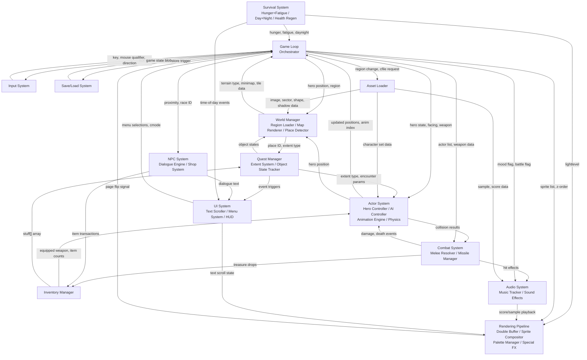
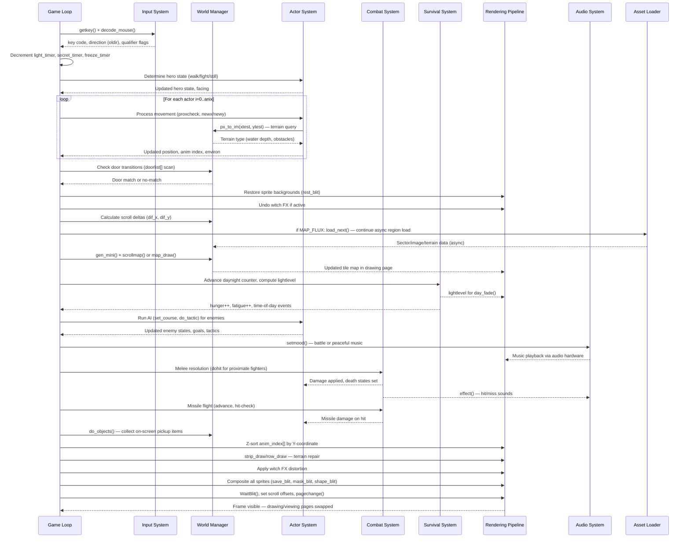

# System Architecture — The Faery Tale Adventure (Amiga, 1987)

## Purpose

This document describes the complete system architecture of The Faery Tale Adventure as implemented in the original Amiga source code (Aztec C and 68000 assembly, by Talin/David Joiner). It is intended to serve as the primary reference for anyone rebuilding the game from scratch.

### Related Documents

- **[RESEARCH.md](RESEARCH.md)** -- Detailed mechanics, formulas, data tables, and asset format specifications for every game system (Sections 1-20).
- **[STORYLINE.md](STORYLINE.md)** -- Mermaid sequence and state diagrams for every game scenario, quest flow, and NPC interaction (Sections 1-17).

### How to Read This Document

- **Mermaid diagrams** render in GitHub, VS Code, and most Markdown viewers. If viewing raw text, read the node labels and edge annotations as a directed graph.
- **Source references** use the format `file.c:LINE` or `file.c:START-END`. All references point to the original source files in the repository root.
- **Subsystem names in parentheses** denote sub-components within a larger system.

## Display Geometry and Presentation

The original game runs in a **non-interlaced 320×200 frame**, but it uses a mixed-resolution split display: a low-resolution playfield and a hi-resolution status bar, with the Amiga changing pixel timing as the viewport changes.

For a faithful modern port, the sections should be rendered at their native sizes and then composed into a centered `640×480` presentation buffer:

- **Playfield:** render at `288×140`, then scale to `576×280` (2×)
- **HI bar:** render at `640×57`, then line-double to `640×114`
- **Separator gap:** preserve the original 3 non-interlaced lines as `6` pixels in the final output
- **Vertical placement:** `40 px` top margin, `280 px` playfield, `6 px` gap, `114 px` HI bar, `40 px` bottom margin

This preserves the original proportions and the intended spacing while fitting the game cleanly inside a modern 4:3 presentation surface.

---

## System Architecture Diagram

The game is organized as a single monolithic program driven by a synchronous main loop. The following diagram shows all 19 subsystems and the data that flows between them.



Each subsystem above corresponds to a detailed section in [RESEARCH.md](RESEARCH.md): Input System (Section 19), World Manager (Section 2), Actor System (Section 3), Combat System (Section 4), Inventory Manager (Section 6), Quest Manager (Section 8), NPC System (Section 7), Survival System (Sections 10-11), Rendering Pipeline (Section 15), Audio System (Section 14), UI System (Section 19), Save/Load System (Section 18), and Asset Loader (Section 20). For quest flow diagrams, see [STORYLINE.md](STORYLINE.md).

---

## Game Loop Tick Structure

The main loop lives at `fmain.c:1270-2615`. Each iteration of the `while (!quitflag)` loop constitutes one "tick" (one frame). The steps execute in strict sequential order:

| # | Step | Source Reference | Description |
|---|------|-----------------|-------------|
| 1 | Read input | `fmain.c:1278` | `key = getkey()` — polls the input handler's key buffer |
| 2 | Process key/menu commands | `fmain.c:1283-1362` | Dispatches key codes to direction, fight, cheat, and menu handlers |
| 3 | Handle view status screens | `fmain.c:1365-1373` | Placard delays, palette flash for item pickup; `continue` skips rest of tick |
| 4 | Decode controls | `fmain.c:1376` | `decode_mouse()` — translates mouse qualifier + joystick into direction (`oldir`) |
| 5 | Check pause | `fmain.c:1378` | If game paused, `Delay(1); continue` — skip rest of tick |
| 6 | Update timers | `fmain.c:1380-1382` | Decrement `light_timer`, `secret_timer`, `freeze_timer` |
| 7 | Determine hero state | `fmain.c:1387-1452` | Death/revival check, fight initiation, walk vs. still, shooting, fatigue stumble |
| 8 | Update all actors | `fmain.c:1467-1865` | Loop `i=0..anix`: movement, collision (`proxcheck`), terrain effects, animation index selection, world-wrap, carrier/raft/dragon/setfig logic |
| 9 | Check bed/sleep | `fmain.c:1875-1890` | In buildings (region 8): detect sleeping-spot tiles, trigger sleep after 30 ticks standing still |
| 10 | Check door transitions | `fmain.c:1894-1955` | Binary search `doorlist[]` (outdoor) or linear scan (indoor); call `xfer()` + `find_place()` on match |
| 11 | Restore sprite backgrounds | `fmain.c:1968-1973` | `OwnBlitter(); rest_blit()` for each shape in drawing page's queue — erases previous frame's sprites |
| 12 | Undo witch FX | `fmain.c:1977-1978` | If drawing page had witch distortion, undo it before new frame |
| 13 | Calculate scroll deltas | `fmain.c:1980-1986` | `dif_x = img_x - fp_drawing->isv_x`, `dif_y = img_y - fp_drawing->isv_y` — tile-granularity scroll amounts |
| 14 | Load pending region data | `fmain.c:1987` | `if (MAP_FLUX) load_next()` — continue async region load if in progress |
| 15 | Generate/scroll map | `fmain.c:1989-2231` | Full redraw (`map_draw`) on view change; directional `scrollmap()` for 1-tile movement; static frame for no-scroll case |
| 16 | Process day/night cycle | `fmain.c:2012-2039` | Advance `daynight` counter (mod 24000), compute `lightlevel`, fire time-of-day events, call `day_fade()` |
| 17 | Health regeneration | `fmain.c:2041-2047` | Every 1024 daynight ticks, heal 1 HP if below max |
| 18 | Process encounters | `fmain.c:2052-2093` | Check `actors_loading` completion; spawn random encounters based on `danger_level` and `daynight` interval |
| 19 | Run AI for enemies | `fmain.c:2109-2184` | For actors 2..anix: evaluate goal/tactic, call `set_course()` and `do_tactic()`, set fight/flee/follow modes |
| 20 | Process hunger/fatigue | `fmain.c:2199-2220` | Every 128 daynight ticks: increment hunger/fatigue, trigger starvation/exhaustion events, force sleep |
| 21 | Resolve melee combat | `fmain.c:2238-2265` | For each fighting actor: compute weapon reach, proximity check against all others, call `dohit()` on contact |
| 22 | Resolve missile flight | `fmain.c:2267-2301` | For each active missile: advance position, terrain collision check, actor proximity check, call `dohit()` on hit |
| 23 | Collect on-screen objects | `fmain.c:2303-2325` | `do_objects()` adds pickup items to `anix2`; add visible missiles as OBJECTS-type sprites |
| 24 | Z-sort all sprites | `fmain.c:2330-2359` | Bubble sort `anim_index[]` by Y-coordinate (with depth adjustments for dead, riding, sinking actors) |
| 25 | Draw terrain repair strips | `fmain.c:2363-2364` | `strip_draw()` / `row_draw()` — fill in the column or row exposed by scrolling |
| 26 | Apply witch FX | `fmain.c:2367-2376` | Store witch distortion parameters in drawing page; apply `witch_fx()` if `witchflag` set |
| 27 | Composite all sprites | `fmain.c:2381-2609` | For each actor in z-order: clip, build terrain occlusion mask, `save_blit` background, `mask_blit` + `shape_blit` sprite onto drawing page |
| 28 | Page flip | `fmain.c:2610-2614` | `WaitBlit()`, set scroll offsets on RasInfo, call `pagechange()` to swap drawing/viewing pages via Copper |

---

## Asset Loading Pipeline

### Memory Allocations in `open_all()` (`fmain.c:728-948`)

All major buffers are allocated from Amiga Chip RAM (required for DMA access by the blitter and display hardware):

| Buffer | Size Constant | Bytes | Source | Purpose |
|--------|--------------|-------|--------|---------|
| `image_mem` | `IMAGE_SZ` | 81,920 (5 x 16,384) | `fmain.c:917` | Tile image data — 5 bitplanes of 256 16x16 tiles |
| `sector_mem` | `SECTOR_SZ` | 36,864 (32,768 + 4,096) | `fmain.c:919` | Map sector data (256 x 128-byte sectors) + 4K region map at offset `SECTOR_OFF` |
| `shape_mem` | `SHAPE_SZ` | 78,000 | `fmain.c:922` | Character/sprite shape data for all loaded character sets |
| `shadow_mem` | `SHADOW_SZ` | 12,288 (8,192 + 4,096) | `fmain.c:924` | Background occlusion masks for terrain-over-sprite compositing |
| `sample_mem` | `SAMPLE_SZ` | 5,632 | `fmain.c:926` | Sound effect sample data (6 samples with IFF length headers) |
| `wavmem` | `VOICE_SZ` | 3,584 (1,024 + 2,560) | `fmain.c:911` | Music waveform tables (S_WAVBUF=1024) + volume envelopes (S_VOLBUF=2560) |
| `scoremem` | `SCORE_SZ` | 5,900 | `fmain.c:912` | Music score data (note sequences for 4-channel tracker) |
| `terra_mem` | — | 1,024 | `fmain.c:928` | Terrain attribute table (2 x 512-byte halves, one per terrain set) |

Additional allocations:
- **Bitmap structures**: 5 x `BM_SIZE` for `bm_page1..bm_source, bm_lim` (`fmain.c:756`)
- **Raster planes**: 5 planes x 2 pages of `PHANTA_WIDTH` x `RAST_HEIGHT` (original non-interlaced `320×200` frame, 5 bitplanes each = 40,000 bytes per page) (`fmain.c:864-868`)
- **Audio device**: `ioaudio` I/O request + audio port (`fmain.c:889-907`)

### Region-to-Disk Mapping: `file_index[10]` (`fmain.c:615-626`)

Each region's assets are defined by a `struct need` containing disk sector addresses for image tilesets, terrain data, sector map, and region map:

| Index | Region | Description | image[0..3] | terra1,terra2 | sector | region | setchar |
|-------|--------|-------------|-------------|---------------|--------|--------|---------|
| 0 | F1 | Snowy region | 320,480,520,560 | 0,1 | 32 | 160 | 22 |
| 1 | F2 | Witch wood | 320,360,400,440 | 2,3 | 32 | 160 | 21 |
| 2 | F3 | Swampy region | 320,360,520,560 | 2,1 | 32 | 168 | 22 |
| 3 | F4 | Plains and rocks | 320,360,400,440 | 2,3 | 32 | 168 | 21 |
| 4 | F5 | Desert area | 320,480,520,600 | 0,4 | 32 | 176 | 0 |
| 5 | F6 | Bay / city / farms | 320,280,240,200 | 5,6 | 32 | 176 | 23 |
| 6 | F7 | Volcanic | 320,640,520,600 | 7,4 | 32 | 184 | 0 |
| 7 | F8 | Forest and wilderness | 320,280,240,200 | 5,6 | 32 | 184 | 24 |
| 8 | F9 | Inside of buildings | 680,720,800,840 | 8,9 | 96 | 192 | 0 |
| 9 | F10 | Dungeons and caves | 680,760,800,840 | 10,9 | 96 | 192 | 0 |

### Async Disk I/O Model

The game uses asynchronous disk reads to minimize stutter during region transitions:

- **`load_track_range(f_block, b_count, buffer, dr)`** (`fmain2.c:708`) — Issues an async read of `b_count` 512-byte sectors starting at sector `f_block` into `buffer`, using I/O channel `dr` (0-8).
- **`WaitDiskIO(num)`** (`hdrive.c:67`) — Blocks until I/O channel `num` completes.
- **`CheckDiskIO(num)`** (`hdrive.c:79`) — Non-blocking check: returns true if I/O channel `num` has completed.
- **`WaitLastDiskIO()`** (`hdrive.c:93`) — Blocks until the most recently issued I/O completes.

Region loading (`load_new_region()` at `fmain.c:3548`) issues multiple async reads across channels 0-7. The main loop checks completion with `CheckDiskIO()` and defers work until all channels report done (`fmain.c:2980`, `fmain.c:3599-3608`).

### Character Set Loading: `cfiles[]` (`fmain2.c:638-665`)

Character sprite sets are loaded on demand via the `cfiles[]` table, which maps each set to a disk sector, target sequence slot, and dimensions:

| Index | Set | Sector | Seq Slot | Dims (w x h x count) | Disk Blocks |
|-------|-----|--------|----------|----------------------|-------------|
| 0 | Julian | 1376 | PHIL | 1x32x67 | 42 |
| 1 | Phillip | 1418 | PHIL | 1x32x67 | 42 |
| 2 | Kevin | 1460 | PHIL | 1x32x67 | 42 |
| 3 | Objects | 1312 | OBJECTS | 1x16x116 | 36 |
| 4 | Raft | 1348 | RAFT | 2x32x2 | 3 |
| 5 | Turtle | 1351 | CARRIER | 2x32x16 | 20 |
| 6 | Ogre | 960 | ENEMY | 1x32x64 | 40 |
| 7 | Ghost | 1080 | ENEMY | 1x32x64 | 40 |
| 8 | Dark Knight | 1000 | ENEMY | 1x32x64 | 40 |
| 9 | Necromancer | 1040 | ENEMY | 1x32x64 | 40 |
| 10 | Dragon | 1160 | DRAGON | 3x40x5 | 12 |
| 11 | Bird | 1120 | CARRIER | 4x64x8 | 40 |
| 12 | Snake/Salamander | 1376 | ENEMY | 1x32x64 | 40 |
| 13 | Wizard/Priest | 936 | SETFIG | 1x32x8 | 5 |
| 14 | Royal set | 931 | SETFIG | 1x32x8 | 5 |
| 15 | Bartender | 941 | SETFIG | 1x32x8 | 5 |
| 16 | Witch | 946 | SETFIG | 1x32x8 | 5 |
| 17 | Ranger/Beggar | 951 | SETFIG | 1x32x8 | 5 |

---

## Data Flow Diagram

The following sequence diagram shows the data flow for one complete tick where the hero is walking, an enemy is on screen, and scrolling occurs:



---

## World Structure Overview

### Region Layout

The game world consists of **10 regions**: 8 outdoor regions arranged in a 2x4 grid, plus 2 indoor regions (buildings and dungeons/caves).

```
         Column 0        Column 1
       +-----------+  +-----------+
Row 0  | F1 Snow   |  | F2 Witch  |   Region 0    Region 1
       +-----------+  +-----------+
Row 1  | F3 Swamp  |  | F4 Plains |   Region 2    Region 3
       +-----------+  +-----------+
Row 2  | F5 Desert |  | F6 Bay    |   Region 4    Region 5
       +-----------+  +-----------+
Row 3  | F7 Volcano|  | F8 Forest |   Region 6    Region 7
       +-----------+  +-----------+

Indoor:  F9  (region 8) — Building interiors
         F10 (region 9) — Dungeons and caves
```

### Coordinate System

- **World space**: 32,768 x 32,768 pixels (coordinates 0-32767 in both axes, defined by `MAXCOORD = 16*16*128` at `fmain.c:632`)
- **Tile dimensions**: 16 pixels wide, 32 pixels tall
- **Map indexing**: `img_x = map_x >> 4` (divide by 16), `img_y = map_y >> 5` (divide by 32)
- **Tile map**: Each region has a 128x256 sector map (`sector_mem`, 128 bytes per sector row, 256 rows) plus a higher-level region map (`map_mem` at `sector_mem + SECTOR_OFF`)
- **Playing map (minimap)**: 6 columns x 19 rows = 114 entries (`minimap[114]` at `fmain.c:630`), representing the visible tile grid

### Region-to-File Mapping

Region index is computed from world coordinates (`fmain.c:2971-2975`, `fmain.c:2959-2976`):

```c
xs = (map_x + 151) >> 8;     // sector X of screen center
ys = (map_y + 64) >> 8;      // sector Y of screen center
xr = (xs >> 6) & 1;          // region column (0 or 1)
yr = (ys >> 5) & 3;          // region row (0-3)
lregion = xr + yr + yr;      // region index 0-7
```

Indoor regions (8 and 9) are entered only through door transitions and never via coordinate-based detection.

### Region Transitions

Region transitions are handled by `gen_mini()` (`fmain.c:2959-2991`):

1. **Boundary detection**: `gen_mini()` computes `lregion` from the hero's current world coordinates.
2. **Load trigger**: If `lregion != region_num`, sets `new_region = lregion` and calls `load_all()`.
3. **`load_all()`** (`fmain.c:3545-3546`): Loops calling `load_new_region()` until `MAP_STABLE` (all disk I/O complete).
4. **`load_new_region()`** (`fmain.c:3548-3609`): Compares the new region's `file_index` entry against `current_loads`; issues `load_track_range()` only for assets that differ from the currently loaded set. This means adjacent regions sharing tilesets (e.g., F1 and F3 share `image[0]` = 320) avoid redundant disk reads.
5. **Async completion**: The main loop checks `MAP_FLUX` each tick (`fmain.c:1987`) and calls `load_next()` to continue loading. Rendering proceeds with partially loaded data; `gen_mini()` at `fmain.c:2980` gates minimap updates on `CheckDiskIO(2) && CheckDiskIO(0)`.
6. **World wrap**: Outdoor regions wrap at boundaries — when the hero crosses past coordinate 32565 or below 300, coordinates wrap to the opposite edge (`fmain.c:1827-1831`).

### Door Transitions (Outdoor to Indoor)

Door transitions (`fmain.c:1894-1955`) use the `doorlist[DOORCOUNT]` array (86 doors, defined at `fmain.c:231-249+`):

- **Outdoor search** (region < 8): Binary search on `doorlist[]` sorted by `xc1`, matching the hero's tile-aligned coordinates against `xc1/yc1`.
- **Indoor search** (region >= 8): Linear scan matching `xc2/yc2` against the hero's tile-aligned position.
- **Transfer**: On match, calls `xfer(xtest, ytest, direction)` to teleport the hero, sets `new_region` to 8 or 9 based on `d->secs`, then calls `find_place()` and `fade_page()`.
