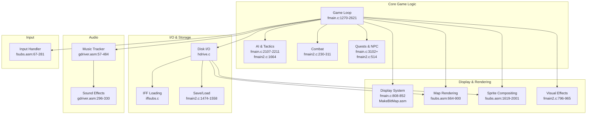
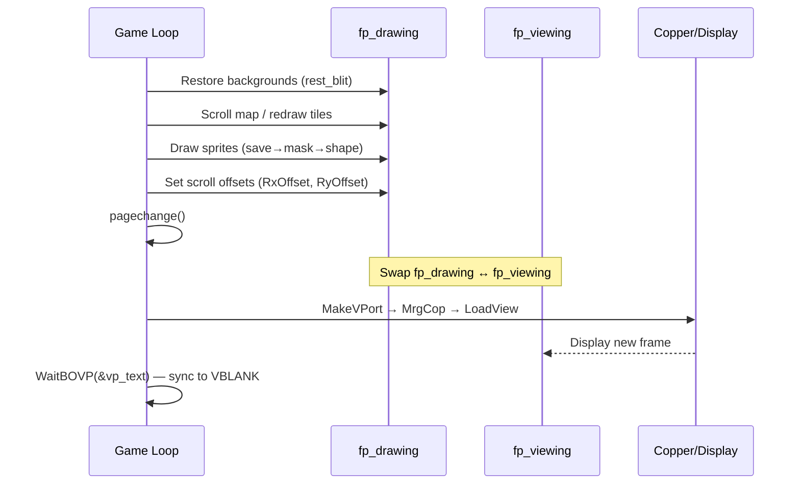
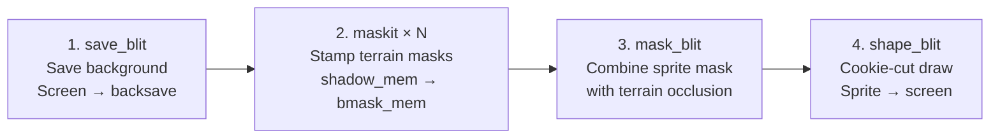
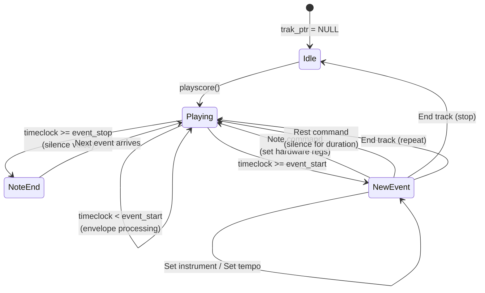
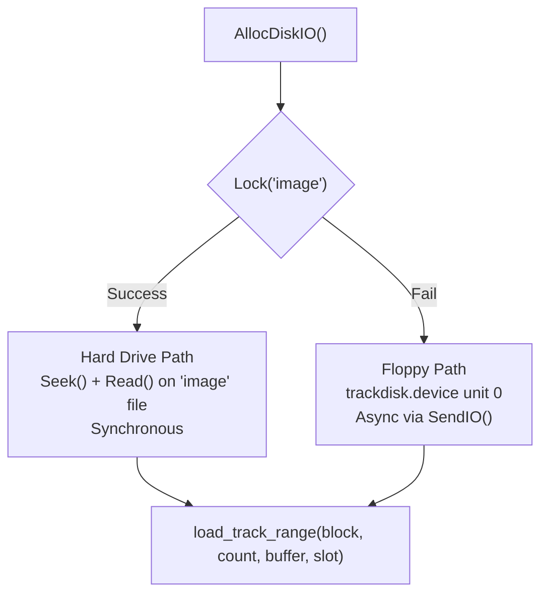
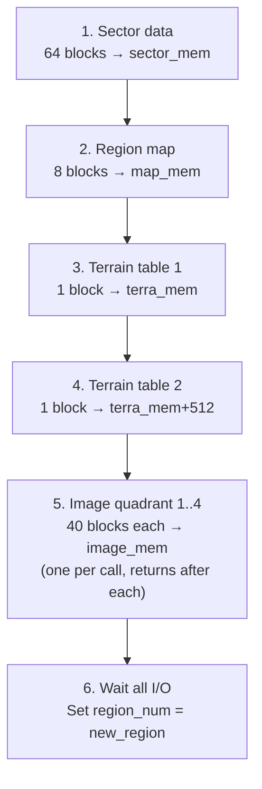
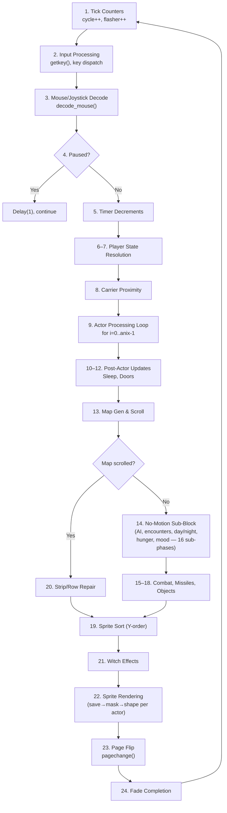
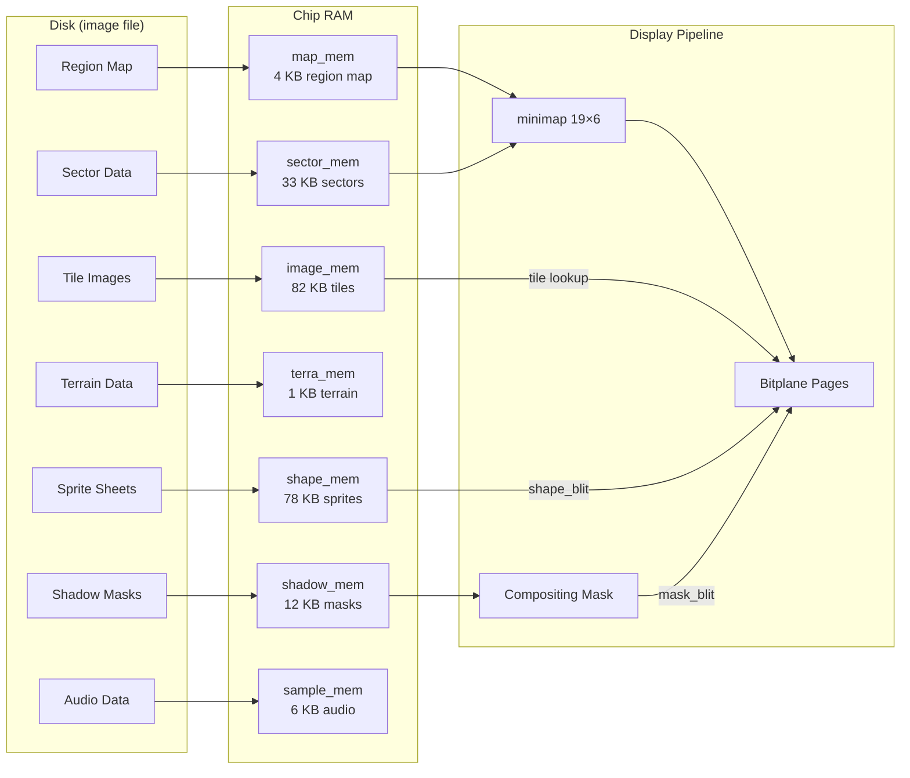
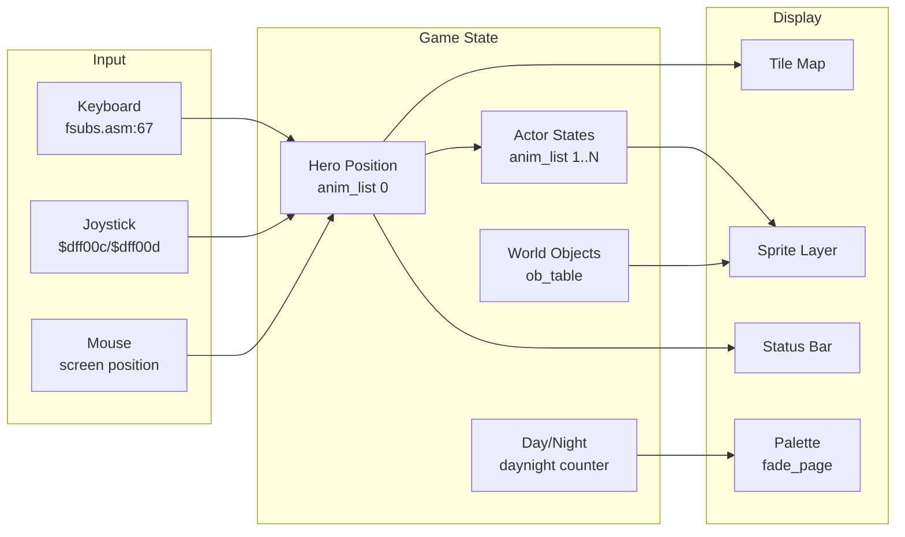

# The Faery Tale Adventure — System Architecture

High-level overview of the game's subsystems, data flow, and technical design. All claims cite the original 1987 source code. For detailed mechanics, see [RESEARCH.md](RESEARCH.md). Open questions are logged in [PROBLEMS.md](PROBLEMS.md).

> **Citation format**: `file.c:LINE` or `file.c:START-END`. Speech references: `speak(N)`.

---

## 1. System Overview

### 1.1 Subsystem Map



### 1.2 Build System

The game is built with **Aztec C** (1987) targeting the Motorola 68000 processor on the Commodore Amiga. The `makefile` specifies:

- **Compiler flags**: `cc -pp -hi amiga39.pre -qf` — precompiled headers, prototype generation
- **Link order**: `fmain.o fsubs.o narr.o fmain2.o iffsubs.o gdriver.o makebitmap.o hdrive.o`

The link order determines symbol resolution. Assembly modules (`fsubs.o`, `narr.o`, `gdriver.o`, `makebitmap.o`) provide performance-critical routines that replace commented-out C equivalents.

### 1.3 File-to-Subsystem Mapping

**Game executable** (`fmain`) — built from 8 object files:

| File | Lines | Subsystem | Role |
|------|-------|-----------|------|
| `fmain.c` | ~3650 | Core | Game loop, actors, combat, physics, rendering dispatch, UI, menus |
| `fmain2.c` | ~1720 | Core (secondary) | Pathfinding, hit resolution, shops, quests, save/load, visual effects |
| `fsubs.asm` | ~2050 | Rendering / Input | Map draw, sprite blitter ops, scrolling, movement vectors, input handler |
| `gdriver.asm` | ~510 | Audio | VBlank music interrupt server, score/sample playback, tempo |
| `narr.asm` | ~530 | Data | All game text: events, places, dialogue, placards, riddles |
| `iffsubs.c` | ~280 | I/O | IFF/ILBM image parser and ByteRun1 decompressor |
| `hdrive.c` | ~155 | I/O | Dual-path disk I/O (floppy raw sectors / hard drive file) |
| `MakeBitMap.asm` | ~124 | Display | Bitplane allocation/deallocation |

**Shared headers:**

| File | Lines | Subsystem | Role |
|------|-------|-----------|------|
| `ftale.h` | ~119 | Shared | Structs, enums, constants (actor, display, input, sequences) |
| `ftale.i` | ~72 | Shared | Assembly struct definitions mirroring `ftale.h` |
| `fincludes.c` | ~20 | Build | Precompiled header aggregator for Aztec C (`-hi amiga39.pre`) |

**Offline tools** (not part of game executable):

| File | Lines | Subsystem | Role |
|------|-------|-----------|------|
| `terrain.c` | ~95 | Tool | Extracts terrain data from IFF landscape images into `terra` binary |
| `mtrack.c` | ~218 | Tool | Writes game assets to disk 1 at specific block offsets |
| `rtrack.c` | ~129 | Tool | Writes game assets to disk 2 (subset of disk 1 data) |
| `copyimage.c` | ~79 | Tool | Raw disk sector copy utility (device → file) |
| `text.c` | ~460 | Tool | Standalone font test program by Talin (not game-related) |
| `form.c` | ~655 | Tool | Standalone form/screen editor "edform" by Talin (not game-related) |

**Not linked** (present in repo but not compiled into any target):

| File | Lines | Role |
|------|-------|------|
| `fsupp.asm` | ~42 | Assembly versions of `colorplay`, `stillscreen`, `skipint` — superseded by C versions in `fmain2.c` |

---

## 2. Memory Architecture

### 2.1 Chip RAM vs. Fast RAM

The Amiga requires **Chip RAM** for any memory accessed by the custom chipset (DMA for display, blitter, audio). The game allocates all graphics and audio buffers in Chip RAM via `AllocMem(..., MEMF_CHIP)`.

| Buffer | Size (bytes) | RAM Type | Purpose | Citation |
|--------|-------------|----------|---------|----------|
| `bm_page1` | 5 × 8000 = 40,000 | Chip | Playfield page 1 (5 bitplanes × 320×200) | `fmain.c:826,865` |
| `bm_page2` | 5 × 8000 = 40,000 | Chip | Playfield page 2 (5 bitplanes × 320×200) | `fmain.c:827,867` |
| `work_bm` | 2 × 16,000 = 32,000 | Chip | Text/status bar planes (2-plane, 640×200) | `fmain.c:744` |
| `image_mem` | 81,920 | Chip | Tile image data (256 tiles × 5 planes) | `fmain.c:640,917` |
| `sector_mem` | 36,864 | Chip | Sector map (32 KB) + region map (4 KB) | `fmain.c:643,919` |
| `terra_mem` | 1,024 | Chip | Terrain attribute tables (2 × 512) | `fmain.c:928` |
| `shape_mem` | 78,000 | Chip | Sprite sheet data (all character sprites) | `fmain.c:641,922` |
| `shadow_mem` | 12,288 | Chip | Terrain occlusion masks | `fmain.c:642,924` |
| `sample_mem` | 5,632 | Chip | Audio sample data (6 samples) | `fmain.c:926` |
| `wavmem` | 1,024 | Chip | Waveform data (8 × 128 bytes) | `fmain.c:663,913` |
| `scoremem` | 5,900 | Any | Music score data (7 songs × 4 tracks) | `fmain.c:912` |
| `volmem` | 2,560 | Any | Volume envelope data (10 × 256 bytes) | `fmain.c:664,913` |

**Total Chip RAM**: ~330 KB of the Amiga's 512 KB Chip RAM budget.

### 2.2 Shared / Dual-Use Buffers

Several buffers serve double duty to maximize use of limited Chip RAM:

- **`bm_text` planes 2–3 overflow area**: The status bar bitmap is 640×57 pixels (57 scanlines × 80 bytes = 4,560 bytes per plane). The underlying `work_bm` allocation is 640×200 (16,000 bytes per plane). The overhead beyond the 57 visible scanlines is repurposed for sprite rendering metadata (`fmain.c:871-884`):

  | Sub-buffer | Location | Size | Purpose |
  |-----------|----------|------|---------|
  | `queue_mem` | `bm_text->Planes[2] + 4560` | ~11,440 | Sprite shape queue + page 1 backsave |
  | `bmask_mem` | `bm_text->Planes[3] + 4560` | ~11,440 | Compositing mask + page 2 backsave |
  | `fp_page1.shape_queue` | `queue_mem` | 250 | 25 × `struct sshape` (10 bytes each) |
  | `fp_page2.shape_queue` | `queue_mem + 250` | 250 | 25 × `struct sshape` |
  | `fp_page1.backsave` | `queue_mem + 962` | ~5,920 | Background save buffer, page 1 |
  | `fp_page2.backsave` | `bmask_mem + 962` | ~5,920 | Background save buffer, page 2 |

- **`bm_lim` ↔ `sector_mem`**: The collision-check bitmap (`bm_lim`, 1 plane × 320×200) shares its plane pointer with `sector_mem` (`fmain.c:829,1180`). This allows direct bitplane-level collision testing against the sector map data.

- **`pagea` / `pageb` ↔ `image_mem`**: Two scratch bitmaps (5 planes × 320×200 each) share the tile image memory (`fmain.c:830-831,1179`). Used during IFF image loading (intro pages, story screens) when tile rendering is not active.

- **`shape_mem` as IFF buffer**: The `unpackbrush()` function temporarily uses `shape_mem` (78,000 bytes) as a decompression buffer for IFF BODY data (`iffsubs.c:163`). Safe because shape loading and IFF loading never overlap.

---

## 3. Display System

### 3.1 Split-Viewport Architecture

The display uses two Amiga ViewPorts stacked vertically, switching resolution mid-frame via the Copper:

```
┌──────────────────────────────────────────┐  Scanline 0
│                                          │
│        vp_page — LORES Playfield         │
│        DxOffset=16, DyOffset=0           │
│        288×140 visible pixels            │
│        5 bitplanes → 32 colors           │
│        Double-buffered (bm_page1/2)      │
│                                          │
├──────────────────────────────────────────┤  Scanline 143 (PAGE_HEIGHT)
│                                          │
│        vp_text — HIRES Status Bar        │
│        DxOffset=0, DyOffset=143          │
│        640×57 visible pixels             │
│        4 bitplanes → 16 colors           │
│        Single-buffered (bm_text)         │
│                                          │
└──────────────────────────────────────────┘  Scanline 200
```

### 3.2 Display Constants

| Constant | Value | Purpose | Citation |
|----------|-------|---------|----------|
| `PAGE_DEPTH` | 5 | Playfield bitplanes | `fmain.c:8` |
| `TEXT_DEPTH` | 4 | Status bar bitplanes | `fmain.c:9` |
| `SCREEN_WIDTH` | 288 | Visible playfield width (pixels) | `fmain.c:11` |
| `PHANTA_WIDTH` | 320 | Full raster width (includes scroll margin) | `fmain.c:12` |
| `PAGE_HEIGHT` | 143 | Scanline where text viewport begins | `fmain.c:14` |
| `RAST_HEIGHT` | 200 | Full raster height per page | `fmain.c:15` |
| `TEXT_HEIGHT` | 57 | Status bar height | `fmain.c:16` |

### 3.3 Double Buffering

Two `struct fpage` instances (`fp_page1`, `fp_page2`) track per-page rendering state (`fmain.c:443`). Pointers `fp_drawing` and `fp_viewing` swap each frame via `pagechange()` (`fmain.c:2993-3008`):



Each `fpage` caches its compiled Copper list in `savecop`, avoiding full recompilation every frame (`fmain.c:2998,3004`). The Copper list encodes bitplane pointers and scroll offsets for each page.

### 3.4 Copper List Management

The game uses the AmigaOS `View`/`ViewPort` system rather than directly constructing Copper lists. The viewport chain is:

- `v.ViewPort = &vp_text` → `vp_text.Next = &vp_page` → `vp_page.Next = NULL` (`fmain.c:804-806`)
- `MrgCop(&v)` merges all viewports into a single Copper program that:
  1. Sets lo-res mode, 5-plane pointers, and 32-color palette for `vp_page` (scanlines 0–139)
  2. At scanline 143, switches to hi-res mode, 4-plane pointers, and 16-color palette for `vp_text`

### 3.5 Hardware Sprite

A single hardware sprite (sprite 0) is used for the mouse pointer (`fmain.c:796-797,942`). The `SPRITES` flag on `vp_text` enables sprite DMA in the status bar viewport (`fmain.c:818`).

---

## 4. Rendering Pipeline

### 4.1 Map Rendering

#### Tile Grid

The visible playfield is a **19×6 grid** of tiles, each **16×32 pixels** (`fmain.c:629`, `fsubs.asm:664-726`):

- Width: 19 tiles × 16 px = 304 pixels (fits within 320-pixel raster with 16 px scroll margin)
- Height: 6 tiles × 32 px = 192 scanlines (fits within 200-scanline raster)

#### Tile Image Memory

256 tiles stored in `image_mem` (81,920 bytes = 5 planes × 16,384 bytes/plane). Each tile is 16×32 pixels = 64 bytes per plane (`fmain.c:638-640`, `fsubs.asm:661`).

#### Coordinate Hierarchy

| Level | Variable(s) | Conversion | Range |
|-------|------------|------------|-------|
| Pixel | `map_x`, `map_y` | — | 0–32767 (`MAXCOORD` at `fmain.c:632`) |
| Tile | `img_x`, `img_y` | `map_x >> 4`, `map_y >> 5` | — |
| Sector | — | `(tile >> 4) - xreg`, `(tile >> 3) - yreg` | 0–63 / 0–31 |
| Region | `region_num` | `(xs>>6)&1 + ((ys>>5)&3)*2` | 0–9 |

Sub-tile viewport offsets: `RxOffset = map_x & 15`, `RyOffset = map_y & 31` (`fmain.c:2611-2612`). These are the low bits of the world position and update continuously as the view drifts by pixels within the current tile window.

#### Two-Level Map Hierarchy

1. **Region map** (`map_mem`, 4 KB): 128×32 grid of sector indices. Each outdoor region occupies a 64-wide × variable-high band (`fmain.c:2986-2987`, `fsubs.asm:1180-1183`).
2. **Sector data** (`sector_mem`, 32 KB): 256 sectors × 128 bytes each. Each sector is a 16×8 grid of tile indices (`fsubs.asm:1185-1192`).

`_genmini` (`fsubs.asm:1136-1207`) resolves world coordinates through this hierarchy to fill the 19×6 `minimap[]` buffer, which `_map_draw` then renders blindly.

#### Full-Screen Draw vs. Incremental Tile Scroll

| Condition | Action | Citation |
|-----------|--------|----------|
| `viewstatus == 99/98` | Full redraw: `gen_mini()` + `map_draw()` | `fmain.c:1989-2005` |
| `dif_x/dif_y == ±1` | Incremental **tile** scroll + edge repair | `fmain.c:1980-1983,1999-2228` |
| `dif_x == 0, dif_y == 0` | No tile scroll — game logic sub-block executes | `fmain.c:1980-1983,2009-2259` |
| Large delta | Fallback to full `map_draw()` | `fmain.c:2230` |

The key distinction is that the renderer has **two different kinds of "scroll"**:

1. **Continuous viewport drift**: every frame, `RxOffset` and `RyOffset` are set from the low bits of `map_x`/`map_y`, so the camera can move smoothly within the already-loaded 19×6 tile window (`fmain.c:2611-2612`).
2. **Incremental tile scroll**: only when `img_x = map_x >> 4` or `img_y = map_y >> 5` changes does the engine call `scrollmap()` and repair the newly exposed row/column (`fmain.c:1980-1983,1998-2006,2220-2228`).

**Blitter tile scrolling** (`_scrollmap`, `fsubs.asm:1736-1797`): Shifts all 5 bitplanes by one tile in any of 8 directions using Amiga blitter DMA (`BLTCON0 = $09F0`, straight A→D copy). Exposed edges are then filled by `strip_draw()` (one column) or `row_draw()` (one row).

**Note**: `_map_draw` (`fsubs.asm:664`) uses CPU register-to-register moves for full-screen tile rendering, not the blitter.

### 4.2 Sprite Compositing

Sprites are rendered using a 4-stage blitter pipeline that implements hardware-accelerated cookie-cut compositing with terrain occlusion:



| Stage | Function | BLTCON0 | Miniterm | Citation |
|-------|----------|---------|---------|---------|
| Save background | `_save_blit` | `$05CC` | D = B (copy) | `fsubs.asm:1953` |
| Terrain occlusion | `_maskit` | CPU copy | — | `fsubs.asm:1047` |
| Combine masks | `_mask_blit` | `$0B50` | D = A AND NOT(C) | `fsubs.asm:1908` |
| Cookie-cut draw | `_shape_blit` | `$0FCA` | D = (A·B) + (¬A·C) | `fsubs.asm:1836` |

Where:
- **A** = compositing mask (sprite visibility after terrain occlusion)
- **B** = sprite shape data
- **C** = screen background
- **D** = screen output

The cookie-cut formula: where the mask is 1 (sprite visible), take the sprite pixel; where the mask is 0 (occluded or transparent), keep the background.

#### Transparency

Color 31 (all 5 bits set = `11111`) is the transparency color. The `_make_mask` function (`fsubs.asm:1619-1653`) ORs all 5 bitplanes and inverts — a pixel is transparent only when all planes are 1 (color 31).

#### Rendering Order

Sprites are **Y-sorted** via bubble sort (`fmain.c:2367-2393`) for correct painter's-algorithm depth. Background restoration (`rest_blit`) runs in **reverse order** to correctly rebuild overlapping backgrounds. Maximum sprites per frame: `MAXSHAPES = 25` (`fmain.c:68`), limited by backsave buffer capacity (5,920 bytes at `fmain.c:2549`).

#### Shape Data Layout

Each sprite set has 5 planes of image data plus 1 plane of mask data, loaded contiguously into `shape_mem`. Addressing for frame `inum` of type `atype` (`fmain.c:2536-2541`):

- Image: `seq_list[atype].location + (planesize * 5 * inum)`
- Mask: `seq_list[atype].maskloc + (planesize * inum)`

Seven sprite sequence slots (`ftale.h:90`): `PHIL=0`, `OBJECTS=1`, `ENEMY=2`, `RAFT=3`, `SETFIG=4`, `CARRIER=5`, `DRAGON=6`.

---

## 5. Audio System

### 5.1 VBlank-Driven Music Tracker

The music engine is a custom 4-channel tracker driven by the **VBlank interrupt** (`_vblank_server`, `gdriver.asm:57`). It processes one tick per vertical blank (~50 Hz PAL, ~60 Hz NTSC).



#### Engine State Block (`_vblank_data`, `gdriver.asm:492`)

Global fields: `nosound` (mute flag), `tempo` (playback speed), `ins_handle` (instrument table), `vol_handle` (envelope data), `wav_handle` (waveform data), `timeclock` (cumulative timer).

Per-voice (4 × 28 bytes): `wave_num`, `vol_num`, `vol_delay`, `vce_stat`, `event_start/stop`, `vol_list`, `trak_ptr/beg/stk`.

`vce_stat` bit flags (`gdriver.asm:40-42`):

| Value | Name | Meaning |
|-------|------|---------|
| 4 | TIE | Tied note (no articulation gap) |
| 8 | CHORD | Chorded note |
| 16 | REST | Voice is resting |
| 32 | ENDTK | Track has ended |

On voice 2, `vce_stat` doubles as a sample-completion countdown (see §5.2).

#### Timeclock & Interrupt Handlers

The VBlank server (`gdriver.asm:57`) always increments `timeclock` by `tempo` each frame, even when `nosound` is set — the game reuses it as a general-purpose timer (`gdriver.asm:63-67`).

That same VBlank pass is also the music/SFX arbitration point. Before processing envelope changes or programming a new note, `dovoice` checks `vce_stat`; if it is nonzero, the music player skips that voice for the current tick rather than touching its Paula registers (`gdriver.asm:92-93`, `gdriver.asm:157-158`). On voice 2 this is how the music engine yields channel 2 to sample playback.

A separate `audio_int` handler is installed on interrupt #8 via `SetIntVector` (`gdriver.asm:453-457`) to manage sample completion on channel 2. `_playsample` writes the sample into the `$B0-$B8` register block, sets `vce_stat+voice2` to 2 to disable note playback on that voice, and enables the channel 2 interrupt (`gdriver.asm:301-317`). `audio_int` then decrements that voice-2 `vce_stat` byte on each audio interrupt; when the counter reaches zero, the handler silences the channel (volume → 0, period → 2), after which the VBlank music code can resume driving voice 2 (`gdriver.asm:264-282`).

#### Waveform & Envelope Data

Both are loaded from the `"v6"` file on disk (`fmain.c:931-935`):

- **Waveforms** (`wavmem`): 1024 bytes — 8 waveforms × 128 bytes each, allocated as CHIP memory (`fmain.c:663`). Higher octaves offset into the waveform to shorten the effective sample, raising pitch without resampling (`gdriver.asm:174-175`).
- **Envelopes** (`volmem`): 2560 bytes — 10 envelopes × 256 bytes each (`fmain.c:664`). Each byte is a volume level applied per VBlank tick; a negative value (bit 7 set) means "hold current volume" (`gdriver.asm:103`).

#### Instrument Table (`new_wave`)

A 12-entry word array (`fmain.c:669-671`) maps instrument numbers (from Set Instrument commands) to waveform/envelope pairs. Stored in `ins_handle` and passed to `_init_music` at startup (`fmain.c:914`). `setmood()` modifies entry 10 at runtime for the underworld region (`fmain.c:2946-2947`).

#### Music Data Format (SMUS-derived)

Track data is a byte-pair stream (`gdriver.asm:117`):

| Command byte | Value byte | Action |
|-------------|-----------|--------|
| 0–127 | Note # + TIE/CHORD bits | Play note with duration from `notevals` table |
| 128 ($80) | Duration code | Rest (silence) for duration |
| 129 ($81) | Instrument # (0–15) | Change instrument |
| $90 (144) | New tempo value | Change playback speed |
| 255 ($FF) | 0=stop, non-zero=loop | End of track |

Note durations are looked up from `notevals` (`gdriver.asm:213-220`), an 8×8 table of SMUS-standard timing values. A 300-count gap is subtracted for articulation (`gdriver.asm:149-151`).

### 5.2 Sound Effects

Sound effects play on **audio channel 2** via `_playsample` (`gdriver.asm:296-322`), which overrides that channel's music voice. The `vce_stat` field doubles as a countdown (set to 2) that the `audio_int` handler (`gdriver.asm:264-282`) decrements to stop the sample.

Six samples are loaded from disk blocks 920–930 into `sample_mem` (`fmain.c:1028`). The C wrapper `effect(num, speed)` (`fmain.c:3616-3619`) checks the Sound menu toggle before calling `playsample()`.

### 5.3 Mood-Based Track Selection

`setmood(now)` (`fmain.c:2936-2957`) selects music based on game state:

| Priority | Condition | Song | Offset |
|----------|-----------|------|--------|
| 1 | Hero dead (`vitality == 0`) | Death | 24 |
| 2 | Specific map zone | Zone theme | 16 |
| 3 | In combat (`battleflag`) | Battle | 4 |
| 4 | Underground (`region_num > 7`) | Dungeon | 20 |
| 5 | Daytime (`lightlevel > 120`) | Day | 0 |
| 6 | Nighttime | Night | 8 |

Each song is 4 tracks (one per voice). `playscore()` resets playback immediately; `setscore()` defers the change until the current tracks loop (`gdriver.asm:338-405`).

---

## 6. Disk I/O Architecture

### 6.1 Dual-Path Design

The game supports both raw floppy access and file-based hard drive I/O, detected at startup by attempting `Lock("image", ACCESS_READ)` (`hdrive.c:35`):



| Function | Floppy | Hard Drive | Citation |
|----------|--------|-----------|---------|
| `load_track_range` | `SendIO()` async DMA | `Seek()` + `Read()` sync | `hdrive.c:121-140` |
| `WaitDiskIO(n)` | `WaitIO(&diskreqs[n])` | No-op | `hdrive.c:65-69` |
| `CheckDiskIO(n)` | `CheckIO(&diskreqs[n])` | Returns TRUE | `hdrive.c:77-83` |
| `motor_off()` | `TD_MOTOR` with length=0 | No-op | `hdrive.c:142-150` |

### 6.2 Async I/O Slots

9 active `IOExtTD` request slots (`diskreqs[0..8]`) enable parallel floppy DMA transfers (`hdrive.c:25-27`):

| Slot(s) | Purpose |
|---------|---------|
| 0 | Sector data / region map |
| 1–2 | Terrain tables |
| 3–7 | Landscape image planes (5 planes) |
| 8 | Sprite loading |
| 9 | Motor control (spare) |

### 6.3 Custom Disk Format

Game assets are stored as raw 512-byte blocks on the floppy, bypassing the AmigaOS filesystem for fast sequential access. The disk formatter `mtrack.c` writes asset data to specific block ranges while maintaining a valid AmigaOS bitmap allocation table for filesystem coexistence (`mtrack.c:91-105,175-181`).

The `game/image` file is a byte-for-byte copy of the entire floppy (1,760 blocks = 880 KB), created by the `Install-FTA` script using `copyimage` (`Install-FTA:26`). On hard drive, `load_track_range` uses `Seek(file, block * 512, OFFSET_BEGINNING)` to address the same block offsets.

#### Disk 1 Block Map (Abridged)

| Blocks | Size | Content |
|--------|------|---------|
| 32–95 | 32 KB | Sector data (outdoor regions) |
| 96–159 | 32 KB | Sector data (indoor regions) |
| 149–159 | 5.5 KB | Terrain tables (overlaps f9a tail) |
| 160–199 | 20 KB | Region maps (5 × 8 blocks) |
| 200–879 | ~340 KB | 17 tile image sets (40 blocks each) |
| 880 | 512 B | AmigaDOS root block |
| 896–919 | 12 KB | Terrain occlusion masks (3 sets) |
| 920–930 | 5.5 KB | Audio samples |
| 931–955 | 12.5 KB | NPC set-figure sprites (5 sets) |
| 960–1171 | ~106 KB | Enemy + carrier + dragon sprites |
| 1312–1501 | ~95 KB | Object + raft + brother sprites |

### 6.4 Region Loading Sequence

`load_new_region()` (`fmain.c:3548-3614`) loads assets incrementally, one category per call. Only changed assets are reloaded (compared against `current_loads`):



During gameplay, `load_next()` (`fmain2.c:752`) is called once per game tick (`fmain.c:1987`). It invokes `load_new_region()` only if the previous async read has completed, preventing the game loop from stalling on floppy I/O.

The `file_index[10]` table (`fmain.c:615-625`) maps each region to its required disk blocks. The 8 outdoor regions share sector block 32 and tile set 320 (wilderness base), while indoor regions (8–9) use separate sector block 96 and indoor tile sets starting at block 680.

---

## 7. Game Loop Architecture

### 7.1 Overview

The main loop is `while (!quitflag)` at `fmain.c:1270`. Each iteration is one game tick, locked to the vertical blank via `WaitBOVP(&vp_text)` in `pagechange()` (~50 Hz PAL, ~60 Hz NTSC). The loop has 24 sequential phases. See [§17 Game Loop in RESEARCH.md](RESEARCH.md#17-game-loop--tick-structure) for full details.

### 7.2 Phase Structure



### 7.3 Scroll-Gated Logic

The **most significant architectural decision** is that AI processing, encounter spawning, hunger/fatigue, day/night advancement, and most game logic (Phase 14) **only execute on frames where no tile scroll occurs**. Here "map scrolled" means `img_x = map_x >> 4` or `img_y = map_y >> 5` changed relative to the previously drawn tile window (`fmain.c:1980-1983`), causing `scrollmap()`/edge repair work. It does **not** mean the smooth per-frame viewport drift produced by `RxOffset`/`RyOffset` while the hero moves within the current tile window (`fmain.c:2611-2612`).

During tile-scroll frames, only actor movement, combat hit detection, map repair, and rendering occur; the Phase 14 "no motion" sub-block is skipped. This naturally reduces computational load during the most expensive render step (blitter tile scroll + edge repair + sprite rendering).

**Implication**: A player walking continuously can still get smooth camera drift every frame, but hunger progression and encounter checks only run on frames where that movement does **not** cross a tile boundary (`fmain.c:2009-2259,2611-2612`).

### 7.4 Actor Processing

The `anim_list[]` array has 20 entries. Active actors are indexed 0 through `anix-1`:

| Slot | Type | Role |
|------|------|------|
| 0 | `PHIL` | Player character |
| 1 | `RAFT` | Raft (always present) |
| 2 | `SETFIG` | NPC set-piece (witch, wizard, etc.) |
| 3–6 | `ENEMY` / `CARRIER` | Enemies or carrier mount |

`anix` defaults to 3. Increases to 4–7 when enemies spawn or a carrier is loaded (`fmain.c:75,2064`).

### 7.5 Frame Timing

Each main loop iteration ends with `pagechange()` which calls `WaitBOVP(&vp_text)` — blocking until the vertical blanking period. This locks the game to one frame per VBLANK. The `continue` statements at `fmain.c:1374` (viewstatus wait) and `fmain.c:1378` (pause) skip `pagechange()` and use `Delay(1)` instead.

---

## 8. Data Flow

### 8.1 Disk → Memory → Rendering



### 8.2 Input → Game State → Display



### 8.3 Keyboard Translation Table (`keytrans`)

`HandlerInterface` reads Amiga raw key events, masks off the up/down bit, looks up the raw code in `keytrans`, then restores the up/down bit onto the translated byte before queueing it for `getkey()` (`fsubs.asm:94-107,221-226,281-293`). Printable letter/number/punctuation keys mostly translate to their ASCII byte; the table below covers the **non-alphanumeric / special-key** entries.

Physical key names follow the standard Amiga raw-key layout; keypad direction values are interpreted by `decode_mouse()` as `keydir - 20`, yielding the compass codes `0..7,9` (`fsubs.asm:1566-1571`).

| Raw key | Physical key | `keytrans` value | Meaning in game |
|---------|---------------|------------------|-----------------|
| `0x1D` | Numeric keypad 1 | `26` | Southwest direction |
| `0x1E` | Numeric keypad 2 | `25` | South direction |
| `0x1F` | Numeric keypad 3 | `24` | Southeast direction |
| `0x2D` | Numeric keypad 4 | `27` | West direction |
| `0x2E` | Numeric keypad 5 | `29` | Center / no movement |
| `0x2F` | Numeric keypad 6 | `23` | East direction |
| `0x3D` | Numeric keypad 7 | `20` | Northwest direction |
| `0x3E` | Numeric keypad 8 | `21` | North direction |
| `0x3F` | Numeric keypad 9 | `22` | Northeast direction |
| `0x40` | Space | `0x20` | ASCII space |
| `0x41` | Backspace | `0x08` | Backspace |
| `0x42` | Tab | `0x09` | Tab |
| `0x43` | Numeric keypad Enter | `0x0D` | Return |
| `0x44` | Return | `0x0D` | Return |
| `0x45` | Escape | `0x1B` | Escape |
| `0x46` | Delete | `0x7F` | Delete |
| `0x47-0x49` | Unused raw-key slots | `0` | Ignored |
| `0x4A` | Numeric keypad minus | `'-'` | ASCII minus |
| `0x4B` | Unused raw-key slot | `0` | Ignored |
| `0x4C` | Cursor Up | `1` | North (also used by cheat handler) |
| `0x4D` | Cursor Down | `2` | South |
| `0x4E` | Cursor Right | `3` | East |
| `0x4F` | Cursor Left | `4` | West |
| `0x50` | F1 | `10` | Function key 1 |
| `0x51` | F2 | `11` | Function key 2 |
| `0x52` | F3 | `12` | Function key 3 |
| `0x53` | F4 | `13` | Function key 4 |
| `0x54` | F5 | `14` | Function key 5 |
| `0x55` | F6 | `15` | Function key 6 |
| `0x56` | F7 | `16` | Function key 7 |
| `0x57` | F8 | `17` | Function key 8 |
| `0x58` | F9 | `18` | Function key 9 |
| `0x59` | F10 | `19` | Function key 10 |
| `0x5A-0x5F` | Keypad `(`, `)`, `/`, `*`, `+`, Help | `0` | Ignored / unmapped by the game |

---

## 9. Visual Effects

### 9.1 Witch Beam (XOR Polygon)

The witch's attack beam is a rotating wedge-shaped polygon drawn in **COMPLEMENT (XOR) mode** (`fmain2.c:917-965`). This allows the same draw call to both apply and erase the effect.

- **Geometry**: Two edges looked up from `witchpoints[256]` (`fmain2.c:889-916`), a 64-entry sine/cosine table encoding points on two concentric circles (radii ~10 and ~100 pixels). The wedge spans ~11.25° of arc.
- **Rotation**: `witchindex` (UBYTE, 0–255) advances each frame by `wdir` (±1), wrapping the beam in a full circle over 256 frames (`fmain.c:2370`).
- **Steering**: `wdir` adjusts based on the `s1` cross-product sign, gated by `rand4()==0` (1-in-4 frames) (`fmain.c:2369`). When `s1 > 0` the hero is clockwise of the beam, so `wdir = 1`; otherwise `wdir = -1`. This creates a slow seeking rotation toward the hero.
- **Hit test**: Cross-product test determines if the hero falls within the beam wedge (`s1 > 0 && s2 < 0`) and distance < 100 pixels; if so, `dohit(-1,0,facing,rand2()+1)` deals 1–2 HP damage per hit (`fmain.c:2374-2375`). The `-1` actor argument triggers a magical-hit sound effect (`fmain2.c:238`).
- **Implementation**: Creates a temporary Amiga Layer (`CreateUpfrontLayer`) for clipped area-fill drawing (`fmain2.c:927-960`).

### 9.2 Color Cycling (Teleport)

`colorplay()` (`fmain2.c:425-432`) rapidly sets all 32 palette colors to random 12-bit values for 32 frames (~0.5 seconds), creating a psychedelic flash effect used during teleportation. The loop starts at `i=1`, preserving `fader[0]` (background color) (`fmain2.c:428`).

> **Note:** `fsupp.asm` contains an assembly version of `colorplay` that differs subtly (randomizes all 32 entries including index 0), but it is never assembled or linked by the makefile.

### 9.3 Screen Transitions

| Effect | Function | Mechanism | Citation |
|--------|----------|-----------|---------|
| Viewport zoom | `screen_size(x)` | Animates viewport dimensions from point to full screen (5:8 aspect ratio: y = x×5/8) | `fmain.c:2914-2933` |
| Columnar wipe | `flipscan()` | Right-half then left-half columnar squeeze/expand between `pagea`/`pageb` | `fmain2.c:796-833` |
| Fade to black | `fade_down()` | 21 steps, 100%→0% via `fade_page()` | `fmain2.c:623-625` |
| Fade from black | `fade_normal()` | 21 steps, 0%→100% via `fade_page()` | `fmain2.c:627-629` |
| Static display | `stillscreen()` | Resets scroll offsets to (0,0) and flips page | `fmain2.c:631-634` |
| Intro pages | `copypage()` | Loads two IFF brushes into `pageb`, then `flipscan()` transition | `fmain2.c:781-791` |

Gameplay uses `screen_size(156)` rather than the full 160, yielding a 312×194 viewport — slightly inset from the 320×200 frame (`fmain.c:1153`, `fmain.c:1220`). The zoom-in intro reaches `screen_size(160)` for full-screen, but normal play snaps to 156.

### 9.4 Day/Night Palette

`fade_page(r,g,b,limit,colors)` (`fmain2.c:377-420`) scales each RGB channel of the 32-color palette by percentage. During gameplay (`limit=TRUE`), enforces minimum brightness floors (R≥10, G≥25, B≥60) and a blue tint bias for night scenes. Sky/water colors (indices 16–24) receive additional blue boosting at dusk/dawn. Region-specific color 31 overrides: amber for desert, green for astral plane with `secret_timer`, otherwise light blue (`fmain2.c:381-386`).

`light_timer > 0` shifts the palette warmer (R boosted to ≥ G), creating the **Green Jewel's temporary light-magic effect** rather than a torch system (`fmain.c:3306`, `fmain2.c:406`).

### 9.5 Victory Sunrise (`win_colors`)

`win_colors()` (`fmain2.c:1605-1636`) plays the end-game sunrise animation after the victory placard:

1. Display victory text via `placard_text(6)`, hero `name()`, `placard_text(7)`, `placard()` (`fmain2.c:1606`).
2. Load `"winpic"` into the drawing bitmap and set both viewports to black (`fmain2.c:1608-1610`).
3. Hide text viewport, set `screen_size(156)` for full playfield (`fmain2.c:1611-1612`).
4. Animate 55 frames (`i` from 25 down to −29): colors 0/31 always black, colors 1/28 always white, colors 2–27 fade in from `sun_colors[]` — a 53-entry gradient from black through deep blue to warm gold (`fmain2.c:1614-1619`). Colors 29–30 are red tones: initially `0x800`/`0x400`, later computed as `0x100*(i+30)/2` and half that (`fmain2.c:1620-1627`).
5. First frame holds 60 ticks (~1 second), subsequent frames 9 ticks (~150 ms) each (`fmain2.c:1629-1630`).
6. Final hold of 30 ticks, then fade to full black (`fmain2.c:1632-1633`).

### 9.6 Flasher Border Blink

During `viewstatus == 1` (dialogue mode), color register 31 blinks white↔black every 16 frames (~0.27 s), gated by `flasher & 16` (`fmain.c:1368-1370`). `flasher` increments every main-loop tick (`fmain.c:1276`), so bit 4 toggles at a steady cadence. Any pixels using color 31 — the text border/highlight color — produce a blinking cursor/prompt effect.

### 9.7 Full-Screen Message Transitions

`map_message()` (`fmain2.c:601-611`) enters full-screen text mode: `fade_down()`, clear bitmap (`SetRast`), set text drawing (pen 24, `JAM1`), hide the text viewport (`VP_HIDE`), `stillscreen()`, load page colors, and set `viewstatus = 2`.

`message_off()` (`fmain2.c:613-620`) returns to gameplay: `fade_down()`, restore text viewport (`HIRES|SPRITES`), `pagechange()`, and set `viewstatus = 3`. The main loop detects `viewstatus == 3` after the next `pagechange()` and fires `fade_normal()` to brighten back in (`fmain.c:2614`).

---

## 10. Copy Protection

Both protection mechanisms trigger once during startup. After the intro sequence finishes, `seekn()` runs the silent disk timestamp check (`fmain.c:1212`). Then the game loads the hi-res screen, displays the riddle intro via `placard_text(19)` (`fmain.c:1235`), and calls `copy_protect_junk()` (`fmain.c:1238`). If either check fails, gameplay never begins.

### 10.1 Riddle System

`copy_protect_junk()` (`fmain2.c:1309-1334`) presents 3 random fill-in-the-blank questions from the game manual. Eight question/answer pairs are stored in `narr.asm:63-85` and `fmain2.c:1306-1308` respectively. Comparison is prefix-only — the loop walks the correct answer until its NUL terminator but does not verify length, so "LIGHTXYZ" would pass for "LIGHT" (`fmain2.c:1330-1331`). Case is not a factor: the `keytrans` table (`fsubs.asm:221-224`) maps all letter keys to uppercase, so player input is always uppercase before it reaches the comparison. Failure triggers graceful exit (`fmain.c:1238`, `goto quit_all`).

In practice, the **first** question is effectively deterministic on a normal startup path: the RNG seed starts at `seed1 = 19837325` (`fmain.c:682`), and the game reaches `copy_protect_junk()` directly after the intro/protection setup without any earlier `rand()` consumption on that path (`fmain.c:1212-1238`). The first `rand8()` draw in the question loop therefore resolves to index 1 (`fmain2.c:1315-1317`), so the opening prompt is ordinarily **"Make haste, but take...?"**

After each correct answer, the entry is nulled (`answers[j] = NULL` at `fmain2.c:1333`) so the same question cannot repeat within a session.

**Complete answer table:**

| Index | Question (`narr.asm:75-82`) | Answer (`fmain2.c:1307`) |
|-------|----------------------------|---------------------------|
| 0 | "To Quest for the...?" | LIGHT |
| 1 | "Make haste, but take...?" | HEED |
| 2 | "Scorn murderous...?" | DEED |
| 3 | "Summon the...?" | SIGHT |
| 4 | "Wing forth in...?" | FLIGHT |
| 5 | "Hold fast to your...?" | CREED |
| 6 | "Defy Ye that...?" | BLIGHT |
| 7 | "In black darker than...?" | NIGHT |

### 10.2 Disk Timestamp Check

`cpytest()` (`fmain2.c:1409-1434`) validates a magic value of **230**:
- **Floppy**: Locks `df0:`, converts the BPTR to a C pointer via the `ADDR()` macro — `(void *)((int)ptr << 2)` (`fmain2.c:1408`) — then navigates `FileLock` → `fl_Volume` → `DeviceList` and checks `dl_VolumeDate.ds_Tick` (`fmain2.c:1419-1421`). Failure calls `cold()` — assembly `jmp -4` (address 0xFFFFFFFC), an illegal address that triggers an immediate guru meditation crash (`fmain2.c:1437-1438`).
- **Hard drive**: Reads block 880 into a 512-byte stack buffer and checks `buffer[123]` (`fmain2.c:1428-1431`). Failure calls `close_all()` — a graceful shutdown that frees resources and returns to Workbench.

The `seekn()` wrapper (`fmain2.c:730-731`) simply calls `cpytest()`. Below the call is a commented-out block (`fmain2.c:733-743`) that would have read disk block 0 and called `prot2()` — a function not defined in the preserved source, suggesting an earlier additional protection layer was stripped.

### 10.3 `NO_PROTECT` Compile Flag

`#define NO_PROTECT` (`fmain2.c:14`) disables the riddle answer comparison and the floppy timestamp check. The hard drive block-880 check is **not** gated by this flag and always executes (`fmain2.c:1428-1431`).

### 10.4 `cheat1` Debug Flag

`cheat1` (`fmain.c:562`) is declared as a `short` and initialized to `FALSE` at `fmain.c:1269`. **No code in the source ever sets it to TRUE.** Because it resides at byte offset 18 in the 80-byte save block (the `map_x`-through-`pad3` range at `fmain.c:557-562`), it persists across save/load cycles — the only way to enable it is hex-editing a save file to set offset 18 to a non-zero value.

When `cheat1` is non-zero, it gates the following debug keys in the main loop (`fmain.c:1293-1340`):

| Key | Effect | Citation |
|-----|--------|----------|
| `B` | Summon the Swan near the hero; if the Swan is already the active carrier, also force `stuff[5] = 1` (granting the Golden Lasso flag) before reloading it | `fmain.c:1293-1296` |
| `.` | Add 3 to a random `stuff[]` entry in the range 0-30 inclusive (`rnd(GOLDBASE)`, with `GOLDBASE = 31`) | `fmain.c:429,1298-1299` |
| `R` | Call `rescue()` | `fmain.c:1333` |
| `=` | Call `prq(2)` | `fmain.c:1334` |
| Key 19 | Call `prq(3)` | `fmain.c:1335` |
| Key 18 | Advance `daynight` by 1000 | `fmain.c:1336` |
| Keys 1–4 | Teleport hero ±150 Y / ±280 X | `fmain.c:1337-1340` |

`cheat1` also gates the map spell's region restriction: when `cheat1 == 0`, the map display returns early if `region_num > 7` (`fmain.c:3310`). With `cheat1` enabled, the map works in all regions.

---

## 11. Save/Load

### 11.1 File Format

Save files are named `A.faery` through `H.faery` (8 slots). Data is written as raw memory dumps in native big-endian 68000 byte order via AmigaDOS `Write()`/`Read()` (`fmain2.c:1553-1558`).

| Block | Size (bytes) | Content | Citation |
|-------|-------------|---------|----------|
| 1 | 80 | Misc game variables (`map_x` through `pad3`) | `fmain2.c:1508` |
| 2 | 2 | `region_num` | `fmain2.c:1511` |
| 3 | 6 | `anix`, `anix2`, `mdex` | `fmain2.c:1514` |
| 4 | anix × 22 | Active actor list (`anim_list[0..anix-1]`) | `fmain2.c:1515` |
| 5 | 35 | Julian's inventory (`julstuff`) | `fmain.c:3623` |
| 6 | 35 | Phillip's inventory (`philstuff`) | `fmain.c:3624` |
| 7 | 35 | Kevin's inventory (`kevstuff`) | `fmain.c:3625` |
| 8 | 60 | 6 missile slots (10 bytes each) | `fmain.c:3630` |
| 9 | 24 | Extent entries 0–1 (bird/turtle positions) | `fmain2.c:1519` |
| 10 | 66 | Global objects (`ob_listg`, 11 × 6) | `fmain2.c:1522` |
| 11 | 20 | Per-region object counts (`mapobs`) | `fmain2.c:1523` |
| 12 | 20 | Per-region distributed flags (`dstobs`) | `fmain2.c:1524` |
| 13 | Σ mapobs[i]×6 | All regional object tables | `fmain2.c:1525-1526` |

Typical file size: ~1,200–1,500 bytes.

### 11.2 Disk Detection

`savegame()` (`fmain2.c:1474-1501`) probes for writable media in priority order: hard drive (`Lock("image")`) → df1: → df0: (if not game disk, verified by absence of `winpic`). Falls back to prompting for disk insertion with 30-second timeout.

### 11.3 What Persists vs. What Resets

**Persisted**: Hero position, stats (brave/luck/kind/wealth/hunger/fatigue), all 3 brothers' inventories (35 items each), daynight cycle, active actors, missiles, world objects (global + all 10 regions), bird/turtle extent positions, carrier state, cheat flag.

**Reset on load** (`fmain2.c:1541-1548`): `encounter_number`, `wt`, `actors_loading`, `encounter_type` — all cleared to 0. `viewstatus` set to 99 (force full redraw). `shape_read()` reloads all sprite data. `set_options()` rebuilds menu states from inventory.

**Not saved**: Display state (copper lists, rendering buffers), input handler state, music playback position, extent entries 2–21 (static initializers), non-80-byte-block variables (`viewstatus`, `battleflag`, `goodfairy`, etc.).

---

## 12. IFF Image Loading

### 12.1 IFF/ILBM Parsing

`unpackbrush()` (`iffsubs.c:139-186`) loads IFF ILBM images from AmigaDOS files. Chunk parsing uses a tag comparison trick — concatenated 4-byte ASCII strings cast as a `long*` array (`iffsubs.c:19-20`).

| Chunk | Handling |
|-------|---------|
| FORM | Validate as IFF container |
| ILBM | No-op (subtype marker) |
| BMHD | Read bitmap header (dimensions, compression mode) |
| CMAP | **Skipped** (palette not loaded; game uses hardcoded palettes) |
| GRAB | **Skipped** |
| CAMG, CRNG | **Skipped** |
| BODY | Decompress into target bitmap |

A full-screen `unpackpic()` loader exists but is compiled out (`#ifdef blarg` at `iffsubs.c:82`). It would have loaded CMAP palette data.

### 12.2 ByteRun1 Decompression

`_unpack_line` (`fsubs.asm:1226-1271`) implements IFF ByteRun1 decompression:

- **Control byte 0–127**: Copy next (n+1) bytes literally
- **Control byte -1 to -127**: Repeat next byte (-n+1) times
- **Control byte -128**: **Not handled** — causes a 129-byte runaway write (Talin's comment: `/* branch overflow?? */` at `fsubs.asm:1258`). The C fallback (`iffsubs.c:223-239`) does handle this case. In practice, the game's compressor likely never emits -128.

The `compress` global (`iffsubs.c:175`) selects between raw copy (`compress == 0`) and ByteRun1 decompression. Data is bulk-read into `shape_mem` as a temporary buffer, then decompressed scanline-by-scanline into destination bitplanes.

### 12.3 Palette Handling

`unpackbrush()` skips the CMAP chunk entirely (`iffsubs.c:157`). All game palettes are managed programmatically:
- Playfield: 32 colors via `LoadRGB4(&vp_page, colors, 32)`, modulated by `fade_page()` for day/night
- Text bar: 20 colors via `LoadRGB4(&vp_text, textcolors, 20)` (`fmain.c:1257`)
- Intro: `introcolors` used by `screen_size()` during zoom animation (`fmain.c:2926`)

---

## 13. Carrier Transport

### 13.1 Carrier Types

| Carrier | `riding` value | Type constant | Sprite file | File ID | Rideable? |
|---------|---------------|---------------|-------------|---------|-----------|
| Raft | 1 | `RAFT` | cfiles[4] | 1348 | Yes (auto) |
| Turtle | 5 | `CARRIER` | cfiles[5] | 1351 | Yes (proximity) |
| Swan/Bird | 11 | `CARRIER` | cfiles[11] | 1120 | Yes (requires Golden Lasso) |
| Dragon | — | `DRAGON` | cfiles[10] | 1160 | **No** (hostile NPC) |

### 13.2 Mount/Dismount Mechanics

| Carrier | Mount Condition | Dismount |
|---------|----------------|----------|
| Raft | `wcarry==1`, within 9px, terrain 3–5 (water/shore) | Automatic when conditions fail |
| Turtle | Within 16px, `wcarry==3` (carrier active) | Automatic when proximity lost |
| Swan | Within 16px, `wcarry==3`, `stuff[5]` (Golden Lasso owned) | Fire button + velocity < 15 + clear ground below |
| Dragon | N/A | N/A |

Swan dismount is blocked in the lava zone (`fiery_death`, event 32: "Ground is too hot") and at high velocity (event 33: "Flying too fast") (`fmain.c:1417-1427`).

### 13.3 Movement Physics

- **Raft**: Follows hero position exactly on water/shore terrain (`fmain.c:1562-1572`).
- **Turtle (autonomous)**: Restricted to **terrain type 5 only** (very deep water). The autonomous handler at `fmain.c:1520-1542` uses `px_to_im()` — not `proxcheck()` — and only commits moves where the result is exactly 5. Shallower water types (2–4) and all land are impassable. Each tick, 4 directions are probed in priority order: current facing `d`, `(d+1)&7`, `(d-1)&7`, `(d-2)&7` — the first that lands on terrain 5 is selected (`fmain.c:1521-1534`). If none succeed, the turtle stays put. Speed is always 3 (`fmain.c:1521-1522`). The facing direction (`an->facing`) is **never updated** by the carrier handler — the `goto raise` exit at `fmain.c:1545` bypasses the `an->facing = d` write at `newloc:` (`fmain.c:1633`), so the turtle retries the same 4-direction sequence every tick.
- **Turtle (mounted)**: The player's WALKING step is forced to speed 3 (`fmain.c:1599`). Movement goes through standard `proxcheck()`, so the rider can walk onto any non-blocked terrain. The `raftprox` flag overrides `environ` to 0 (`fmain.c:1768`), preventing drowning. The turtle's actual position only updates when the hero stands on terrain 5 (`fmain.c:1541`); walking onto land causes the turtle sprite to stay at the water's edge. Once the hero moves >16px away, `raftprox` drops to 0 and the rider dismounts automatically. Riding also neutralizes lava push-back (terrain type 8, `e = -2`) since the speed-3 override is checked first (`fmain.c:1599`).
- **Turtle extent drift bug**: When the autonomous turtle cannot find terrain 5 in any of 4 probed directions, `xtest`/`ytest` retain the coordinates from the last failed probe. `move_extent(1, xtest, ytest)` at `fmain.c:1545` still executes, repositioning the 500×400 extent box to a non-water location while the turtle's actual `abs_x`/`abs_y` remain unchanged. Over time this can cause the extent to drift away from the turtle, potentially making it unreachable. See [PROBLEMS.md §P22](PROBLEMS.md).
- **Mounted-turtle exploit**: The rider can attack continuously in the direction of travel and use melee recoil to shove the mounted position across otherwise invalid terrain. `dohit()` pushes the attacker forward with `move_figure(i,fc,2)` after a successful hit (`fmain2.c:242-245`), and `move_figure()` applies only the generic `proxcheck()` collision test before rewriting `abs_x/abs_y` (`fmain2.c:322-329`). That bypasses the turtle carrier's explicit `px_to_im(...) == 5` water-only movement rule (`fmain.c:1521-1542`), enabling transit over terrain the turtle is not supposed to cross.
- **Swan**: Inertial flight physics via `environ == -2` (`fmain.c:1581-1596`):
  - Velocity accumulates via directional acceleration
  - Max horizontal velocity ~32, max vertical ~40
  - Position updates by `vel/4` per frame
  - No terrain collision — `proxcheck` is skipped
  - Auto-faces into wind via `set_course(0,-nvx,-nvy,6)`
- **Dragon**: Stationary, shoots fire missiles (type 2) with 25% chance per frame, always faces south (`fmain.c:1482-1493`). Has 50 vitality and can be killed.

### 13.4 Carrier Loading

`load_carrier(n)` (`fmain.c:2784-2801`) loads carrier sprites into the ENEMY shape memory slot — carriers and enemies share memory and cannot coexist. Carriers always occupy `anim_list[3]`. Loading sets `anix = 4` and positions the carrier at the center of its extent zone.

### 13.5 Carrier Interactions

- **Doors**: All riding values block door entry (`fmain.c:1900`)
- **Random encounters**: Suppressed while `active_carrier != 0` (`fmain.c:2081`)
- **Combat**: Carriers skip melee/missile hit detection (`fmain.c:2254,2286`)
- **Freeze spell**: Blocked when `riding > 1` (turtle or swan) (`fmain.c:3308`)
- **Stone circle teleport**: Carrier teleports with hero (`fmain.c:3338-3341`)
- **Rendering**: Carriers skip terrain masking (`fmain.c:2564`); swan on ground renders as RAFT sprite (`fmain.c:2463-2464`)

---

## Report

**Status**: COMPLETE

**What was documented**: All 13 sections of ARCHITECTURE.md created from discovery files:
1. System Overview (subsystem map, build system, file mapping)
2. Memory Architecture (chip RAM allocations, dual-use buffers)
3. Display System (split viewport, double buffering, copper lists)
4. Rendering Pipeline (map tiles, sprite compositing, Y-sorting)
5. Audio System (VBlank tracker, SFX, mood selection)
6. Disk I/O Architecture (dual-path, async slots, custom format, region loading)
7. Game Loop Architecture (24-phase structure, scroll-gating)
8. Data Flow (disk→memory→rendering, input→state→display)
9. Visual Effects (witch beam, color cycling, transitions, day/night palette)
10. Copy Protection (riddles, disk timestamp, NO_PROTECT flag)
11. Save/Load (file format, persistence, reset-on-load)
12. IFF Image Loading (chunk parsing, ByteRun1, palette skipping)
13. Carrier Transport (types, mount/dismount, physics, interactions)

**Gaps remaining**: None — all sections documented with source citations from verified discovery files.

**Needs from orchestrator**: None.
