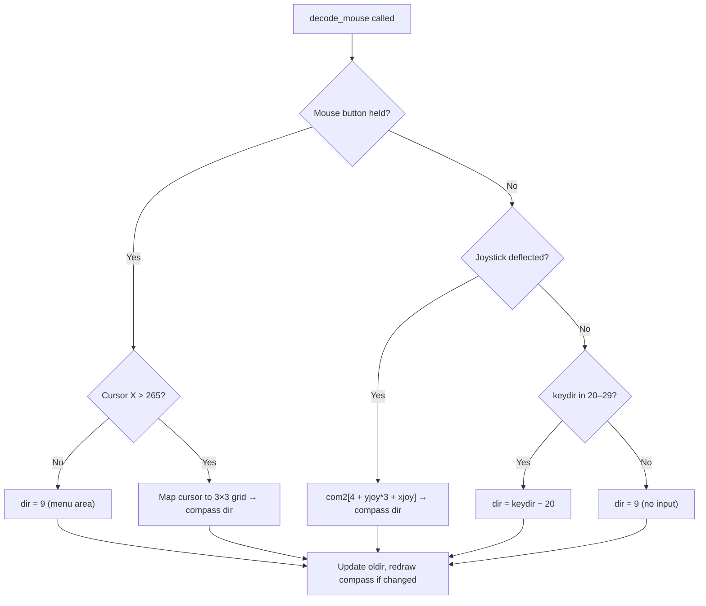
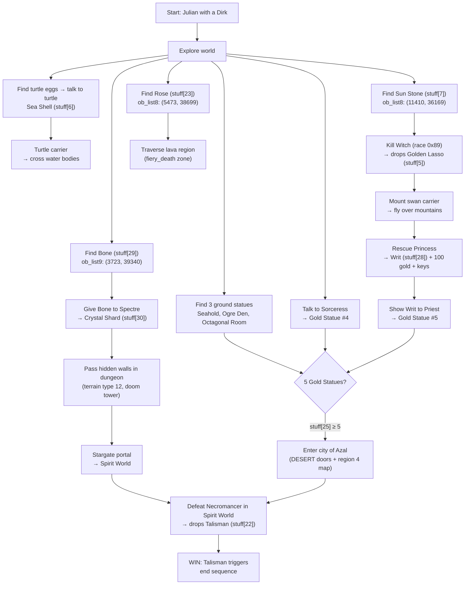

# The Faery Tale Adventure — Game Mechanics Research

Ground-truth documentation of every game mechanic, derived exclusively from the original 1987 source code. All claims are backed by file-and-line citations. Open questions are logged in [PROBLEMS.md](PROBLEMS.md).

> **Citation format**: `file.c:LINE` or `file.c:START-END`. Speech references: `speak(N)`.

---

## 1. Core Data Structures

### 1.1 struct shape — Actor Record

The fundamental actor record, used for the player, NPCs, and enemies. Defined in C at `ftale.h:56-67` and mirrored with byte offsets in assembly at `ftale.i:5-22`.

| Offset | Size | Field | Type | Purpose |
|--------|------|-------|------|---------|
| 0 | 2 | `abs_x` | unsigned short | Absolute world X coordinate |
| 2 | 2 | `abs_y` | unsigned short | Absolute world Y coordinate |
| 4 | 2 | `rel_x` | unsigned short | Screen-relative X position |
| 6 | 2 | `rel_y` | unsigned short | Screen-relative Y position |
| 8 | 1 | `type` | char | Object type number |
| 9 | 1 | `race` | UBYTE | Race (indexes `encounter_chart[]`) |
| 10 | 1 | `index` | char | Current animation frame image index |
| 11 | 1 | `visible` | char | On-screen visibility flag |
| 12 | 1 | `weapon` | char | Weapon type: 0=none, 1=dagger, 2=mace, 3=sword, 4=bow, 5=wand |
| 13 | 1 | `environ` | char | Environment/terrain state (see [P1](PROBLEMS.md)) |
| 14 | 1 | `goal` | char | Current goal mode ([§2.2](#22-goal-modes)) |
| 15 | 1 | `tactic` | char | Current tactical mode ([§2.3](#23-tactical-modes)) |
| 16 | 1 | `state` | char | Motion/animation state ([§2.1](#21-motion-states)) |
| 17 | 1 | `facing` | char | Direction facing (0–7, see [§5.1](#51-direction-encoding)) |
| 18 | 2 | `vitality` | short | Hit points; doubles as original object index for NPCs |
| 20 | 1 | `vel_x` | char | X velocity (slippery/ice physics) |
| 21 | 1 | `vel_y` | char | Y velocity (slippery/ice physics) |
| **22** | | | | **Total size** (`l_shape` in `ftale.i`) |

A commented-out `APTR source_struct` field appears in both C and assembly definitions (`ftale.h:66`, `ftale.i:21`), suggesting a removed feature.

#### Actor Array

```c
#define MAXSHAPES 25                    // fmain.c:68
struct shape anim_list[20];             // fmain.c:70
unsigned char anim_index[20];           // fmain.c:74 — depth-sort index
short anix, anix2;                      // fmain.c:75 — monster allocation count
short mdex;                             // fmain.c:76 — missile index
```

- `anim_list[0]` — always the player-controlled hero
- `anim_list[1-2]` — party members / carriers
- `anim_list[3-6]` — enemy actors (up to 4; `anix` tracks count, max 7 per `fmain.c:2064`)
- `anim_list[7-19]` — remaining slots for world objects and set-figures

`MAXSHAPES=25` governs the per-page rendering queue (`sshape[25]`), not the actor array size (`fmain.c:68` vs `fmain.c:70`).

#### Missile System

```c
struct missile {                        // fmain.c:78-85
    unsigned short abs_x, abs_y;
    char missile_type,                  // NULL, arrow, rock, 'thing', or fireball
         time_of_flight,
         speed,                         // 0 = unshot
         direction,
         archer;                        // ID of firing actor
} missile_list[6];                      // 6 missiles max
```

### 1.2 struct fpage — Double-Buffer Page State

Defined at `ftale.h:69-79` and `ftale.i:24-37`. Two instances: `fp_page1`, `fp_page2` (`fmain.c:443`).

| Field | Type | Purpose |
|-------|------|---------|
| `ri_page` | RasInfo* | Amiga RasInfo for this page |
| `savecop` | cprlist* | Copper list pointer |
| `isv_x` | long | Page scroll X position |
| `isv_y` | long | Page scroll Y position |
| `obcount` | short | Number of objects queued for rendering |
| `shape_queue` | sshape* | Pointer to rendering shape queue |
| `backsave` | unsigned char* | Background save buffer |
| `saveused` | long | How much of save buffer is used |
| `witchx` | short | Witch effect X position (for erasure) |
| `witchy` | short | Witch effect Y position |
| `witchdir` | short | Witch effect direction |
| `wflag` | short | Witch effect active flag |

### 1.3 struct seq_info — Sprite Sheet Descriptor

Defined at `ftale.h:81-88` and `ftale.i:39-47`. Array: `seq_list[7]` (`fmain.c:39`).

| Field | Type | Purpose |
|-------|------|---------|
| `width` | short | Frame width in pixels |
| `height` | short | Frame height in pixels |
| `count` | short | Number of frames |
| `location` | unsigned char* | Pointer to image data |
| `maskloc` | unsigned char* | Pointer to mask data |
| `bytes` | short | Bytes per frame |
| `current_file` | short | Currently loaded file index |

Sequence type constants (`ftale.h:90`):

| Value | Name | Purpose |
|-------|------|---------|
| 0 | `PHIL` | Player character sprites |
| 1 | `OBJECTS` | World object sprites |
| 2 | `ENEMY` | Enemy sprites |
| 3 | `RAFT` | Raft/vehicle sprites |
| 4 | `SETFIG` | Set-piece figure sprites (NPCs) |
| 5 | `CARRIER` | Carrier animal sprites |
| 6 | `DRAGON` | Dragon sprites |

### 1.4 struct object — World Object Instance

Defined at `ftale.h:92-95` and `ftale.i:53-58`. 6 bytes per object; 250 objects per sector. Two arrays: `ob_listg[]`, `ob_list8[]` (`fmain.c:378`).

| Field | Type | Size | Purpose |
|-------|------|------|---------|
| `xc` | unsigned short | 2 | World X coordinate |
| `yc` | unsigned short | 2 | World Y coordinate |
| `ob_id` | char | 1 | Object type ID |
| `ob_stat` | char | 1 | Status (0=inactive, 1+=active) |

### 1.5 struct inv_item — Inventory Item Descriptor

Defined at `ftale.h:97-104`. The `inv_list[]` table has 36 entries (`fmain.c:380-418`).

| Field | Type | Purpose |
|-------|------|---------|
| `image_number` | UBYTE | Display image number |
| `xoff` | UBYTE | X offset on inventory screen |
| `yoff` | UBYTE | Y offset on inventory screen |
| `ydelta` | UBYTE | Y increment for stacking |
| `img_off` | UBYTE | Sub-image offset |
| `img_height` | UBYTE | Height of sub-image |
| `maxshown` | UBYTE | Max displayable count (also gold value for coins) |
| `name` | char* | Display name string |

#### Inventory Index Ranges

| Range | Constant | Contents | Source |
|-------|----------|----------|--------|
| 0–4 | — | Weapons: Dirk, Mace, Sword, Bow, Magic Wand | `fmain.c:427` |
| 5–8 | — | Special: Golden Lasso, Sea Shell, Sun Stone, Arrows | `fmain.c:428` |
| 9–15 | `MAGICBASE=9` | Magic items: Blue Stone, Green Jewel, Glass Vial, Crystal Orb, Bird Totem, Gold Ring, Jade Skull | `fmain.c:429` |
| 16–21 | `KEYBASE=16` | Keys: Gold, Green, Blue, Red, Grey, White | `fmain.c:430` |
| 22–24 | — | Quest/stat: Talisman, Rose, Fruit | `fmain.c:380-418` |
| 25–30 | `STATBASE=25` | Collectibles: Gold Statue, Book, Herb, Writ, Bone, Shard | `fmain.c:430` |
| 31–34 | `GOLDBASE=31` | Gold coins: 2gp, 5gp, 10gp, 100gp | `fmain.c:430` |
| 35 | `ARROWBASE=35` | Quiver of arrows | `fmain.c:430` |

Per-brother storage: `julstuff[35]`, `philstuff[35]`, `kevstuff[35]`; active inventory via `UBYTE *stuff` pointer (`fmain.c:432`).

### 1.6 struct need — Asset Loading Descriptor

Defined at `ftale.h:106-108`. Array: `file_index[10]` (one per region F1–F10, `fmain.c:615-625`).

| Field | Type | Purpose |
|-------|------|---------|
| `image[4]` | USHORT | 4 image file indices needed |
| `terra1` | USHORT | Terrain data file 1 |
| `terra2` | USHORT | Terrain data file 2 |
| `sector` | USHORT | Sector data file |
| `region` | USHORT | Region data file |
| `setchar` | USHORT | Set-character file needed |

### 1.7 struct in_work — Input Handler Data

Defined at `ftale.h:110-119`. Single instance: `handler_data` (`fmain.c:694`). Passed to the interrupt handler as `a1`.

| Offset | Field | Type | Purpose |
|--------|-------|------|---------|
| 0 | `xsprite` | short | Mouse pointer X (clamped 5–315) |
| 2 | `ysprite` | short | Mouse pointer Y (clamped 147–195) |
| 4 | `qualifier` | short | Input event qualifier (button/modifier state) |
| 6 | `laydown` | UBYTE | Keyboard buffer write pointer (0–127) |
| 7 | `pickup` | UBYTE | Keyboard buffer read pointer (0–127) |
| 8 | `newdisk` | char | Disk-inserted event flag |
| 9 | `lastmenu` | char | Last mouse-click menu character |
| 10 | `gbase` | GfxBase* | GfxBase pointer for MoveSprite |
| 14 | `pbase` | SimpleSprite* | Pointer sprite (NULL = no updates) |
| 18 | `vbase` | ViewPort* | ViewPort for MoveSprite |
| 22 | `keybuf[128]` | unsigned char | 128-byte circular keyboard buffer |
| 150 | `ticker` | short | Timer heartbeat counter (0–16) |

Byte offsets confirmed from assembly equates at `fsubs.asm:60-62` and field access patterns at `fsubs.asm:74-76`, `fsubs.asm:101`, `fsubs.asm:144`, `fsubs.asm:191-196`.

---

## 2. Actor State Machine

Actors are governed by three orthogonal state variables: **motion state** (animation/physics), **goal mode** (high-level AI objective), and **tactical mode** (low-level navigation behavior). These are stored in `shape.state`, `shape.goal`, and `shape.tactic` respectively ([§1.1](#11-struct-shape--actor-record)).

### 2.1 Motion States

Defined at `ftale.h:9-25` (canonical) and duplicated at `fmain.c:90-103`.

| Value | Name | Purpose |
|-------|------|---------|
| 0–11 | *(fighting frames)* | Combat animation sub-states; figure selected via `statelist[facing*12 + state]` |
| 12 | `WALKING` | Normal walk cycle |
| 13 | `STILL` | Stationary/idle |
| 14 | `DYING` | Death animation in progress |
| 15 | `DEAD` | Fully dead |
| 16 | `SINK` | Sinking (quicksand/water) |
| 17 | `OSCIL` | Oscillation animation 1 (comment: "and 18") — vestigial, never assigned |
| 18 | *(implicit)* | Oscillation animation 2 (paired with OSCIL) — vestigial, never assigned |
| 19 | `TALKING` | Speaking/dialogue |
| 20 | `FROZEN` | Frozen in place (freeze spell) |
| 21 | `FLYING` | Vestigial — defined but never assigned; Swan uses WALKING + `riding` |
| 22 | `FALL` | Falling; velocity-based with 25% friction per tick (`fmain.c:1737-1738`) |
| 23 | `SLEEP` | Sleeping |
| 24 | `SHOOT1` | Bow up — aiming |
| 25 | `SHOOT3` | Bow fired, arrow given velocity |

### 2.2 Goal Modes

Defined at `ftale.h:29-39` (canonical) and duplicated at `fmain.c:107-117`.

| Value | Name | Purpose |
|-------|------|---------|
| 0 | `USER` | Player-controlled |
| 1 | `ATTACK1` | Attack stupidly (low cleverness) |
| 2 | `ATTACK2` | Attack cleverly (high cleverness) |
| 3 | `ARCHER1` | Archery attack style 1 |
| 4 | `ARCHER2` | Archery attack style 2 |
| 5 | `FLEE` | Run directly away from hero |
| 6 | `STAND` | Stand still, face hero |
| 7 | `DEATH` | Dead character |
| 8 | `WAIT` | Wait to speak to hero |
| 9 | `FOLLOWER` | Follow another character |
| 10 | `CONFUSED` | Run around randomly |

ATTACK1 vs ATTACK2 is determined by the `cleverness` field in `encounter_chart[]` — dispatched at `fmain.c:2150`.

### 2.3 Tactical Modes

Defined at `ftale.h:43-54` (canonical). `fmain.c:121-132` duplicates values 0–10 only; values 11–12 exist only in the header.

| Value | Name | Purpose |
|-------|------|---------|
| 0 | `FRUST` | Frustrated — try a different tactic |
| 1 | `PURSUE` | Move toward hero |
| 2 | `FOLLOW` | Move toward another character |
| 3 | `BUMBLE_SEEK` | Bumble around seeking target |
| 4 | `RANDOM` | Move in random direction |
| 5 | `BACKUP` | Reverse current direction |
| 6 | `EVADE` | Move 90° from hero |
| 7 | `HIDE` | Seek hiding place (planned but never implemented) |
| 8 | `SHOOT` | Shoot an arrow |
| 9 | `SHOOTFRUST` | Arrows not connecting — re-evaluate |
| 10 | `EGG_SEEK` | Snakes seeking turtle eggs |
| 11 | `DOOR_SEEK` | Dark Knight blocking door (replaced by hardcoded logic) |
| 12 | `DOOR_LET` | Dark Knight letting player pass (replaced by hardcoded logic) |

Source comment at `ftale.h:47`: "choices 2–5 can be selected randomly for getting around obstacles."

### 2.4 statelist — Animation Frame Lookup

Defined at `fmain.c:143-205`. An array of 87 `struct state` entries (`fmain.c:138-142`):

```c
struct state { char figure, wpn_no, wpn_x, wpn_y; };
```

Maps `(motion_state, facing, frame)` → `(figure_image, weapon_overlay_index, weapon_x_offset, weapon_y_offset)`.

#### Walk Sequences (8 frames each)

| Index Range | Direction | Source |
|-------------|-----------|--------|
| 0–7 | South | `fmain.c:148-149` |
| 8–15 | West | `fmain.c:152-153` |
| 16–23 | North | `fmain.c:156-157` |
| 24–31 | East | `fmain.c:160-161` |

Walk base is selected via `diroffs[16]` (`fmain.c:1010`):

```c
char diroffs[16] = {16,16,24,24,0,0,8,8,56,56,68,68,32,32,44,44};
```

Indices 0–7 select walk bases; indices 8–15 select fight/shoot bases.

#### Fight Sequences (12 states each)

| Index Range | Direction | Source |
|-------------|-----------|--------|
| 32–43 | South | `fmain.c:164-169` |
| 44–55 | West | `fmain.c:172-177` |
| 56–67 | North | `fmain.c:180-185` |
| 68–79 | East | `fmain.c:188-193` |

Each 12-entry block covers fight states 0–11: states 0–8 are weapon swing positions, state 9 duplicates a swing position, states 10–11 are ranged attack frames (bow/wand entries reference `wpn_no` indices 80+; see [P4](PROBLEMS.md)).

#### Special States

| Index | Purpose | Source |
|-------|---------|--------|
| 80–82 | Death sequence (3 frames) | `fmain.c:196` |
| 83 | Sinking | `fmain.c:198` |
| 84–85 | Oscillation (2 frames) | `fmain.c:201` |
| 86 | Asleep | `fmain.c:203` |

### 2.5 trans_list — Fight Animation Transitions

Defined at `fmain.c:136-146`. Nine entries of `struct transition`:

```c
struct transition { char newstate[4]; };    // fmain.c:136-137
```

| Index | newstate[0] | [1] | [2] | [3] | Source |
|-------|-------------|-----|-----|-----|--------|
| 0 | 1 | 8 | 0 | 1 | `fmain.c:138` |
| 1 | 2 | 0 | 1 | 0 | `fmain.c:139` |
| 2 | 3 | 1 | 2 | 8 | `fmain.c:140` |
| 3 | 4 | 2 | 3 | 7 | `fmain.c:141` |
| 4 | 5 | 3 | 4 | 6 | `fmain.c:142` |
| 5 | 6 | 4 | 5 | 5 | `fmain.c:143` |
| 6 | 8 | 5 | 6 | 4 | `fmain.c:144` |
| 7 | 8 | 6 | 7 | 3 | `fmain.c:145` |
| 8 | 0 | 6 | 8 | 2 | `fmain.c:146` |

The `newstate[0]` column forms a forward cycle: 0→1→2→3→4→5→6→8→0 (state 7 reached via `newstate[3]` and feeds back into the cycle). `newstate[1]` traverses the reverse direction. This implements the sword swing arc animation. See [P3](PROBLEMS.md) for detailed index semantics.

A random element selects which of the 4 transition paths to take: `trans_list[state].newstate[rand4()]` (`fmain.c:1712`).

### 2.6 setfig_table — NPC Type Descriptors

Defined at `fmain.c:21-37`. Maps NPC type index to image file and speech capability.

```c
struct { BYTE cfile_entry, image_base, can_talk; }
```

| Index | NPC Type | cfile_entry | image_base | can_talk | Source |
|-------|----------|-------------|------------|----------|--------|
| 0 | Wizard | 13 | 0 | 1 | `fmain.c:24` |
| 1 | Priest | 13 | 4 | 1 | `fmain.c:25` |
| 2 | Guard (front) | 14 | 0 | 0 | `fmain.c:26` |
| 3 | Guard (back) | 14 | 1 | 0 | `fmain.c:27` |
| 4 | Princess | 14 | 2 | 0 | `fmain.c:28` |
| 5 | King | 14 | 4 | 1 | `fmain.c:29` |
| 6 | Noble | 14 | 6 | 0 | `fmain.c:30` |
| 7 | Sorceress | 14 | 7 | 0 | `fmain.c:31` |
| 8 | Bartender | 15 | 0 | 0 | `fmain.c:32` |
| 9 | Witch | 16 | 0 | 0 | `fmain.c:33` |
| 10 | Spectre | 16 | 6 | 0 | `fmain.c:34` |
| 11 | Ghost | 16 | 7 | 0 | `fmain.c:35` |
| 12 | Ranger | 17 | 0 | 1 | `fmain.c:36` |
| 13 | Beggar | 17 | 4 | 1 | `fmain.c:37` |

`cfile_entry` selects the image file (index into `seq_list` loading sequence). `image_base` is the sub-image offset within that file. `can_talk=1` enables generic dialogue initiation.

### 2.7 encounter_chart — Monster Combat Stats

Defined at `fmain.c:42-64`. Struct definition at `fmain.c:42-53`:

```c
struct encounter {
    char hitpoints, agressive, arms, cleverness, treasure, file_id;
};
```

| Index | Monster | HP | Aggressive | Arms | Cleverness | Treasure | File ID | Source |
|-------|---------|-----|------------|------|------------|----------|---------|--------|
| 0 | Ogre | 18 | TRUE | 2 | 0 | 2 | 6 | `fmain.c:54` |
| 1 | Orcs | 12 | TRUE | 4 | 1 | 1 | 6 | `fmain.c:55` |
| 2 | Wraith | 16 | TRUE | 6 | 1 | 4 | 7 | `fmain.c:56` |
| 3 | Skeleton | 8 | TRUE | 3 | 0 | 3 | 7 | `fmain.c:57` |
| 4 | Snake | 16 | TRUE | 6 | 1 | 0 | 8 | `fmain.c:58` |
| 5 | Salamander | 9 | TRUE | 3 | 0 | 0 | 7 | `fmain.c:59` |
| 6 | Spider | 10 | TRUE | 6 | 1 | 0 | 8 | `fmain.c:60` |
| 7 | DKnight | 40 | TRUE | 7 | 1 | 0 | 8 | `fmain.c:61` |
| 8 | Loraii | 12 | TRUE | 6 | 1 | 0 | 9 | `fmain.c:62` |
| 9 | Necromancer | 50 | TRUE | 5 | 0 | 0 | 9 | `fmain.c:63` |
| 10 | Woodcutter | 4 | 0 | 0 | 0 | 0 | 9 | `fmain.c:64` |

**Field semantics:**

- **`hitpoints`** — Base vitality assigned at spawn.
- **`agressive`** — TRUE = hostile on sight; 0 = passive. Only the Woodcutter (index 10) is non-aggressive.
- **`arms`** — Indexes into `weapon_probs[]` (`fmain2.c:860-868`): `weapon_probs[arms*4 + rnd(4)]` selects the weapon type at spawn (`fmain.c:2758`).
- **`cleverness`** — 0 = goal ATTACK1 (stupid pursuit), 1 = goal ATTACK2 (clever pursuit with more frequent re-evaluation).
- **`treasure`** — Indexes into `treasure_probs[]` (`fmain2.c:852-858`): `treasure_probs[treasure*8 + rnd(8)]` selects loot on body search (`fmain.c:3273`).
- **`file_id`** — Image file index for loading monster sprites.

#### weapon_probs — Weapon Selection Table

Defined at `fmain2.c:860-868`. 8 groups of 4 entries (32 total). Indexed by `arms * 4 + rnd(4)`:

| Group | Values | Weapons |
|-------|--------|---------|
| 0 | 0,0,0,0 | None |
| 1 | 1,1,1,1 | All daggers |
| 2 | 1,2,1,2 | Daggers and maces |
| 3 | 1,2,3,2 | Mostly maces, some swords |
| 4 | 4,4,3,2 | Bows and swords |
| 5 | 5,5,5,5 | All magic wands |
| 6 | 8,8,8,8 | Touch attack |
| 7 | 3,3,3,3 | All swords |

Weapon type 8 ("touch attack") is not in the standard weapon enum (0–5) and represents contact damage from monsters like Wraiths and Spiders.

#### treasure_probs — Loot Selection Table

Defined at `fmain2.c:852-858`. 5 groups of 8 entries (40 total). Indexed by `treasure * 8 + rnd(8)`:

| Group | Values | Loot Type |
|-------|--------|-----------|
| 0 | 0,0,0,0,0,0,0,0 | Nothing |
| 1 | 9,11,13,31,31,17,17,32 | Stones, vials, totems, gold, keys |
| 2 | 12,14,20,20,20,31,33,31 | Keys, skulls, gold |
| 3 | 10,10,16,16,11,17,18,19 | Magic items and keys |
| 4 | 15,21,0,0,0,0,0,0 | Jade Skull and White Key (rare) |

---

## 3. Random Number Generation

### 3.1 Algorithm

The RNG is a **Linear Congruential Generator (LCG)** implemented in 68000 assembly at `fsubs.asm:299-306`:

```
seed1 = low16(seed1) × 45821 + 1       (mulu.w produces 32-bit result)
output = ror32(seed1, 6) & 0x7FFFFFFF   (rotate, then clear sign bit)
```

Instruction-by-instruction:

| Line | Instruction | Effect |
|------|-------------|--------|
| `fsubs.asm:300` | `move.l _seed1,d0` | Load 32-bit state |
| `fsubs.asm:301` | `mulu.w #45821,d0` | Unsigned 16×16→32 multiply (uses only low 16 bits of d0) |
| `fsubs.asm:302` | `addq.l #1,d0` | Increment by 1 |
| `fsubs.asm:303` | `move.l d0,_seed1` | Store updated state |
| `fsubs.asm:304` | `ror.l #6,d0` | Rotate right 6 bits (mixes high/low bits) |
| `fsubs.asm:305` | `and.l #$7fffffff,d0` | Clear sign bit → non-negative 31-bit result |

**Critical limitation**: The 68000 `mulu.w` instruction operates on the low 16 bits of `d0` only. The upper 16 bits of `seed1` are always a deterministic function of the low 16 bits. The effective state space is 2^16, giving a maximum period of **65536** — not 2^32 (see [P7](PROBLEMS.md)).

The `ror.l #6` rotation scrambles bit positions so low state bits contribute to high output bits and vice versa, but it does not increase the period. The output is 31 bits wide from a 16-bit state, so many 31-bit values can never appear.

### 3.2 Function Family

All functions declared at `fsubs.asm:296-297` and implemented at `fsubs.asm:299-340`:

| Function | Location | Returns | Formula |
|----------|----------|---------|---------|
| `rand()` | `fsubs.asm:299-306` | 0 to 0x7FFFFFFF (31-bit) | Base LCG output |
| `bitrand(x)` | `fsubs.asm:308-310` | `rand() & x` | Masked random |
| `rand2()` | `fsubs.asm:312-314` | 0 or 1 | `rand() & 1` |
| `rand4()` | `fsubs.asm:316-318` | 0–3 | `rand() & 3` |
| `rand8()` | `fsubs.asm:320-322` | 0–7 | `rand() & 7` |
| `rand64()` | `fsubs.asm:324-326` | 0–63 | `rand() & 63` |
| `rand256()` | `fsubs.asm:328-330` | 0–255 | `rand() & 255` |
| `rnd(n)` | `fsubs.asm:332-338` | 0 to n−1 | `(rand() & 0xFFFF) % n` |

The `bitrand`/`randN` variants use bitwise AND, so they produce uniform results only when the mask is a power-of-two minus one. `rnd(n)` uses a true modulo operation via the 68000 `divu.w` instruction (`fsubs.asm:335-337`).

### 3.3 Seeding

**Initial value**: `seed1 = 19837325` (hex `0x012ED98D`), declared at `fmain.c:682`.

A second variable `seed2 = 23098324` is declared on the same line but **never referenced** anywhere in the codebase (vestigial).

**No runtime reseeding**: There is no code that writes to `seed1` other than the `_rand` function itself (`fsubs.asm:303`). The seed is not derived from system time, VBlank counter, user input timing, or any other entropy source.

The developer `notes` file contains a single line (`notes:1`): *"Need to initialize random number generator."* — indicating Talin was aware of this limitation but the TODO was never addressed.

### 3.4 Copy-Protection Entropy

The only source of sequence variation between game sessions is the copy-protection input loop at `fmain2.c:1327`:

```c
while (TRUE) { key = getkey(); ... rand(); }
```

Each keystroke iteration calls `rand()` with the result discarded. Since different players type at different speeds, the RNG state has advanced by a variable (but uncontrolled) number of steps before gameplay begins. This provides incidental — not intentional — seed variation.

### 3.5 Usage Summary

The RNG is called pervasively across combat, AI, encounters, loot, movement, sound, and visual effects. Key usage categories:

| Domain | Example | Source |
|--------|---------|--------|
| AI re-evaluation | `!bitrand(15)` — 1/16 chance per tick | `fmain.c:2132` |
| Tactic selection | `rand4()+2` (ranged), `rand2()+3` (melee) | `fmain.c:2142-2143` |
| Hit detection | `rand256() > brave` — bravery dodge check | `fmain.c:2260` |
| Encounter spawn | `rand64() <= danger_level` | `fmain.c:2085` |
| Loot generation | `rand4()` selects chest tier (0–3) | `fmain.c:3201` |
| Movement deviation | `rand4()` hunger stumble; `rand2()` direction | `fmain.c:1442-1443` |
| Fight transition | `rand4()` selects `trans_list` path | `fmain.c:1712` |
| Sound pitch | `rand256()` or `bitrand(511)` for variation | `fmain.c:1680`, `fmain2.c:239` |

---

## 4. Input System

### 4.1 Handler Architecture

The game installs a custom Amiga input event handler at priority 51 — one higher than Intuition's 50 — so it intercepts all input events before the operating system.

**Installation** — `add_device()` at `fmain.c:3017-3036`:

1. Clears keyboard buffer: `handler_data.laydown = handler_data.pickup = 0` (`fmain.c:3020`)
2. Creates a message port and I/O request (`fmain.c:3021-3022`)
3. Configures `struct Interrupt handlerStuff`:
   - `is_Data = &handler_data` — the `struct in_work` instance (`fmain.c:3025`)
   - `is_Code = HandlerInterface` — assembly entry point (`fmain.c:3026`)
   - `is_Node.ln_Pri = 51` (`fmain.c:3027`)
4. Opens `input.device` and sends `IND_ADDHANDLER` (`fmain.c:3029-3035`)

**Teardown** — `wrap_device()` at `fmain.c:3038-3046`: sends `IND_REMHANDLER`, closes device, frees port.

**Initialization before install** (`fmain.c:785-788`):
- `xsprite = ysprite = 320` — initial cursor position
- `gbase = GfxBase` — graphics library base
- `pbase = 0` — no sprite initially (set to `&pointer` later at `fmain.c:1258`)
- `vbase = &vp_text` — assigned after display setup (`fmain.c:943`)

### 4.2 Interrupt Handler

`_HandlerInterface` at `fsubs.asm:63-218` receives `a0` = input event chain, `a1` = `&handler_data`. It iterates the linked list of events and processes each by type:

#### TIMER Events (type 6) — `fsubs.asm:72-80`

Heartbeat mechanism: increments `ticker` (offset 150) each TIMER event. When `ticker` reaches 16, resets to 0 and synthesizes a fake RAWKEY event (keycode `$E0` — key-up for undefined scancode `$60`). This prevents the game loop from stalling when no real input arrives.

#### RAWKEY Events (type 1) — `fsubs.asm:82-110`

1. Reads qualifier word; ignores repeat keys (bit 9 set) (`fsubs.asm:90-92`)
2. Extracts 7-bit scancode and up/down flag (bit 7) (`fsubs.asm:94-96`)
3. Ignores scancodes > `$5A` (`fsubs.asm:97-98`)
4. **Nullifies the event** (sets type to 0) so Intuition never sees it (`fsubs.asm:100`)
5. Translates via `keytrans[]` table: `translated = keytrans[scancode]` (`fsubs.asm:102`)
6. Restores up/down bit: `output = translated | original_bit7` (`fsubs.asm:103-104`)
7. Writes to circular `keybuf[laydown]` and advances `laydown` pointer with `& $7F` wrap (`fsubs.asm:106-112`)

#### RAWMOUSE Events (type 2) — `fsubs.asm:114-159`

**Button change detection**: XORs new qualifier with old to detect transitions (`fsubs.asm:117`).

**Left button release**: replays `lastmenu` character with bit 7 set (key-up) and clears `lastmenu` (`fsubs.asm:123-127`).

**Left button press** in menu area (X: 215–265):
- Computes character: `(ysprite - 144) / 9 * 2 + 'a' + column` where column = 1 if X ≥ 240 (`fsubs.asm:139-148`)
- Queues character in `keybuf`; saves as `lastmenu` (`fsubs.asm:149-156`)

**Left button press** outside menu: `d2 = 9` (no direction) (`fsubs.asm:130`).

#### DISKIN Events (type $10) — `fsubs.asm:160-161`

Sets `handler_data.newdisk = 1` — the disk-inserted flag read by the game loop.

#### Mouse Position Update (all events) — `fsubs.asm:163-200`

Applied for every event regardless of type:
1. Adds delta from event fields (`ie_X`, `ie_Y`) to `xsprite`/`ysprite` (`fsubs.asm:166-167`)
2. Clamps X to 5–315, Y to 147–195 (`fsubs.asm:169-180`)
3. If `pbase` ≠ NULL: calls `MoveSprite(gbase, pbase, x*2, y-143)` (`fsubs.asm:184-199`)
   - X is doubled for hi-res sprite positioning
   - Y offset −143 maps to ViewPort-relative coordinates

The Y clamp of 147–195 confines the pointer to the 48-pixel status bar area — the mouse never enters the playfield.

### 4.3 Keyboard Buffer — getkey()

`_getkey` at `fsubs.asm:281-295`: reads the next translated keycode from the 128-byte circular FIFO. Returns 0 if buffer empty, or the translated key with bit 7 = up/down flag.

Called from the game loop at `fmain.c:1278`: `key = getkey()`.

### 4.4 keytrans Table — Scancode Translation

Defined at `fsubs.asm:221-226`. A 91-byte table translating Amiga raw scancodes (0–`$5A`) to game-internal key codes.

**Numpad → Direction codes (20–29)**:

```
7=NW(20)   8=N(21)    9=NE(22)
4=W(27)    5=stop(29)  6=E(23)
1=SW(26)   2=S(25)    3=SE(24)
```

| Scancode | Numpad Key | keytrans | Direction (val−20) | Compass |
|----------|-----------|----------|-------------------|---------|
| `$3D` | 7 | 20 | 0 | NW |
| `$3E` | 8 | 21 | 1 | N |
| `$3F` | 9 | 22 | 2 | NE |
| `$2F` | 6 | 23 | 3 | E |
| `$1D` | 1 | 26 | 6 | SW |
| `$1E` | 2 | 25 | 5 | S |
| `$1F` | 3 | 24 | 4 | SE |
| `$2D` | 4 | 27 | 7 | W |
| `$2E` | 5 | 29 | 9 | Stop/center |

Cursor keys (`$4C`–`$4F`) translate to values 1–4 (used as cheat movement keys at `fmain.c:1339-1342`), **not** direction codes 20–29.

Function keys F1–F10 (`$50`–`$59`) translate to values 10–19 (`fsubs.asm:225`).

### 4.5 Direction Decoder — decode_mouse()

`_decode_mouse` at `fsubs.asm:1488-1590`, called every frame from `fmain.c:1376`. Determines the current movement direction from three sources in priority order:



**Mouse direction** (highest priority, `fsubs.asm:1492-1529`): When either mouse button is held (`qualifier & $6000`), the cursor position maps to a 3×3 compass grid if X > 265. Otherwise direction = 9 (menu area, no movement).

**Joystick direction** (`fsubs.asm:1531-1560`): Reads JOY1DAT register at `$dff00c`. High byte = Y axis, low byte = X axis. Decoded via XOR of adjacent bits to extract direction per axis, then indexed through `com2[]`.

**Keyboard direction** (lowest priority, `fsubs.asm:1565-1576`): Uses the stored `keydir` value (set when numpad keys 20–29 are pressed at `fmain.c:1288`). `keydir − 20` gives the compass direction.

When the resolved direction changes from `oldir`, `drawcompass()` is called to update the compass highlight (`fsubs.asm:1578-1585`).

### 4.6 com2 — Direction Lookup Table

Defined at `fsubs.asm:1486` and `fmain2.c:155-162`. Converts (xjoy, yjoy) sign pairs to compass directions via the formula `com2[4 + yjoy*3 + xjoy]` (for joystick) or `com2[4 − 3*ydir − xdir]` (for `set_course`):

```
com2[9] = {0, 1, 2, 7, 9, 3, 6, 5, 4}
```

| yjoy\\xjoy | −1 | 0 | +1 |
|---|---|---|---|
| −1 | 0 (NW) | 1 (N) | 2 (NE) |
| 0 | 7 (W) | 9 (stop) | 3 (E) |
| +1 | 6 (SW) | 5 (S) | 4 (SE) |

### 4.7 Combat & Walk Triggers

The game loop reads input qualifier bits and hardware registers to determine action:

**Combat trigger** (`fmain.c:1409`):
```
qualifier & 0x2000 (right mouse)  ||  keyfight  ||  (CIA-A $bfe001 bit 7 == 0)
```

The joystick fire button is read directly from CIA-A PRA register at `$bfe001` bit 7 (active low), **bypassing** the input.device handler entirely (`fmain.c:1272`).

**Walk trigger** (`fmain.c:1447`):
```
qualifier & 0x4000 (left mouse)  ||  keydir != 0
```

**Fight mode toggle**: The '0' key (numpad 0) sets `keyfight = TRUE` on key-down and clears on key-up (`fmain.c:1290-1291`), providing a keyboard alternative to holding the fire button.

### 4.8 letter_list — Keyboard Shortcuts

Defined at `fmain.c:537-556`. A 38-entry table (`#define LMENUS 38`, `fmain.c:533`) mapping translated key characters to `(menu, choice)` pairs:

```c
struct letters { char letter, menu, choice; };
```

| Key | Menu | Choice | Action |
|-----|------|--------|--------|
| `I` | ITEMS (0) | 5 | Items menu |
| `T` | ITEMS (0) | 6 | Take |
| `?` | ITEMS (0) | 7 | Look |
| `U` | ITEMS (0) | 8 | Use |
| `G` | ITEMS (0) | 9 | Give |
| `Y` | TALK (2) | 5 | Yell |
| `S` | TALK (2) | 6 | Say |
| `A` | TALK (2) | 7 | Ask |
| `Space` | GAME (4) | 5 | Pause |
| `M` | GAME (4) | 6 | Music toggle |
| `F` | GAME (4) | 7 | Sound toggle |
| `Q` | GAME (4) | 8 | Quit |
| `L` | GAME (4) | 9 | Load |
| `O` | BUY (3) | 5 | Buy item |
| `R` | BUY (3) | 6 | Buy item |
| `8` | BUY (3) | 7 | Buy item |
| `C` | BUY (3) | 8 | Buy Mace |
| `W` | BUY (3) | 9 | Buy Sword |
| `B` | BUY (3) | 10 | Buy Bow |
| `E` | BUY (3) | 11 | Buy Totem |
| `V` | SAVEX (5) | 5 | Save |
| `X` | SAVEX (5) | 6 | Exit |
| F1–F7 | MAGIC (1) | 5–11 | Magic spells 1–7 |
| `1`–`7` | USE (8) | 0–6 | Use item slots 1–7 |
| `K` | USE (8) | 7 | Use key |

The game loop processes keys at `fmain.c:1278-1355` in priority order: view dismissal → direction keys → fight toggle → mouse-click menu → cheat keys → `letter_list` scan.

---

## 5. Movement & Direction

### 5.1 Direction Encoding

The game uses a compass-rose system with 10 values. Defined implicitly by the `xdir`/`ydir` vector tables at `fsubs.asm:1276-1277` and referenced throughout the codebase:

| Value | Direction | xdir | ydir |
|-------|-----------|------|------|
| 0 | NW | −2 | −2 |
| 1 | N | 0 | −3 |
| 2 | NE | +2 | −2 |
| 3 | E | +3 | 0 |
| 4 | SE | +2 | +2 |
| 5 | S | 0 | +3 |
| 6 | SW | −2 | +2 |
| 7 | W | −3 | 0 |
| 8 | Still | 0 | 0 |
| 9 | Still | 0 | 0 |

Values 8 and 9 both map to zero movement. `oldir = 9` signals "no direction input" (`fsubs.asm:1577`).

The vectors are **not** unit vectors. Cardinal directions have magnitude 3, diagonals have magnitude 2 per axis (displacement √8 ≈ 2.83). This produces near-parity between cardinal and diagonal movement speed.

### 5.2 Position Update Functions — newx / newy

#### newx (`fsubs.asm:1280-1295`)

```
newx(x, dir, speed):
    if dir > 7: return x
    return (x + (xdir[dir] * speed) >> 1) & 0x7FFF
```

Steps:
1. Load `x`, `dir`, `speed` from stack (`fsubs.asm:1282-1286`)
2. If `dir > 7`: return `x` unchanged (`fsubs.asm:1287-1288`)
3. `xdir[dir] * speed` — signed 16×16→32 multiply via `muls.w` (`fsubs.asm:1292`)
4. `lsr.w #1` — logical right shift by 1 (`fsubs.asm:1293`)
5. Add to `x` and mask to 15-bit `& 0x7FFF` (`fsubs.asm:1294-1295`)

**Note**: Step 4 uses `lsr.w` (logical shift), not `asr.w` (arithmetic). For negative products this introduces a +1 pixel bias, but the result is clamped to 15 bits (`& 0x7FFF`) in step 5, making the difference negligible.

#### newy (`fsubs.asm:1298-1318`)

Same formula as `newx` using `ydir[]`, plus one additional step: **preserves bit 15** of the original y coordinate:

```asm
and.l  #$07fff,d0      ; mask to 15 bits    (fsubs.asm:1315)
and.w  #$8000,d1       ; extract bit 15     (fsubs.asm:1316)
or.w   d1,d0           ; restore bit 15     (fsubs.asm:1317)
```

Bit 15 of `abs_y` is preserved through movement calculations but is never tested, set, or read by any other code — it has no functional effect.

### 5.3 set_course — Pathfinding

`set_course(object, target_x, target_y, mode)` at `fmain2.c:57-228`. Sets an actor's facing direction based on a target position and one of 7 pathfinding modes.

#### Direction Computation (`fmain2.c:69-109`)

1. **Mode 6 special case**: uses target_x/target_y directly as xdif/ydif without subtracting from current position (`fmain2.c:79-80`)
2. **All other modes**: `xdif = self.abs_x − target_x`, `ydif = self.abs_y − target_y` (`fmain2.c:85-88`)
3. Computes `xdir = sign(xdif)`, `ydir = sign(ydif)` (`fmain2.c:90-109`)

#### Directional Snapping (`fmain2.c:113-126`)

For mode ≠ 4: if one axis dominates, the minor axis is zeroed:
- `(|xdif| >> 1) > |ydif|` → `ydir = 0` (mostly horizontal)
- `(|ydif| >> 1) > |xdif|` → `xdir = 0` (mostly vertical)

Mode 4 skips snapping, always allowing diagonal movement.

#### com2 Lookup (`fmain2.c:155-168`)

Converts the sign pair to compass direction: `j = com2[4 − 3*ydir − xdir]` (see [§4.6](#46-com2--direction-lookup-table)).

If `j == 9` (actor is at target): sets `state = STILL` and returns (`fmain2.c:165-168`).

#### Random Deviation (`fmain2.c:172-179`)

If `j ≠ 9` and deviation > 0:
- `if (rand() & 2)`: `j += deviation` else `j −= deviation`
- `j = j & 7` (wraps to valid direction)

The random test checks bit 1 of `rand()` (`btst #1`), not bit 0.

#### Mode Summary

| Mode | Behavior | Deviation | Source |
|------|----------|-----------|--------|
| 0 | Toward target with snapping | 0 | `fmain2.c:113-187` |
| 1 | Toward target + deviation when distance < 40 | 1 | `fmain2.c:136-139` |
| 2 | Toward target + deviation when distance < 30 | 1 (stale comment says 2) | `fmain2.c:143-146` |
| 3 | Away from target (reverses direction) | 0 | `fmain2.c:149-152` |
| 4 | Toward target without snapping (always allows diagonal) | 0 | `fmain2.c:113` |
| 5 | Toward target with snapping; does NOT set state to WALKING | 0 | `fmain2.c:183-187` |
| 6 | Uses target_x/target_y as raw direction vector | 0 | `fmain2.c:79-80` |

**Important**: These mode numbers are NOT the same as tactical mode constants. `do_tactic()` (`fmain2.c:1664-1700`) maps AI tactics to `set_course` modes:

| Tactic | set_course mode | Target |
|--------|----------------|--------|
| PURSUE (1) | 0 | Hero |
| FOLLOW (2) | 0 | Leader (+20 Y offset) |
| BUMBLE_SEEK (3) | 4 | Hero (no snap) |
| BACKUP (5) | 3 | Hero (reversed) |
| EVADE (6) | 2 | Neighboring actor (+20 Y offset) |
| SHOOT (8) | 5 | Hero (no walk) |
| EGG_SEEK (10) | 0 | Fixed coords (23087, 5667) |
| RANDOM (4) | *(none)* | Sets `facing = rand()&7` directly (`fmain2.c:1686`) |

Most tactics only call `set_course` when a random check passes — `!(rand()&7)` = 1/8 chance per tick (`fmain2.c:1670`), upgraded to `!(rand()&3)` = 1/4 for ATTACK2 goal (`fmain2.c:1669`). This creates sluggish, organic NPC movement.

### 5.4 move_figure — Position Commit with Collision

`move_figure(fig, dir, dist)` at `fmain2.c:322-330`:

```c
xtest = newx(anim_list[fig].abs_x, dir, dist);
ytest = newy(anim_list[fig].abs_y, dir, dist);
if (proxcheck(xtest, ytest, fig)) return FALSE;
anim_list[fig].abs_x = xtest;
anim_list[fig].abs_y = ytest;
return TRUE;
```

Used primarily for combat knockback (`fmain2.c:250`: `move_figure(j, fc, 2)`). Normal per-tick walking is handled **inline** in the main game loop (`fmain.c:1596-1650`), which performs `newx`/`newy` and `proxcheck` directly, then applies terrain effects, velocity, and animation.

#### proxcheck — Collision Detection (`fmain2.c:277-296`)

Two-phase collision test:

1. **Terrain**: calls `prox(x, y)` (`fsubs.asm:1604-1622`) which checks terrain at `(x+4, y+2)` and `(x−4, y+2)`. Returns terrain code if blocked. Wraiths (`race == 2`) skip terrain checks entirely (`fmain2.c:279`). Hero (`i==0`) can pass terrain codes 8 and 9 (`fmain2.c:280`).
2. **Actors**: loops through all actors; if another living actor (not self, not slot 1, not type 5/raft) is within an 11×9 pixel bounding box, returns 16 (`fmain2.c:284-290`).

Returns: 0 = clear, terrain code = terrain-blocked, 16 = actor-blocked.

#### Player Collision Deviation (`fmain.c:1612-1626`)

When the player walks into a wall:
1. Try `dir + 1` (clockwise) — if clear, commit (`fmain.c:1613-1617`)
2. Try `dir − 2` (counterclockwise from original) — if clear, commit (`fmain.c:1620-1624`)
3. All three blocked: `frustflag++` (`fmain.c:1654-1660`). At `frustflag > 20`: scratching-head animation. At `frustflag > 40`: special animation index 40.

### 5.5 World Wrapping

#### Coordinate Masking

Both `_newx` and `_newy` mask results with `& 0x7FFF` — clamping to the 15-bit range [0, 32767]. This provides implicit wrapping on arithmetic overflow.

#### Hero Wrap Boundaries (`fmain.c:1831-1839`)

For outdoor regions (`region_num < 8`) only, applied to the hero (index 0):

```c
if (abs_x < 300)      abs_x = 32565;
else if (abs_x > 32565) abs_x = 300;
else if (abs_y < 300)  abs_y = 32565;
else if (abs_y > 32565) abs_y = 300;
```

This creates a toroidal world with wrap boundaries at 300 and 32565. Indoor regions (`region_num ≥ 8`) do not wrap. NPCs are never wrapped — they can exist at any coordinate.

#### Relative Positioning — wrap() (`fsubs.asm:1350-1356`)

Sign-extends a 15-bit coordinate difference to 16-bit signed:

```asm
btst  #14,d0          ; if bit 14 set (≥ 16384) →
or.w  #$8000,d0       ;   set bit 15 (treat as negative)
```

Called at `fmain.c:1846-1854` to compute screen-relative positions:

```c
rel_x = wrap(abs_x - map_x - 8);
rel_y = wrap(abs_y - map_y - 26);
```

### 5.6 Camera Tracking — map_adjust()

`_map_adjust(x, y)` at `fsubs.asm:1359-1437`. Adjusts the global camera position (`map_x`, `map_y`) to follow the hero.

**Dead zone**: ±20 pixels X, ±10 pixels Y. Within the dead zone, the camera does not scroll. Outside, it scrolls 1 pixel per tick (`fsubs.asm:1389-1397`, `fsubs.asm:1410-1419`).

**Large jumps**: If the hero-to-camera delta exceeds 70 pixels X or 44/24 pixels Y, the camera snaps immediately instead of scrolling (`fsubs.asm:1377-1387`, `fsubs.asm:1398-1407`).

The asymmetric Y thresholds (−24 vs +44) account for the player sprite being offset from screen center — more visible space exists below the character than above.

### 5.7 Velocity System

The `vel_x`/`vel_y` fields in `struct shape` (signed bytes, offset 20–21) implement ice/slippery physics.

#### Ice Physics (`fmain.c:1581-1597`)

When `environ == −2` (terrain type 7, ice):

```
vel_x += xdir[dir]    (directional impulse from input)
vel_y += ydir[dir]
```

Velocity is clamped to magnitude limits (`e = 42` normally, `e = 40` when riding swan). Position updates use `abs_x += vel_x / 4`, giving a maximum displacement of 8–10 pixels per tick.

On swan/ice, facing is derived from velocity rather than input: `set_course(0, −nvx, −nvy, 6)` (`fmain.c:1592`).

#### Normal Walking — Velocity Recording (`fmain.c:1646-1647`)

After each non-ice movement step, velocity is recorded as displacement × 4:

```c
vel_x = ((short)(xtest - abs_x)) * 4;
vel_y = ((short)(ytest - abs_y)) * 4;
```

This feeds the swan dismount check: the hero can only dismount when `|vel_x| < 15 && |vel_y| < 15` (`fmain.c:1420-1425`), preventing high-speed dismount.

#### FALL State Friction (`fmain.c:1737-1738`)

During FALL state, velocity decays by 25% per tick:

```c
vel_x = (vel_x * 3) / 4;
vel_y = (vel_y * 3) / 4;
```

Velocity halves approximately every 3 ticks. Position continues updating by `vel / 4` on ice (`fmain.c:1743-1744`).

### 5.8 Movement Speed by Terrain

Speed value `e` passed to `newx`/`newy` during WALKING (`fmain.c:1599-1604`):

| Condition | Speed | Effect |
|-----------|-------|--------|
| Hero riding raft (`riding==5`) | 3 | Fast overland |
| `environ == −3` (terrain 8) | −2 | Direction reversal zone (near Necromancer); reverses player input |
| `environ == −2` (terrain 7) | N/A | Ice physics (velocity-based, no direct speed) |
| `environ == −1` (terrain 6) | 4 | Fast terrain |
| `environ == 2` or `> 6` | 1 | Wading / deep water |
| Default | 2 | Normal walking |

For non-hero actors: `e = 1` in water/deep terrain, `e = 2` otherwise (with the same environ exceptions above).

Negative speed (−2 for terrain 8) causes backward movement along the current facing direction — the `newx`/`newy` `muls.w` handles the sign inversion.

### 5.9 Hunger Stumble (`fmain.c:1442-1445`)

When `hunger > 120`, there is a 1/4 chance (`!rand4()`) per walking tick that the direction is deflected by ±1 (50/50 via `rand()&1`):

```c
if (!rand4()) {
    d = (rand() & 1) ? d + 1 : d - 1;
    d &= 7;
}
```

This creates visible stumbling/disorientation, crossing over with the input system to affect movement.

---

## 6. Terrain & Collision

### 6.1 Terrain Decode Chain — `px_to_im`

The `_px_to_im` function (`fsubs.asm:542-620`) converts absolute pixel coordinates `(x, y)` to a terrain type value (0–15). The chain has four stages.

#### Stage 1: Sub-Tile Bit Selection (`fsubs.asm:548-559`)

A mask byte `d4` selects one of 8 spatial zones within a 16×32 image tile:

```
d4 = 0x80                      ; start at bit 7
if bit 3 of x set: d4 >>= 4   ; select east/west half
if bit 3 of y set: d4 >>= 1   ; select north/south quarter
if bit 4 of y set: d4 >>= 2   ; further subdivide vertically
```

The 8 sub-tile zones allow a single tile to be partially passable — e.g., a wall tile with a walkable gap on one side.

#### Stage 2: Pixel to Sector Coordinates (`fsubs.asm:561-589`)

```
imx = x >> 4           ; pixel to image-tile X (16 px/tile)
imy = y >> 5           ; pixel to image-tile Y (32 px/tile)
secx = (imx >> 4) - xreg
secy = (imy >> 3) - yreg
```

Sector X wrapping (`fsubs.asm:567-572`): if bit 6 of `secx` is set, clamp to 0 or 63 based on bit 5. Sector Y clamped to 0–31 (`fsubs.asm:577-579`).

Map grid index: `secy * 128 + secx + xreg` (`fsubs.asm:581-583`).

#### Stage 3: Sector Tile Lookup (`fsubs.asm:590-604`)

```
sec_num  = map_mem[map_index]
local_imx = imx & 15
local_imy = imy & 7
offset   = sec_num * 128 + local_imy * 16 + local_imx
image_id = sector_mem[offset]
```

Each sector is 16 columns × 8 rows = 128 tile IDs.

#### Stage 4: Terrain Attribute Lookup (`fsubs.asm:606-616`)

```
terra_index = image_id * 4
tbit = terra_mem[terra_index + 2]      ; sub-tile collision mask
if (tbit & d4) == 0: return 0          ; passable
else: return terra_mem[terra_index + 1] >> 4   ; terrain type (high nibble)
```

The AND of the sub-tile mask (`d4` from Stage 1) with the tile feature byte enables per-zone collision — only if the specific zone's bit is set does the terrain type apply.

### 6.2 Terrain Types

Terrain types are the high nibble of `terra_mem[image_id * 4 + 1]`. The source comment at `fmain.c:685-686` lists basic categories. Behavior is determined across `fmain.c:1770-1795` and `fsubs.asm:1596-1609`:

| Value | Meaning | `environ` Set | Gameplay Effect |
|-------|---------|---------------|-----------------|
| 0 | Open/passable | 0 | No effect — walkable ground |
| 1 | Impassable | — | Blocked by `_prox` at both probes (`fsubs.asm:1596-1597`, `1606-1607`) |
| 2 | Shallow water | 2 | Slow (speed 1, `fmain.c:1603`); gradual drowning if no turtle item (`fmain.c:1844-1846`) |
| 3 | Medium water | 5 | Same as type 2 with deeper `environ` |
| 4 | Deep water | 10 | Sinking begins at environ 15 (`fmain.c:1795`) |
| 5 | Very deep water | 30 | Death at environ 30 (`fmain.c:1784-1793`); sector 181 triggers underwater teleport to region 9 instead (`fmain.c:1784-1791`) |
| 6 | Slippery | −1 | Speed becomes 4 (`fmain.c:1601`, `1771`) |
| 7 | Velocity ice | −2 | Momentum-based physics with directional impulse (`fmain.c:1580-1595`) |
| 8 | Direction reversal | −3 | Walk backwards at speed −2 (`fmain.c:1600`, `1770`); reverses player input near Necromancer area |
| 9 | Pit/fall | — | If hero (i==0) and `xtype==52`: triggers FALL state, `luck -= 2` (`fmain.c:1776-1783`) |
| 10+ | Blocked | — | `_prox` blocks at second probe point (`fsubs.asm:1608-1609`); first probe blocks at ≥10 (`fsubs.asm:1598-1599`) |
| 12 | Crystal wall | — | Blocked unless `stuff[30]` (crystal shard) is held (`fmain.c:1611`). Exists only in terra set 8 (under+furnish, Region 8 building interiors) — tile index 93, found in 12 sectors: small chambers, twisting tunnels, forked intersections, and doom tower. **Not present** in the spirit world or dungeons (terra set 10 maps tile 93 to type 1/impassable). |
| 15 | Door | — | Triggers `doorfind()` attempt when player bumps it (`fmain.c:1609`) |

#### Environ Effects

The `environ` field on each actor tracks terrain depth/slide state (`fmain.c:1760-1800`). When the actor stands on a non-zero terrain type, `environ` is adjusted toward the target value. Key thresholds:

- `environ > 15`: instant death — `vitality = 0` (`fmain.c:1845`)
- `environ > 2`: gradual drowning — `vitality--` per tick (`fmain.c:1846`)
- `stuff[23]` (turtle item) forces `environ = 0`, preventing all water damage (`fmain.c:1844`)

Water damage is gated by the `fiery_death` flag (`fmain.c:1843`); see [P17](PROBLEMS.md).

### 6.3 Collision Detection

#### `_prox` — Terrain Probe (`fsubs.asm:1590-1614`)

Two terrain probes at offset positions from the actor's feet:

**Probe 1** (`fsubs.asm:1593-1599`): `(x+4, y+2)`
- Blocks if terrain type == 1 (impassable) or terrain type ≥ 10

**Probe 2** (`fsubs.asm:1601-1609`): `(x−4, y+2)`
- Blocks if terrain type == 1 or terrain type ≥ 8

The probes have **asymmetric thresholds**: the right probe blocks at ≥10 while the left blocks at ≥8. This means terrain types 8–9 (lava, pit) block only at the left probe. The original source has a comment error at `fsubs.asm:1603` — the comment says `; x + 4` but the instruction is `subq #4,d0` (x − 4).

Returns the blocking terrain code, or 0 if both probes pass.

#### `proxcheck` — Full Collision Test (`fmain2.c:277-293`)

Wraps `_prox` with three additional layers:

1. **Wraith bypass** (`fmain2.c:279-280`): Actors with `race == 2` (wraith) skip terrain collision entirely.
2. **Player override** (`fmain2.c:281-283`): For the hero (`i==0`), terrain types 8 and 9 are treated as passable — the player walks *into* lava and pits (they cause effects but don't block).
3. **Actor collision** (`fmain2.c:285-292`): Checks all active actors for bounding-box overlap (22×18 pixels: `|dx| < 11`, `|dy| < 9`). Skips self, slot 1 (raft/companion), CARRIER type (type 5), and DEAD actors. Returns 16 on actor collision.

#### Player Collision Deviation (`fmain.c:1612-1626`)

When the player's movement is terrain-blocked, the game auto-deviates:

1. Try `dir + 1` (clockwise) — if clear, commit
2. Try `dir − 2` (counterclockwise from original) — if clear, commit
3. All three blocked: `frustflag++` — at 20+, scratching-head animation (`fmain.c:1654-1660`)

### 6.4 Movement Speed by Terrain

Speed value `e` for `newx`/`newy` during WALKING, elaborating [§5.8](#58-movement-speed-by-terrain):

| Condition | Speed | Source |
|-----------|-------|--------|
| Riding raft (`riding==5`) | 3 | `fmain.c:1599` |
| `environ == −3` (lava) | −2 | `fmain.c:1600` |
| `environ == −1` (slippery) | 4 | `fmain.c:1601` |
| `environ == 2` or `> 6` | 1 | `fmain.c:1603` |
| Default | 2 | `fmain.c:1604` |

Crystal shard (`stuff[30]`) overrides terrain type 12 blocking: `if (stuff[30] && j==12) goto newloc` (`fmain.c:1611`).

### 6.5 Memory Layout

#### `sector_mem` — Sector Tile Data

Allocated as `SECTOR_SZ = (128 * 256) + 4096 = 36864` bytes (`fmain.c:643`):

- **Bytes 0–32767**: 256 sectors × 128 bytes each. Each sector is a 16×8 grid of tile IDs (one byte per tile).
- **Bytes 32768–36863**: Region map data (`map_mem`), pointed to via `map_mem = sector_mem + SECTOR_OFF` where `SECTOR_OFF = 32768` (`fmain.c:921`).

#### `map_mem` — Region Map Grid

4096 bytes (part of `sector_mem` allocation). Organized as 128 columns × 32 rows. Each byte is a sector number (0–255). Indexed by `secy * 128 + secx + xreg`. The `xreg`/`yreg` values are region origin offsets set during region loading.

#### `terra_mem` — Terrain Attributes

Allocated as 1024 bytes in MEMF_CHIP (`fmain.c:928`). Two halves of 512 bytes, loaded from separate terrain data tracks:

- `terra_mem[0..511]`: from `TERRA_BLOCK + nd->terra1` (`fmain.c:3567`)
- `terra_mem[512..1023]`: from `TERRA_BLOCK + nd->terra2` (`fmain.c:3572`)

where `TERRA_BLOCK = 149` (`fmain.c:608`).

Each image tile has a 4-byte entry:

| Byte | Name | Purpose |
|------|------|---------|
| 0 | `maptag` | Image characteristics / mask data (used by `maskit`: `fmain.c:2595`) |
| 1 | terrain | High nibble = terrain type (0–15); low nibble = mask application rule |
| 2 | `tiles` | 8-bit sub-tile collision bitmask |
| 3 | `big_colors` | Dominant tile color (used for rendering) |

512 bytes / 4 = 128 entries per half — supports up to 128 distinct image tiles per terrain file.

### 6.6 Region Loading

Each region has a `struct need` entry (`ftale.h:106-108`) in the `file_index[10]` array (`fmain.c:615-625`). The `terra1`/`terra2` fields select which terrain attribute files to load:

| Region | Description | terra1 | terra2 | Source |
|--------|-------------|--------|--------|--------|
| 0 (F1) | Snowy region | 0 | 1 | `fmain.c:615` |
| 1 (F2) | Witch wood | 2 | 3 | `fmain.c:616` |
| 2 (F3) | Swampy region | 2 | 1 | `fmain.c:617` |
| 3 (F4) | Plains and rocks | 2 | 3 | `fmain.c:618` |
| 4 (F5) | Desert area | 0 | 4 | `fmain.c:619` |
| 5 (F6) | Bay/city/farms | 5 | 6 | `fmain.c:620` |
| 6 (F7) | Volcanic | 7 | 4 | `fmain.c:621` |
| 7 (F8) | Forest/wilderness | 5 | 6 | `fmain.c:622` |
| 8 (F9) | Inside buildings | 8 | 9 | `fmain.c:623` |
| 9 (F10) | Dungeons/caves | 10 | 9 | `fmain.c:624` |

Terrain data is only reloaded when `terra1` or `terra2` differ from `current_loads` (`fmain.c:3565-3573`), avoiding redundant disk I/O when adjacent regions share terrain files.

### 6.7 Mask Application Rules

The low nibble of `terra_mem[image_id * 4 + 1]` controls sprite occlusion during rendering (`fmain.c:2579-2596`, comment at `fmain.c:689-691`):

| Value | Rule | Source |
|-------|------|--------|
| 0 | Never apply mask | `fmain.c:2580` |
| 1 | Apply when sprite is below (down) | `fmain.c:2582` |
| 2 | Apply when sprite is to the right | `fmain.c:2584` |
| 3 | Always apply (unless flying) | `fmain.c:2586` |
| 4 | Only when down AND right | `fmain.c:2588` |
| 5 | Only when down OR right | `fmain.c:2590` |
| 6 | Full mask if above ground level; partial otherwise | `fmain.c:2592` |
| 7 | Only when close to top (`ystop > 20`) | `fmain.c:2596` |

An exception: `hero_sector == 48` (bridge) skips mask rule 3 to prevent incorrect occlusion (`fmain.c:2588`).

### 6.8 `terrain.c` — Offline Tool

The `terrain.c` file is a standalone build tool (not part of the game runtime) that generates the `terra` binary from IFF landscape image files.

**Algorithm** (`terrain.c:47-73`): Iterates landscape files in pairs via an `order[]` array (`terrain.c:24-35`). For each pair, calls `load_images()` which seeks past `IPLAN_SZ = 5 * 64 * 64 = 20480` bytes of image data (`terrain.c:76-84`) and reads 4 arrays of 64 bytes: `maptag`, `terrain`, `tiles`, `big_colors`. Each pair produces 512 bytes of output.

**Pairing order** (`terrain.c:24-35`):

| Pair | Files | Output Bytes |
|------|-------|--------------|
| 0 | wild + palace | 0–511 |
| 1 | swamp + mountain2 | 512–1023 |
| 2 | wild + build | 1024–1535 |
| 3 | rock + tower | 1536–2047 |
| 4 | swamp + mountain3 | 2048–2559 |
| 5 | wild + castle | 2560–3071 |
| 6 | field + mountain1 | 3072–3583 |
| 7 | wild + doom | 3584–4095 |
| 8 | under + furnish | 4096–4607 |
| 9 | inside + astral | 4608–5119 |
| 10 | under + cave | 5120–5631 |

Total: 11 pairs × 512 = 5632 bytes.

### 6.9 Region & Place Names

#### Outdoor Places (`narr.asm:86-193`)

The `_place_tbl` is a 3-byte-entry lookup table: `{sector_low, sector_high, msg_index}`. When `hero_sector` falls within the range, the corresponding `_place_msg` string is displayed. The table is scanned sequentially (`fmain.c:2660-2663`) — first match wins, so overlapping ranges resolve by index order.

Selected entries:

| Sector Range | Place Name |
|-------------|------------|
| 64–69 | Village of Tambry |
| 70–73 | Vermillion Manor |
| 80–95 | City of Marheim |
| 96–99 | Witch's castle |
| 138–139 | Graveyard |
| 144 | Great stone ring |
| 159–162 | Hidden city of Azal |
| 164–167 | Crystal Palace |
| 171–174 | Citadel of Doom |
| 176 | Pixle Grove |
| 208–221 | Great Bog |
| 243 | Oasis |

Special mountain logic (`fmain.c:2664-2668`): When message #4 (mountains) matches, region modifiers apply — odd regions suppress the message; regions > 3 change it to "Plain of Grief" (message 5).

#### Indoor Places (`narr.asm:116-168`)

Same 3-byte format, used when `region_num > 7` (`fmain.c:2656`). Selected entries:

| Sector Range | Place Name |
|-------------|------------|
| 43–59, 100, 143–149 | Spirit world |
| 60–78, 82, 86–87, 92–99, 116–120, 139–141 | Building (various) |
| 65–66 | Tavern |
| 79–96 | Castle of King Mar |
| 105–115, 135–138 | Castle |
| 150–161 | Stone maze |

#### `hero_sector` Computation (`fsubs.asm:1207-1221`)

Computed in `_genmini` from the hero's high-byte coordinates:

```
sec_offset = ((hero_y_high - yreg) << 7) + hero_x_high
hero_sector = map_mem[sec_offset]
```

For indoor regions (`region_num > 7`), 256 is added to `hero_sector` to select the indoor lookup table (`fmain.c:2655-2656`).

#### `mapxy` — Tile Pointer Lookup (`fsubs.asm:1085-1130`)

A variant of `_px_to_im` that returns a *pointer* into `sector_mem` rather than a terrain type. Takes image coordinates (already divided by tile size) instead of pixel coordinates. Used by `doorfind()` and sleeping-spot detection (`fmain.c:1876-1887`) to read or modify the actual tile ID at a map position.

---

## 7. Combat System

### 7.1 Damage Formula — `dohit()`

`dohit(i, j, fc, wt)` at `fmain2.c:230-248` applies damage from attacker `i` to defender `j`.

- `i`: attacker index (−1 = arrow, −2 = fireball, 0 = player, 3+ = monster)
- `j`: defender index
- `fc`: attacker's facing direction (0–7)
- `wt`: damage amount (weapon code, possibly modified)

**Damage application** (`fmain2.c:236-237`):

```c
anim_list[j].vitality -= wt;
if (anim_list[j].vitality < 0) anim_list[j].vitality = 0;
```

Damage equals `wt` directly — the weapon code IS the damage value. Vitality floors at 0.

#### Immunity Checks (`fmain2.c:231-235`)

| Target | Condition | Effect | Source |
|--------|-----------|--------|--------|
| Necromancer (`race 9`) | `weapon < 4` | Immune; `speak(58)` | `fmain2.c:231-233` |
| Witch (`race 0x89`) | `weapon < 4` AND no Sun Stone (`stuff[7]==0`) | Immune; `speak(58)` | `fmain2.c:232-233` |
| Spectre (`race 0x8a`) | Always | Completely immune, silent return | `fmain2.c:234` |
| Ghost (`race 0x8b`) | Always | Completely immune, silent return | `fmain2.c:234` |

The Necromancer and Witch can only be damaged by ranged weapons (bow ≥ 4 or wand = 5). The Witch becomes vulnerable to all weapons when the player holds the Sun Stone (`stuff[7] != 0`). Spectre and Ghost (dead brothers) are non-combatants, intentionally immune to all damage with no feedback.

#### Knockback (`fmain2.c:243-245`)

After damage, the defender is pushed 2 pixels in the attacker's facing direction via `move_figure(j, fc, 2)`. If knockback succeeds and the attacker is melee (`i >= 0`), the attacker also slides 2 pixels forward (follow-through). DRAGON and SETFIG types are immune to knockback.

Every `dohit()` call ends with `checkdead(j, 5)` (`fmain2.c:246`).

### 7.2 Hit Detection — Melee Swing

The hit detection loop runs once per frame for every actor in a fighting state (`fmain.c:2237-2264`):

#### Strike Point (`fmain.c:2247-2248`)

```c
xs = newx(anim_list[i].abs_x, fc, wt+wt) + rand8()-3;
ys = newy(anim_list[i].abs_y, fc, wt+wt) + rand8()-3;
```

The strike point extends `wt * 2` pixels in the attacker's facing direction, with ±3 to ±4 pixels random jitter per axis. Longer weapons probe further from the attacker.

#### Hit Window — Bravery as Reach (`fmain.c:2249-2250`)

```c
if (i==0) bv = (brave/20)+5; else bv = 2 + rand4();
if (bv > 14) bv = 15;
```

| Attacker | Reach (`bv`) | Notes |
|----------|-------------|-------|
| Player | `(brave / 20) + 5`, max 15 | Grows with kills; Julian starts at 6, maxes at 15 at brave=200 |
| Monster | `2 + rand4()` = 2–5 | Re-rolled each frame |

#### Target Matching (`fmain.c:2252-2263`)

Uses **Chebyshev distance** (max of |dx|, |dy|) from strike point to target. All conditions must be true for a hit:

1. Distance < `bv` (reach)
2. `freeze_timer == 0`
3. **Player attacks** (`i==0`): automatic hit
4. **Monster attacks** (`i > 0`): must pass `rand256() > brave` — bravery acts as dodge probability

Monster hit probability: `(256 − brave) / 256`. At Julian's starting brave of 35, monsters land 86% of swings. At brave=100, only 61%.

Near-miss sound plays when distance < `bv + 2` and weapon ≠ wand: `effect(1, 150 + rand256())` (`fmain.c:2263`).

### 7.3 Missile Combat (`fmain.c:2266-2299`)

Arrows and fireballs use the `missile_list[6]` system ([§1.1](#11-struct-shape--actor-record)).

| Property | Arrow | Fireball |
|----------|-------|----------|
| Hit radius (`mt`) | 6 pixels | 9 pixels |
| Damage | `rand8() + 4` = 4–11 | `rand8() + 4` = 4–11 |
| `dohit` attacker code | −1 | −2 |
| Source | `fmain.c:2280-2281` | `fmain.c:2280-2281` |

Dodge check: for player target (`j==0`), `bv = brave`; for monsters, `bv = 20`. Only missile slot 0 has the dodge check `bitrand(512) > bv` — slots 1–5 always hit if in range (`fmain.c:2289`). With 6 slots assigned round-robin (`mdex` at `fmain.c:1479`), ~17% of projectiles are dodge-eligible. This limits dodge frequency since projectiles are already harder to aim than melee.

#### Special Ranged Attacks

| Attacker | Damage | Rate | Source |
|----------|--------|------|--------|
| Witch (`fmain.c:2375`) | `rand2() + 1` = 1–2 | When `witchflag` set and distance < 100 | `fmain.c:2375` |
| Dragon (`fmain.c:1489-1497`) | 4–11 (fireball) | 25% per frame (`rand4()==0`) | `fmain.c:1493` |

### 7.4 Weapon Types & Damage

| Code | Name | Type | Damage Range | Strike Range (`wt*2`) | Source |
|------|------|------|-------------|----------------------|--------|
| 0 | None | Melee | 0–2 | 0–4 px | `fmain.c:2244-2245` |
| 1 | Dirk | Melee | 1–3 | 2–6 px | `fmain.c:2244-2245` |
| 2 | Mace | Melee | 2–4 | 4–8 px | `fmain.c:2244-2245` |
| 3 | Sword | Melee | 3–5 | 6–10 px | `fmain.c:2244-2245` |
| 4 | Bow | Ranged | 4–11 | mt=6 | `fmain.c:2292-2293` |
| 5 | Wand | Ranged | 4–11 | mt=9 | `fmain.c:2292-2293` |
| 8 | Touch | Melee | 5–7 | 10–14 px | `fmain.c:2244-2245` |

Melee damage formula: `wt + bitrand(2)` where `wt` is the weapon code (clamped to 5 for touch attacks: `if (wt >= 8) wt = 5` at `fmain.c:2245`). Missile damage: `rand8() + 4` for both arrows and fireballs.

Touch attack (code 8) is monster-only, used by Wraiths, Snakes, Spiders, and Loraii (arms group 6 in `weapon_probs[]`).

### 7.5 Swing State Machine

The 9-state `trans_list[]` (`fmain.c:138-146`, detailed in [§2.5](#25-trans_list--fight-animation-transitions)) drives the sword swing animation. Each tick, a random transition is selected: `trans_list[state].newstate[rand4()]` (`fmain.c:1712`).

The forward cycle through `newstate[0]` traces: 0→1→2→3→4→5→6→8→0 (state 7 reached via other paths). Monsters that reach states 6 or 7 (overhead swings) are forced to state 8 (`fmain.c:1715`).

Fight entry:
- **Player** (`fmain.c:1431-1436`): melee weapon → `state = FIGHTING`; ranged weapon → `state = SHOOT1`
- **Enemy** (`fmain.c:2166`): transitions from WALKING to FIGHTING when within melee threshold

### 7.6 Post-Kill Rewards — `aftermath()`

`aftermath()` (`fmain2.c:253-275`) fires when `battleflag` transitions from TRUE to FALSE (`fmain.c:2192`). It counts dead and fleeing enemies for status messages but does **not** grant experience or loot directly. Rewards come from:

1. **`checkdead()`** (`fmain.c:2769-2784`): Each enemy kill grants `brave++` (`fmain.c:2777`).
2. **Body search** (`fmain.c:3254-3281`): The "Get" action near a dead body yields:
   - **Weapon drop**: The monster's weapon code (1–5). If better than current, auto-equips. Bow drops also give `rand8() + 2` = 2–9 arrows (`fmain.c:3265-3268`).
   - **Treasure**: Indexed by `treasure_probs[encounter_chart[race].treasure * 8 + rand8()]` (`fmain.c:3273`). SetFig races (`race & 0x80`) yield no treasure.

### 7.7 Treasure Drop Tables

`treasure_probs[]` at `fmain2.c:852-858` (5 groups of 8 entries, indexed by `treasure * 8 + rand8()`):

**Group 0** (treasure=0): No drops. Used by Snake, Salamander, Spider, DKnight, Loraii, Necromancer, Woodcutter.

**Group 1** (treasure=1, used by Orcs):

| Roll | Index | Item |
|------|-------|------|
| 0 | 9 | Blue Stone |
| 1 | 11 | Glass Vial |
| 2 | 13 | Bird Totem |
| 3–4 | 31 | 2 Gold Pieces |
| 5–6 | 17 | Green Key |
| 7 | 32 | 5 Gold Pieces |

**Group 2** (treasure=2, used by Ogres):

| Roll | Index | Item |
|------|-------|------|
| 0 | 12 | Crystal Orb |
| 1 | 14 | Gold Ring |
| 2–4 | 20 | Grey Key |
| 5, 7 | 31 | 2 Gold Pieces |
| 6 | 33 | 10 Gold Pieces |

**Group 3** (treasure=3, used by Skeletons):

| Roll | Index | Item |
|------|-------|------|
| 0–1 | 10 | Green Jewel |
| 2–3 | 16 | Gold Key |
| 4 | 11 | Glass Vial |
| 5 | 17 | Green Key |
| 6 | 18 | Blue Key |
| 7 | 19 | Red Key |

**Group 4** (treasure=4, used by Wraiths):

| Roll | Index | Item |
|------|-------|------|
| 0 | 15 | Jade Skull |
| 1 | 21 | White Key |
| 2–7 | 0 | Nothing (`j==0` treated as no treasure in the body search code) |

### 7.8 Death System — `checkdead()`

`checkdead(i, dtype)` at `fmain.c:2769-2784`. Triggers when `vitality < 1` and state is not already DYING or DEAD:

| Effect | Condition | Source |
|--------|-----------|--------|
| Set `goal=DEATH`, `state=DYING`, `tactic=7` | Always | `fmain.c:2774` |
| DKnight death speech: `speak(42)` | `race == 7` | `fmain.c:2775` |
| `kind -= 3` | SETFIG type, not witch (`race != 0x89`) | `fmain.c:2776` |
| `brave++` | Enemy (`i > 0`) | `fmain.c:2777` |
| `event(dtype)`, `luck -= 5`, `setmood(TRUE)` | Player (`i == 0`) | `fmain.c:2777` |

Death event messages (from `narr.asm:11+`): dtype 5 = hit/killed, 6 = drowned, 7 = burned, 8 = turned to stone.

The dying animation uses `tactic` as a frame countdown from 7 to 0 (`fmain.c:1718-1728`). After countdown, state transitions to DEAD with sprite index 82.

#### Special Death Drops (`fmain.c:1751-1756`)

| Monster | On Death | Source |
|---------|----------|--------|
| Necromancer (`race 0x09`) | Transforms to Woodcutter (race 10, vitality 10); drops Talisman (object 139) | `fmain.c:1751-1753` |
| Witch (`race 0x89`) | Drops Golden Lasso (object 27) | `fmain.c:1756` |

### 7.9 Good Fairy & Brother Succession

When the player is DEAD or FALL, `goodfairy` (unsigned char, starts at 0) undergoes a countdown (`fmain.c:1388-1407`):

1. **DYING phase** (before countdown): `checkdead()` sets `tactic = 7`, `state = DYING` (`fmain.c:2773-2774`). Tactic decrements each frame (7→0) — 7 frames of death animation (sprites 80/81 alternating, `fmain.c:1719-1724`). At tactic 0 → `state = DEAD`, corpse sprite (82). `goodfairy` countdown begins.
2. **goodfairy 255→200** (~56 frames): Death sequence continues — corpse visible, death song plays. No code branches match in this range.
3. **goodfairy 199→120** (~80 frames): **Luck gate** — `luck < 1` → `revive(TRUE)` (brother succession). FALL → `revive(FALSE)` (non-lethal). If `luck >= 1`: no visible effect, countdown continues.
4. **goodfairy 119→20** (~100 frames): Fairy sprite flies toward hero (only reached if `luck >= 1`).
5. **goodfairy 19→2** (~18 frames): Resurrection glow effect.
6. **goodfairy 1**: `revive(FALSE)` — fairy rescue, same character returns.

**Design note**: The luck gate at `goodfairy < 200` is positioned *after* the death animation completes (255→200). This is a deliberate design choice — the death sequence (DYING animation + corpse + death song) always plays fully before the outcome is determined. Luck cannot change during the DEAD state — the four luck-modifying code paths all require the hero to be alive or interacting (`checkdead` guards with `state != DYING && state != DEAD`, pit falls require movement, sorceress requires TALK). So the gate is effectively a one-time decision: if luck ≥ 1 when the countdown crosses 200, the fairy is guaranteed to appear and rescue the hero. Since each death costs exactly 5 luck, the number of fairy rescues from starting stats is exactly `floor((luck - 1) / 5)`: Julian: 3, Phillip: 6, Kevin: 3. Falls cost 2 luck each and reduce this total.

#### `revive()` — `fmain.c:2812-2900`

**`revive(TRUE)` — New brother**:
- `brother` increments: 1→Julian, 2→Phillip, 3→Kevin, 4+→game over
- Stats reset from `blist[]` (`fmain.c:2803-2805`): Julian {brave=35, luck=20, kind=15, wealth=20}, Phillip {brave=20, luck=35, kind=15, wealth=15}, Kevin {brave=15, luck=20, kind=35, wealth=10}
- Inventory wiped: `for (i=0; i<GOLDBASE; i++) stuff[i] = 0` (`fmain.c:2849`)
- Starting weapon: Dirk (weapon 1) (`fmain.c:2850`)
- Vitality: `15 + brave/4` (`fmain.c:2897`)
- Dead brother's body and ghost placed in world (`fmain.c:2840-2844`)

**`revive(FALSE)` — Fairy rescue**: No stat changes. Returns to last safe position (`safe_x`, `safe_y`). Vitality restored to `15 + brave/4`.

### 7.10 Bravery & Luck in Combat

Bravery serves dual duty as passive experience and active combat stat:

| Effect | Formula | Source |
|--------|---------|--------|
| Melee reach | `(brave / 20) + 5`, max 15 | `fmain.c:2249` |
| Monster dodge chance | `rand256() > brave` must pass for hit | `fmain.c:2260` |
| Missile dodge (slot 0) | `bitrand(512) > brave` | `fmain.c:2289` |
| Starting vitality | `15 + brave / 4` | `fmain.c:2897` |
| Growth | +1 per enemy kill | `fmain.c:2777` |

This creates a **compounding feedback loop**: more kills → higher brave → longer reach + better dodge + more HP → more kills. Combat gets progressively easier.

Luck decreases by 5 per player death (`fmain.c:2777`) and by 2 per ledge fall (`fmain.c:1783`). When depleted, the next death is permanent — there is no fairy rescue.

---

## 8. AI System

Goal modes and tactical modes are enumerated in [§2.2](#22-goal-modes) and [§2.3](#23-tactical-modes). This section covers runtime behavior and decision-making.

### 8.1 Goal Mode Assignment

**At spawn** (`fmain.c:2761-2763`):

```c
if (an->weapon & 4) an->goal = ARCHER1 + encounter_chart[race].cleverness;
else an->goal = ATTACK1 + encounter_chart[race].cleverness;
```

Ranged weapon → ARCHER1 (cleverness=0) or ARCHER2 (cleverness=1). Melee → ATTACK1 or ATTACK2.

**Runtime transitions** in the AI loop (`fmain.c:2130-2182`):

| Condition | New Goal | Source |
|-----------|----------|--------|
| Hero dead/falling, no leader | FLEE | `fmain.c:2133-2134` |
| Hero dead/falling, leader exists | FOLLOWER | `fmain.c:2135-2136` |
| Vitality < 2 | FLEE | `fmain.c:2138` |
| Special encounter mismatch (`xtype > 59`, race ≠ extent v3) | FLEE | `fmain.c:2139-2140` |
| Weapon < 1 (unarmed) | CONFUSED | `fmain.c:2151-2152` |
| Vitality < 1 | DEATH (via `checkdead`) | `fmain.c:2774` |

### 8.2 `do_tactic()` Dispatch (`fmain2.c:1664-1699`)

All tactical movement is rate-limited by a random gate:

```c
r = !(rand() & 7);                    // 12.5% chance (fmain2.c:1666)
if (an->goal == ATTACK2) r = !(rand() & 3);  // 25% for clever melee (fmain2.c:1669)
```

When `r` is 0, the actor continues its previous trajectory unchanged.

| Tactic | `set_course` Mode | Target | Rate-limited? | Source |
|--------|-------------------|--------|---------------|--------|
| PURSUE (1) | 0 (smart seek) | Hero | Yes | `fmain2.c:1670` |
| SHOOT (8) | 0 or 5 (face only) | Hero | **No** | `fmain2.c:1671-1682` |
| RANDOM (4) | *(direct)* | Random dir | Facing only | `fmain2.c:1684` |
| BUMBLE_SEEK (3) | 4 (no snap) | Hero | Yes | `fmain2.c:1686` |
| BACKUP (5) | 3 (reverse) | Hero | Yes | `fmain2.c:1687` |
| FOLLOW (2) | 0 (smart seek) | Leader+20y | Yes | `fmain2.c:1688-1691` |
| EVADE (6) | 2 (close proximity) | Neighboring actor | Yes | `fmain2.c:1693-1695` |
| EGG_SEEK (10) | 0 (smart seek) | Fixed (23087, 5667) | Yes | `fmain2.c:1697-1699` |

SHOOT is the only tactic that fires every tick — it checks axis alignment with the hero and transitions between approaching (mode 0) and aiming/shooting (mode 5).

**RANDOM note** (`fmain2.c:1684`): `an->state = WALKING` is intentionally unconditional — the actor must always be walking. Only the facing direction changes when `r` is non-zero.

**EVADE** (`fmain2.c:1693`): `f = i+i` doubles the actor index instead of incrementing. With at most 4 active enemies, `i` maxes around 5, so `f` stays within `anim_list[20]` bounds in practice. The dead-code branch `if (i == anix) f = i-1` can never execute since the calling loop uses `i < anix`.

**Unused tactics**: HIDE (7) was planned but never implemented. DOOR_SEEK (11) and DOOR_LET (12) were replaced by hardcoded DKnight logic (`fmain.c:2162-2169`). None have a case in `do_tactic()`.

### 8.3 AI Main Loop (`fmain.c:2109-2183`)

The AI loop processes actors 2 through `anix-1` (skipping player and raft). Processing order:

1. **Goodfairy suspend** (`fmain.c:2112`): If fairy resurrection active (`goodfairy > 0 && < 120`), all AI halts.
2. **CARRIER type** (`fmain.c:2114-2117`): Every 16 ticks, face player with `set_course(i, hero_x, hero_y, 5)`. No other AI.
3. **SETFIG type** (`fmain.c:2119`): Skipped entirely — SETFIGs use special dialogue/rendering, not real-time AI.
4. **Distance & battle detection** (`fmain.c:2123-2131`): Within 300×300 pixels sets `actors_on_screen = TRUE` and `battleflag = TRUE`.
5. **Random reconsider** (`fmain.c:2132`): `r = !bitrand(15)` → 1/16 (6.25%) base probability of reconsidering tactics.
6. **Goal overrides** (`fmain.c:2133-2152`): Hero dead → FLEE/FOLLOWER; low health → FLEE; unarmed → CONFUSED.
7. **Frustration handling** (`fmain.c:2141-2143`): FRUST or SHOOTFRUST → random tactic: ranged picks from {FOLLOW, BUMBLE_SEEK, RANDOM, BACKUP}; melee picks from {BUMBLE_SEEK, RANDOM}.
8. **Hostile AI** (`fmain.c:2146-2171`): ATTACK1–ARCHER2 modes; detailed below.
9. **FLEE** (`fmain.c:2172`): `do_tactic(i, BACKUP)`.
10. **FOLLOWER** (`fmain.c:2173`): `do_tactic(i, FOLLOW)`.
11. **STAND** (`fmain.c:2174-2176`): Face hero, force STILL state.
12. **WAIT** (`fmain.c:2178`): Force STILL state, no facing change.
13. **CONFUSED** and others: No processing — actor continues last trajectory.

At loop end, `leader` is set to the first living active enemy (`fmain.c:2183`).

#### Hostile AI Detail (`fmain.c:2146-2171`)

For modes ≤ ARCHER2, reconsider frequency is adjusted:

```c
if ((mode & 2) == 0) r = !rand4();    // 25% for ATTACK1 and ARCHER2
```

This creates a non-obvious pattern: ATTACK1 and ARCHER2 reconsider often (25%), while ATTACK2 and ARCHER1 keep the base 6.25% rate.

Tactic assignment when reconsidering (`r == TRUE`):

| Condition | Tactic | Source |
|-----------|--------|--------|
| `race==4 && turtle_eggs` | EGG_SEEK | `fmain.c:2150` |
| `weapon < 1` | RANDOM (mode→CONFUSED) | `fmain.c:2151-2152` |
| `vitality < 6 && rand2()` | EVADE | `fmain.c:2153-2154` |
| Archer, xd<40 && yd<30 | BACKUP | `fmain.c:2156` |
| Archer, xd<70 && yd<70 | SHOOT | `fmain.c:2157` |
| Archer, far away | PURSUE | `fmain.c:2158` |
| Melee, default | PURSUE | `fmain.c:2160` |

Melee engagement threshold: `thresh = 14 − mode` (`fmain.c:2162`). DKnight (race 7) overrides to 16 (`fmain.c:2163`). Within threshold, the enemy enters FIGHTING state. Outside, `do_tactic(i, tactic)` is called.

**DKnight special behavior** (`fmain.c:2168-2169`): When alive and not in melee range, DKnight stays STILL facing south (direction 5), overriding all tactical movement.

### 8.4 Frustration Cycle

When an actor is blocked during movement, `tactic` is set to FRUST (`fmain.c:1660-1661`). Next tick, the AI loop catches FRUST and selects a random escape tactic:

```
walk → blocked → FRUST → random tactic → walk → ...
```

This loop prevents enemies from getting permanently stuck on obstacles.

### 8.5 Cleverness Effects

The `cleverness` field in `encounter_chart[]` ([§2.7](#27-encounter_chart--monster-combat-stats)) is 0 or 1. Its effects span multiple systems:

| Property | Cleverness 0 | Cleverness 1 |
|----------|-------------|-------------|
| Goal mode | ATTACK1 / ARCHER1 | ATTACK2 / ARCHER2 |
| `do_tactic` rate | 12.5% per tick | 25% per tick (ATTACK2 only) |
| Tactic reconsider | 25% (ATTACK1) or 6.25% (ARCHER1) | 6.25% (ATTACK2) or 25% (ARCHER2) |
| Melee threshold | 13 (ATTACK1) or 11 (ARCHER1) | 12 (ATTACK2) or 10 (ARCHER2) |

ATTACK2 is the most distinctive: it reconsiders tactics rarely (6.25%) but executes them twice as often (25% vs 12.5%). This creates persistent, aggressive behavior — the actor commits to a tactic and follows through energetically.

Clever enemies (cleverness=1): Orcs, Wraith, Snake, Spider, DKnight, Loraii. Stupid enemies (cleverness=0): Ogre, Skeleton, Salamander, Necromancer, Woodcutter.

### 8.6 CONFUSED Mode

Assigned when a hostile actor loses its weapon (`weapon < 1`, `fmain.c:2151-2152`). On the first tick, `do_tactic(i, RANDOM)` runs. On subsequent ticks, CONFUSED (value 10) fails all goal-mode checks in the dispatch chain (none match), so **no AI processing occurs** — the actor continues walking in its last random direction until blocked.

---

## 9. Encounter & Spawning

### 9.1 `extent_list` — Zone Definitions

`extent_list[]` at `fmain.c:339-371` defines 22 rectangular zones plus a whole-world sentinel at index 22. Each zone specifies encounter rules via `struct extent` (`fmain.c:333-337`):

```c
struct extent { UWORD x1, y1, x2, y2; UBYTE etype, v1, v2, v3; };
```

`EXT_COUNT = 22` (`fmain.c:372`). The extent scan is first-match (`fmain.c:2676-2679`) — lower indices have higher priority.

| Idx | Location | etype | v1 | v2 | v3 | Category |
|-----|----------|-------|----|----|----|----------|
| 0 | Bird (swan) | 70 | 0 | 1 | 11 | Carrier |
| 1 | Turtle (movable) | 70 | 0 | 1 | 5 | Carrier |
| 2 | Dragon | 70 | 0 | 1 | 10 | Carrier |
| 3 | Spider pit | 53 | 4 | 1 | 6 | Forced encounter |
| 4 | Necromancer | 60 | 1 | 1 | 9 | Special figure |
| 5 | Turtle eggs | 61 | 3 | 2 | 4 | Special figure |
| 6 | Princess rescue | 83 | 1 | 1 | 0 | Peace (special) |
| 7 | Graveyard | 48 | 8 | 8 | 2 | Regular (very high danger) |
| 8 | Around city | 80 | 4 | 20 | 0 | Peace zone |
| 9 | Astral plane | 52 | 3 | 1 | 8 | Forced encounter |
| 10 | King's domain | 81 | 0 | 1 | 0 | Peace + weapon block |
| 11 | Sorceress domain | 82 | 0 | 1 | 0 | Peace + weapon block |
| 12–14 | Buildings/cabins | 80 | 0 | 1 | 0 | Peace zone |
| 15 | Hidden valley | 60 | 1 | 1 | 7 | Special figure (DKnight) |
| 16 | Swamp region | 7 | 1 | 8 | 0 | Regular (swamp) |
| 17–18 | Spider regions | 8 | 1 | 8 | 0 | Regular (spiders) |
| 19 | Village | 80 | 0 | 1 | 0 | Peace zone |
| 20–21 | Around village/city | 3 | 1 | 3 | 0 | Regular (low danger) |
| *22* | *Whole world* | *3* | *1* | *8* | *0* | *Sentinel fallback* |

Only extents 0 and 1 (bird/turtle) are persisted in savegames — `fmain2.c:1530`. The turtle extent starts at `(0,0,0,0)` (unreachable) and is repositioned via `move_extent()` during gameplay.

### 9.2 Extent Categories

The `etype` field determines zone behavior (`fmain.c:2674-2720`):

| etype Range | Category | Behavior |
|-------------|----------|----------|
| 0–49 | Regular encounter zone | Sets `xtype`; random encounters per danger timer |
| 50–59 | Forced group encounter | Monsters spawn immediately on entry; `v1` = count, `v3` = monster type |
| 52 | Astral plane (special) | Forces `encounter_type = 8` (Loraii); synchronous load (`fmain.c:2696`) |
| 60–61 | Special figure | Unique NPC spawned at extent center if not already present |
| 70 | Carrier | Loads bird/turtle/dragon via `load_carrier(v3)` (`fmain.c:2716-2719`) |
| 80 | Peace zone | Blocks random encounters (`xtype ≥ 50` fails the `xtype < 50` check) |
| 81 | King peace | Peace + weapon draw blocked: `event(15)` ("Even % would not be stupid enough…") |
| 82 | Sorceress peace | Peace + weapon draw blocked: `event(16)` ("A great calming influence…") |
| 83 | Princess rescue | Triggers `rescue()` if `ob_list8[9].ob_stat` set (`fmain.c:2684-2685`) |

### 9.3 `find_place` — Zone Detection (`fmain.c:2647-2720`)

Called every frame as `find_place(2)` (`fmain.c:2049`). Two phases:

**Phase 1 — Place name** (`fmain.c:2649-2673`): Looks up `hero_sector` (masked to 8 bits) in `_place_tbl` (outdoor, `narr.asm:86`) or `_inside_tbl` (indoor when `region_num > 7`, `narr.asm:117`). Linear scan of 3-byte entries `{sector_low, sector_high, msg_index}` — first match wins.

**Phase 2 — Extent detection** (`fmain.c:2674-2720`): Linear scan of `extent_list[0..21]`. Tests `hero_x > x1 && hero_x < x2 && hero_y > y1 && hero_y < y2` (exclusive bounds). First match wins; if none, the sentinel (index 22, etype=3) applies.

Priority ordering ensures specific zones override general ones: the graveyard (idx 7, etype 48) takes priority over the surrounding city peace zone (idx 8, etype 80); the spider pit (idx 3, etype 53) overrides overlapping peace zones (idx 12–14).

### 9.4 Danger Level & Spawn Logic

Two periodic checks drive random encounters (`fmain.c:2058-2091`):

#### Placement Check — Every 16 Frames (`fmain.c:2058-2078`)

Places already-loaded monsters into anim_list slots 3–6. Up to 10 random locations are tried via `set_loc()` (`fmain2.c:1714-1720`), which picks a random point 150–213 pixels from the hero. Each location must have terrain type 0 (walkable) per `px_to_im()` (`fmain.c:2063`). Dead enemy slots are recycled when all 4 slots are full.

#### Danger Check — Every 32 Frames (`fmain.c:2080-2091`)

Conditions: no actors on screen, no pending load, no active carrier, `xtype < 50`.

Danger level formula (`fmain.c:2082-2083`):

```
Indoor (region_num > 7): danger_level = 5 + xtype
Outdoor:                 danger_level = 2 + xtype
```

Spawn probability: `rand64() <= danger_level` → `(danger_level + 1) / 64`.

| Zone | xtype | Outdoor Danger | Probability |
|------|-------|----------------|-------------|
| Whole world / around village/city | 3 | 5 | 6/64 = 9.4% |
| Swamp region | 7 | 9 | 10/64 = 15.6% |
| Spider region | 8 | 10 | 11/64 = 17.2% |
| Graveyard | 48 | 50 | 51/64 = 79.7% |

Monster type selection (`fmain.c:2086-2090`): base is `rand4()` (0–3 → ogre, orc, wraith, skeleton), with region overrides:

| Override | Condition | Monster | Source |
|----------|-----------|---------|--------|
| Swamp (xtype=7) | Wraith roll (2) → Snake | Snake (4) | `fmain.c:2087-2088` |
| Spider region (xtype=8) | All rolls forced | Spider (6) | `fmain.c:2089` |
| xtype=49 | All rolls forced | Wraith (2) | `fmain.c:2090` |

#### Monster Count — `load_actors()` (`fmain.c:2722-2735`)

```c
encounter_number = extn->v1 + rnd(extn->v2);
```

| Zone | v1 | v2 | Count Range |
|------|----|----|-------------|
| Whole world | 1 | 8 | 1–8 |
| Around village/city | 1 | 3 | 1–3 |
| Spider pit | 4 | 1 | 4 (forced) |
| Graveyard | 8 | 8 | 8–15 |

Only 4 enemy actor slots (indices 3–6) exist, so excess `encounter_number` resolves over time as the placement check recycles dead slots.

### 9.5 `set_encounter` — Actor Placement (`fmain.c:2736-2770`)

`set_encounter(i, spread)` places a single enemy in slot `i`. Up to 15 placement attempts (`MAX_TRY`):

- **DKnight fixed position**: If `extn->v3 == 7`, hardcoded at (21635, 25762) (`fmain.c:2741`). The placement loop is skipped, leaving variable `j` uninitialized — the subsequent `j == MAX_TRY` check reads garbage (technically a bug, but harmless in practice).
- **Normal**: Random offset from encounter origin: `encounter_x + bitrand(spread) - spread/2` (`fmain.c:2743-2744`). Accept if `proxcheck == 0`.
- **Astral special**: Also accept if `px_to_im == 7` (ice terrain, `fmain.c:2746`).

#### Race Mixing (`fmain.c:2753-2755`)

When `mixflag & 2` (and encounter_type ≠ snake): `race = (encounter_type & 0xFFFE) + rand2()`. This allows adjacent types to mix: ogre↔orc (0↔1), wraith↔skeleton (2↔3). `mixflag` is disabled (`= 0`) for `xtype > 49` or `xtype` divisible by 4 (`fmain.c:2059-2060`).

#### Weapon Selection (`fmain.c:2756-2758`)

```c
w = encounter_chart[race].arms * 4 + wt;
an->weapon = weapon_probs[w];
```

`wt` is re-randomized per enemy if `mixflag & 4` (`fmain.c:2756`). Otherwise all enemies in a batch share the same weapon slot index.

`weapon_probs[]` at `fmain2.c:860-868` (8 groups of 4):

| Group | Values | Weapons |
|-------|--------|---------|
| 0 | 0,0,0,0 | None |
| 1 | 1,1,1,1 | All dirks |
| 2 | 1,2,1,2 | Dirks and maces |
| 3 | 1,2,3,2 | Mostly maces, some swords |
| 4 | 4,4,3,2 | Bows and swords |
| 5 | 5,5,5,5 | All magic wands |
| 6 | 8,8,8,8 | Touch attack |
| 7 | 3,3,3,3 | All swords |

### 9.6 Special Extents

#### Carriers — Bird, Turtle, Dragon (etype 70)

`load_carrier(n)` at `fmain.c:2784-2804` places the carrier in anim_list[3]:

| v3 | Carrier | Type Set | Notes |
|----|---------|----------|-------|
| 11 | Swan (bird) | CARRIER | Requires Golden Lasso (`stuff[5]`) to mount (`fmain.c:1498`) |
| 5 | Turtle | CARRIER | Extent starts at (0,0,0,0), must be repositioned via `move_extent()` |
| 10 | Dragon | DRAGON | Has its own fireball attack logic |

Carrier extent position: set to a 500×400 box centered on a point via `move_extent()` at `fmain2.c:1560-1566`.

#### Spider Pit (etype 53, index 3)

Forced encounter: spawns `v1=4` spiders (`v3=6`) immediately on entry. `mixflag=0, wt=0` — no mixing, all spiders get the same touch attack weapon.

#### Necromancer / DKnight (etype 60)

Spawns unique NPC at extent center. Only spawns if the NPC isn't already present (`anim_list[3].race != v3` or `anix < 4`, `fmain.c:2687-2693`).

#### Princess Rescue (etype 83, index 6)

When entered and `ob_list8[9].ob_stat` is set (princess captured), calls `rescue()` (`fmain2.c:1584-1605`): displays placard text, increments `princess` counter, teleports hero to (5511, 33780), and repositions the bird extent via `move_extent(0, 22205, 21231)`.

### 9.7 Peace Zones

Extents with etype 80–83 set `xtype ≥ 50`, which fails the `xtype < 50` guard on the danger check (`fmain.c:2081`). This completely suppresses random encounters.

Additional enforcement for etype 81 (King's domain) and 82 (Sorceress domain): drawing a weapon triggers `event(15)` or `event(16)` respectively — admonishing messages that prevent combat initiation.

The `aggressive` field in `encounter_chart[]` is defined for all monster types but is **never read** by any runtime code (`fmain.c:44`). Peace zones rely entirely on the extent system, not per-monster aggression flags.

### 9.8 Dark Knight (DKnight)

The Dark Knight — called "DKnight" in source, "Knight of Dreams" in narrative text — is a unique fixed-position enemy guarding the elf glade entrance in the hidden valley.

#### 9.8.1 Identity

`encounter_chart[7]` at `fmain.c:61`:

```
{ 40, TRUE, 7, 1, 0, 8 }   /* 7 - DKnight - elf glade */
```

| Field | Value | Meaning |
|-------|-------|---------|
| hitpoints | 40 | Highest non-boss HP (Necromancer has 50) |
| aggressive | TRUE | (field never read at runtime — see §9.7) |
| arms | 7 | `weapon_probs[28–31]` = `3,3,3,3` → sword only (`fmain2.c:867`) |
| cleverness | 1 | Goal = ATTACK1 + 1 = ATTACK2 |
| treasure | 0 | Group 0 — no treasure drops |
| file_id | 8 | `cfiles[8]` = `{ 1,32,64, 40, ENEMY, 1000 }` (`fmain2.c:653`) |

The sprite data (`cfiles[8]`) specifies a 16×32-pixel sprite with 64 animation frames, loaded from disk blocks 1000–1039. Spiders (encounter\_type 6, file\_id 8) reference the same `cfiles` entry; the two enemy types share a single sprite sheet on disk. The comment at `fmain2.c:653` reads `/* dknight file (spiders) */`.

#### 9.8.2 Spawning

The DKnight spawns via `extent_list[15]` at `fmain.c:360`:

```
{ 21405, 25583, 21827, 26028, 60, 1, 1, 7 }   /* hidden valley */
```

- **etype 60** — special figure encounter (shared with the Necromancer).
- **v3 = 7** — encounter\_type 7 (race 7, DKnight).
- Zone bounds: (21405, 25583) to (21827, 26028), a 422×445 world-unit rectangle.

**Spawn trigger** (`fmain.c:2688-2691`): on zone entry, if `anim_list[3].race != extn->v3` or `anix < 4`, a new DKnight is spawned. The DKnight **respawns every time** the player re-enters the hidden valley.

**Hardcoded position** (`fmain.c:2741`): `if (extn->v3==7) { xtest = 21635; ytest = 25762; }` — the random-placement loop is skipped entirely. This fixed positioning is unique to the DKnight among all encounter types.

**Bug — uninitialized `j`**: Because the placement loop is skipped, variable `j` (declared at `fmain.c:2738`) is never assigned. The subsequent `if (j==MAX_TRY) return FALSE;` at `fmain.c:2749` reads an indeterminate value. This is technically undefined behavior but harmless in practice — a garbage register value is unlikely to equal exactly 15.

#### 9.8.3 AI Behavior

The DKnight bypasses the normal tactic system with hardcoded logic at `fmain.c:2162-2169`:

- **Melee threshold override** (`fmain.c:2163`): `if (an->race == 7) thresh = 16;` — normal ATTACK2 enemies use `thresh = 14 - mode` = 12. The DKnight's effective engagement radius is 33% larger.
- **In range** (xd < 16 AND yd < 16): Enters FIGHTING state and attacks the hero with its sword (`fmain.c:2164-2166`).
- **Out of range** (`fmain.c:2168-2169`): `an->state = STILL; an->facing = 5;` — stands motionless facing south (direction 5). Does **not** pursue. Does **not** call `do_tactic()`.
- **No fleeing** (`fmain.c:2139-2140`): For etype 60 zones (`xtype > 59`), actors whose race matches `extn->v3` are exempt from flee mode. Since the DKnight's race (7) matches v3 (7), it never flees, even at vitality 1.

This "stand still facing south" behavior is the door-blocking mechanic: the DKnight physically obstructs passage at its fixed position and only engages when the hero comes within melee range.

#### 9.8.4 Vestigial DOOR\_SEEK / DOOR\_LET

`ftale.h:53-54` defines two goal modes that were evidently planned for the DKnight:

```
#define DOOR_SEEK  11   /* dknight blocking door */
#define DOOR_LET   12   /* dknight letting pass */
```

Neither constant is referenced in any `.c` file. No code ever assigns `goal = 11` or `goal = 12`. The `do_tactic()` switch at `fmain2.c:1664-1700` has no case for either value. These were presumably replaced by the simpler hardcoded logic described above; `fmain.c:121-131` redefines goal constants up to CONFUSED (10) and omits DOOR\_SEEK/DOOR\_LET entirely.

#### 9.8.5 Speech

Two race-specific messages are triggered for the DKnight:

| Event | Call | narr.asm | Text |
|-------|------|----------|------|
| Proximity | `speak(41)` at `fmain.c:2101` | `narr.asm:462-465` | *"Ho there, young traveler!" said the black figure. "None may enter the sacred shrine of the People who came Before!"* |
| Death | `speak(42)` at `fmain.c:2775` | `narr.asm:466-469` | *"Your prowess in battle is great." said the Knight of Dreams. "You have earned the right to enter and claim the prize."* |

The proximity speech fires when the DKnight is `nearest_person` and the hero is nearby (`fmain.c:2094-2103`). The death speech fires inside `checkdead()` when DKnight vitality drops below 1 — it is the only race-specific death speech triggered directly in `checkdead()`.

#### 9.8.6 Quest Connection

The DKnight guards `doorlist[48]` — the **elf glade** entrance (`fmain.c:288`):

```
{ 0x5470, 0x6480, 0x2c80, 0x8d80, HSTONE, 1 }   /* elf glade */
```

The door's outside coordinates (21616, 25728) are 19 pixels from the DKnight's fixed position (21635, 25762). There is no programmatic gate — no code checks whether the DKnight is alive to enable or disable passage. The "door" is simply the DKnight's physical body blocking the path. Because the DKnight respawns on zone re-entry, the player must defeat it each time.

Inside the elf glade, `ob_list8[18]` at `fmain2.c:1092` places the **Sun Stone** (`stuff[7]`), the "prize" referenced in `speak(42)`. The Sun Stone is required to damage the Witch: without it (`stuff[7] == 0`), melee attacks against the Witch (race `0x89`) are blocked with `speak(58)` (`fmain2.c:231-233`). For the full witch combat flow, see [STORYLINE.md §5.4](STORYLINE.md#54-witch-combat-encounter).

On death, the only lasting mechanical effect is `brave++` (`fmain.c:2777`). Bravery affects max vitality (`15 + brave/4`, `fmain.c:2901`), combat strength (`brave/20 + 5`, `fmain.c:2249`), and enemy hit chance (`rand256() > brave`, `fmain.c:2260`). No quest flags are set and no inventory items are granted.

---

## 10. Inventory & Items

### 10.1 `inv_list` — Complete Item Table

The 36-entry `inv_list[]` table (`fmain.c:380-424`) is described structurally in [§1.5](#15-struct-inv_item--inventory-item-descriptor). The complete item catalogue with gameplay semantics:

#### Weapons (stuff[0–4])

| Index | Item | Melee Damage | Notes |
|-------|------|-------------|-------|
| 0 | Dirk | 1–3 | Starting weapon for each brother |
| 1 | Mace | 2–4 | Purchasable (30 gold) |
| 2 | Sword | 3–5 | Purchasable (45 gold) |
| 3 | Bow | 4–11 (missile) | Purchasable (75 gold); consumes arrows |
| 4 | Magic Wand | 4–11 (missile) | Fires fireballs; no ammo cost |

Weapon is equipped via USE menu: `anim_list[0].weapon = hit + 1` (`fmain.c:3448-3451`). The bow consumes one arrow per shot (`stuff[8]--` at `fmain.c:1677`); when arrows run out mid-combat, auto-switches to the next best weapon (`fmain.c:1693`).

#### Special Items (stuff[5–8])

| Index | Item | Effect |
|-------|------|--------|
| 5 | Golden Lasso | Enables mounting the swan carrier (`fmain.c:1498`). Dropped by the Witch (race `0x89`) on death (`fmain.c:1756`). Requires Sun Stone first — see below. |
| 6 | Sea Shell | USE calls `get_turtle()` to summon sea turtle carrier near water (`fmain.c:3458-3461`). Blocked inside rectangle `(11194–21373, 10205–16208)`. Obtained from turtle NPC dialogue (`fmain.c:3419-3420`), or ground pickup in ob_list2/ob_list8 at `(10344, 36171)`. |
| 7 | Sun Stone | Makes the Witch (race `0x89`) vulnerable to melee weapons (`fmain2.c:231-233`). Without it, attacks on the witch produce `speak(58)`: "Stupid fool, you can't hurt me with that!" Ground pickup at `(11410, 36169)` in ob_list8 (`fmain2.c:1092`). |
| 8 | Arrows | Integer count (max display 45). Consumed by bow. Purchased in batches of 10 for 10 gold. |

#### Magic Consumables (stuff[9–15], `MAGICBASE=9`)

All consumed on use (`--stuff[4+hit]` at `fmain.c:3365`). Guarded by `extn->v3 == 9` check — magic doesn't work in certain areas (`fmain.c:3304`).

| Index | Item | Effect | Source |
|-------|------|--------|--------|
| 9 | Blue Stone | Teleport via stone circle (only at sector 144) | `fmain.c:3306-3313` |
| 10 | Green Jewel | `light_timer += 760` — temporary light-magic effect that brightens dark outdoor areas | `fmain.c:3306` |
| 11 | Glass Vial | Heal: `vitality += rand8() + 4` (4–11), capped at `15 + brave/4` | `fmain.c:3317-3319` |
| 12 | Crystal Orb | `secret_timer += 360` — reveals hidden passages | `fmain.c:3321` |
| 13 | Bird Totem | Renders overhead map with player position | `fmain.c:3323-3340` |
| 14 | Gold Ring | `freeze_timer += 100` — freezes all enemies (disabled while riding) | `fmain.c:3342-3348` |
| 15 | Jade Skull | Kill spell: kills all visible enemies with `vitality > 0`, `type == ENEMY`, `race < 7`. **Decrements `brave`** per kill. | `fmain.c:3350-3363` |

The Jade Skull's `brave--` per kill is notable — it's the only item that *reduces* bravery, counterbalancing the kill-based `brave++` from normal combat.

#### Keys (stuff[16–21], `KEYBASE=16`)

| Index | Key |
|-------|-----|
| 16 | Gold Key |
| 17 | Green Key |
| 18 | Blue Key |
| 19 | Red Key |
| 20 | Grey Key |
| 21 | White Key |

Used via the KEYS submenu (`fmain.c:3468-3485`). The handler tries 9 directions from the hero's position, calling `doorfind(x, y, keytype)` (`fmain.c:1081-1123`). On success, the key is consumed (`stuff[hit + KEYBASE]--`). `doorfind()` matches terrain type 15 (door tile) nearby and checks the `open_list[]` for matching `keytype`.

#### Quest & Stat Items (stuff[22–30])

| Index | Item | Effect | Source |
|-------|------|--------|--------|
| 22 | Talisman | **Win condition**: collecting triggers end sequence (`fmain.c:3244-3247`). Dropped by the Necromancer (race `0x09`) on death (`fmain.c:1754`). The Necromancer transforms to a normal man (race 10) and speaks `speak(44)`. | `fmain.c:3244` |
| 23 | Rose | **Lava immunity**: forces `environ = 0` in the `fiery_death` zone (`map_x` 8802–13562, `map_y` 24744–29544) — `fmain.c:1384-1385`, `fmain.c:1844`. Without it, `environ > 15` kills instantly; `environ > 2` drains vitality per tick. Only protects the player (actor 0), not carriers or NPCs. Ground pickup at `(5473, 38699)` in ob_list8 (`fmain2.c:1128`). | `fmain.c:1844` |
| 24 | Fruit | **Portable food**: auto-consumed when `hunger > 30` at safe points (`fmain.c:2195-2196`), reducing hunger by 30. On pickup, stored only when `hunger < 15`; otherwise eaten immediately via `eat(30)` (`fmain.c:3166`). 10 fruits placed in ob_list8 (`fmain2.c:1129-1138`). | `fmain.c:2195` |
| 25 | Gold Statue | **Desert gate key**: need 5 to access the city of Azal. Dual-gated: DESERT door type blocked when `stuff[25] < 5` (`fmain.c:1919`), AND region 4 map tiles overwritten to impassable sector 254 at load time (`fmain.c:3594-3596`). See [§10.1.1](#1011-gold-statue-locations) for all 5 locations. | `fmain.c:1919` |
| 26 | Book | Vestigial — defined in inventory system but no world placement, no handler, not obtainable | — |
| 27 | Herb | Vestigial — defined in inventory system but no world placement, no handler, not obtainable | — |
| 28 | Writ | **Royal commission**: obtained from `rescue()` after saving the princess (`fmain2.c:1598`). Also grants `princess++`, 100 gold, and 3 of each key type (`stuff[16..21] += 3`). Shown to Priest triggers `speak(39)` and reveals a gold statue (`fmain.c:3383-3386`). GIVE menu entry exists but has no handler — the Writ functions only as a passive dialogue check. | `fmain.c:3383` |
| 29 | Bone | **Spectre trade**: found underground at `(3723, 39340)` in ob_list9 (`fmain2.c:1167`). Given to Spectre (race `0x8a`): `speak(48)` "Take this crystal shard", drops crystal shard (`fmain.c:3501-3503`). Non-spectre NPCs reject it: `speak(21)`. | `fmain.c:3501` |
| 30 | Crystal Shard | **Dungeon hidden passages**: overrides terrain type 12 blocking in collision check (`fmain.c:1609`). Type-12 walls (terra set 8, tile 93) appear in dungeon labyrinth sectors (2, 3, 5–9, 11–12, 35) and doom tower sectors 137–138 near the stargate portal to the spirit world. Never consumed. Obtained from Spectre trade (see Bone above). | `fmain.c:1611` |

##### 10.1.1 Gold Statue Locations

All 5 statues use object ID `STATUE` (149), mapped to `stuff[25]` via `itrans`.

| # | Source | Location | How Obtained |
|---|--------|----------|-------------|
| 1 | `ob_listg[6]` — `fmain2.c:1006` | Seahold `(11092, 38526)` | Ground pickup (ob_stat=1) |
| 2 | `ob_listg[7]` — `fmain2.c:1007` | Ogre Den `(25737, 10662)` | Ground pickup (ob_stat=1) |
| 3 | `ob_listg[8]` — `fmain2.c:1008` | Octagonal Room `(2910, 39023)` | Ground pickup (ob_stat=1) |
| 4 | `ob_listg[9]` — `fmain2.c:1009` | Sorceress `(12025, 37639)` | Talk to Sorceress — `speak(45)`, revealed on first visit (`fmain.c:3402-3403`) |
| 5 | `ob_listg[10]` — `fmain2.c:1010` | Priest `(6700, 33766)` | Show Writ to Priest — `speak(39)`, requires `stuff[28]` (`fmain.c:3383-3386`) |

Wizard hint — `speak(39)`: "Find all five and you'll find the vanishing city" (`narr.asm:437-439`).

##### 10.1.2 Quest Progression Chain

The quest items form a dependency graph. Items listed at the same indent level are independent.



**Key dependencies**: Sun Stone → Witch → Lasso → Bird → Princess → Writ → Priest Statue is the critical path for the 5-statue gate. The Bone → Shard → dungeon hidden walls → stargate chain provides access to the spirit world where the Necromancer resides. The Rose → lava traversal is required for the volcanic region.

#### Gold (stuff[31–34], `GOLDBASE=31`)

Gold items are handled specially: `inv_list[j].maxshown` holds the gold value (2, 5, 10, 100), which is added to the `wealth` variable instead of `stuff[]` (`fmain.c:3278`).

### 10.2 `stuff[]` Array — Inventory Storage

```c
UBYTE *stuff, julstuff[ARROWBASE], philstuff[ARROWBASE], kevstuff[ARROWBASE];
```
(`fmain.c:432`)

Three static arrays of 35 elements (indices 0–34), one per brother. The `stuff` pointer is bound to the current brother via `blist[brother-1].stuff` (`fmain.c:2848`, `fmain.c:3628`).

Index 35 (`ARROWBASE`) is used as a temporary accumulator for quiver pickups — set to 0 before Take, then `stuff[8] += stuff[ARROWBASE] * 10` after pickup (`fmain.c:3150`, `fmain.c:3243`).

On brother succession (`revive(TRUE)`): all items wiped (`fmain.c:2849`), starting loadout is one Dirk (`fmain.c:2850`). All three inventories are saved/loaded (`fmain.c:3623-3628`).

### 10.3 `itrans` — World Object to Inventory Mapping

`itrans[]` at `fmain2.c:979-985` maps world object IDs (`ob_id`) to `stuff[]` indices via pairs terminated by `0,0`:

| World Object ID | Name | → stuff[] Index | Inventory Item |
|-----------------|------|----------------|----------------|
| 11 (QUIVER) | Quiver | 35 | Arrows (×10) |
| 18 (B_STONE) | Blue Stone | 9 | Blue Stone |
| 19 (G_JEWEL) | Green Jewel | 10 | Green Jewel |
| 22 (VIAL) | Glass Vial | 11 | Glass Vial |
| 21 (C_ORB) | Crystal Orb | 12 | Crystal Orb |
| 23 (B_TOTEM) | Bird Totem | 13 | Bird Totem |
| 17 (G_RING) | Gold Ring | 14 | Gold Ring |
| 24 (J_SKULL) | Jade Skull | 15 | Jade Skull |
| 145 (M_WAND) | Magic Wand | 4 | Magic Wand |
| 27 | — | 5 | Golden Lasso |
| 8 | — | 2 | Sword |
| 9 | — | 1 | Mace |
| 12 | — | 0 | Dirk |
| 10 | — | 3 | Bow |
| 147 (ROSE) | Rose | 23 | Rose |
| 148 (FRUIT) | Fruit | 24 | Fruit |
| 149 (STATUE) | Gold Statue | 25 | Gold Statue |
| 150 (BOOK) | Book | 26 | Book |
| 151 (SHELL) | Sea Shell | 6 | Sea Shell |
| 155 | — | 7 | Sun Stone |
| 136 | — | 27 | Herb |
| 137 | — | 28 | Writ |
| 138 | — | 29 | Bone |
| 139 | — | 22 | Talisman |
| 140 | — | 30 | Crystal Shard |
| 25 (GOLD_KEY) | Gold Key | 16 | Gold Key |
| 153 (GREEN_KEY) | Green Key | 17 | Green Key |
| 114 (BLUE_KEY) | Blue Key | 18 | Blue Key |
| 242 (RED_KEY) | Red Key | 19 | Red Key |
| 26 (GREY_KEY) | Grey Key | 20 | Grey Key |
| 154 (WHITE_KEY) | White Key | 21 | White Key |

The `enum obytes` at `fmain2.c:968-977` defines constants for many of these IDs.

Lookup logic (`fmain.c:3186-3194`): linear scan of pairs until the `0,0` terminator. On match, increments `stuff[index]` and announces the pickup.

#### Special-Cased World Objects

These bypass `itrans` in the Take handler (`fmain.c:3155-3183`):

| ob_id | Item | Special Handling |
|-------|------|-----------------|
| 13 (MONEY) | Gold bag | `wealth += 50` |
| 20 (SCRAP) | Scrap | `event(17)` + region-specific event |
| 28 | Dead brother bones | Recovers dead brother's full inventory |
| 15 (CHEST) | Chest | Container → random loot |
| 14 (URN) | Brass urn | Container → random loot |
| 16 (SACKS) | Sacks | Container → random loot |
| 102 (TURTLE) | Turtle eggs | Cannot be taken |
| 31 (FOOTSTOOL) | Footstool | Cannot be taken |

### 10.4 `jtrans` — Shop System

`jtrans[]` at `fmain2.c:850` defines 7 purchasable items as `(stuff_index, price)` pairs:

| Menu Label | Item | Price | Notes | Source |
|------------|------|-------|-------|--------|
| Food | (special) | 3 gold | Calls `eat(50)` — reduces hunger by 50 | `fmain.c:3434` |
| Arrow | Arrows | 10 gold | Adds 10 arrows (`stuff[8] += 10`) | `fmain.c:3435` |
| Vial | Glass Vial | 15 gold | `stuff[11]++` | `fmain.c:3436` |
| Mace | Mace | 30 gold | `stuff[1]++` | `fmain.c:3436` |
| Sword | Sword | 45 gold | `stuff[2]++` | `fmain.c:3436` |
| Bow | Bow | 75 gold | `stuff[3]++` | `fmain.c:3436` |
| Totem | Bird Totem | 20 gold | `stuff[13]++` | `fmain.c:3436` |

Menu labels from `fmain.c:501`: `"Food ArrowVial Mace SwordBow  Totem"`.

Purchase requires proximity to a shopkeeper (`race == 0x88`) and `wealth > price` (`fmain.c:3424-3430`). Food is special — it doesn't add to `stuff[0]` (that's Dirk); instead calls `eat(50)`.

### 10.5 Container Loot (`fmain.c:3198-3239`)

When a container (chest, urn, sacks) is opened, `rand4()` determines the tier:

| Roll | Result | Details |
|------|--------|---------|
| 0 | Nothing | `"nothing."` |
| 1 | One item | `rand8() + 8` → indices 8–15 (arrows or magic items). Index 8 → quiver. |
| 2 | Two items | Two different random items from same range. Index 8 → 100 gold. |
| 3 | Three of same | Three copies. Index 8 → 3 random keys (`KEYBASE` to `KEYBASE+5`). |

### 10.6 Menu System

#### Menu Modes (`fmain.c:494`)

```c
enum cmodes {ITEMS=0, MAGIC, TALK, BUY, GAME, SAVEX, KEYS, GIVE, USE, FILE};
```

Menu item availability is managed by `set_options()` (`fmain.c:3526-3542`), which calls `stuff_flag(index)` — returns 10 (enabled) if `stuff[index] > 0`, else 8 (disabled). The Book in the GIVE menu is **hardcoded disabled**: `menus[GIVE].enabled[6] = 8` (`fmain.c:3540`).

#### GIVE Mode (`fmain.c:3486-3506`)

| Menu Hit | Action | Source |
|----------|--------|--------|
| Gold | Give 2 gold to NPC. `wealth -= 2`. If `rand64() > kind`, `kind++`. Beggars (`0x8d`) give goal speech. | `fmain.c:3488-3498` |
| Writ | Handled via TALK/Priest interaction, not GIVE handler | `fmain.c:3383-3386` |
| Bone | Give to Spectre (`0x8a`): `speak(48)`, drops crystal shard | `fmain.c:3501-3503` |

---

## 11. World Objects

### 11.1 `struct object`

Defined at `ftale.h:92-95`, each world object is a compact 6-byte record:

| Field | Type | Purpose |
|-------|------|---------|
| `xc` | `unsigned short` | World X coordinate (pixel-space, 0–65535) |
| `yc` | `unsigned short` | World Y coordinate (pixel-space, 0–65535) |
| `ob_id` | `char` | Object type identifier (see [§11.3](#113-object-id-registry)) |
| `ob_stat` | `char` | Object status code (see below) |

#### ob_stat Values

Defined in comment at `fmain2.c:998`:

| Value | Meaning | Effect in `set_objects` |
|-------|---------|------------------------|
| 0 | Non-existent / disabled | Skipped — `fmain2.c:1262` |
| 1 | On ground (pickable) | Rendered as OBJECTS type, `race=1` — `fmain2.c:1291` |
| 2 | In inventory / taken | Skipped — `fmain2.c:1262` |
| 3 | Setfig (NPC character) | NPC with `state=STILL` — `fmain2.c:1265-1282` |
| 4 | Dead setfig | NPC with `state=DEAD` — `fmain2.c:1275` |
| 5 | Hidden (revealed by Look) | Rendered as OBJECTS type, `race=0` — `fmain2.c:1290` |
| 6 | Cabinet item | Rendered as OBJECTS type, `race=2` — `fmain2.c:1289` |

The `race` values assigned to OBJECTS entries encode interaction behavior: `race=0` means not directly pickable (revealed by Look), `race=1` means normal ground item, `race=2` means cabinet item.

### 11.2 Region Object Lists

Objects are organized into 10 regional lists plus one global list. Each list is a static array of `struct object`. The global list is processed every tick; the regional list is processed only for the player's current region.

#### ob_listg — Global Objects (11 entries)

Defined at `fmain2.c:1001-1012`. `glbobs = 11` (`fmain2.c:1180`). These objects are checked regardless of region.

| Index | ob_id | Initial ob_stat | Purpose |
|-------|-------|----------------|---------|
| 0 | 0 | 0 | **Drop slot** — overwritten by `leave_item()` for dynamically dropped items |
| 1 | 28 (bones) | 0 | Dead brother 1 (Julian) — coordinates filled at death |
| 2 | 28 (bones) | 0 | Dead brother 2 (Phillip) — coordinates filled at death |
| 3 | 11 (ghost) | 0 | Ghost brother 1 — activated during succession |
| 4 | 11 (ghost) | 0 | Ghost brother 2 — activated during succession |
| 5 | 10 (spectre) | 3 | Spectre NPC — toggles visibility with day/night |
| 6 | STATUE | 1 | Gold statue — Seahold |
| 7 | STATUE | 1 | Gold statue — Ogre Den |
| 8 | STATUE | 1 | Gold statue — Octal Room |
| 9 | STATUE | 0 | Gold statue — Sorceress (hidden until first talk) |
| 10 | STATUE | 0 | Gold statue — Priest (hidden until writ presented) |

Key runtime mutations:
- `ob_listg[0]` overwritten by `leave_item()` — `fmain2.c:1191-1195`
- `ob_listg[1-2]` get death coordinates during brother succession — `fmain.c:2839-2840`
- `ob_listg[3-4]` activated as ghost setfigs (stat=3) — `fmain.c:2841`; cleared when bones picked up — `fmain.c:3174`
- `ob_listg[5]` stat toggles: `lightlevel < 40` → stat=3 (visible), else stat=2 (hidden) — `fmain.c:2027-2028`
- `ob_listg[9]` set to stat=1 on sorceress first talk — `fmain.c:3403`
- `ob_listg[10]` set to stat=1 on presenting writ to priest — `fmain.c:3384-3385`

#### Regional Lists (ob_list0–ob_list9)

Each outdoor region (0–7) has a small set of pre-placed objects plus 10 `TENBLANKS` slots reserved for random treasure. Regions 8 (building interiors) and 9 (underground) have larger fixed lists and are excluded from random scatter.

| Region | List | Initial Count | Description |
|--------|------|---------------|-------------|
| 0 | `ob_list0` | 3 | Snow Land — 3 rangers |
| 1 | `ob_list1` | 1 | Maze Forest North — turtle eggs |
| 2 | `ob_list2` | 5 | Swamp Land — 2 wizards, ranger, sacks, shell |
| 3 | `ob_list3` | 12 | Tambry / Manor area — mixed NPCs and items |
| 4 | `ob_list4` | 3 | Desert — 2 dummies + beggar |
| 5 | `ob_list5` | 5 | Farm & City — beggar, 2 wizards, ring, chest |
| 6 | `ob_list6` | 1 | Lava Plain — dummy object |
| 7 | `ob_list7` | 1 | Southern Mountains — dummy object |
| 8 | `ob_list8` | 77 (61+16) | Building Interiors — NPCs, items, and 16 hidden Look items |
| 9 | `ob_list9` | 9 | Underground — 4 wands, 2 chests, wizard, money, king's bone |

Source: `fmain2.c:1013-1177` for list data, `fmain2.c:1181` for initial counts.

**ob_list8** is the largest list. Indices 0–15 are setfig NPCs (priest, king, nobles, guards, wizards, princesses, sorceress, witch, bartenders). Indices 16–60 are ground items (footstools, urns, chests, vials, bird totems, keys, fruits, rose, scraps, shells). Indices 61–76 are hidden Look items with `ob_stat=5` (keys, jewels, skulls, money, totems) — `fmain2.c:1071-1168`.

### 11.3 Object ID Registry

The `enum obytes` at `fmain2.c:967-977` defines named constants for object types:

| Value | Constant | Description |
|-------|----------|-------------|
| 0–10 | (setfig NPCs) | Wizard (0), Priest (1), Guard (2/3), Princess (4), King (5), Noble (6), Sorceress (7), Bartender (8), Witch (9), Spectre (10) |
| 11 | `QUIVER` | Quiver of arrows |
| 13 | `MONEY` | 50 gold pieces — `fmain.c:3157` |
| 14 | `URN` | Brass urn (container) |
| 15 | `CHEST` | Chest (container) |
| 16 | `SACKS` | Sacks (container) |
| 17–24 | `G_RING`..`J_SKULL` | Magic/quest items (ring, stone, jewel, scrap, orb, vial, totem, skull) |
| 25–26 | `GOLD_KEY`, `GREY_KEY` | Keys |
| 28 | (dead brother) | Brother's bones — `fmain.c:3172-3176` |
| 29 | 0x1d | Opened/empty chest — `fmain2.c:1208` |
| 31 | `FOOTSTOOL` | Cannot be taken — `fmain.c:3186` |
| 102 | `TURTLE` | Turtle eggs — cannot be taken — `fmain.c:3170` |
| 114 | `BLUE_KEY` | Blue key |
| 139 | (talisman) | Dropped by necromancer on death — `fmain.c:1754` |
| 140 | (crystal shard) | Dropped when giving bone to spectre — `fmain.c:3503` |
| 145–151 | `M_WAND`..`SHELL` | Wand, meal, rose, fruit, statue, book, shell |
| 153–154 | `GREEN_KEY`, `WHITE_KEY` | Keys |
| 242 | `RED_KEY` | Red key |

The `itrans[]` table at `fmain2.c:979-985` maps `ob_id` values to `stuff[]` inventory indices as terminator-delimited pairs. See [§10.3](#103-itrans--world-object-to-inventory-mapping) for the full mapping.

### 11.4 Management Arrays

#### ob_table[10]

Maps region numbers to object list pointers — `fmain2.c:1178-1179`:

```c
struct object *ob_table[10] = {
    ob_list0, ob_list1, ob_list2, ob_list3, ob_list4,
    ob_list5, ob_list6, ob_list7, ob_list8, ob_list9 };
```

#### mapobs[10]

Tracks current entry count per region — `fmain2.c:1181`. Initial values: `{ 3, 1, 5, 12, 3, 5, 1, 1, 77, 9 }`. This array is **mutable**: when random treasure is distributed, `mapobs[region_num]` is incremented per new object — `fmain2.c:1234`.

#### dstobs[10]

Tracks whether random treasure has been distributed — `fmain2.c:1182`. Initial values: `{ 0,0,0,0,0,0,0,0,1,1 }`. Regions 8 and 9 start as 1 (excluded from random scatter). Set to 1 after distribution — `fmain2.c:1238`.

### 11.5 `do_objects` — Per-Tick Processing

Defined at `fmain2.c:1184-1189`, called every tick from `fmain.c:2304`:

1. Sets `j1 = 2` — starting anim_list index for setfig NPCs (0=hero, 1=carrier are reserved)
2. Calls `set_objects(ob_listg, glbobs, 0x80)` — processes global objects with flag `0x80`
3. Calls `set_objects(ob_table[region_num], mapobs[region_num], 0)` — processes regional objects
4. If `j1 > 3`, updates `anix = j1` — adjusts the setfig/enemy boundary in anim_list

### 11.6 `set_objects` — Region Load and Rendering

Defined at `fmain2.c:1218-1301`. Called twice per tick by `do_objects`.

**Random treasure distribution** (`fmain2.c:1225-1238`): On first region load (when `dstobs[region_num] == 0` and `new_region >= 10`), 10 random objects are scattered. Items are selected from `rand_treasure[]` (`fmain2.c:987-992`):

| Distribution | Items |
|-------------|-------|
| 4/16 | SACKS |
| 3/16 | GREY_KEY |
| 2/16 | CHEST |
| 1/16 each | MONEY, GOLD_KEY, QUIVER, RED_KEY, B_TOTEM, VIAL, WHITE_KEY |

Positions are randomized within the region's quadrant, rejecting non-traversable terrain via `px_to_im()` — `fmain2.c:1232`.

**Per-object processing** (`fmain2.c:1240-1301`): For each object, performs a screen-bounds check, then:

- **Setfigs** (ob_stat 3/4): Loads sprite file via `setfig_table[id]`, creates anim_list entry with `type=SETFIG`, `race = id + 0x80`, `vitality = 2 + id*2`, `goal = i` (list index). Dead setfigs (stat=4) get `state=DEAD`. Witch presence sets `witchflag = TRUE` — `fmain2.c:1258`.
- **Items** (ob_stat 1/5/6): Creates anim_list entry with `type=OBJECTS`, `index=ob_id`, `vitality = i + f` (list index + global flag `0x80`).
- **Resource limit**: Returns early if `anix2 >= 20` — `fmain2.c:1242`.

### 11.7 `change_object` — Object State Mutation

Defined at `fmain2.c:1200-1208`. Decodes the anim_list entry's `vitality` field to locate the original `struct object`: bit 7 selects global vs. regional list (`vitality & 0x80`), bits 0–6 give the list index (`vitality & 0x7f`).

- Normal objects: sets `ob_stat = flag`
- Chests: changes `ob_id` from `CHEST` (15) to `0x1d` (29, empty chest) instead — `fmain2.c:1208`

Callers:
- Take handler: `change_object(nearest, 2)` — marks taken — `fmain.c:3242`
- Look handler: `change_object(i, 1)` — reveals hidden items — `fmain.c:3294`

### 11.8 `leave_item` — Drop Item in World

Defined at `fmain2.c:1191-1196`. Always uses `ob_listg[0]` (the dedicated drop slot), setting coordinates to the actor's position (+10 Y offset) and `ob_stat=1`.

Callers:
- Necromancer death (race `0x09`) → talisman (139): `leave_item(i, 139)` — `fmain.c:1754`
- Witch death (race `0x89`) → golden lasso (27): `leave_item(i, 27)` — `fmain.c:1756`
- Bone given to spectre → crystal shard (140): `leave_item(nearest_person, 140)` — `fmain.c:3503`

**Limitation**: Only one dynamically dropped item can exist at a time. Each call overwrites the previous `ob_listg[0]` contents.

### 11.9 Save/Load of Object State

Object state is fully persisted — `fmain2.c:1522-1527`:

1. `ob_listg` — 66 bytes (11 × 6)
2. `mapobs` — 20 bytes (10 × 2, current counts including random additions)
3. `dstobs` — 20 bytes (10 × 2, distribution flags)
4. All 10 regional lists — variable size based on current `mapobs[i]`

---

## 12. Door System

### 12.1 `struct door` and `doorlist[86]`

Defined at `fmain.c:233-325`. Each door connects an outdoor coordinate (`xc1, yc1`) to an indoor coordinate (`xc2, yc2`):

```c
struct door {
    unsigned short xc1, yc1;  /* outside image coords */
    unsigned short xc2, yc2;  /* inside image coords */
    char type;                /* door visual/orientation type */
    char secs;                /* 1=buildings (region 8), 2=dungeons (region 9) */
};
```

`DOORCOUNT = 86` (`fmain.c:231`). The table is sorted by `xc1` (ascending) to support binary search during outdoor→indoor transitions.

#### Door Type Constants (`fmain.c:210-229`)

Horizontal types have bit 0 set (`type & 1`):

| Constant | Value | Orientation | Entries in doorlist |
|----------|-------|-------------|---------------------|
| HWOOD | 1 | Horizontal | 16 |
| VWOOD | 2 | Vertical | 3 |
| HSTONE | 3 | Horizontal | 11 |
| CRYST | 7 | Horizontal | 2 |
| BLACK | 9 | Horizontal | 5 |
| MARBLE | 10 | Vertical | 7 |
| LOG | 11 | Horizontal | 10 |
| HSTON2 | 13 | Horizontal | 12 |
| VSTON2 | 14 | Vertical | 2 |
| STAIR | 15 | Horizontal | 4 |
| DESERT | 17 | Horizontal | 5 |
| CAVE/VLOG | 18 | Vertical | 14 (4 cave + 10 cabin yard) |

**CAVE and VLOG share value 18** — `fmain.c:228-229`. Code checking `d->type == CAVE` also catches VLOG entries. Both use the same teleportation offset.

Unused types: VSTONE (4), HCITY (5), VCITY (6) are defined but never appear in `doorlist[]`. SECRET (8) appears only in `open_list[]`.

#### secs Field

| Value | Target Region | Description |
|-------|--------------|-------------|
| 1 | 8 | Building interiors (F9 image set) — `fmain.c:624` |
| 2 | 9 | Dungeons and caves (F10 image set) — `fmain.c:625` |

Region assignment at `fmain.c:1926`: `if (d->secs == 1) new_region = 8; else new_region = 9;`

#### Notable Patterns

- **Entries 0–3 identical** — four copies of the same desert fort door at `fmain.c:240-243`. Editing artifact; functionally harmless.
- **Cabin pairs** — 10 cabins, each with a VLOG "yard" door and a LOG "cabin" door (20 entries total).
- **Crystal palace** (idx 21–22) — two adjacent doors for the same building.
- **Stargate** (idx 14–15) — bidirectional portal. Entry 14 goes outdoor→region 8, entry 15 goes region 8→region 9.
- **Village cluster** (idx 31–39) — 9 doors for the village.
- **City cluster** (idx 50–61) — 12 doors for Marheim.

### 12.2 `doorfind` Algorithm

Defined at `fmain.c:1081-1128`. Opens LOCKED doors (terrain tile type 15) by modifying map tiles. This system is **separate** from the `doorlist[]` teleportation system — `doorfind` operates on `open_list[]`.

Algorithm:
1. **Locate terrain type 15** — tries `px_to_im(x,y)`, `px_to_im(x+4,y)`, `px_to_im(x-8,y)` — `fmain.c:1083-1085`
2. **Find top-left corner** — scans left (up to 2×16 px) and down (32 px) — `fmain.c:1087-1089`
3. **Convert to image coordinates** — `x >>= 4; y >>= 5` — `fmain.c:1090-1091`
4. **Get sector/region IDs** — `sec_id = *(mapxy(x,y))`, `reg_id = current_loads.image[(sec_id >> 6)]` — `fmain.c:1093-1095`
5. **Search `open_list[17]`** — match `map_id == reg_id && door_id == sec_id`, with key check `keytype == 0 || keytype == open_list[j].keytype` — `fmain.c:1097-1118`
6. **Replace tiles** — writes new tile IDs into `sector_mem` via `mapxy()`. Placement varies by `above` field — `fmain.c:1100-1114`
7. **Failure** — prints "It's locked." (suppressed by `bumped` flag) — `fmain.c:1121-1123`

Collision-triggered: when the player bumps terrain type 15, `doorfind(xtest, ytest, 0)` is called automatically — `fmain.c:1607`. This opens only NOKEY doors.

### 12.3 Door Types & Keys (`open_list`)

#### Key Enum (`fmain.c:1049`)

```c
enum ky {NOKEY=0, GOLD=1, GREEN=2, KBLUE=3, RED=4, GREY=5, WHITE=6};
```

#### `struct door_open` (`fmain.c:1053-1058`)

| Field | Type | Purpose |
|-------|------|---------|
| `door_id` | UBYTE | Sector tile ID of the closed door |
| `map_id` | USHORT | Image block number identifying the door's region |
| `new1` | UBYTE | Primary replacement tile ID |
| `new2` | UBYTE | Secondary replacement tile ID (0 = none) |
| `above` | UBYTE | Tile placement: 0=none, 1=above, 2=side, 3=back, 4=special cabinet |
| `keytype` | UBYTE | Key needed: 0=none, 1–6 per enum |

#### `open_list[17]` (`fmain.c:1059-1078`)

| Idx | Key | Comment |
|-----|-----|---------|
| 0 | GREEN | HSTONE door (outdoor stone buildings) |
| 1 | NOKEY | HWOOD door (unlocked wooden doors) |
| 2 | NOKEY | VWOOD door (unlocked vertical wooden doors) |
| 3 | GREY | HSTONE2 door |
| 4 | GREY | VSTONE2 door |
| 5 | KBLUE | CRYST (crystal palace interiors) |
| 6 | GREEN | OASIS entrance |
| 7 | WHITE | MARBLE (keep doors) |
| 8 | GOLD | HGATE (gates) |
| 9 | GOLD | VGATE (vertical gates) |
| 10 | RED | SECRET passage |
| 11 | GREY | TUNNEL |
| 12 | GOLD | GOLDEN door (special 3-tile layout) |
| 13 | NOKEY | HSTON3 (unlocked) |
| 14 | NOKEY | VSTON3 (unlocked) |
| 15 | GREEN | CABINET (special 4-tile layout) |
| 16 | NOKEY | BLUE door (unlocked) |

#### Key Usage — Menu Handler (`fmain.c:3472-3488`)

Player selects a key, then all 9 directions (0–8) at 16-pixel distance are checked via `doorfind(x, y, keytype)`. On success, the key is consumed (`stuff[hit+KEYBASE]--`).

**Door tile changes are transient** — they modify live `sector_mem` data only. Changes are lost when the sector reloads from disk. No save mechanism preserves opened door tiles.

### 12.4 Region Transitions

#### Outdoor → Indoor (`fmain.c:1894-1935`)

Triggered when `region_num < 8` and the hero's aligned position matches a doorlist entry:

1. **Align** to 16×32 tile grid: `xtest = hero_x & 0xfff0; ytest = hero_y & 0xffe0` — `fmain.c:1898-1899`
2. **Riding check**: `if (riding) goto nodoor3` — cannot enter doors while mounted — `fmain.c:1901`
3. **Binary search** on `doorlist` by `xc1` — `fmain.c:1903-1913`
4. **Orientation check**: horizontal doors skip if `hero_y & 0x10` is set; vertical doors skip if `(hero_x & 15) > 6` — `fmain.c:1914-1916`
5. **DESERT gate**: `if (d->type == DESERT && stuff[STATBASE] < 5) break` — need ≥5 gold statues — `fmain.c:1919`
6. **Destination offset** by type — `fmain.c:1920-1923`:
   - CAVE/VLOG: `xc2 + 24, yc2 + 16`
   - Horizontal: `xc2 + 16, yc2`
   - Vertical: `xc2 - 1, yc2 + 16`
7. **Teleport**: `xfer(xtest, ytest, FALSE)` — `fmain.c:1927`
8. **Visual transition**: `fade_page(100,100,100,TRUE,pagecolors)` — `fmain.c:1929`

#### Indoor → Outdoor (`fmain.c:1936-1954`)

Triggered when `region_num >= 8` and the hero matches a doorlist's `xc2/yc2`:

1. **Linear scan** through all 86 entries — `fmain.c:1937`
2. **Match on `xc2/yc2`** with wider hit zone for horizontal doors — `fmain.c:1938-1939`
3. **Destination offset** — `fmain.c:1943-1946`:
   - CAVE/VLOG: `xc1 - 4, yc1 + 16`
   - Horizontal: `xc1 + 16, yc1 + 34`
   - Vertical: `xc1 + 20, yc1 + 16`
4. **Teleport**: `xfer(xtest, ytest, TRUE)` — TRUE recalculates region from position — `fmain.c:1948`
5. **No fade** — exiting is instant, unlike entering

#### Quicksand → Dungeon (`fmain.c:1784-1791`)

A non-door transition. When the player fully sinks (`environ == 30`) at `hero_sector == 181`: teleport to `(0x1080, 34950)` in region 9. NPCs in the same quicksand die.

---

## 13. NPC Dialogue & Quests

### 13.1 Setfig NPCs

Defined at `fmain.c:22-36`, the `setfig_table[]` maps 14 NPC types:

| Index | NPC | cfile | image_base | can_talk | Race |
|-------|-----|-------|------------|----------|------|
| 0 | Wizard | 13 | 0 | Yes | 0x80 |
| 1 | Priest | 13 | 4 | Yes | 0x81 |
| 2 | Guard | 14 | 0 | No | 0x82 |
| 3 | Guard (back) | 14 | 1 | No | 0x83 |
| 4 | Princess | 14 | 2 | No | 0x84 |
| 5 | King | 14 | 4 | Yes | 0x85 |
| 6 | Noble | 14 | 6 | No | 0x86 |
| 7 | Sorceress | 14 | 7 | No | 0x87 |
| 8 | Bartender | 15 | 0 | No | 0x88 |
| 9 | Witch | 16 | 0 | No | 0x89 |
| 10 | Spectre | 16 | 6 | No | 0x8a |
| 11 | Ghost | 16 | 7 | No | 0x8b |
| 12 | Ranger | 17 | 0 | Yes | 0x8c |
| 13 | Beggar | 17 | 4 | Yes | 0x8d |

`can_talk` controls only the talking animation (15-tick timer) — `fmain.c:3376-3379`. All 14 types have speech dispatch code regardless.

Race code: `id + 0x80` (OR'd with 0x80 in `set_objects` — `fmain2.c:1280`). Vitality: `2 + id*2` (`fmain2.c:1274`). The `goal` field stores the object list index — `fmain2.c:1275` — which selects variant dialogue for wizards, rangers, and beggars.

### 13.2 Talk System

Entry point: `do_option()` at `fmain.c:3367-3422`.

**Submenu** (`fmain.c:497`): `"Yell Say  Ask  "` — three options (hit values 5, 6, 7):

| Option | Range | Special Behavior |
|--------|-------|-----------------|
| Yell (hit=5) | `nearest_fig(1,100)` — 100 units | If target within 35 units: `speak(8)` "No need to shout!" — `fmain.c:3374` |
| Say (hit=6) | `nearest_fig(1,50)` — 50 units | Standard dispatch |
| Ask (hit=7) | `nearest_fig(1,50)` — 50 units | Functionally identical to Say |

All three share the same dispatch logic after the range check. There is no separate Ask handler.

#### Dispatch Logic (`fmain.c:3375-3422`)

1. If no target or target is DEAD → break
2. **SETFIG**: switch on `k = an->race & 0x7f` (setfig index)
3. **CARRIER** with `active_carrier == 5` (turtle): shell dialogue — `fmain.c:3418-3421`
4. **ENEMY**: `speak(an->race)` — enemy race directly indexes the speech table — `fmain.c:3422`

#### NPC-Specific Speech

**Wizard** (`fmain.c:3380-3381`):
- `kind < 10` → `speak(35)` — "Away with you, ruffian!"
- `kind >= 10` → `speak(27 + an->goal)` — goal selects from 8 different hints (speak 27–34)

**Priest** (`fmain.c:3382-3394`):
- Has writ (`stuff[28]`): if `ob_listg[10].ob_stat == 0` → `speak(39)`, gives gold statue, sets stat=1. Else → `speak(19)` — "already gave the statue"
- `kind < 10` → `speak(40)` — "Repent, Sinner!"
- `kind >= 10` → `speak(36 + daynight%3)` — rotating hints. Also heals player to max vitality (`15 + brave/4`) — `fmain.c:3390-3391`

**Bartender** (`fmain.c:3405-3407`):
- `fatigue < 5` → `speak(13)` — "Good Morning"
- `fatigue >= 5 && dayperiod > 7` → `speak(12)` — "Would you like to buy something?"
- Else → `speak(14)` — "Have a drink!"

**Other NPCs**: Guard → `speak(15)`, Princess → `speak(16)` (gated by `ob_list8[9].ob_stat`), King → `speak(17)` (same gate), Noble → `speak(20)`, Sorceress → `speak(45)` (first visit gives statue, luck boost on returns — `fmain.c:3400-3402`), Witch → `speak(46)`, Spectre → `speak(47)`, Ghost → `speak(49)`, Ranger → region-based (`speak(22)` in region 2, else `speak(53+goal)` — `fmain.c:3411-3413`), Beggar → `speak(23)` — `fmain.c:3414`.

#### Proximity Auto-Speech (`fmain.c:2094-2102`)

Certain NPCs speak automatically when near the player, independent of the Talk menu:
- Beggar (0x8d) → `speak(23)`
- Witch (0x89) → `speak(46)`
- Princess (0x84) → `speak(16)` (only if `ob_list8[9].ob_stat` set)
- Necromancer (race 9) → `speak(43)`
- DreamKnight (race 7) → `speak(41)`

Tracked by `last_person` to prevent re-triggering for the same NPC.

### 13.3 Give System

Entry point: `do_option()` at `fmain.c:3490-3508`.

Menu: `"Gold Book Writ Bone "` (`fmain.c:506`).

| Action | Condition | Effect | Citation |
|--------|-----------|--------|----------|
| Gold (hit=5) | `wealth > 2` | `wealth -= 2`. If `rand64() > kind` → `kind++`. Beggar: `speak(24+goal)`. Others: `speak(50)`. | `fmain.c:3493-3500` |
| Book (hit=6) | ALWAYS DISABLED | Hardcoded disabled in `set_options` — `fmain.c:3540` | `fmain.c:3540` |
| Writ (hit=7) | `stuff[28] != 0` | **No handler code** — menu enabled but no processing. Writ is checked passively during Priest Talk. | — |
| Bone (hit=8) | `stuff[29] != 0` | Non-spectre: `speak(21)`. Spectre (0x8a): `speak(48)`, `stuff[29]=0`, drops crystal shard (140). | `fmain.c:3501-3503` |

### 13.4 Quest Progression Flags

Quest state is tracked via object list `ob_stat` fields, not dedicated flag variables:

| Flag | Meaning | Set | Cleared |
|------|---------|-----|---------|
| `ob_list8[9].ob_stat` | Princess captive | `revive(TRUE)` → 3 (`fmain.c:2843`) | `rescue()` → 0 (`fmain2.c:1601`) |
| `ob_listg[9].ob_stat` | Sorceress statue given | First talk → 1 (`fmain.c:3403`) | — |
| `ob_listg[10].ob_stat` | Priest statue given | Writ presented → 1 (`fmain.c:3384-3385`) | — |
| `ob_listg[5].ob_stat` | Spectre visible | `lightlevel < 40` → 3, else → 2 (`fmain.c:2027-2028`) | — |
| `ob_listg[1-2].ob_stat` | Dead brother bones | Brother death → 1 (`fmain.c:2839`) | Bones picked up → 0 (implicit) |
| `ob_listg[3-4].ob_stat` | Ghost brothers | Brother death → 3 (`fmain.c:2841`) | Bones picked up → 0 (`fmain.c:3174`) |

#### Gold Statue Sources (5 needed for desert gate)

| # | Source | Mechanism |
|---|--------|-----------|
| 1 | Sorceress (first talk) | `ob_listg[9].ob_stat` → 1 — `fmain.c:3400-3401` |
| 2 | Priest (talk with writ) | `ob_listg[10].ob_stat` → 1 — `fmain.c:3384-3385` |
| 3 | Seahold (ob_listg[6]) | Ground pickup at (11092, 38526) |
| 4 | Ogre Den (ob_listg[7]) | Ground pickup at (25737, 10662) |
| 5 | Octal Room (ob_listg[8]) | Ground pickup at (2910, 39023) |

**Note**: The sorceress and priest talk handlers set `ob_listg[].ob_stat = 1` but no explicit `stuff[25]++` is visible in the talk code. The three ground statues are picked up through normal `itrans` object pickup. Whether the dialogue-given statues increment `stuff[25]` through an untraced mechanism requires further investigation; see [P21](PROBLEMS.md).

#### Quest State Gates

| Gate | Condition | Citation |
|------|-----------|----------|
| Desert/Azal entrance | `stuff[STATBASE] < 5` blocks DESERT doors | `fmain.c:1919` |
| Azal city map | `stuff[25] < 5` → tiles overwritten to 254 | `fmain.c:3594-3596` |
| King's castle pax | `xtype == 81` → `event(15)` — weapon sheathed | `fmain.c:1413` |
| Sorceress pax | `xtype == 82` → `event(16)` — calming influence | `fmain.c:1414` |
| Witch invulnerability | `weapon < 4 && (race==9 \|\| (race==0x89 && stuff[7]==0))` | `fmain2.c:231-233` |
| Necromancer invulnerability | `weapon < 4` blocks damage to race 9 | `fmain2.c:231-232` |
| Spectre/Ghost immunity | Absolute — `dohit()` returns early for 0x8a/0x8b | `fmain2.c:234` |
| Magic blocked in necro arena | `extn->v3 == 9` → `speak(59)` | `fmain.c:3305` |
| Crystal shard passwall | `stuff[30] && j==12` → bypass terrain 12 | `fmain.c:1609` |
| Rose lava protection | `stuff[23]` → `environ = 0` | `fmain.c:1844` |
| Golden lasso + bird | `stuff[5]` needed to ride bird carrier | `fmain.c:1498` |

### 13.5 `rescue()` — Princess Rescue

Defined at `fmain2.c:1584-1604`. Triggered when the player enters the princess extent (`xtype == 83`) and `ob_list8[9].ob_stat` is set — `fmain.c:2684-2685`.

Sequence:
1. Display rescue narrative: `placard_text(8 + princess*3)` through three princess-specific texts — `fmain2.c:1588-1591`
2. `princess++` — increment counter — `fmain2.c:1594`
3. Teleport to king's castle: `xfer(5511, 33780, 0)` — `fmain2.c:1596`
4. `ob_list8[2].ob_id = 4` — place a princess NPC in the castle — `fmain2.c:1597`
5. `stuff[28] = 1` — give writ — `fmain2.c:1598`
6. `speak(18)` — king gives writ speech — `fmain2.c:1599`
7. `wealth += 100` — gold reward — `fmain2.c:1600`
8. `ob_list8[9].ob_stat = 0` — clear princess captive flag — `fmain2.c:1601`
9. `stuff[16..21] += 3` — give 3 of each key type — `fmain2.c:1602`

Three princesses: Katra (princess=0), Karla (princess=1), Kandy (princess=2). The `princess` counter persists across brother succession.

### 13.6 Shop System

**Bartender identification**: setfig index 8, race `0x88`. BUY menu only works with race `0x88` — `fmain.c:3426`.

**`jtrans[]`** (`fmain2.c:850`) defines 7 purchasable items as `{stuff_index, price}` pairs:

| Item | Price | Effect | Citation |
|------|-------|--------|----------|
| Food | 3 | `eat(50)` — reduces hunger by 50 | `fmain.c:3433-3434` |
| Arrows | 10 | `stuff[8] += 10` | `fmain.c:3435` |
| Vial | 15 | `stuff[11]++` | `fmain.c:3436` |
| Mace | 30 | `stuff[1]++` | `fmain.c:3436` |
| Sword | 45 | `stuff[2]++` | `fmain.c:3436` |
| Bow | 75 | `stuff[3]++` | `fmain.c:3436` |
| Totem | 20 | `stuff[13]++` | `fmain.c:3436` |

Menu: `"Food ArrowVial Mace SwordBow  Totem"` (`fmain.c:501`). Purchase requires `wealth > price` — `fmain.c:3430`.

### 13.7 Win Condition

1. Kill Necromancer (race 9) — requires bow or wand (`weapon >= 4`)
2. On necromancer death: transforms to race 10 (woodcutter), talisman (139) dropped — `fmain.c:1751-1756`
3. Pick up talisman → `stuff[22]` → `quitflag = TRUE; viewstatus = 2` → `win_colors()` — `fmain.c:3244-3247`
4. Win sequence: `placard_text(6)`, `name()`, `placard_text(7)` + win picture — `fmain2.c:1605-1607`

### 13.8 Message Tables

#### Event Messages (`narr.asm:11-74`)

Called via `event(n)` — `fmain2.c:554-558`. Key entries:

| Index | Text | Usage |
|-------|------|-------|
| 0–2 | Hunger warnings ("rather hungry", "very hungry", "starving!") | `fmain.c:2203-2209` |
| 3–4 | Fatigue warnings ("getting tired", "getting sleepy") | `fmain.c:2218-2219` |
| 5–7 | Death messages (combat, drowning, lava) | `checkdead()` dtype |
| 12 | "couldn't stay awake any longer!" | Forced sleep — `fmain.c:2211` |
| 15–16 | Pax zone messages | `fmain.c:1413-1414` |
| 17–19 | Paper pickup and regionally-variant text | `fmain.c:3163-3168` |
| 22–23 | Shop purchases | `fmain.c:3433-3434` |
| 24 | "passed out from hunger!" | `fmain.c:2213` |
| 27 | "perished in the hot lava!" | `fmain.c:1847` |
| 28–31 | Time-of-day announcements | `fmain.c:2033` |
| 36–37 | Fruit pickup/auto-eat | `fmain.c:3166`, `fmain.c:2196` |

#### Speech Table (`narr.asm:347+`)

0-indexed, null-terminated strings. Entries 0–7 are enemy talk responses (directly indexed by race). Entries 8–60 cover NPC dialogue, sub-indexed by NPC type and conditional state. See [§13.2](#132-talk-system) for the full dispatch logic.

#### Placard Texts (`narr.asm:230-343`)

Formatted narrative screens with XY positioning. Entries 0–5 cover brother succession/game-over, 6–7 the win sequence, 8–18 princess rescues (3 sets of 3 texts + 2 shared post-rescue texts), and 19 the copy protection prompt.

---

## 14. Hunger, Fatigue & Stats

### 14.1 Player Stats Overview

Six core stats are declared as global `short` variables at `fmain.c:565`:

```c
short brave, luck, kind, wealth, hunger, fatigue;
```

These are part of a contiguous saved block starting at `map_x` (`fmain.c:557`), serialized as 80 bytes via `saveload((void *)&map_x, 80)` (`fmain2.c:1516`).

> **Compiler caveat:** The source code assumes these variables are laid out contiguously in memory in declaration order. Disassembly of the `fmain` executable in this repository shows the Aztec C compiler scattered them across BSS — `map_y` is 2 bytes *below* `map_x`, `hero_x`/`hero_y` are 154+ bytes *above*, and `cheat1` is 474 bytes below. The 80-byte `saveload` call therefore captures `map_x` plus 78 bytes of unrelated variables. Save files from the original shipped release (tested with `game/A.faery` created from a release disk image) are correct, indicating the release was built with a compiler version that preserved declaration order. The `fmain` in this repository appears to have been compiled later with an optimizing toolchain that reorders globals. See [PROBLEMS.md §P21](PROBLEMS.md) for the full analysis.

Vitality is per-actor (`struct shape.vitality` at `ftale.h:65`), NOT a global. The hero's vitality is `anim_list[0].vitality`.

### 14.2 Hunger System

#### Increment

Hunger increases by 1 every 128 game ticks — `fmain.c:2199-2201`:

```c
if ((daynight & 127) == 0 && anim_list[0].vitality &&
        anim_list[0].state != SLEEP)
{   hunger++;
```

Conditions: `(daynight & 127) == 0`, hero alive, not sleeping.

#### Thresholds

| Hunger | Effect | Citation |
|--------|--------|----------|
| 35 | `event(0)` — "getting rather hungry" | `fmain.c:2203` |
| 60 | `event(1)` — "getting very hungry" | `fmain.c:2204` |
| >90 | `event(2)` — "starving!" (every 8th tick when `(hunger & 7)==0`) | `fmain.c:2209` |
| >100 | HP damage: `vitality -= 2` (every 8th tick, only when `vitality > 5`) | `fmain.c:2207-2208` |
| >120 | Movement wobble: direction shifted ±1 with 75% probability | `fmain.c:1442-1445` |
| >140 | Forced sleep: `event(24)` "passed out!", hunger reset to 130, `state = SLEEP` | `fmain.c:2213-2215` |

#### Auto-Eating

When `(daynight & 127) == 0` in a safe zone, if `hunger > 30` and `stuff[24] > 0` (has Fruit): `stuff[24]--; hunger -= 30; event(37)` — `fmain.c:2195-2196`.

### 14.3 Fatigue System

#### Increment

Fatigue increases by 1 alongside hunger, same conditions — `fmain.c:2202`.

#### Thresholds

| Fatigue | Effect | Citation |
|---------|--------|----------|
| 70 | `event(3)` — "getting tired" | `fmain.c:2218` |
| 90 | `event(4)` — "getting sleepy" | `fmain.c:2219` |
| >160 | HP damage: `vitality -= 2` (same check as hunger >100) | `fmain.c:2207-2208` |
| >170 | Forced sleep: `event(12)` (only when `vitality <= 5`) | `fmain.c:2211-2212` |

The HP damage at `fmain.c:2206-2208` fires when **either** `hunger > 100` OR `fatigue > 160`, each 8th hunger tick:

```c
if (anim_list[0].vitality > 5)
{   if (hunger > 100 || fatigue > 160)
    {   anim_list[0].vitality -= 2; prq(4); }
```

The forced-sleep at `fatigue > 170` is in the `else` branch — only fires when `vitality <= 5`.

### 14.4 Sleep Mechanics

**Voluntary sleep** (`fmain.c:1876-1886`): Inside buildings (region 8), standing on bed terrain tiles (161, 52, 162, 53) increments `sleepwait`. After 30 ticks:
- `fatigue < 50` → `event(25)` "not sleepy" — no sleep
- `fatigue >= 50` → `event(26)` "decided to lie down and sleep", `state = SLEEP`

**Sleep processing** (`fmain.c:2013-2020`): While sleeping:
- `daynight += 63` — time advances rapidly
- `fatigue--` (if > 0) — fatigue decrements per frame
- Wake conditions: `fatigue == 0`, or `fatigue < 30 && daynight ∈ [9000,10000)` (morning), or combat with 1/64 chance per tick
- On waking: `state = STILL`, Y-position snapped to grid

### 14.5 `eat()` Function

Defined at `fmain2.c:1704-1707`:

```c
eat(amt)
{   hunger -= amt;
    if (hunger < 0) { hunger = 0; event(13); }
    else print("Yum!");
}
```

| Food Source | Amount | Citation |
|-------------|--------|----------|
| Pickup fruit (hungry) | `eat(30)` | `fmain.c:3167` |
| Buy food from shop | `eat(50)` | `fmain.c:3433` |
| Auto-eat fruit in safe zone | `hunger -= 30` (direct, not via `eat()`) | `fmain.c:2196` |

When hunger < 15, picked-up fruit is stored instead: `stuff[24]++; event(36)` — `fmain.c:3166`.

### 14.6 Vitality / HP

**Max HP formula**: `15 + brave/4`

Used at:
- Natural healing cap — `fmain.c:2042`
- Revive — `fmain.c:2901`
- Heal vial cap — `fmain.c:3350-3351`
- Priest healing — `fmain.c:3391`

**Natural healing**: Every 1024 ticks (`(daynight & 0x3ff) == 0`), hero gains +1 vitality up to max — `fmain.c:2041-2044`. During sleep, `daynight` advances by 63 per frame, so healing occurs approximately 63× faster.

**Heal vial**: `vitality += rand8() + 4` (4–11 HP), capped at max — `fmain.c:3349-3352`.

**Priest healing**: Full heal to `15 + brave/4` — `fmain.c:3390-3391`. Requires `kind >= 10`.

**Damage sources**:
- Combat hits: `vitality -= wt` — `fmain2.c:236`
- Hunger/fatigue: `-2 HP` per tick — `fmain.c:2208`
- Drowning (`environ == 30`): `-1 HP` per 8 ticks — `fmain.c:1850`
- Lava (`environ > 2`): `-1 HP` per tick; instant death at `environ > 15` — `fmain.c:1845-1846`
- Rose (`stuff[23]`) prevents lava damage by forcing `environ = 0` — `fmain.c:1844`

### 14.7 Stat Changes

#### Bravery

| Change | Condition | Citation |
|--------|-----------|----------|
| +1 | Kill any non-hero actor | `fmain.c:2777` |
| −1 | Per target killed by Jade Skull (Wand of Death) | `fmain.c:3359` |

Initial values: Julian=35, Phillip=20, Kevin=15 — `fmain.c:2810-2812`.

Bravery also affects combat: hero melee hit range = `(brave/20) + 5` (`fmain.c:2249`), hero missile bravery = full `brave` value (`fmain.c:2283`), and enemies must roll `rand256() > brave` to hit the hero (`fmain.c:2260`).

#### Luck

| Change | Condition | Citation |
|--------|-----------|----------|
| −5 | Hero death | `fmain.c:2777` |
| −2 | Fall into pit | `fmain.c:1771` |
| +5 (probabilistic) | Sorceress talk: `if (luck < rand64()) luck += 5` | `fmain.c:3402` |
| Clamped ≥ 0 | On HUD redraw | `fmain2.c:461` |

Initial values: Julian=20, Phillip=35, Kevin=20. Luck < 1 after death triggers brother succession instead of fairy rescue — `fmain.c:1391`.

#### Kindness

| Change | Condition | Citation |
|--------|-----------|----------|
| −3 | Kill non-witch setfig | `fmain.c:2776` |
| +1 (probabilistic) | Give gold: `if (rand64() > kind) kind++` | `fmain.c:3496` |
| Clamped ≥ 0 | In `checkdead` | `fmain.c:2778` |

Initial values: Julian=15, Phillip=15, Kevin=35. Below 10, wizards and priests give dismissive dialogue — `fmain.c:3380`, `fmain.c:3388`.

#### Wealth

| Change | Condition | Citation |
|--------|-----------|----------|
| +50 | Loot gold bag (MONEY) | `fmain.c:3158` |
| +100 | Container gold | `fmain.c:3213` |
| +100 | Princess rescue reward | `fmain2.c:1600` |
| variable | Corpse loot (`inv_list[j].maxshown` for gold items) | `fmain.c:3279` |
| −price | Buy item from shop | `fmain.c:3431` |
| −2 | Give gold to NPC | `fmain.c:3495` |

Initial values: Julian=20, Phillip=15, Kevin=10.

### 14.8 HUD Display

Rendered via the print queue (`ppick()` at `fmain2.c:441`):

- **prq(7)**: `Brv`, `Lck`, `Knd`, `Wlth` — `fmain2.c:461-465`
- **prq(4)**: `Vit` — `fmain2.c:458`

Hunger and fatigue are **not** displayed on the HUD — communicated only through event messages.

---

## 15. Brother Succession

### 15.1 `checkdead` — Death Detection

Defined at `fmain.c:2769-2781`. Triggers when `an->vitality < 1` and actor is not already DYING/DEAD:

```c
an->vitality = 0; an->tactic = 7;
an->goal = DEATH; an->state = DYING;
```

Hero-specific effects (`i == 0`): `event(dtype)` (death message), `luck -= 5`, `setmood(TRUE)` — `fmain.c:2777`.

NPC effects (`i != 0`): if SETFIG and not witch (0x89) → `kind -= 3`; if DreamKnight (race 7) → `speak(42)`. Always `brave++` — `fmain.c:2775-2777`.

Death types: 5=combat, 6=drowning, 27=lava. Transition DYING→DEAD occurs when `tactic` counts to 0 — `fmain.c:1747-1748`.

### 15.2 Fairy Rescue Mechanism

Defined at `fmain.c:1388-1403`. Activates when hero's state is DEAD or FALL. Uses `goodfairy` counter (`unsigned char`, starts at 0, declared `fmain.c:592`).

Timeline after hero enters DEAD/FALL state:

| `goodfairy` Range | Behavior |
|-------------------|----------|
| 255–200 (frames 2–57) | **Death sequence plays**. No code branches match — the death animation and death song always play fully before any rescue decision. |
| 199–120 (frames 58–137) | **Luck gate**: `luck < 1` → `revive(TRUE)` (brother succession). FALL state → `revive(FALSE)` (non-lethal recovery). If `luck >= 1`: no visible effect, countdown continues. Since luck cannot change during DEAD state, this gate is effectively a one-time decision at the moment goodfairy first drops below 200. |
| 119–20 (frames 138–237) | Fairy sprite visible, flying toward hero. Only reached if `luck >= 1`. `battleflag = FALSE`. AI suspended (`fmain.c:2112`). |
| 19–2 (frames 238–255) | Resurrection glow effect. |
| 1 (frame 256) | `revive(FALSE)` — fairy rescues hero, same brother continues. |

**Key insight**: `checkdead()` subtracts `luck -= 5` on hero death. The luck gate at `goodfairy < 200` is deliberately positioned after the death animation completes (255→200), so the player always sees the full death sequence before the outcome is determined. Luck cannot change during DEAD state — `checkdead` is guarded by `state != DYING && state != DEAD` (`fmain.c:2772`), pit fall luck loss requires movement (`fmain.c:1771`), and sorceress luck gain requires TALK interaction (`fmain.c:3402`). So if luck ≥ 1 when the gate first fires, the fairy is guaranteed. The system is fully deterministic with no random element. FALL state always gets `revive(FALSE)` regardless of luck (pit falls are non-lethal) — `fmain.c:1392`.

### 15.3 `blist` — Brother Base Stats

Defined at `fmain.c:2806-2812`:

| Brother | brave | luck | kind | wealth | stuff | Starting HP (`15+brave/4`) |
|---------|-------|------|------|--------|-------|---------------------------|
| Julian (`blist[0]`) | 35 | 20 | 15 | 20 | `julstuff` | 23 |
| Phillip (`blist[1]`) | 20 | 35 | 15 | 15 | `philstuff` | 20 |
| Kevin (`blist[2]`) | 15 | 20 | 35 | 10 | `kevstuff` | 18 |

Each brother has an independent 35-byte inventory array (`ARROWBASE=35`): `julstuff`, `philstuff`, `kevstuff` — `fmain.c:432`.

Design: Julian is the strongest fighter (highest bravery/HP), Phillip has the most fairy rescues available (highest luck — 6 rescues vs. 3 for the others), Kevin is the diplomat (highest kindness, but weakest combatant).

### 15.4 `revive()` — Resurrection and Succession

Defined at `fmain.c:2814-2911`. `revive(new)` where `new=TRUE` means brother succession, `new=FALSE` means fairy rescue/fall recovery.

#### Common Setup (both paths)

- `anim_list[1]` placed as RAFT, `anim_list[2]` as SETFIG (reset carriers)
- `handler_data.laydown = handler_data.pickup = 0`
- `battleflag = goodfairy = mdex = 0`

#### New Brother Path (`new == TRUE`)

1. **Place dead brother ghost** (`fmain.c:2837-2841`): Only for brothers 1 (Julian) and 2 (Phillip) — Kevin has no successor.
   - `ob_listg[brother].xc/yc = hero_x/hero_y; ob_stat = 1` — bones at death location
   - `ob_listg[brother+2].ob_stat = 3` — ghost setfig activated

2. **Load new brother stats** (`fmain.c:2843-2847`):
   - `ob_list8[9].ob_stat = 3` — re-enable princess as captive
   - Load stats from `blist[brother]`: `brave, luck, kind, wealth`
   - `stuff` pointer switches to new brother's inventory array
   - `brother++`

3. **Clear inventory** (`fmain.c:2849-2850`): Zero first 31 slots (`GOLDBASE`). Give one Dirk: `stuff[0] = an->weapon = 1`.

4. **Reset position/timers** (`fmain.c:2852-2853`): `secret_timer = light_timer = freeze_timer = 0`. Spawn at `(19036, 15755)` in region 3 (Tambry area).

5. **Display placard** — brother-specific narrative text:
   - Brother 1 (Julian): `placard_text(0)` — "Rescue the Talisman!"
   - Brother 2 (Phillip): `placard_text(1)` + `placard_text(2)` — Julian failed / Phillip sets out
   - Brother 3 (Kevin): `placard_text(3)` + `placard_text(4)` — Phillip failed / Kevin takes quest

6. **Load sprites**: `shape_read()` → `read_shapes(brother-1)` for correct character sprite — `fmain.c:2882`.

7. **Journey message** (`fmain.c:2885-2892`): `event(9)` — "started the journey in Tambry", with brother-specific suffix (`event(10)` or `event(11)` for subsequent brothers).

#### Fairy Rescue Path (`new == FALSE`)

Skips ghost placement, stat/inventory reset, and placard text. Hero respawns at current `safe_x, safe_y` with current stats. Only vitality, hunger, and fatigue are reset.

#### Common Finalization (both paths) (`fmain.c:2896-2907`)

- Position: `hero_x = safe_x, hero_y = safe_y`
- Vitality: `15 + brave/4` (full HP)
- Time: `daynight = 8000, lightlevel = 300` (daytime)
- `hunger = fatigue = 0`
- `an->state = STILL; an->race = -1`

### 15.5 `mod1save` — Inventory Serialization

Defined at `fmain.c:3621-3630`. Serializes all three brothers' inventory arrays (35 bytes each) and the missile list. After loading, `stuff = blist[brother-1].stuff` reassigns the active inventory pointer.

### 15.6 Picking Up Dead Brother's Bones

When a living brother picks up bones (ob_id 28) — `fmain.c:3173-3177`:

- Both ghost setfigs cleared: `ob_listg[3].ob_stat = ob_listg[4].ob_stat = 0`
- Dead brother's inventory merged: `for (k=0; k<GOLDBASE; k++) stuff[k] += dead_brother_stuff[k]`
- Index 1 = Julian's stuff, index 2 = Phillip's stuff

### 15.7 Game Over

When `brother > 3` (all three dead) — `fmain.c:2870-2872`:
- `placard_text(5)`: "And so ends our sad tale. The Lesson of the Story: Stay at Home!"
- `quitflag = TRUE`
- `Delay(500)` — 10-second pause (500 ticks at 50Hz)

### 15.8 What Persists Across Brothers

| Persists | Resets |
|----------|--------|
| Princess counter (`princess`) | Stats (loaded fresh from `blist`) |
| Quest flags (`ob_listg`, `ob_list8` stats) | Inventory (zeroed; only a Dirk given) |
| Object world state (all `ob_list` data) | Position (back to Tambry 19036, 15755) |
| `dstobs[]` distribution flags | Hunger / fatigue (→ 0) |
| | Timers (secret, light, freeze → 0) |
| | `daynight` (→ 8000), `lightlevel` (→ 300) |

---

## 16. Win Condition & Princess Rescue

### 16.1 Princess Rescue Trigger

Each brother's journey can include rescuing a captured princess. The trigger is extent-based — `fmain.c:2684-2685`:

```c
if (xtype == 83 && ob_list8[9].ob_stat)
{   rescue(); flag = 0; goto findagain; }
```

The princess extent (index 6) covers coordinates 10820–10877, 35646–35670 — `fmain.c:346`. The flag `ob_list8[9].ob_stat` must be nonzero (set to 3 by `revive()` at `fmain.c:2843`). A cheat shortcut exists: `'R' && cheat1` at `fmain.c:1333`.

### 16.2 `rescue()` Function

Defined at `fmain2.c:1584-1603`. Performs the full princess rescue sequence:

1. `map_message()` + `SetFont(rp,afont)` — enter fullscreen text mode with Amber font.
2. Compute text offset `i = princess*3` — indexes princess-specific placard text (`fmain2.c:1587`).
3. Display rescue story: `placard_text(8+i)`, `name()`, `placard_text(9+i)`, `name()`, `placard_text(10+i)`, then `placard()` + `Delay(380)` (~7.6 sec).
4. Clear inner rectangle, display post-rescue text (`placard_text(17)` + `name()` + `placard_text(18)`), `Delay(380)`.
5. `message_off()` — restore normal display.
6. `princess++` — advance counter (`fmain2.c:1594`).
7. `xfer(5511,33780,0)` — teleport hero near king's castle (`fmain2.c:1595`).
8. `move_extent(0,22205,21231)` — reposition bird extent (`fmain2.c:1596`).
9. `ob_list8[2].ob_id = 4` — place rescued princess NPC in castle (`fmain2.c:1597`).
10. `stuff[28] = 1` — give Writ item (`fmain2.c:1598`).
11. `speak(18)` — king says "Here is a writ designating you as my official agent…"
12. `wealth += 100` — reward 100 gold (`fmain2.c:1600`).
13. `ob_list8[9].ob_stat = 0` — clear princess-captured flag (`fmain2.c:1601`).
14. `for (i=16; i<22; i++) stuff[i] += 3` — give +3 of each key type (`fmain2.c:1602`).

### 16.3 Princess Counter

Declared at `fmain.c:568` as `short princess`. There are exactly three princesses:

| `princess` | Name | Placard Text Indices (8+i×3) |
|------------|------|------------------------------|
| 0 | Katra | 8, 9, 10 — `narr.asm:298-305` |
| 1 | Karla | 11, 12, 13 — `narr.asm:307-314` |
| 2 | Kandy | 14, 15, 16 — `narr.asm:316-322` |

The counter persists across brother succession — `revive()` at `fmain.c:2830-2850` does NOT reset `princess`. However, `ob_list8[9].ob_stat` IS reset to 3 during `revive()` (`fmain.c:2843`), enabling each new brother to trigger a rescue with different text. After `princess >= 3`, no further rescues can fire because `ob_list8[9].ob_stat` stays 0 after the third `rescue()` call.

### 16.4 Necromancer and the Talisman

The Necromancer is the final boss — race 9, 50 HP, arms 5 (wand) — `fmain.c:62`. Its extent is at coordinates 9563–10144, 33883–34462 — `fmain.c:343`.

On death (`fmain.c:1750-1755`):
- Transforms to Woodcutter: `an->race = 10`, `an->vitality = 10`, `an->state = STILL`, `an->weapon = 0`.
- Drops the Talisman: `leave_item(i, 139)`.

World object 139 maps to `stuff[22]` via the `itrans` lookup — `fmain2.c:983`.

Proximity speech: `speak(43)` when near — `fmain.c:2099-2100`.

### 16.5 Win Check and Victory Sequence

After every item pickup, the win condition fires — `fmain.c:3244-3247`:

```c
if (stuff[22])
{   quitflag = TRUE; viewstatus = 2;
    map_message(); SetFont(rp,afont); win_colors();
}
```

The `win_colors()` function at `fmain2.c:1605-1636` plays the victory sequence:

1. Display victory placard: `placard_text(6)` + `name()` + `placard_text(7)` — "Having defeated the villanous Necromancer and recovered the Talisman…" (`narr.asm:288-296`). `placard()` + `Delay(80)`.
2. Load win picture: `unpackbrush("winpic", bm_draw, 0, 0)` — IFF image from `game/winpic`.
3. Black out both viewports and hide HUD: `vp_text.Modes = HIRES | SPRITES | VP_HIDE`.
4. Expand playfield: `screen_size(156)`.
5. Sunrise animation — 55 frames (i=25 down to −29): slides a window across the `sun_colors[]` gradient table (`fmain2.c:1569-1578`, 53 entries of 12-bit RGB values). Colors 2–27 fade in progressively, colors 29–30 transition through reds. First frame pauses 60 ticks; subsequent frames at 9 ticks each. Total: ~555 ticks ≈ 11.1 seconds.
6. Final pause `Delay(30)`, then blackout via `LoadRGB4(&vp_page, blackcolors, 32)`.

### 16.6 `quitflag` and Game Termination

Declared at `fmain.c:590`. Controls the main loop `while (!quitflag)` at `fmain.c:1270`.

| Trigger | Citation | Meaning |
|---------|----------|---------|
| `quitflag = FALSE` | `fmain.c:1269` | Reset at game start |
| `quitflag = TRUE` | `fmain.c:2872` | All brothers dead — game over |
| `quitflag = TRUE` | `fmain.c:3245` | Talisman picked up — victory |
| `quitflag = TRUE` | `fmain.c:3466` | SAVEX menu → Exit option |

After the loop exits: `stopscore()` at `fmain.c:2616`, then `close_all()` at `fmain.c:2619-2620`.

### 16.7 Complete Quest Chain

1. **Rescue princess** (up to 3 times): Enter princess extent with `ob_list8[9].ob_stat` set. Rewards: Writ, 100 gold, +3 of each key, bird repositioned.
2. **Show Writ to Priest**: Talk to priest (setfig race 1) with `stuff[28]` — `fmain.c:3383-3386`. Priest speaks(39), reveals a golden statue (`ob_listg[10].ob_stat = 1`).
3. **Collect 5 golden figurines** (`stuff[25]`): Sorceress gives one via `speak(45)` at `fmain.c:3404-3406`; priest gives one with writ; others from world objects.
4. **Defeat the Necromancer**: Only bow (weapon 4) or wand (weapon 5) can damage due to combat immunity. On death → drops Talisman (world object 139).
5. **Pick up the Talisman**: `stuff[22]` set → `quitflag = TRUE` → `win_colors()` victory sequence.

---

## 17. Main Game Loop

### 17.1 Initialization

The `main()` function at `fmain.c:1129` performs initialization:

1. **Workbench startup** (`fmain.c:1136-1139`): Sets current directory from Workbench message if `argc == 0`.
2. **`open_all()`** (`fmain.c:1142`): Opens graphics/layers libraries, allocates bitmaps, loads font, sets up disk I/O. Defined at `fmain.c:728`.
3. **Display setup** (`fmain.c:1145-1156`): Configures viewports, clears page bitmaps, sets screen size to 156.
4. **Title screen** (`fmain.c:1160-1163`): Displays `titletext` via `ssp()`, waits 50 ticks.
5. **Audio/font setup** (`fmain.c:1165-1168`): Sets text font/pens, loads music (`read_score()`), loads sound effects (`read_sample()`).
6. **Image memory** (`fmain.c:1173-1175`): Sets up 5 bitplane pointers for `pagea`/`pageb`.
7. **Music start** (`fmain.c:1177`): Plays title score from `track[12..15]`.
8. **Intro sequence** (`fmain.c:1183-1206`): Loads `page0` brush, animates screen open, shows story pages (`p1a`/`p1b`, `p2a`/`p2b`, `p3a`/`p3b`). Skippable via `skipint()`.
9. **Post-intro** (`fmain.c:1207-1243`): Loads shadow data, loads `hiscreen` brush (status bar), displays copy protection placard, calls `revive(TRUE)` for first brother.
10. **Viewport config** (`fmain.c:1246-1260`): Text viewport at `PAGE_HEIGHT` offset, page viewport 140×288, loads text colors, sets `viewstatus = 99`, `cmode = 0`.
11. **Loop entry** (`fmain.c:1269`): `cheat1 = quitflag = FALSE`, enters main loop.

### 17.2 Tick Structure

The main loop at `fmain.c:1270` is `while (!quitflag)`. Each iteration is one game tick. The 24 phases execute in strict order:

1. **Tick Counters** (`fmain.c:1274-1275`): `cycle++; flasher++`. `cycle` is a local `short`; `flasher` is a global `char` for blink effects.
2. **Input Processing** (`fmain.c:1277-1365`): `getkey()` reads from circular buffer (`fsubs.asm:281`). Dispatches direction keys, combat toggle ('0'), cheat keys, menu shortcuts via `letter_list[]`, and mouse-click keycodes (≥ 0x61). Also handles `viewstatus` sub-loops: state 1/4 uses `continue` (skip rest of tick); state 2 delays 200 ticks.
3. **Mouse/Joystick Decode** (`fmain.c:1376`): `decode_mouse()` — reads pointer/joystick, computes `oldir` and qualifier bits (`fsubs.asm:1489`).
4. **Pause Gate** (`fmain.c:1378`): If paused (`menus[GAME].enabled[5] & 1`), `Delay(1)` and `continue` — skips all remaining phases.
5. **Timer Decrements** (`fmain.c:1380-1382`): Decrements `light_timer`, `secret_timer`, `freeze_timer` if nonzero.
6. **Fiery Death Zone** (`fmain.c:1384-1385`): Sets `fiery_death` flag if player is in volcanic region (map_x 8802–13562, map_y 24744–29544).
7. **Player State Resolution** (`fmain.c:1387-1459`): Reads `anim_list[0].state`, resolves fire-button combat/shoot, direction-based walking, death/fairy rescue, hunger-induced direction drift (`fmain.c:1443-1446`).
8. **Carrier Proximity** (`fmain.c:1462-1472`): Computes `raftprox` (1 = within 16 px, 2 = within 9 px) between player and carrier (`anim_list[wcarry]`).
9. **Actor Processing Loop** (`fmain.c:1476-1826`): `for (i=0; i<anix; i++)` — iterates all active actors. Per-actor: freeze check, type dispatch (DRAGON/CARRIER/SETFIG/RAFT), movement state machine (WALKING/STILL/SHOOT/FIGHTING/DYING/DEAD), death processing (race 0x09 drops talisman at `fmain.c:1754`), terrain/environment update, sprite index assignment, screen coordinate calculation.
10. **Post-Actor Updates** (`fmain.c:1829-1833`): Copies `hero_x`/`hero_y` from `anim_list[0]`. Resets `sleepwait` if moving.
11. **Bed/Sleep Check** (`fmain.c:1835-1849`): Only in `region_num == 8` (buildings). Checks sleep-spot tiles (161, 52, 162, 53). At `sleepwait == 30`: enters SLEEP if `fatigue >= 50`.
12. **Door Check** (`fmain.c:1853-1955`): Binary search through sorted `doorlist[]` (outdoor) or linear search (indoor). On match: `xfer()` to destination, `find_place(2)`, `fade_page()`.
13. **Map Generation & Scroll** (`fmain.c:1959-2010`): Sets draw target, restores sprite backgrounds via `rest_blit()`, undoes witch FX, computes scroll delta. If `MAP_FLUX`: `load_next()`. Full redraw for `viewstatus` 99/98/3; incremental `scrollmap()` for ±1 deltas.
14. **No-Motion Sub-Block** (`fmain.c:2009-2259`): Executes only when map didn't scroll (`dif_x == 0 && dif_y == 0`). Contains the bulk of periodic game logic — see [§17.3](#173-no-motion-sub-block).
15. **Melee Combat Hit Detection** (`fmain.c:2262-2296`): For each non-WALKING actor: computes weapon reach via `newx()`/`newy()`, checks distance to all other actors. Player bravery range: `bv = (brave/20) + 5`, capped at 15.
16. **Missile Processing** (`fmain.c:2298-2340`): Iterates `missile_list[0..5]`. Checks terrain/actor collision. Hit: `dohit(-1,...)` for arrows, `dohit(-2,...)` for fireballs. Expires at `time_of_flight > 40`.
17. **Object Processing** (`fmain.c:2342-2343`): `do_objects()` (`fmain2.c:1184`) — processes global and region-specific objects, sets up display entries.
18. **Missile Sprite Setup** (`fmain.c:2345-2362`): Adds active missiles to `anim_list` as OBJECTS type. Max `anix2 = 20`.
19. **Sprite Sorting** (`fmain.c:2367-2393`): Bubble sort of `anim_index[]` by Y coordinate for painter's-algorithm draw order. Dead actors sort at y−32, sinking actors at y+32. Also finds `nearest_person`.
20. **Map Strip Repair** (`fmain.c:2396-2397`): After scroll: `strip_draw()` for new columns (`fsubs.asm:782`), `row_draw()` for new rows (`fsubs.asm:819`).
21. **Witch Visual Effects** (`fmain.c:2399-2410`): Sets witch distortion parameters. If witch active and within 100 px, deals damage via `dohit(-1,0,...)`.
22. **Sprite Rendering** (`fmain.c:2412-2609`): Multi-pass render for each sorted actor: clips to screen, handles environment offsets, blits via `save_blit()` → `mask_blit()` → `shape_blit()`.
23. **Page Flip** (`fmain.c:2611-2614`): Sets scroll offsets, calls `pagechange()` — swaps drawing/viewing pages, rebuilds copper list, waits for vertical blank via `WaitBOVP(&vp_text)`.
24. **Fade Completion** (`fmain.c:2615`): If `viewstatus == 3`: `fade_normal()`, then `viewstatus = 0`.

### 17.3 No-Motion Sub-Block

Phase 14 only runs when the map did not scroll. It contains all periodic game logic, organized as sub-phases:

- **14a** Print Queue (`fmain.c:2009`): `ppick()` — processes one deferred display command.
- **14b** Sleep Advancement (`fmain.c:2012-2021`): `daynight += 63` (64× speed). Wakes on fatigue=0, dawn (daynight 9000–10000 with fatigue < 30), or battle.
- **14c** Day/Night Cycle (`fmain.c:2022-2037`): `daynight++` wraps at 24000. `lightlevel = daynight/40`, mirrored at 300. Spectre visibility at lightlevel < 40. Time-of-day events at period changes (see [§19](#19-daynight-cycle)).
- **14d** Day Fade (`fmain.c:2039`): `day_fade()` adjusts palette (see [§19.2](#192-day_fade--palette-interpolation)).
- **14e** Vitality Regen (`fmain.c:2041-2046`): Every 1024 ticks: vitality++ if below `15+brave/4`.
- **14f** Freeze Gate (`fmain.c:2048`): If `freeze_timer`, skip to `stasis`.
- **14g** Find Place (`fmain.c:2050`): `find_place(2)` — determines `hero_sector`, `hero_place`, `xtype`.
- **14h** Actor Loading (`fmain.c:2052-2056`): Checks async disk I/O for enemy sprite data.
- **14i** Encounter Placement (`fmain.c:2057-2077`): Every 16 ticks: places queued encounters via `set_loc()`/`set_encounter()`, up to 10 attempts.
- **14j** Random Encounters (`fmain.c:2078-2095`): Every 32 ticks if no actors on screen: `danger_level = 2 + xtype` (outdoor) or `5 + xtype` (indoor). `rand64() <= danger_level` → `load_actors()`.
- **14k** NPC Proximity Speech (`fmain.c:2096-2106`): Beggar `speak(23)`, witch `speak(46)`, princess `speak(16)`, necromancer `speak(43)`, dark knight `speak(41)`.
- **14l** AI Loop (`fmain.c:2107-2211`): `for (i=2; i<anix; i++)` — evaluates goal/tactics: FLEE, PURSUE, SHOOT, EVADE, BACKUP. Calls `do_tactic(i, tactic)`.
- **14m** Battle Transitions (`fmain.c:2212-2215`): Start: `setmood(1)`. End: `aftermath()`.
- **14n** Safe Zone (`fmain.c:2216-2224`): Every 128 ticks: records `safe_r/safe_x/safe_y` respawn point. Auto-eats food if `hunger > 30`.
- **14o** Mood Music (`fmain.c:2225`): Every 8 ticks (non-battle): `setmood(0)`.
- **14p** Hunger/Fatigue (`fmain.c:2226-2258`): Every 128 ticks: `hunger++; fatigue++`. Threshold events and forced sleep.

### 17.4 Scroll-Gated Logic

The most significant architectural characteristic: AI processing, encounter spawning, hunger/fatigue, day/night advancement, and most game logic (Phase 14) only execute on frames where the map does not scroll. During continuous scrolling, only actor movement/animation, combat, and rendering occur. This naturally reduces computational load during scrolling but means a walking player has slower hunger progression and fewer encounter checks than a stationary one.

### 17.5 Global Control Flags

| Flag | Type | Declared | Purpose |
|------|------|----------|---------|
| `quitflag` | char | `fmain.c:590` | Loop termination. TRUE on win, game-over, or exit. |
| `viewstatus` | char | `fmain.c:583` | Display state: 0=normal, 1/4=picking, 2=map-message, 3=fade-in, 98/99=rebuild. |
| `battleflag` | char | `fmain.c:588` | TRUE if hostile actors within 300 px. Set per tick in AI loop. |
| `freeze_timer` | short | `fmain.c:577` | Countdown. While >0: enemies frozen, daynight frozen, encounters suppressed. |
| `light_timer` | short | `fmain.c:577` | Countdown. While >0: Green Jewel light-magic effect in `day_fade()`. |
| `secret_timer` | short | `fmain.c:577` | Countdown. While >0: secret passages visible. |
| `riding` | short | `fmain.c:563` | 0=walking, 1=raft, 5=turtle, 11=swan. |
| `anix` | short | `fmain.c:75` | Active actor count (typically 3–7). |
| `fiery_death` | local | `fmain.c:1384` | TRUE if in volcanic zone. Computed each tick. |

### 17.6 Region Loading

Region transitions are triggered by crossing outdoor boundaries (`gen_mini()` at `fmain.c:2959-2992`), door transitions (`fmain.c:1924-1932`), or respawn (`fmain.c:2903`).

- `MAP_FLUX` / `MAP_STABLE`: `new_region < NO_REGION(10)` means transition in progress — `fmain.c:612-613`.
- `load_all()` (`fmain.c:3545`): Blocking loop — `while (MAP_FLUX) load_new_region()`.
- `load_next()` (`fmain2.c:752`): Non-blocking incremental loader called during Phase 13.
- `load_new_region()` (`fmain.c:3547-3617`): Loads sector data, region map, terrain blocks, and 5 image planes incrementally. Desert gate check at `fmain.c:3600`: if `new_region == 4` and `stuff[STATBASE] < 5`, blocks desert map squares.

### 17.7 Frame Timing

The frame rate is locked to vertical blank. `pagechange()` at `fmain.c:2993-3005` calls `WaitBOVP(&vp_text)`, blocking until the next VBLANK period. On PAL Amiga this is ~50 Hz, NTSC ~60 Hz. One main loop iteration = one frame = one VBLANK.

Exceptions: `continue` statements at `fmain.c:1374` (viewstatus 1/4) and `fmain.c:1378` (pause) skip page-flip and use `Delay(1)` instead.

---

## 18. Menu System

### 18.1 `menus[10]` Structure

Defined at `fmain.c:517-531`:

```c
struct menu {
    char    *label_list;
    char    num, color;
    char    enabled[12];
} menus[10];
```

Each `enabled[i]` byte encodes state and behavior — `fmain.c:512-513`:
- **Bit 0** (`& 1`): highlight/selected toggle
- **Bit 1** (`& 2`): visibility — entry displayed only if set
- **Bits 2–7** (`& 0xfc`): action type (`atype`)

| atype | Behavior |
|-------|----------|
| 0 | Top-bar navigation: switch `cmode` to `hit` |
| 4 | Toggle: XOR bit 0, call `do_option(hit)` |
| 8 | Immediate action: highlight, `do_option(hit)` |
| 12 | One-shot highlight: set bit 0, `do_option(hit)` |

Common encoded values: 2 = visible nav item, 3 = visible + highlighted, 6 = visible toggle (off), 7 = visible toggle (on), 8 = hidden action, 10 = visible action.

Ten menu modes — `fmain.c:494`:

```c
enum cmodes {ITEMS=0, MAGIC, TALK, BUY, GAME, SAVEX, KEYS, GIVE, USE, FILE};
```

| Mode | Label List | Entries | Color | Purpose |
|------|-----------|---------|-------|---------|
| ITEMS (0) | `label2` | 10 | 6 | List/Take/Look/Use/Give |
| MAGIC (1) | `label6` | 12 | 5 | Stone/Jewel/Vial/Orb/Totem/Ring/Skull |
| TALK (2) | `label3` | 8 | 9 | Yell/Say/Ask |
| BUY (3) | `label5` | 12 | 10 | Food/Arrow/Vial/Mace/Sword/Bow/Totem |
| GAME (4) | `label4` | 10 | 2 | Pause/Music/Sound/Quit/Load |
| SAVEX (5) | `label8` | 7 | 0 | Save/Exit |
| KEYS (6) | `label9` | 11 | 8 | Gold/Green/Blue/Red/Grey/White |
| GIVE (7) | `labelA` | 9 | 10 | Gold/Book/Writ/Bone |
| USE (8) | `label7` | 10 | 8 | Dirk/Mace/Sword/Bow/Wand/Lasso/Shell/Key/Sun |
| FILE (9) | `labelB` | 10 | 5 | Slots A–H |

Menus ITEMS through GAME (modes 0–4) share a top bar of 5 entries (indices 0–4) drawn from `label1` ("Items Magic Talk Buy  Game"). Entries 5+ come from each menu's `label_list`. USE and FILE skip the top bar — for `cmode >= USE`, labels draw directly from `menus[cmode].label_list` (`fmain.c:3088`).

### 18.2 Display: `print_options`, `propt`, `gomenu`

**`print_options()`** at `fmain.c:3048-3068` renders the right-side menu panel on `rp_text2` (hi-res status bitmap). Iterates `menus[cmode]` entries; for each where `(enabled[i] & 2) != 0` (visible), assigns `real_options[j] = i` and calls `propt(j, highlight)`. Layout: 2 columns (x=430/482), 6 rows spaced 9 px, starting at y=8.

**`propt(j, pena)`** at `fmain.c:3070-3090` draws a single label. Background pen varies:
- USE: pen 14. FILE: pen 13. Top bar (k<5): pen 4.
- KEYS: `keycolors[k-5]` where `keycolors = {8, 6, 4, 2, 14, 1}` — `fmain.c:519`.
- SAVEX: pen = entry index. Others: `menus[cmode].color`.

**`gomenu(mode)`** at `fmain.c:3521-3525`: Sets `cmode`, resets `handler_data.lastmenu`, calls `print_options()`. **Blocked if paused** — checks `menus[GAME].enabled[5] & 1`.

**`real_options[12]`** at `fmain.c:515`: Indirection array mapping visible screen positions to actual `enabled[]` indices. Built by `print_options()`. Mouse/keyboard handlers index through `real_options[inum]` — `fmain.c:1304-1306`.

### 18.3 `set_options` — Dynamic Availability

Defined at `fmain.c:3527-3543`. Called at the end of every `do_option()` (`fmain.c:3507`). Updates `enabled[]` arrays based on current inventory:

- **MAGIC** (indices 5–11): `menus[MAGIC].enabled[i+5] = stuff_flag(i+9)` — magic items `stuff[9..15]`.
- **USE** (indices 0–6): `menus[USE].enabled[i] = stuff_flag(i)` — weapons `stuff[0..6]`.
- **KEYS** (indices 5–10): `menus[KEYS].enabled[i+5] = stuff_flag(i+16)` — keys `stuff[16..21]`. Also `menus[USE].enabled[7] = 10` if any key owned, else 8.
- **USE Sun**: `menus[USE].enabled[8] = stuff_flag(7)` — Sun Stone `stuff[7]`.
- **GIVE Gold**: `enabled[5] = 10 if wealth > 2`, else 8.
- **GIVE Book**: Always 8 (hidden) — `fmain.c:3540`.
- **GIVE Writ/Bone**: `stuff_flag(28)` / `stuff_flag(29)`.

`stuff_flag(n)` at `fmain2.c:1639-1648` returns 8 if `stuff[n] == 0` (hidden), 10 if owned (visible).

### 18.4 `do_option` Dispatch

Defined at `fmain.c:3102-3507`. Dispatches on `cmode` and `hit` (menu entry index):

#### ITEMS (`fmain.c:3110-3297`)

| hit | Label | Action |
|-----|-------|--------|
| 5 | List | Renders full inventory screen. Iterates `stuff[0..GOLDBASE-1]`, draws item icons. Sets `viewstatus=4`. |
| 6 | Take | `nearest_fig(0,30)`: gold pieces (0x0d) → +50 wealth; food (148) → eat; brother's bones (28) → recover inventory; containers (chest/urn/sack) → random loot via `rand4()`; other → `itrans[]` lookup. Dead bodies → extract weapon+treasure. **Win check**: `stuff[22]` (Talisman) set → `quitflag = TRUE` — `fmain.c:3244`. |
| 7 | Look | Scans nearby OBJECTS within range 40. Found → `event(38)`, else `event(20)`. |
| 8 | Use | `gomenu(USE)` |
| 9 | Give | `gomenu(GIVE)` |

#### MAGIC (`fmain.c:3299-3367`)

Guard: `stuff[4+hit] == 0` → `event(21)` "if only I had some magic!". Blocked in necromancer extent: `speak(59)` — `fmain.c:3301-3302`.

| hit | Spell | Effect |
|-----|-------|--------|
| 5 | Stone | Teleport via standing stones; requires `hero_sector==144`, uses `stone_list[]` — `fmain.c:3327-3348` |
| 6 | Jewel | `light_timer += 760` — `fmain.c:3305` |
| 7 | Vial | `vitality += rand8()+4`, capped at `15+brave/4` — `fmain.c:3349-3352` |
| 8 | Orb | `secret_timer += 360` — `fmain.c:3306` |
| 9 | Totem | Map view: renders big map with hero marker, `viewstatus=1` — `fmain.c:3308-3323` |
| 10 | Ring | `freeze_timer += 100`. Blocked if `riding > 1`. — `fmain.c:3307` |
| 11 | Skull | Kills all visible enemies with `race < 7`. Decrements `brave`. — `fmain.c:3353-3360` |

After use: `--stuff[4+hit]`; if depleted, `set_options()` — `fmain.c:3363`.

#### TALK (`fmain.c:3368-3425`)

| hit | Label | Range |
|-----|-------|-------|
| 5 | Yell | `nearest_fig(1, 100)` |
| 6 | Say | `nearest_fig(1, 50)` |
| 7 | Ask | `nearest_fig(1, 50)` |

NPC responses switch on `an->race & 0x7f`: Wizard(0)→`speak(35/27+goal)`, Priest(1)→checks writ/heals, Guard(2,3)→`speak(15)`, Princess(4)→`speak(16)`, King(5)→`speak(17)`, Noble(6)→`speak(20)`, Sorceress(7)→luck boost or `speak(45)`, Innkeeper(8)→`speak(13/12/14)` based on fatigue/time, Witch(9)→`speak(46)`, Spectre(10)→`speak(47)`, Ghost(11)→`speak(49)`, Ranger(12)→`speak(22/53+goal)`, Beggar(13)→`speak(23)` — `fmain.c:3385-3415`.

#### BUY (`fmain.c:3426-3442`)

Requires shopkeeper (race `0x88`). Uses `jtrans[]` pairs (item_index, cost) — `fmain.c:3426`:

| Menu | Item | Cost |
|------|------|------|
| Food | eat(50) | 3 |
| Arrow | `stuff[8] += 10` | 10 |
| Vial | `stuff[11]++` | 15 |
| Mace | `stuff[1]++` | 30 |
| Sword | `stuff[2]++` | 45 |
| Bow | `stuff[3]++` | 75 |
| Totem | `stuff[13]++` | 20 |

#### GAME (`fmain.c:3443-3447`)

| hit | Label | Action |
|-----|-------|--------|
| 5 | Pause | Toggle via atype=4 bit flip; gates `notpause` at `fmain.c:1282` |
| 6 | Music | `setmood(TRUE)` — `fmain.c:3444` |
| 7 | Sound | Toggle bit only; checked elsewhere in sound playback |
| 8 | Quit | `gomenu(SAVEX)` |
| 9 | Load | `svflag = FALSE; gomenu(FILE)` |

#### SAVEX (`fmain.c:3467-3469`)

| hit | Action |
|-----|--------|
| 5 | Save: `svflag = TRUE; gomenu(FILE)` |
| 6 | Exit: `quitflag = TRUE` |

#### USE (`fmain.c:3448-3466`)

| hit | Action |
|-----|--------|
| 0–4 | Equip weapon: `anim_list[0].weapon = hit+1` (Dirk/Mace/Sword/Bow/Wand) |
| 6 | Shell/Turtle: calls `get_turtle()` |
| 7 | Key: `gomenu(KEYS)` if any key owned |
| 8 | Sunstone: if `witchflag`, `speak(60)` |

Returns to ITEMS: `gomenu(ITEMS)` — `fmain.c:3464`.

#### KEYS (`fmain.c:3473-3485`)

Converts `hit -= 5` to key index 0–5 (Gold/Green/Blue/Red/Grey/White). If `stuff[hit+KEYBASE] > 0`: scans 9 directions around hero via `doorfind(x, y, hit+1)`. If door found, decrements key. Returns to ITEMS.

#### GIVE (`fmain.c:3490-3506`)

Requires `nearest_person != 0`.

| hit | Action |
|-----|--------|
| 5 | Gold: wealth − 2, random `kind++`. Beggar → `speak(24+goal)`, else `speak(50)`. |
| 8 | Bone: if spectre (0x8a) → `speak(48)`, drops crystal shard (item 140). |

#### FILE (`fmain.c:3470-3472`)

Calls `savegame(hit)` — slot 0–7 (A–H). `svflag` determines save vs. load. Returns to GAME.

### 18.5 Keyboard Shortcuts

Defined via `letter_list[38]` at `fmain.c:537-547`:

| Key | Action | Key | Action |
|-----|--------|-----|--------|
| I | List inventory | Y | Yell |
| T | Take | S | Say |
| ? | Look | A | Ask |
| U | Use submenu | Space | Pause toggle |
| G | Give submenu | M | Music toggle |
| O | Buy food | F | Sound toggle |
| R | Buy arrows | Q | Quit |
| 8 | Buy vial | L | Load |
| C | Buy mace | V | Save |
| W | Buy sword | X | Exit |
| B | Buy bow | 1–7 | Equip/use items |
| E | Buy totem | K | Keys submenu |
| F1–F7 | Magic spells (keycodes 10–16) | | |

The keyboard handler at `fmain.c:1343-1360` loops through `letter_list`, matches the key, sets `cmode` and `hit`, checks `hitgo` and `atype`, then calls `do_option(hit)`.

**SAVEX guard** (`fmain.c:1350`): V and X shortcuts are blocked unless `cmode == SAVEX`, preventing accidental save/exit.

**KEYS special** (`fmain.c:1341-1343`): If `cmode == KEYS` and key is '1'–'6', calls `do_option(key - '1' + 5)` directly.

---

## 19. Day/Night Cycle

### 19.1 `daynight` Counter

Declared at `fmain.c:572` as `USHORT daynight`. Cycles from 0 to 23999, representing one full day. Incremented once per non-scrolling tick — `fmain.c:2023-2024`:

```c
if (!freeze_timer)
    if ((daynight++) >= 24000) daynight = 0;
```

Does NOT advance when `freeze_timer` is active (time-stop spell). Initialized to 8000 (morning) during `revive()` — `fmain.c:2905`. During sleep, advances 64× faster: `daynight += 63` — `fmain.c:2014`.

#### `lightlevel` — Brightness Curve

Computed at `fmain.c:2025-2026`:

```c
lightlevel = daynight / 40;
if (lightlevel >= 300) lightlevel = 600 - lightlevel;
```

This creates a **triangular wave** peaking at 300 (noon) and bottoming at 0 (midnight):

| daynight | lightlevel | Phase |
|----------|------------|-------|
| 0 | 0 | Midnight (darkest) |
| 6000 | 150 | Dawn |
| 12000 | 300 | Noon (brightest) |
| 18000 | 150 | Dusk |
| 23999 | 1 | Just before midnight |

#### `dayperiod` — Time-of-Day Events

Computed as `daynight / 2000` (values 0–11) — `fmain.c:2029-2036`. Transitions trigger text events:

| Period | daynight Range | Event | Message |
|--------|---------------|-------|---------|
| 0 | 0–1999 | `event(28)` | "It was midnight." — `narr.asm:45` |
| 4 | 8000–9999 | `event(29)` | "It was morning." — `narr.asm:46` |
| 6 | 12000–13999 | `event(30)` | "It was midday." — `narr.asm:47` |
| 9 | 18000–19999 | `event(31)` | "Evening was drawing near." — `narr.asm:48` |

Periods 1–3, 5, 7–8, 10–11 are silent transitions.

### 19.2 `day_fade` — Palette Interpolation

Defined at `fmain2.c:1653-1660`. Called every tick from Phase 14d (`fmain.c:2039`):

```c
day_fade()
{   register long ll;
    if (light_timer) ll = 200; else ll = 0;
    if ((daynight & 3) == 0 || viewstatus > 97)
        if (region_num < 8)
             fade_page(lightlevel-80+ll, lightlevel-61, lightlevel-62, TRUE, pagecolors);
        else fade_page(100, 100, 100, TRUE, pagecolors);
}
```

- **Green Jewel light bonus**: `light_timer > 0` adds 200 to red parameter (warm amber glow).
- **Update rate**: Every 4 ticks (`daynight & 3 == 0`) or during screen rebuild (`viewstatus > 97`).
- **Indoor override**: `region_num >= 8` → always full brightness `(100,100,100)` with no day/night variation.

### 19.3 `fade_page` — RGB Component Fading

Defined at `fmain2.c:377-419`. Per-component palette scaler:

**Color 31 override** (`fmain2.c:381-386`):

| Region | Color 31 | Meaning |
|--------|----------|---------|
| 4 (desert) | `0x0980` | Orange-brown desert sky |
| 9 (dungeon), `secret_timer` active | `0x00f0` | Bright green (secret revealed) |
| 9 (dungeon), normal | `0x0445` | Dark grey-blue |
| All others | `0x0bdf` | Light blue sky |

**Clamping** (with `limit=TRUE`) — `fmain2.c:389-400`:
- Red: min 10, max 100
- Green: min 25, max 100
- Blue: min 60, max 100
- Blue shift factor: `g2 = (100-g)/3`

**Per-color computation** (`fmain2.c:402-416`): For each of 32 palette entries, extracts 12-bit RGB components from `pagecolors[]`, then:
- Green Jewel light effect (`fmain2.c:407`): if `light_timer` active and red < green, boosts red to match green.
- Scales: `r1 = (r × r1) / 1600`, `g1 = (g × g1) / 1600`, `b1 = (b × b1 + g2 × g1) / 100`.
- Nighttime vegetation boost (`fmain2.c:412-413`): Colors 16–24 get extra blue at twilight (g 21–49: +2; g 50–74: +1).

Result written to `fader[]` and loaded via `LoadRGB4(&vp_page, fader, 32)`.

#### Outdoor RGB at Key Times

| Phase | lightlevel | r (no jewel effect) | g | b |
|-------|------------|-------------|---|---|
| Midnight | 0 | clamped 10 | clamped 25 | clamped 60 |
| Dawn | 150 | 70 | 89 | 88 |
| Noon | 300 | clamped 100 | clamped 100 | clamped 100 |

With the Green Jewel effect active: red gets +200, so midnight red = 120 (warm amber tone even in darkness).

### 19.4 `fade_down` / `fade_normal` — Screen Transitions

Defined at `fmain2.c:623-630`:

- **`fade_down()`**: Steps all channels from 100 to 0 in increments of 5 (21 steps, `Delay(1)` each). Fades screen to black.
- **`fade_normal()`**: Steps all channels from 0 to 100 in increments of 5. Fades back to full brightness.

Both use `limit=FALSE` — no night clamping or blue shift. Used for map messages, door transitions, and other screen changes.

### 19.5 `setmood` — Music Selection

Defined at `fmain.c:2936-2957`. Selects one of 7 four-channel music tracks based on game state:

| Track Offset | Indices | Condition | Music |
|-------------|---------|-----------|-------|
| 0 | track[0–3] | `lightlevel > 120` (outdoor day) | Day theme |
| 4 | track[4–7] | `battleflag` | Battle theme |
| 8 | track[8–11] | `lightlevel ≤ 120` (outdoor night) | Night theme |
| 12 | track[12–15] | (intro/title) | Title theme |
| 16 | track[16–19] | Astral plane coordinates | Astral theme |
| 20 | track[20–23] | `region_num > 7` (indoor) | Indoor theme |
| 24 | track[24–27] | `vitality == 0` (death) | Death theme |

Priority (highest first): Dead → Astral plane → Battle → Indoor → Day/Night outdoor.

Day/night music crossover: `lightlevel > 120` = day, `≤ 120` = night. Crossover at daynight ≈ 4800 (dawn) and ≈ 19200 (dusk).

Playback at `fmain.c:2951-2956`: if music enabled (`menus[GAME].enabled[6] & 1`), `now=1` → `playscore()` (immediate), `now=0` → `setscore()` (crossfade). Mood re-evaluated every 8 ticks via `fmain.c:2198`.

Indoor waveform tweak (`fmain.c:2945-2946`): dungeons (region 9) use `new_wave[10] = 0x0307`; buildings (region 8) use `0x0100`.

### 19.6 Gameplay Effects

**Spectre visibility** (`fmain.c:2027-2028`): `lightlevel < 40` (deep night, daynight < 1600 or > 22400) → `ob_listg[5].ob_stat = 3` (visible/interactive). Otherwise stat = 2 (hidden).

**Sleep** (`fmain.c:2014-2021`): Time passes 64× faster. Wake conditions: fatigue = 0, OR fatigue < 30 and daynight 9000–10000 (morning), OR battle interruption (`battleflag && rand64() == 0`). Inn guests wake at morning.

**Encounter spawning** (`fmain.c:2058-2091`): Checked every 16/32 ticks. Rate is constant regardless of day/night — `danger_level` depends on `region_num` and `xtype`, not `lightlevel`.

**Innkeeper dialogue** (`fmain.c:3407`): `dayperiod > 7` (evening/night) triggers lodging speech.

**Vitality recovery** (`fmain.c:2041-2045`): Every 1024 ticks, regenerates 1 HP if below max. Tied to `daynight` counter but not time-of-day dependent.

### 19.7 Palette Data

**`pagecolors[32]`** at `fmain2.c:367-372`: Hardcoded 32-color base palette in 12-bit Amiga RGB. Same for all outdoor regions (0–7). Faded dynamically by `fade_page()` each tick.

**`textcolors[20]`** at `fmain.c:476-479`: Status bar palette (hi-res viewport). NOT affected by day/night fading.

**`blackcolors[32]`** at `fmain.c:481-482`: All-zero palette for instant blackout transitions.

**`sun_colors[53]`** at `fmain2.c:1569-1578`: Sunrise/sunset gradient for the victory sequence `win_colors()` (see [§16.5](#165-win-check-and-victory-sequence)).

**`introcolors[32]`** at `fmain.c:484-488`: Title/intro screen palette, separate from gameplay.

**`colorplay()`** at `fmain2.c:425-431`: Teleportation effect — 32 frames of random 12-bit colors for all palette entries (except color 0). Used at `fmain.c:3336`.

---

## 20. Text & Message Display

### 20.1 Display Architecture

The game uses a split-screen Amiga display with two ViewPorts:

- **`vp_page`** — lo-res (288×140) playfield for the game world — `fmain.c:14` (`PAGE_HEIGHT 143`), `fmain.c:811-813`.
- **`vp_text`** — hi-res (640×57) status bar at bottom — `fmain.c:16` (`TEXT_HEIGHT 57`), `fmain.c:815-818`.

Key RastPort assignments — `fmain.c:448`:
- `rp_map` — for drawing on playfield pages (used during `map_message()` story screens).
- `rp_text` — for scrolling message text (backed by `bm_scroll`, a 1-bitplane 640×57 bitmap sharing plane 0 with `bm_text` — `fmain.c:832`, `fmain.c:938`).
- `rp_text2` — for hi-res status bar labels/menus (backed by `bm_text`, a 4-bitplane 640×57 bitmap — `fmain.c:835`).
- `rp` — global pointer swapped between `rp_map` and `rp_text` as needed.

### 20.2 Font System

Two fonts:

1. **Topaz 8** (`tfont`) — ROM font, loaded via `OpenFont(&topaz_ta)` — `fmain.c:650`, `fmain.c:779`. Used for status bar labels, menu text, and map-mode text.
2. **Amber 9** (`afont`) — custom disk font from `fonts/Amber/9` — `fmain.c:774-782`. Loaded via `LoadSeg` (not `OpenDiskFont`), cast through `DiskFontHeader`. Used for in-game scrolling messages and placard text. Applied at `fmain.c:1168`: `SetFont(rp,afont); SetAPen(rp,10); SetBPen(rp,11)`.

Note: [text.c](text.c) is a standalone test program referencing `"sapphire.font"` at size 19 — unrelated to the game's font system.

### 20.3 `_ssp` — Scrolling String Print

Defined at `fsubs.asm:497-536`. Prints a formatted string to the current `rp` with embedded positioning commands.

**Escape code**: `XY` (byte value 128, `$80`) — `fsubs.asm:228`.

**String format**: Segments of printable ASCII (bytes 1–127) interspersed with `XY, x_half, y` positioning commands. The X coordinate is stored at half value and doubled during rendering (`add.w d0,d0` — `fsubs.asm:529`).

**Algorithm** (`fsubs.asm:501-531`):
1. Read byte. If 0: exit. If 128 (`XY`): read next two bytes as (x/2, y), call `GfxBase->Move(rp, x×2, y)`.
2. Otherwise: scan forward counting printable bytes, call `GfxBase->Text(rp, buffer, count)`.
3. Loop until null terminator.

**Example** — title text at `fsubs.asm:236-241`:
```asm
_titletext  dc.b  XY,(160-26*4)/2,33,$22,"The Faery Tale Adventure",$22
```
Called via `ssp(titletext)` at `fmain.c:1163`.

### 20.4 `_placard` — Decorative Border

Defined at `fsubs.asm:382-475`. Despite the name, this is a **visual effect**, not a text routine. Draws a recursive fractal line pattern on `rp_map` using offset tables `xmod`/`ymod` (±4 pixel deltas — `fsubs.asm:381-382`).

The pattern is mirror-symmetric: draws lines at original position, center-mirrored at (284,124), and two 90°/270° rotations. Uses 16×15 outer iterations with 5 inner passes. Color 1 for most lines, color 24 for the first inner pass — `fsubs.asm:411-414`.

Called during story sequences: `placard()` renders after `placard_text()` — e.g., `fmain.c:2869-2870`.

### 20.5 `_placard_text` — Story Message Dispatch

Defined at `narr.asm:235-248`. Indexes into the `mst` pointer table (20 story messages) and tail-calls `_ssp`:

| Index | Message | Citation |
|-------|---------|----------|
| 0 | Julian's quest intro | `narr.asm:252-259` |
| 1 | Julian's failure | `narr.asm:261-264` |
| 2 | Phillip sets out | `narr.asm:266-269` |
| 3 | Phillip's failure | `narr.asm:271-274` |
| 4 | Kevin sets out | `narr.asm:276-283` |
| 5 | Game over | `narr.asm:284-287` |
| 6–7 | Victory / Talisman recovered | `narr.asm:288-296` |
| 8–10 | Princess Katra rescue | `narr.asm:298-305` |
| 11–13 | Princess Karla rescue | `narr.asm:307-314` |
| 14–16 | Princess Kandy rescue | `narr.asm:316-322` |
| 17–18 | After seeing princess home | `narr.asm:330-335` |
| 19 | Copy protection intro | `narr.asm:337-347` |

Line width constraints (per `narr.asm:1-2`): max 36 chars for scroll text, 29 for placard text.

### 20.6 `_prdec` — Decimal Number Printing

Defined at `fsubs.asm:342-378`. Converts a number to ASCII digits in `numbuf[11]` (`fmain.c:492`), then calls `GfxBase->Text()`:

1. `ion6` subroutine (`fsubs.asm:367-377`): divides by 10 repeatedly, stores ASCII digits (`$30` + remainder) right-to-left, space-fills leading positions.
2. Adjusts pointer to display the requested number of digits.
3. Renders via `GfxBase->Text(rp, buffer, length+1)` — `fsubs.asm:350-353`.

Usage: `prdec(anim_list[0].vitality, 3)` — `fmain2.c:461`; `prdec(brave, 3)` — `fmain2.c:464`.

### 20.7 `_move` / `_text` — Low-Level Wrappers

Both at `fsubs.asm:477-495`. Thin wrappers around Amiga GfxBase routines using the global `_rp`:

- **`_move(x, y)`** (`fsubs.asm:477-485`): Calls `GfxBase->Move(rp, x, y)`.
- **`_text(string, length)`** (`fsubs.asm:487-495`): Calls `GfxBase->Text(rp, string, length)`.

### 20.8 Print Queue (`prq` / `ppick`)

A deferred display system using a 32-entry circular buffer — `fmain2.c:434-435`:

```c
char print_que[32];
short prec=0, pplay=0;
```

**`prq(n)`** at `fmain2.c:473-488` (inline assembly): enqueues a command byte. Silently drops if buffer full.

**`ppick()`** at `fmain2.c:443-470`: dequeues and executes one command per call. Called from Phase 14a (`fmain.c:2009`):

| Code | Action | Citation |
|------|--------|----------|
| 2 | Debug: coords + available memory | `fmain2.c:449-451` |
| 3 | Debug: position, sector, extent | `fmain2.c:452-456` |
| 4 | Display vitality at (245,52) | `fmain2.c:457-459` |
| 5 | Refresh menu via `print_options()` | `fmain2.c:460` |
| 7 | Full stat bar: Brv/Lck/Knd/Wlth | `fmain2.c:461-466` |
| 10 | Print "Take What?" | `fmain2.c:467` |

If queue empty: `Delay(1)` — yields to OS.

### 20.9 `print` / `print_cont` — C Text Output

**`print(str)`** at `fmain2.c:495-500`: Scrolls the text region up 10 pixels via `ScrollRaster(rp, 0, 10, TXMIN, TYMIN, TXMAX, TYMAX)`, then renders at (TXMIN, 42). Bounds: `TXMIN=16`, `TYMIN=5`, `TXMAX=400`, `TYMAX=44` — `fmain2.c:490-493`.

**`print_cont(str)`** at `fmain2.c:502-505`: Continues on the same line without scrolling.

Both use the global `rp` (set to `rp_text` during gameplay — `fmain.c:1167`). Text colors: pen 10 foreground, pen 11 background, JAM2 mode — `fmain.c:1168`.

### 20.10 `extract` — Template Engine

Defined at `fmain2.c:515-548`. Performs word-wrapping and hero name substitution:

- Uses local buffer `mesbuf[200]` — `fmain2.c:509`.
- Scans input character by character, max 37 chars per line — `fmain2.c:523`.
- `%` character → substitutes `datanames[brother-1]` (Julian/Phillip/Kevin) — `fmain2.c:528-530`, `fmain.c:604`.
- Carriage return (13) forces line break.
- At wrap boundary: calls `print(lstart)` to output line.

### 20.11 Message Dispatch (`speak`, `event`, `msg`)

Three inline-assembly functions at `fmain2.c:557-577` that index into null-terminated string tables and tail-call `extract()`:

- **`event(n)`** — uses `_event_msg` table (`narr.asm:10-30`): hunger, drowning, journey start, etc.
- **`speak(n)`** — uses `_speeches` table (`narr.asm:351+`): NPC dialogue indexed by speech number.
- **`msg(table, n)`** — generic: takes explicit string table and index.

Common handler `msg1` (`fmain2.c:572-577`): skips `n` null-terminated strings to find the target, then calls `extract()`.

### 20.12 Location Messages

**`find_place()`** at `fmain.c:2653-2680`: Called from Phase 14g. Determines `hero_sector`, selects appropriate message table:
- Outdoor (`region_num < 8`): `_place_tbl` / `_place_msg` — `narr.asm:100-148`, `narr.asm:164-195`.
- Indoor (`region_num > 7`): `_inside_tbl` / `_inside_msg` — `narr.asm:199-223`.

Each table entry is 3 bytes: `{min_sector, max_sector, message_index}`. Scans until `hero_sector` falls within range — `fmain.c:2663`. Mountain messages (index 4) vary by region — `fmain.c:2668-2671`.

**`map_message()`** at `fmain2.c:601-613`: Switches to fullscreen text overlay — fades down, clears playfield, hides status bar (`VP_HIDE`), sets `rp = &rp_map`, `viewstatus = 2`.

**`message_off()`** at `fmain2.c:615-620`: Returns to gameplay — fades down, restores `rp = &rp_text`, shows status bar, sets `viewstatus = 3`.

**`name()`** at `fmain2.c:593`: Prints current brother's name via `print_cont(datanames[brother-1])`.

### 20.13 Status Bar & HUD

The status bar occupies `vp_text` (640×57 hi-res). Color palette from `textcolors[20]` (`fmain.c:476-479`) — NOT affected by day/night fading.

**Stat display** via print queue:
- `prq(7)`: Full stat line at y=52 — `Brv:` at x=14, `Lck:` at x=90, `Knd:` at x=168, `Wlth:` at x=321 — `fmain2.c:461-466`.
- `prq(4)`: Vitality at (245,52) — `fmain2.c:457-459`.

**Menu display**: `print_options()` renders on `rp_text2`. Two columns (x=430, x=482), 6 rows at 9 px spacing, starting at y=8. Each label is 5 characters — `fmain.c:3064-3067`.

### 20.14 Compass

**`drawcompass()`** at `fmain2.c:351-365`. Two 48×24 pixel bitmaps stored as raw bitplane data in assembly:
- `_hinor` — base compass (all directions normal) — `fsubs.asm:249-260`.
- `_hivar` — highlighted direction segments — `fsubs.asm:262-275`.

Copied to chip RAM at init (`fmain.c:944-945`). Direction regions defined in `comptable[10]` (`fmain2.c:332-344`): 8 cardinal/ordinal rectangles plus 2 null entries.

Rendering: blits full normal compass to `bm_text` at (567,15), then overlays the highlighted direction segment from `_hivar`. Only bitplane 2 differs between the two images — `bm_source->Planes[2]` is swapped (`fmain2.c:357-361`).

Called from `_decode_mouse` in `fsubs.asm:1582`.
