# The Faery Tale Adventure — Storyline & Quest Documentation

Quest flows, NPC interactions, and narrative sequences documented from the original 1987 source code. All claims are backed by file-and-line citations.

> **Citation format**: `file.c:LINE` or `file.c:START-END`. Speech references: `speak(N)`.
> **Cross-references**: `[RESEARCH.md §N](RESEARCH.md#section-anchor)` for mechanics detail.

---

## 1. Story Overview

Three brothers — Julian, Phillip, and Kevin — live in the village of Tambry. The Talisman, a powerful artifact protecting their land, has been stolen by a Necromancer. The village mayor pleads: *"Rescue the Talisman!"* — `placard_text(0)`, `narr.asm:252-260`.

Julian, the eldest and bravest, sets out first. If he falls, Phillip takes up the quest. If Phillip also fails, young Kevin is the last hope. If all three perish, the tale ends: *"The Lesson of the Story: Stay at Home!"* — `placard_text(5)`, `narr.asm:299-302`.

The quest spans a vast overworld divided into outdoor regions (snow, swamp, desert, forest, lava, mountains, farmland) and indoor areas (castles, keeps, cabins, dungeons, caves). Along the way, brothers rescue princesses, gather golden figurines, consult wizards, and ultimately confront the Necromancer to recover the Talisman.

### The Three Brothers

| Brother | Brave | Luck | Kind | Wealth | Starting Vitality | Defining Trait |
|---------|-------|------|------|--------|-------------------|----------------|
| Julian  | 35    | 20   | 15   | 20     | 23                | Strongest fighter |
| Phillip | 20    | 35   | 15   | 15     | 20                | Most fairy rescues (highest luck) |
| Kevin   | 15    | 20   | 35   | 10     | 18                | Kindest; weakest combatant |

Source: `blist[]` — `fmain.c:2807-2812`. Vitality = `15 + brave/4` — `fmain.c:2901`.

### The Three Princesses

| Order | Name  | Relationship | Placard Texts |
|-------|-------|-------------|---------------|
| 1st   | Katra | Princess of Marheim | `placard_text(8-10)` |
| 2nd   | Karla | Katra's sister | `placard_text(11-13)` |
| 3rd   | Kandy | Katra's and Karla's sister | `placard_text(14-16)` |

Source: `narr.asm:302-336`. Counter: `princess` variable — `fmain.c:568`.

### Narrative Walkthrough

The quest begins in **Tambry** (sectors 64–69), a small village in the plains. Julian sets out with only a dirk, 20 gold pieces, and the mayor's plea. The world is large and nonlinear — there is no enforced quest order — but the item gates create a natural progression.

**Early exploration**: The hero explores the plains around Tambry and the nearby farms and city of **Marheim** (sectors 80–95). Talking to **wizards** (when `kind >= 10`) yields cryptic hints: *"Kind deeds could gain thee a friend from the sea"*, *"The Witch lives in the dim forest of Grimwood"*, *"Only the light of the Sun can destroy the Witch's Evil."* **Beggars**, when given gold, offer prophecies: *"Seek two women, one Good, one Evil"*, *"Where is the hidden city?"*. **Rangers** give directions to the dragon's cave. **Priests** heal the hero's wounds on every visit (`vitality = 15 + brave/4`) and offer counsel about the spirit plane and teleport stones. The **King** at Marheim can only lament: *"I cannot help you, young man"* — until the princess is rescued.

**The Turtle and Sea Shell**: Near the **Mountains of Frost** (region 1), the hero discovers **Turtle Eggs** at an extent zone (22945–23225, 5597–5747). When the turtle carrier spawns, talking to it earns gratitude: *"Oh, thank you for saving my eggs!"* — and the **Sea Shell** (`stuff[6]`), which can be USEd anywhere to summon the turtle for ocean travel. This opens the coastlines and islands.

**Princess Rescue**: The princess is imprisoned in the **Forbidden Keep** (sector 180), an "unreachable castle surrounded by unclimbable mountains" — accessible only through underground passages or (later) by swan. When the hero enters the princess extent zone with `ob_list8[9].ob_stat != 0`, the rescue cinematic plays. The hero is teleported to Marheim (5511, 33780), the **King** speaks: *"Here is a writ designating you as my official agent"* — granting the **Writ** (`stuff[28]`), 100 gold, and 3 of each key type. The bird extent is also repositioned from the southern mountains to the Marheim farmlands (`move_extent(0, 22205, 21231)`), a hidden reward. Each brother can trigger one rescue; the `princess` counter advances through Katra → Karla → Kandy.

**The Five Golden Statues**: Five golden figurines of Azal-Car-Ithil are needed to enter the **Burning Waste** desert and reach the hidden city of **Azal** (sectors 159–162). Three statues sit on the ground: at **Seahold** (`ob_listg[6]`), in the **Ogre Den** (`ob_listg[7]`), and in the **Octagonal Room** (`ob_listg[8]`). The **Sorceress** at the Crystal Palace gives one on first visit: *"Welcome. Here is one of the five golden figurines you will need."* The **Priest** gives one when shown the Writ: *"Ah! You have a writ from the king. Here is one of the golden statues."* Both NPCs "give" statues by making invisible ground objects visible (`ob_stat = 1`), which the player picks up normally.

**The Dark Knight and Sun Stone**: The **Knight of Dreams** (race 7, 40 HP) guards the **Pixie Grove** shrine (extent idx 15, Hidden Valley). *"None may enter the sacred shrine of the People who came Before!"* Defeating him grants access: *"You have earned the right to enter and claim the prize."* Inside the Elf Glade sanctuary, the **Sun Stone** (`stuff[7]`) awaits — the key to defeating the Witch.

**The Witch and Golden Lasso**: In **Grimwood** (Witch's Castle, sectors 96–99), the Witch hisses: *"Look into my eyes and Die!!"* Without the Sun Stone, all attacks are blocked: *"Stupid fool, you can't hurt me with that!"* USEing the Sun Stone when the witch is present makes her vulnerable. Killing her (race `0x89`) drops the **Golden Lasso** (`stuff[5]`, `leave_item(i, 27)` — `fmain.c:1756`). The lasso is the key to the swan.

**The Swan**: The bird carrier normally provides basic flight. But when the hero rides the bird while holding the Golden Lasso (`active_carrier==11 && stuff[5]`), the bird becomes a **swan** — capable of flying over mountains and all terrain. The swan bypasses collision checks entirely (`goto newloc` skips `proxcheck()`), making the entire world accessible. Dismounting is blocked in lava zones and at high speed.

**The Spectre and Crystal Shard**: The **Spectre** (visible only at night, `lightlevel < 40`) haunts a crypt near Marheim. *"HE has usurped my place as lord of undead. Bring me bones of the ancient King."* Finding the **King's Bone** (`stuff[29]`, `ob_list9[8]`) in the underground and giving it to the Spectre yields the **Crystal Shard** (`stuff[30]`): *"Take this crystal shard."* The Shard allows walking through terrain type 12 — spirit barriers in the dungeon passages leading to the Necromancer.

**The Rose and Desert**: The **Rose** (`stuff[23]`) grants fire immunity in the lava zone — when in the `fiery_death` area, `stuff[23]` resets environmental damage to 0 (`fmain.c:1844`). With 5 Golden Statues, the hero can enter the desert through oasis doors (`stuff[25] >= 5` — `fmain.c:1919`). Without them, the desert tiles are overwritten to block passage (`fmain.c:3594`).

**The Spirit Plane and Necromancer**: Through the desert dungeons and a stargate portal, the hero reaches the **Spirit Plane** (sectors 43–59, 100, 143–149) — a twisted maze where *"Space may twist, and time itself may run backwards!"* The Crystal Shard is needed to navigate its barriers. At the heart lies the **Necromancer's Arena** (sector 46, extent idx 4). The Necromancer (race 9, 50 HP) taunts: *"So this is the so-called Hero... Simply Pathetic."* He can only be damaged with the Bow or Magic Wand (`weapon >= 4`); lesser weapons are deflected: *"Stupid fool, you can't hurt me with that!"* Magic is also explicitly blocked in his arena (`extn->v3 == 9`): *"Your magic won't work here, fool!"*

**Victory**: When the Necromancer falls, he transforms into a normal man (race 10, Woodcutter) and drops the **Talisman** (object 139, `leave_item(i, 139)` — `fmain.c:1754`). *"The Necromancer had been transformed into a normal man. All of his evil was gone."* Picking up the Talisman sets `stuff[22]`, which triggers `quitflag = TRUE`. The win sequence plays: *"Having defeated the villainous Necromancer and recovered the Talisman, [name] returned to Marheim where he wed the princess..."* A sunrise color animation plays over a victory image, and the tale ends.

---

## 2. Quest Progression

### 2.1 Complete Quest Chain

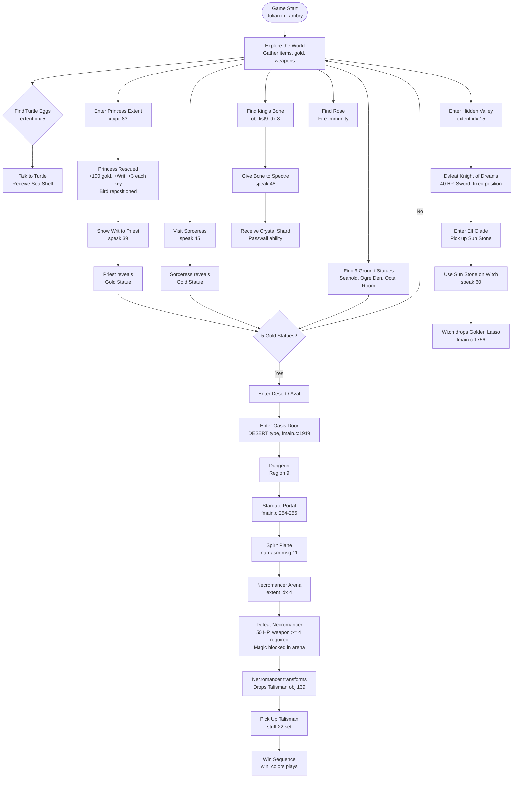
```mermaid
flowchart TD
    START([Game Start<br>Julian in Tambry]) --> EXPLORE[Explore the World<br>Gather items, gold, weapons]
    EXPLORE --> TURTLE_EGGS{Find Turtle Eggs<br>extent idx 5}
    TURTLE_EGGS --> TURTLE_TALK[Talk to Turtle<br>Receive Sea Shell]

    EXPLORE --> RESCUE_P[Enter Princess Extent<br>xtype 83]
    RESCUE_P --> PRINCESS_RESCUED[Princess Rescued<br>+100 gold, +Writ, +3 each key<br>Bird repositioned]

    PRINCESS_RESCUED --> SHOW_WRIT[Show Writ to Priest<br>speak 39]
    SHOW_WRIT --> PRIEST_STATUE[Priest reveals<br>Gold Statue]

    EXPLORE --> SORC_VISIT[Visit Sorceress<br>speak 45]
    SORC_VISIT --> SORC_STATUE[Sorceress reveals<br>Gold Statue]

    EXPLORE --> FIND_STATUES[Find 3 Ground Statues<br>Seahold, Ogre Den, Octal Room]

    PRIEST_STATUE --> FIVE_STATUES{5 Gold Statues?}
    SORC_STATUE --> FIVE_STATUES
    FIND_STATUES --> FIVE_STATUES

    FIVE_STATUES -->|Yes| DESERT[Enter Desert / Azal]
    FIVE_STATUES -->|No| EXPLORE

    EXPLORE --> GET_BONE[Find King's Bone<br>ob_list9 idx 8]
    GET_BONE --> GIVE_SPECTRE[Give Bone to Spectre<br>speak 48]
    GIVE_SPECTRE --> GET_SHARD[Receive Crystal Shard<br>Passwall ability]

    EXPLORE --> DKNIGHT_VALLEY[Enter Hidden Valley<br>extent idx 15]
    DKNIGHT_VALLEY --> FIGHT_DKNIGHT[Defeat Knight of Dreams<br>40 HP, Sword, fixed position]
    FIGHT_DKNIGHT --> GET_SUNSTONE[Enter Elf Glade<br>Pick up Sun Stone]
    GET_SUNSTONE --> FIGHT_WITCH[Use Sun Stone on Witch<br>speak 60]
    FIGHT_WITCH --> GET_LASSO[Witch drops Golden Lasso<br>fmain.c:1756]

    EXPLORE --> GET_ROSE[Find Rose<br>Fire Immunity]

    DESERT --> OASIS_DOOR[Enter Oasis Door<br>DESERT type, fmain.c:1919]
    OASIS_DOOR --> DUNGEON[Dungeon<br>Region 9]
    DUNGEON --> STARGATE[Stargate Portal<br>fmain.c:254-255]
    STARGATE --> SPIRIT_WORLD[Spirit Plane<br>narr.asm msg 11]
    SPIRIT_WORLD --> NECRO_ARENA[Necromancer Arena<br>extent idx 4]
    NECRO_ARENA --> FIGHT_NECRO[Defeat Necromancer<br>50 HP, weapon >= 4 required<br>Magic blocked in arena]
    FIGHT_NECRO --> TALISMAN_DROP[Necromancer transforms<br>Drops Talisman obj 139]
    TALISMAN_DROP --> PICK_TALISMAN[Pick Up Talisman<br>stuff 22 set]
    PICK_TALISMAN --> WIN[Win Sequence<br>win_colors plays]
```

### 2.2 Gold Statue Sources

Five golden figurines are required to access the desert and the hidden city of Azal (`stuff[25] >= 5` — `fmain.c:1919`). Without them, DESERT-type doors block entry and the Azal map tiles are overwritten to be impassable (`fmain.c:3594-3596`).

| # | Source | Location | How Obtained |
|---|--------|----------|-------------|
| 1 | Sorceress | ob_listg[9], (12025, 37639) | Talk to sorceress; `speak(45)`, sets `ob_listg[9].ob_stat = 1` — `fmain.c:3400-3403` |
| 2 | Priest | ob_listg[10], (6700, 33766) | Show Writ to priest; `speak(39)`, sets `ob_listg[10].ob_stat = 1` — `fmain.c:3384-3385` |
| 3 | Seahold | ob_listg[6], (11092, 38526) | Ground pickup — `fmain2.c:1008` |
| 4 | Ogre Den | ob_listg[7], (25737, 10662) | Ground pickup — `fmain2.c:1009` |
| 5 | Octal Room | ob_listg[8], (2910, 39023) | Ground pickup — `fmain2.c:1010` |

> **Note**: Dialogue-revealed statues work through the standard Take mechanic — setting `ob_stat = 1` makes the object world-visible; the player picks it up via `itrans` like any ground object. See [PROBLEMS.md P21](PROBLEMS.md) (resolved).

### 2.3 Key Quest Items

| Item | stuff[] | How Obtained | Purpose |
|------|---------|-------------|---------|
| Writ | stuff[28] | Princess rescue → `fmain2.c:1598` | Show to Priest for Gold Statue |
| Gold Statues ×5 | stuff[25] | Various (§2.2) | Gate to desert/Azal |
| Sun Stone | stuff[7] | Ground pickup, ob_list8[18] | Makes Witch vulnerable — `fmain2.c:231-233`. Also required for combat: without Sun Stone, all attacks on Witch are blocked (`speak(58)`) |
| Golden Lasso | stuff[5] | Dropped by witch (race 0x89) on death — `fmain.c:1756` | Enables riding the Swan — `fmain.c:1498` |
| Sea Shell | stuff[6] | Talk to Turtle with `active_carrier==5` | Summon Turtle for water travel |
| Rose | stuff[23] | Ground pickup, ob_list8[51] | Fire immunity — `fmain.c:1844` |
| Bone | stuff[29] | Ground pickup, ob_list9[8] | Give to Spectre for Shard |
| Crystal Shard | stuff[30] | Give Bone to Spectre — `fmain.c:3503` | Walk through terrain type 12 (crystal/spirit barriers) — `fmain.c:1609`. Required for navigating Spirit Plane |
| Crystal Orb | stuff[12] | Pickups/containers | `secret_timer` — reveals secret passages |
| Talisman | stuff[22] | Necromancer drops on death — `fmain.c:1754` | Picking it up wins the game |

See [RESEARCH.md §10](RESEARCH.md#10-inventory--items) for full item mechanics.

### 2.4 Transport Progression

Four transport modes exist, each unlocking new areas of the world. All carriers share `anim_list[3]` (except the raft at `anim_list[1]`), meaning only one active carrier at a time.

| Carrier | Actor | How Obtained | Capability | Restriction |
|---------|-------|-------------|------------|-------------|
| Raft | 1 | Automatic near water edges | Cross rivers/lakes | Water only; no steering |
| Turtle | 5 | Save turtle eggs → talk to turtle → USE Sea Shell | Ocean travel | Water only; summoned via `move_extent(1,...)` |
| Bird | 11 | Extent zone (idx 0); repositioned after princess rescue | Basic flight over land | Cannot cross mountains or lava |
| Swan | 11 | Ride bird while holding Golden Lasso (`stuff[5]`) | Unrestricted flight over all terrain | Dismount blocked in lava (`event(32)`) and at speed (`event(33)`) |

**Key interactions**:
- All carriers suppress random encounters (`fmain.c:2081`)
- All doors are blocked while mounted (`fmain.c:1901`)
- Cannot talk to NPCs while riding swan/bird (`riding==11`, `fmain.c:2338`)
- Freeze spell blocked when `riding > 1` (`fmain.c:3308`)
- After combat, the turtle auto-resumes if turtle eggs are visible (`fmain2.c:274`)
- Carrier and enemy shapes share memory — loading one unloads the other (`fmain.c:2730, 2791`)

Source: `load_carrier()` — `fmain.c:2784-2802`. Extent zones — `fmain.c:2680-2720`.

### 2.5 Magic Items

Seven magic items (`stuff[9]`–`stuff[15]`) provide tactical advantages. All require weapon slot selection and are consumed on use via the MAGIC menu (`fmain.c:3301-3324`).

| Item | stuff[] | Effect | Source |
|------|---------|--------|--------|
| Blue Stone | stuff[9] | Teleport to Great Stone Ring (sector 144) | `fmain.c:3312` |
| Green Jewel | stuff[10] | Teleport to last-visited inn | `fmain.c:3315` |
| Gold Ring | stuff[11] | Freeze all enemies on screen | `fmain.c:3308` — blocked when `riding > 1` |
| Crystal Orb | stuff[12] | Start `secret_timer` — reveals hidden objects (`ob_stat == 5`) | `fmain.c:3310` |
| Vial | stuff[13] | Full heal: vitality = `15 + brave/4` | `fmain.c:3319` |
| Jade Skull | stuff[14] | Kill all enemies on screen | `fmain.c:3321` |
| Red Gem | stuff[15] | *(Listed in `inv_list` but no effect code found)* | — |

> **Note**: The Crystal Orb (`stuff[12]`) is uniquely valuable — it reveals hidden ground objects by setting `secret_timer`, which cycles `ob_stat` between 5 and 6 (visible/hidden) each frame. Objects with `ob_stat == 5` have their `race` temporarily set to 0, making them pickable.

---

## 3. NPC Dialogue Trees

All NPC speech is dispatched through `do_option()` — `fmain.c:3367-3422`. The Talk submenu offers three functionally identical options (Yell/Say/Ask) defined at `fmain.c:497`. The target NPC is identified by `race & 0x7f` for setfig types. See [RESEARCH.md §13](RESEARCH.md#13-npc-dialogue--quests).

### 3.1 Wizard

Wizards appear in multiple locations with different `goal` values (set from their object list position — `fmain2.c:1275`). Each goal produces a unique hint.

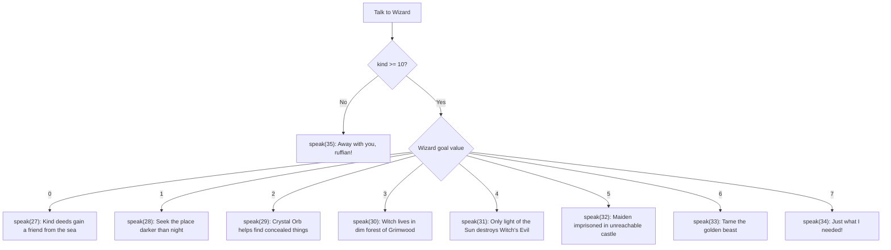
```mermaid
flowchart TD
    TALK_WIZ[Talk to Wizard] --> KIND_CHECK{kind >= 10?}
    KIND_CHECK -->|No| RUDE["speak(35): Away with you, ruffian!"]
    KIND_CHECK -->|Yes| GOAL_SWITCH{Wizard goal value}
    GOAL_SWITCH -->|0| S27["speak(27): Kind deeds gain a friend from the sea"]
    GOAL_SWITCH -->|1| S28["speak(28): Seek the place darker than night"]
    GOAL_SWITCH -->|2| S29["speak(29): Crystal Orb helps find concealed things"]
    GOAL_SWITCH -->|3| S30["speak(30): Witch lives in dim forest of Grimwood"]
    GOAL_SWITCH -->|4| S31["speak(31): Only light of the Sun destroys Witch's Evil"]
    GOAL_SWITCH -->|5| S32["speak(32): Maiden imprisoned in unreachable castle"]
    GOAL_SWITCH -->|6| S33["speak(33): Tame the golden beast"]
    GOAL_SWITCH -->|7| S34["speak(34): Just what I needed!"]
```

Source: `fmain.c:3380-3381`. Kindness threshold: `kind < 10` → `speak(35)`.

### 3.2 Priest

The priest has a three-stage progression based on quest items and stats.

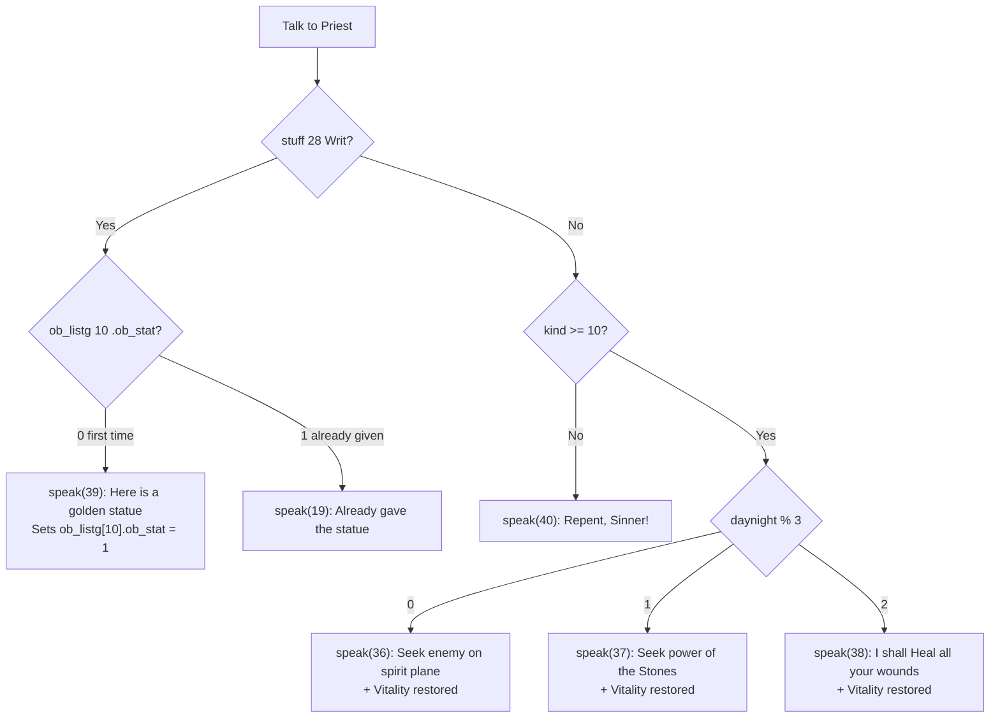
```mermaid
flowchart TD
    TALK_PRIEST[Talk to Priest] --> HAS_WRIT{stuff 28 Writ?}
    HAS_WRIT -->|Yes| ALREADY_GIVEN{ob_listg 10 .ob_stat?}
    ALREADY_GIVEN -->|0 first time| S39["speak(39): Here is a golden statue<br>Sets ob_listg[10].ob_stat = 1"]
    ALREADY_GIVEN -->|1 already given| S19["speak(19): Already gave the statue"]
    HAS_WRIT -->|No| KIND_CHECK2{kind >= 10?}
    KIND_CHECK2 -->|No| S40["speak(40): Repent, Sinner!"]
    KIND_CHECK2 -->|Yes| ROTATE{daynight % 3}
    ROTATE -->|0| S36["speak(36): Seek enemy on spirit plane<br>+ Vitality restored"]
    ROTATE -->|1| S37["speak(37): Seek power of the Stones<br>+ Vitality restored"]
    ROTATE -->|2| S38["speak(38): I shall Heal all your wounds<br>+ Vitality restored"]
```

Source: `fmain.c:3382-3394`. The vitality restoration (`15 + brave/4`) occurs on **every** visit when `kind >= 10` and no Writ — the rotating message (`daynight % 3`) selects only the speech text, not whether healing occurs. All three speeches (36, 37, 38) are followed by the heal.

### 3.3 King

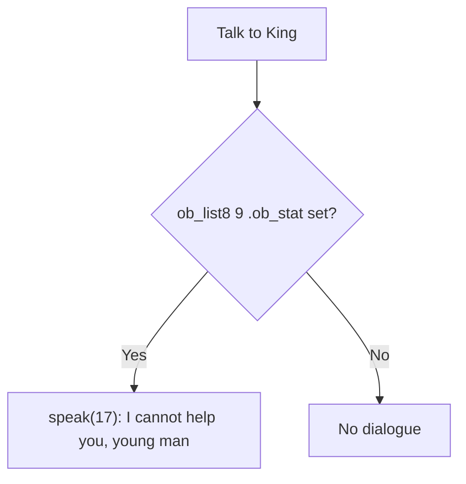
```mermaid
flowchart TD
    TALK_KING[Talk to King] --> PRINCESS_FLAG{ob_list8 9 .ob_stat set?}
    PRINCESS_FLAG -->|Yes| S17["speak(17): I cannot help you, young man"]
    PRINCESS_FLAG -->|No| SILENT[No dialogue]
```

Source: `fmain.c:3398`. The King's main role is post-rescue: after `rescue()` fires, he gives the Writ via `speak(18)` — `fmain2.c:1599`.

### 3.4 Sorceress

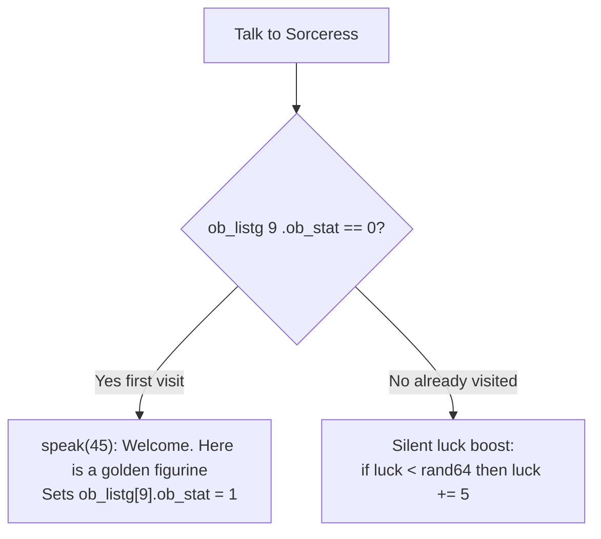
```mermaid
flowchart TD
    TALK_SORC[Talk to Sorceress] --> FIRST_VISIT{ob_listg 9 .ob_stat == 0?}
    FIRST_VISIT -->|Yes first visit| S45["speak(45): Welcome. Here is a golden figurine<br>Sets ob_listg[9].ob_stat = 1"]
    FIRST_VISIT -->|No already visited| LUCK_BOOST["Silent luck boost:<br>if luck < rand64 then luck += 5"]
```

Source: `fmain.c:3400-3405`. On first visit, the sorceress gives a Gold Statue and speaks. On return visits, no speech plays but `luck` silently increases by 5 (if `luck < rand64()`) — a hidden mechanical reward for revisiting.

### 3.5 Bartender

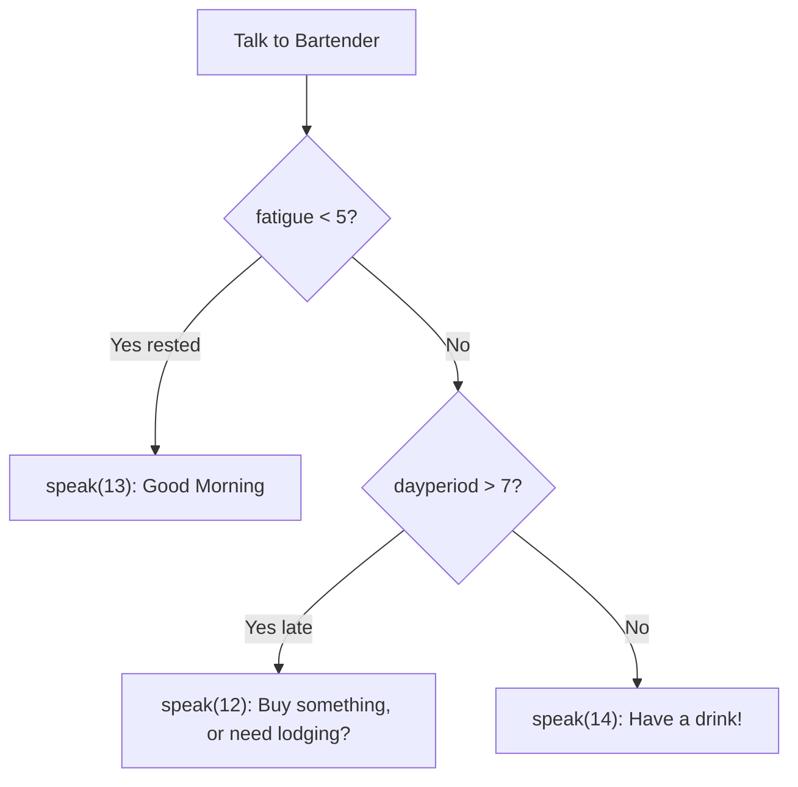
```mermaid
flowchart TD
    TALK_BAR[Talk to Bartender] --> FATIGUE_CHECK{fatigue < 5?}
    FATIGUE_CHECK -->|Yes rested| S13["speak(13): Good Morning"]
    FATIGUE_CHECK -->|No| TIME_CHECK{dayperiod > 7?}
    TIME_CHECK -->|Yes late| S12["speak(12): Buy something, or need lodging?"]
    TIME_CHECK -->|No| S14["speak(14): Have a drink!"]
```

Source: `fmain.c:3405-3407`. Bartenders (race `0x88`) also serve as shopkeepers — see BUY menu in [RESEARCH.md §18](RESEARCH.md#18-menu-system).

### 3.6 Witch

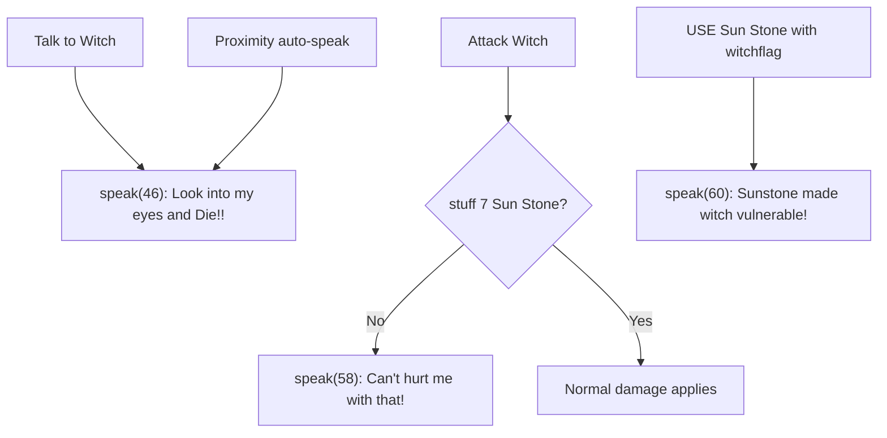
```mermaid
flowchart TD
    TALK_WITCH[Talk to Witch] --> S46["speak(46): Look into my eyes and Die!!"]
    PROXIMITY[Proximity auto-speak] --> S46
    ATTACK[Attack Witch] --> HAS_SUN{stuff 7 Sun Stone?}
    HAS_SUN -->|No| S58["speak(58): Can't hurt me with that!"]
    HAS_SUN -->|Yes| DAMAGE[Normal damage applies]
    USE_SUN[USE Sun Stone with witchflag] --> S60["speak(60): Sunstone made witch vulnerable!"]
```

Source: Talk — `fmain.c:3408`. Auto-speak — `fmain.c:2099`. Combat immunity — `fmain2.c:231-233`. Sun Stone USE — `fmain.c:3462`.

### 3.7 Spectre

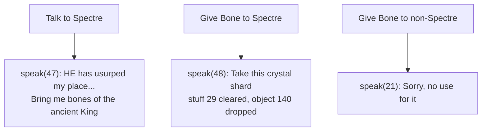
```mermaid
flowchart TD
    TALK_SPECTRE[Talk to Spectre] --> S47["speak(47): HE has usurped my place...<br>Bring me bones of the ancient King"]
    GIVE_BONE[Give Bone to Spectre] --> S48["speak(48): Take this crystal shard<br>stuff 29 cleared, object 140 dropped"]
    GIVE_OTHER[Give Bone to non-Spectre] --> S21["speak(21): Sorry, no use for it"]
```

Source: Talk — `fmain.c:3409`. Give Bone — `fmain.c:3501-3503`. The Spectre only appears at night (`lightlevel < 40` → `ob_listg[5].ob_stat = 3` — `fmain.c:2027-2028`).

### 3.8 Ghost (Dead Brother)

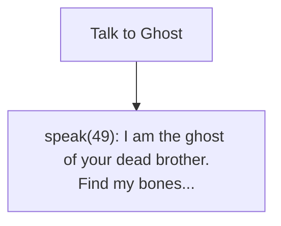
```mermaid
flowchart TD
    TALK_GHOST[Talk to Ghost] --> S49["speak(49): I am the ghost of your dead brother.<br>Find my bones..."]
```

Source: `fmain.c:3410`. Ghosts appear after a brother dies — `ob_listg[brother+2].ob_stat = 3` — `fmain.c:2841`. Finding and picking up the dead brother's bones merges their inventory into the current brother's — `fmain.c:3173-3177`.

### 3.9 Noble, Guard, Princess

| NPC | Race | Speech | Condition | Source |
|-----|------|--------|-----------|--------|
| Noble | 0x86 | `speak(20)`: "If you could rescue the king's daughter..." | Always | `fmain.c:3396` |
| Guard | 0x82/0x83 | `speak(15)`: "State your business!" | Always | `fmain.c:3394` |
| Princess | 0x84 | `speak(16)`: "Please, sir, rescue me..." | `ob_list8[9].ob_stat` set | `fmain.c:3397` |

Princess auto-speaks on proximity when captured — `fmain.c:2099`.

### 3.10 Beggar

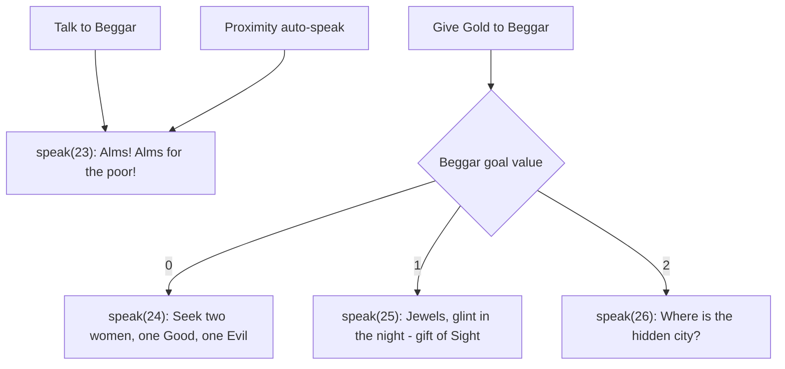
```mermaid
flowchart TD
    TALK_BEGGAR[Talk to Beggar] --> S23["speak(23): Alms! Alms for the poor!"]
    PROXIMITY[Proximity auto-speak] --> S23
    GIVE_GOLD[Give Gold to Beggar] --> GOAL{Beggar goal value}
    GOAL -->|0| S24["speak(24): Seek two women, one Good, one Evil"]
    GOAL -->|1| S25["speak(25): Jewels, glint in the night - gift of Sight"]
    GOAL -->|2| S26["speak(26): Where is the hidden city?"]
```

Source: Talk — `fmain.c:3414`. Auto-speak — `fmain.c:2097`. Give Gold — `fmain.c:3498`. Giving gold (costs 2 `wealth`) may also increase `kind` stat — `fmain.c:3496`.

> **Bug**: The beggar at `ob_list3[3]` (region 3, near Great Bog) has `goal=3`, which overflows the 3 beggar speeches (24–26) and reads `speak(27)` — the first wizard hint text ("Kind deeds could gain thee a friend from the sea"). Only goals 0–2 produce intended beggar dialogue.

### 3.11 Ranger

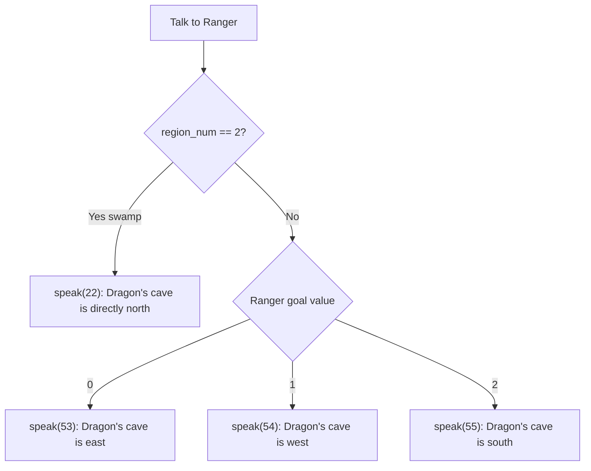
```mermaid
flowchart TD
    TALK_RANGER[Talk to Ranger] --> REGION{region_num == 2?}
    REGION -->|Yes swamp| S22["speak(22): Dragon's cave is directly north"]
    REGION -->|No| GOAL{Ranger goal value}
    GOAL -->|0| S53["speak(53): Dragon's cave is east"]
    GOAL -->|1| S54["speak(54): Dragon's cave is west"]
    GOAL -->|2| S55["speak(55): Dragon's cave is south"]
```

Source: `fmain.c:3411-3413`. Rangers only appear in ob_list0 (snow, 3 rangers) and ob_list2 (swamp, 1 ranger).

### 3.12 Turtle

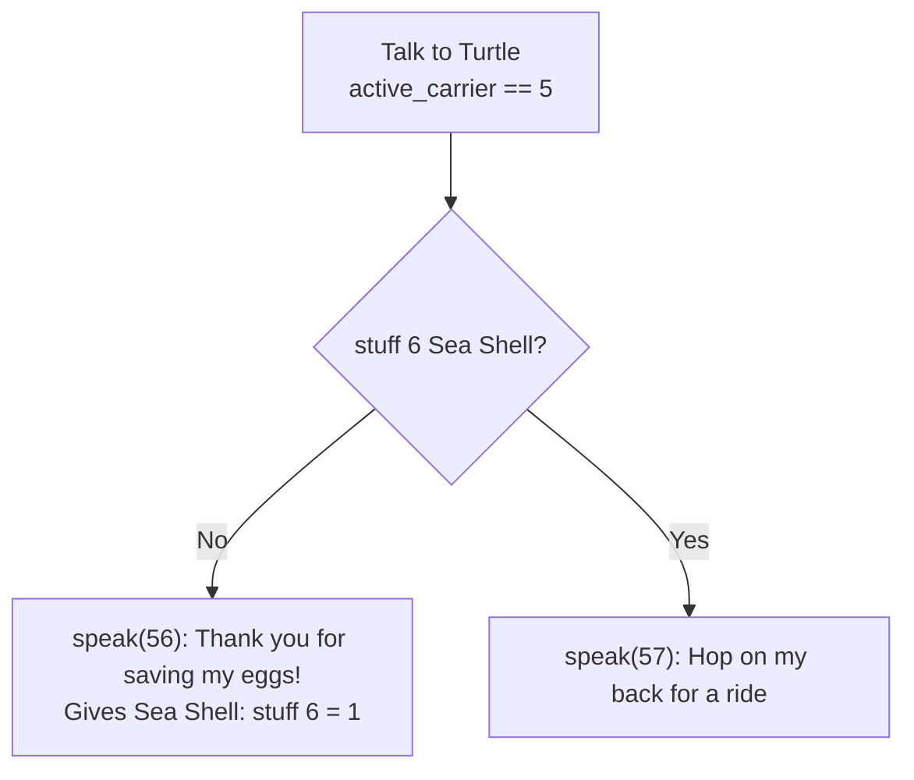
```mermaid
flowchart TD
    TALK_TURTLE[Talk to Turtle<br>active_carrier == 5] --> HAS_SHELL{stuff 6 Sea Shell?}
    HAS_SHELL -->|No| S56["speak(56): Thank you for saving my eggs!<br>Gives Sea Shell: stuff 6 = 1"]
    HAS_SHELL -->|Yes| S57["speak(57): Hop on my back for a ride"]
```

Source: `fmain.c:3418-3421`. The Turtle carrier (extent idx 1) starts at coordinates (0,0,0,0) — initially unreachable. It must be repositioned via `move_extent()`.

### 3.13 DreamKnight & Necromancer (Auto-Speak Only)

| NPC | Race | Auto-Speak | On Death | Source |
|-----|------|------------|----------|--------|
| DreamKnight | 7 | `speak(41)`: "None may enter the sacred shrine..." | `speak(42)`: "Your prowess in battle is great. You have earned the right to enter..." | `fmain.c:2101`, `fmain.c:2775` |
| Necromancer | 9 | `speak(43)`: "So this is the so-called Hero..." | Transforms to Woodcutter (race 10), drops Talisman | `fmain.c:2100`, `fmain.c:1751-1756` |

### 3.14 Enemy Speech

When the player talks to enemies, the speech index equals the enemy's `race` value — `fmain.c:3422`:

| Race | Enemy | Speech |
|------|-------|--------|
| 0 | Ogre | `speak(0)`: "A guttural snarl was the only reply." |
| 1 | Orc | `speak(1)`: "Human must die!" |
| 2 | Wraith | `speak(2)`: "Doom!" |
| 3 | Skeleton | `speak(3)`: "A clattering of bones" |
| 4 | Snake | `speak(4)`: "A waste of time to talk to a snake" |
| 5 | Salamander | `speak(5)` |
| 6 | Loraii | `speak(6)`: "There was no reply." |
| 7 | Necromancer | `speak(7)`: "Die, foolish mortal!" |

---

## 4. Brother Succession Narrative

When a brother dies, the fairy rescue system determines the outcome based on the `luck` stat. This is a deterministic system with no random element: if `luck >= 1` after the death penalty (`luck -= 5`), the fairy always rescues the brother. If `luck < 1`, the brother is permanently lost and the next brother takes over. Each brother's luck is a finite resource — Julian and Kevin can survive 3 deaths, Phillip can survive 6 (from starting stats alone). See [RESEARCH.md §15](RESEARCH.md#15-brother-succession).

### 4.1 Succession State Diagram

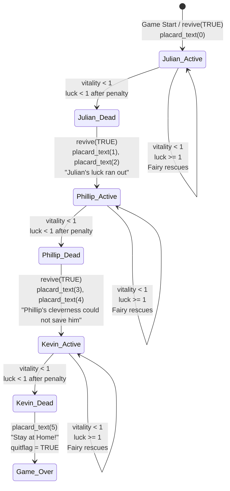
```mermaid
stateDiagram-v2
    [*] --> Julian_Active : Game Start / revive(TRUE)<br>placard_text(0)

    Julian_Active --> Julian_Dead : vitality < 1<br>luck < 1 after penalty
    Julian_Active --> Julian_Active : vitality < 1<br>luck >= 1<br>Fairy rescues

    Julian_Dead --> Phillip_Active : revive(TRUE)<br>placard_text(1), placard_text(2)<br>"Julian's luck ran out"

    Phillip_Active --> Phillip_Dead : vitality < 1<br>luck < 1 after penalty
    Phillip_Active --> Phillip_Active : vitality < 1<br>luck >= 1<br>Fairy rescues

    Phillip_Dead --> Kevin_Active : revive(TRUE)<br>placard_text(3), placard_text(4)<br>"Phillip's cleverness could not save him"

    Kevin_Active --> Kevin_Dead : vitality < 1<br>luck < 1 after penalty
    Kevin_Active --> Kevin_Active : vitality < 1<br>luck >= 1<br>Fairy rescues

    Kevin_Dead --> Game_Over : placard_text(5)<br>"Stay at Home!"<br>quitflag = TRUE
```

### 4.2 Placard Text Sequence

The `brother` variable (`fmain.c:567`) controls which placard text displays during `revive(TRUE)` — `fmain.c:2857-2872`:

| brother (after ++) | Placard | Text Summary |
|--------------------|---------|-------------|
| 1 (Julian starts) | `placard_text(0)` | *"Rescue the Talisman!" was the Mayor's plea... Julian set out on his quest.* |
| 2 (Phillip starts) | `placard_text(1)` then `placard_text(2)` | *Julian's luck had run out... So Phillip set out, determined to find his brother.* |
| 3 (Kevin starts) | `placard_text(3)` then `placard_text(4)` | *Phillip's cleverness could not save him... Kevin took up the quest, risking all.* |
| >3 (Game Over) | `placard_text(5)` | *"And so ends our sad tale. The Lesson of the Story: Stay at Home!"* |

Source: Placard text content in `narr.asm:252-302`.

### 4.3 Journey Start Messages

After the placard, each brother gets a contextual start message — `fmain.c:2885-2892`:

| Brother | Event Messages |
|---------|---------------|
| Julian | `event(9)`: *"% started the journey in his home village of Tambry."* |
| Phillip | `event(9)` + `event(10)`: *"...as had his brother before him."* |
| Kevin | `event(9)` + `event(11)`: *"...as had his brothers before him."* |

### 4.4 What Carries Over Between Brothers

| Persists | Resets |
|----------|--------|
| Princess counter (`princess`) | Stats loaded fresh from `blist[]` |
| Quest flags (`ob_listg`, `ob_list8` entries) | Inventory cleared (gets only a Dirk) |
| Princess rescued flag reset to 3 (`ob_list8[9].ob_stat = 3`) | Position resets to Tambry (19036, 15755) |
| Dead brother bones + ghost placed in world | Hunger, fatigue reset to 0 |

Source: `revive()` — `fmain.c:2814-2911`. Inventory clear at `fmain.c:2849-2850`. Ghost placement at `fmain.c:2837-2841`.

### 4.5 Recovering a Dead Brother's Items

When a living brother picks up the bones (ob_id 28) of a dead brother — `fmain.c:3173-3177`:

1. Both ghost setfigs are removed: `ob_listg[3].ob_stat = ob_listg[4].ob_stat = 0`
2. The dead brother's entire inventory (31 item slots) is merged into the current brother's inventory
3. Ghost dialogue before pickup: `speak(49)` — *"I am the ghost of your dead brother. Find my bones..."*

---

## 5. NPC Interactions

### 5.1 Wizard Interaction Flow

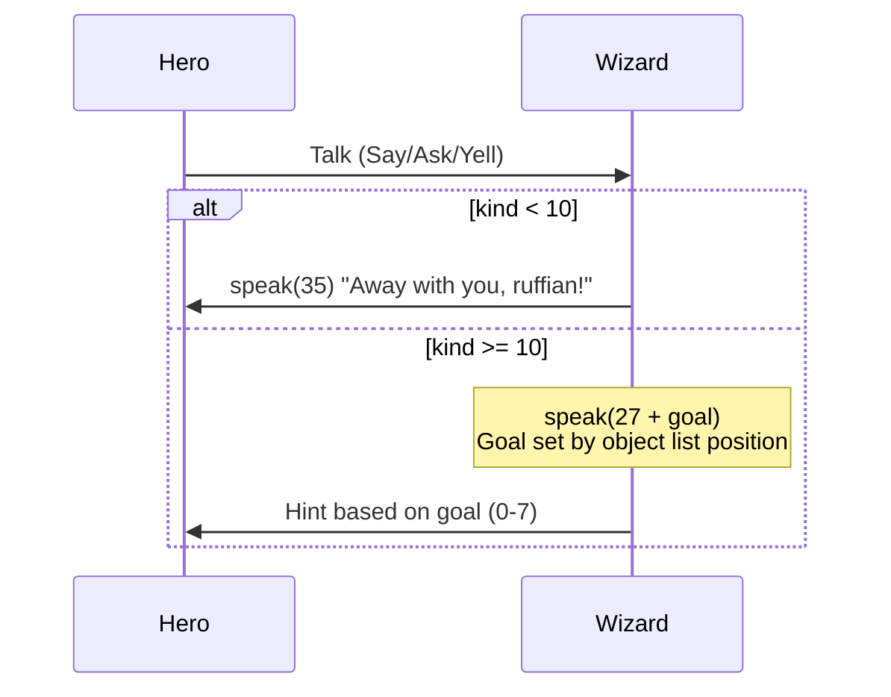
```mermaid
sequenceDiagram
    participant Hero
    participant Wizard

    Hero->>Wizard: Talk (Say/Ask/Yell)

    alt kind < 10
        Wizard->>Hero: speak(35) "Away with you, ruffian!"
    else kind >= 10
        Note over Wizard: speak(27 + goal)<br>Goal set by object list position
        Wizard->>Hero: Hint based on goal (0-7)
    end
```

**Wizard locations and hints**:

| Region | Object List | Goal | Hint Topic |
|--------|------------|------|------------|
| Swamp (region 2) | ob_list2[0] | 0 | Sea friend (Turtle) |
| Swamp (region 2) | ob_list2[1] | 1 | Place darker than night |
| Tambry (region 3) | ob_list3[2] | 2 | Crystal Orb reveals secrets |
| Farm/City (region 5) | ob_list5[3] | 3 | Witch in Grimwood |
| Farm/City (region 5) | ob_list5[4] | 4 | Sun destroys Witch |
| Indoors (region 8) | ob_list8[5] | 5 | Princess in unreachable castle |
| Indoors (region 8) | ob_list8[6] | 6 | Tame the golden beast (Swan) |
| Underground (region 9) | ob_list9[6] | 6 | Tame the golden beast (Swan) — same hint as region 8 wizard |

### 5.2 Priest Interaction Flow

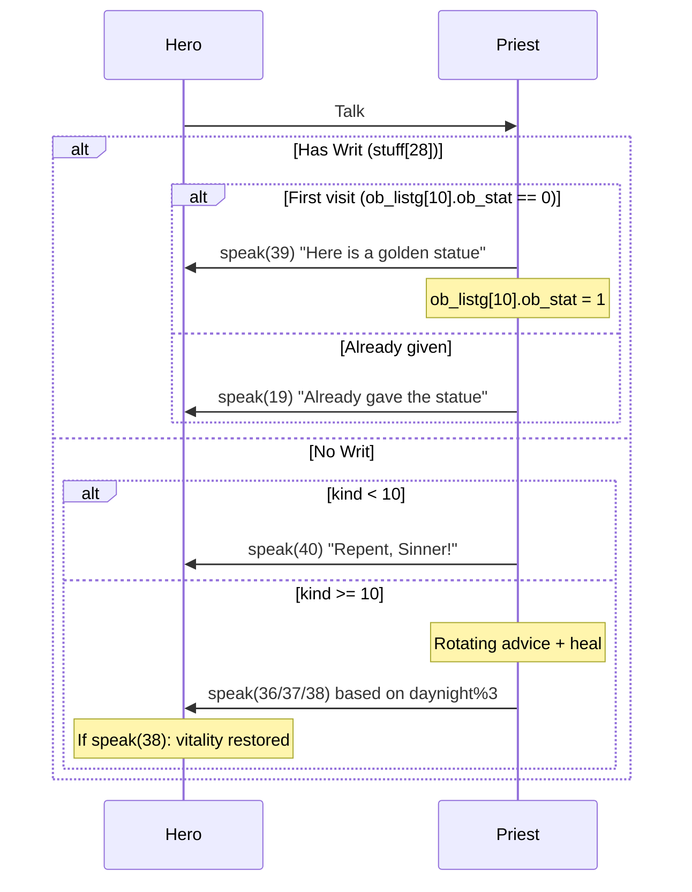
```mermaid
sequenceDiagram
    participant Hero
    participant Priest

    Hero->>Priest: Talk

    alt Has Writ (stuff[28])
        alt First visit (ob_listg[10].ob_stat == 0)
            Priest->>Hero: speak(39) "Here is a golden statue"
            Note over Priest: ob_listg[10].ob_stat = 1
        else Already given
            Priest->>Hero: speak(19) "Already gave the statue"
        end
    else No Writ
        alt kind < 10
            Priest->>Hero: speak(40) "Repent, Sinner!"
        else kind >= 10
            Note over Priest: Rotating advice + heal
            Priest->>Hero: speak(36/37/38) based on daynight%3
            Note over Hero: If speak(38): vitality restored
        end
    end
```

### 5.3 Spectre / Bone / Shard Exchange

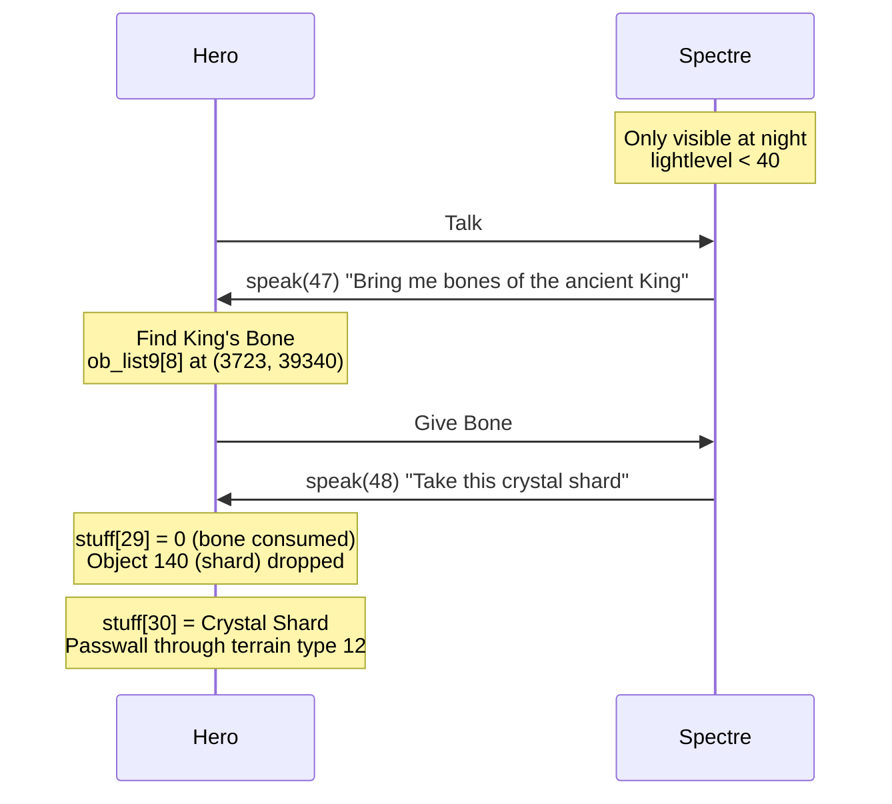
```mermaid
sequenceDiagram
    participant Hero
    participant Spectre

    Note over Spectre: Only visible at night<br>lightlevel < 40

    Hero->>Spectre: Talk
    Spectre->>Hero: speak(47) "Bring me bones of the ancient King"

    Note over Hero: Find King's Bone<br>ob_list9[8] at (3723, 39340)

    Hero->>Spectre: Give Bone
    Spectre->>Hero: speak(48) "Take this crystal shard"
    Note over Hero: stuff[29] = 0 (bone consumed)<br>Object 140 (shard) dropped
    Note over Hero: stuff[30] = Crystal Shard<br>Passwall through terrain type 12
```

### 5.4 Witch Combat Encounter

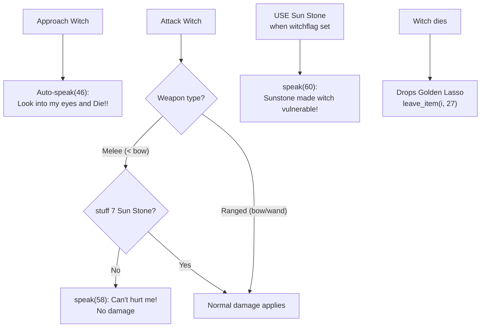
```mermaid
flowchart TD
    APPROACH[Approach Witch] --> AUTO["Auto-speak(46):<br>Look into my eyes and Die!!"]
    ATTACK[Attack Witch] --> WEAPON{Weapon type?}
    WEAPON -->|"Melee (< bow)"| SUN{stuff 7 Sun Stone?}
    SUN -->|No| IMMUNE["speak(58): Can't hurt me!<br>No damage"]
    SUN -->|Yes| DAMAGE[Normal damage applies]
    WEAPON -->|"Ranged (bow/wand)"| DAMAGE

    USE_SUNSTONE[USE Sun Stone<br>when witchflag set] --> VULNERABLE["speak(60):<br>Sunstone made witch vulnerable!"]

    WITCH_DIES[Witch dies] --> LASSO_DROP["Drops Golden Lasso<br>leave_item(i, 27)"]
```

Source: Combat immunity — `fmain2.c:231-233`. Lasso drop — `fmain.c:1756`. Sun Stone USE — `fmain.c:3462`.

### 5.5 Necromancer Final Battle

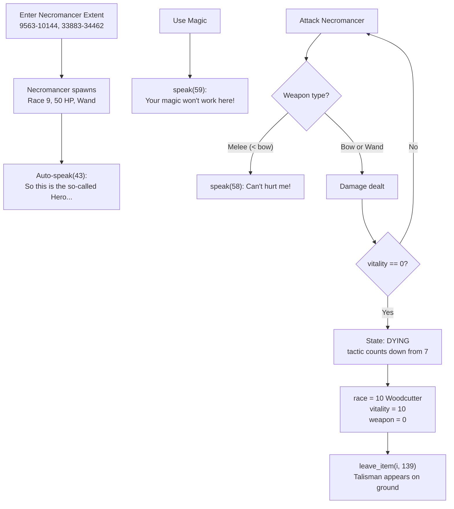
```mermaid
flowchart TD
    ENTER_ARENA[Enter Necromancer Extent<br>9563-10144, 33883-34462] --> SPAWN["Necromancer spawns<br>Race 9, 50 HP, Wand"]
    SPAWN --> AUTO["Auto-speak(43):<br>So this is the so-called Hero..."]

    MAGIC_ATTEMPT[Use Magic] --> BLOCKED["speak(59):<br>Your magic won't work here!"]

    ATTACK[Attack Necromancer] --> WEAPON{Weapon type?}
    WEAPON -->|"Melee (< bow)"| IMMUNE["speak(58): Can't hurt me!"]
    WEAPON -->|"Bow or Wand"| DAMAGE[Damage dealt]

    DAMAGE --> DEAD{vitality == 0?}
    DEAD -->|No| ATTACK
    DEAD -->|Yes| DYING["State: DYING<br>tactic counts down from 7"]
    DYING --> TRANSFORM["race = 10 Woodcutter<br>vitality = 10<br>weapon = 0"]
    TRANSFORM --> DROP_TALISMAN["leave_item(i, 139)<br>Talisman appears on ground"]
```

Source: Extent — `fmain.c:343`. Stats — `fmain.c:62`. Magic block — `fmain.c:3305`. Death handler — `fmain.c:1751-1756`.

### 5.6 Dark Knight (Knight of Dreams)

The DKnight is a unique fixed encounter guarding the elf glade, where the Sun Stone is located. Unlike other enemies, it does not use the tactic system — it stands still facing south at a hardcoded position, physically blocking passage. See [RESEARCH.md §9.8](RESEARCH.md#98-dark-knight-dknight).

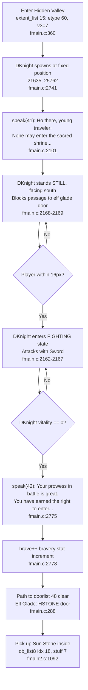
```mermaid
flowchart TD
    ENTER[Enter Hidden Valley<br>extent_list 15: etype 60, v3=7<br>fmain.c:360] --> SPAWN[DKnight spawns at fixed position<br>21635, 25762<br>fmain.c:2741]
    SPAWN --> SPEAK41["speak(41): Ho there, young traveler!<br>None may enter the sacred shrine...<br>fmain.c:2101"]
    SPEAK41 --> IDLE[DKnight stands STILL, facing south<br>Blocks passage to elf glade door<br>fmain.c:2168-2169]

    IDLE --> APPROACH{Player within 16px?}
    APPROACH -->|No| IDLE
    APPROACH -->|Yes| FIGHT[DKnight enters FIGHTING state<br>Attacks with Sword<br>fmain.c:2162-2167]

    FIGHT --> DEAD{DKnight vitality == 0?}
    DEAD -->|No| FIGHT
    DEAD -->|Yes| SPEAK42["speak(42): Your prowess in battle is great.<br>You have earned the right to enter...<br>fmain.c:2775"]
    SPEAK42 --> BRAVE[brave++ bravery stat increment<br>fmain.c:2778]
    BRAVE --> CLEAR[Path to doorlist 48 clear<br>Elf Glade: HSTONE door<br>fmain.c:288]
    CLEAR --> SUNSTONE[Pick up Sun Stone inside<br>ob_list8 idx 18, stuff 7<br>fmain2.c:1092]
```

**DKnight combat stats**:

| Stat | Value | Source |
|------|-------|--------|
| Hitpoints | 40 | `fmain.c:61` |
| Weapon | Sword (3) | `fmain2.c:867` |
| Goal | ATTACK2 (clever) | ATTACK1 + cleverness 1 |
| Melee threshold | 16 (overridden from normal 12) | `fmain.c:2163` |
| Aggressive | TRUE | `fmain.c:61` |
| Treasure | None (group 0) | `fmain.c:61` |

**Key behaviors**:
- **No pursuit**: Outside melee range, the DKnight stands STILL facing south (direction 5) — it never chases the player (`fmain.c:2168-2169`). All other enemies use the tactic system when out of range.
- **Extended engagement**: Normal ATTACK2 enemies engage at threshold 12 (14 − mode). The DKnight overrides this to 16, a 33% larger radius (`fmain.c:2163`).
- **No flee**: The DKnight's race (7) matches extent v3 (7), so the flee condition at `fmain.c:2138-2140` is suppressed — it fights to the death.
- **Respawns**: The DKnight spawns every time the player enters the hidden valley extent (`fmain.c:2687-2691`). No death flag is persisted.
- **DOOR_SEEK/DOOR_LET unused**: `ftale.h:53-54` defines goal modes DOOR_SEEK (11) and DOOR_LET (12), but no code references them. The DKnight's door-blocking behavior is entirely hardcoded.

---

## 6. Location Map

### 6.1 Outdoor Regions

The world is divided into 8 outdoor regions (0–7) plus 2 indoor regions (8–9). The outdoor world is a **2×4 grid** computed from map coordinates: `x_col = ((map_x+151)>>14) & 1`, `y_row = ((map_y+64)>>13) & 7`, `region = x_col + y_row*2` — `fmain.c:2633-2637`.

```
          WEST (x=0)              EAST (x=1)
       ┌─────────────────────┬─────────────────────┐
 NORTH │  0 — Snow Land      │  1 — Witch Wood /   │
 (y=0) │      (F1)           │      Maze Forest (F2)│
       ├─────────────────────┼─────────────────────┤
       │  2 — Swamp Land     │  3 — Plains /       │
 (y=1) │      Great Bog (F3) │      Tambry (F4)    │
       ├─────────────────────┼─────────────────────┤
       │  4 — Desert /       │  5 — Bay / Marheim /│
 (y=2) │      Azal (F5)      │      Farms (F6)     │
       ├─────────────────────┼─────────────────────┤
 SOUTH │  6 — Lava /         │  7 — Forest /       │
 (y=3) │      Volcanic (F7)  │      Mountains (F8) │
       └─────────────────────┴─────────────────────┘
         Indoor regions (entered via doors):
           8 — Building interiors (F9)
           9 — Dungeons and caves (F10)
```

| Region | File | Description |
|--------|------|-------------|
| 0 | F1 | Snow land |
| 1 | F2 | Witch wood / maze forest north |
| 2 | F3 | Swamp land |
| 3 | F4 | Plains / Tambry / manor |
| 4 | F5 | Desert |
| 5 | F6 | Bay / City of Marheim / farms |
| 6 | F7 | Lava / volcanic |
| 7 | F8 | Forest / wilderness / mountains |
| 8 | F9 | Building interiors |
| 9 | F10 | Dungeons and caves |

Source: `file_index[]` — `fmain.c:615-625`. Region formula — `fmain.c:2633-2637`.

### 6.2 Named Outdoor Locations

From `_place_tbl` / `_place_msg` — `narr.asm:86-193`. Sector ranges determine which name displays when the hero enters.

| Sector Range | Location Name | Notable Features |
|-------------|--------------|-----------------|
| 64–69 | Village of Tambry | Starting location for all brothers |
| 70–73 | Vermillion Manor | — |
| 80–95 | City of Marheim | King's castle, shops, guards |
| 96–99 | Witch's Castle | Witch encounter; Sun Stone needed |
| 138–139 | Graveyard | High danger (79.7% spawn rate) |
| 144 | Great Stone Ring | Blue Stone teleport destination |
| 147 | Watchtower / Lighthouse | — |
| 148 | Old Castle | — |
| 159–162 | Hidden City of Azal | Requires 5 Gold Statues |
| 163 | Outlying Fort | Desert region |
| 164–167 | Crystal Palace | Blue Key doors |
| 171–174 | Citadel of Doom | — |
| 176 | Pixle Grove | — |
| 179 | Tombs of Hemsath | Stair to underground |
| 180 | Forbidden Keep | — |
| 208–221 | Great Bog | Swamp region |
| 243 | Oasis | Desert; requires 5 statues |
| 255 | Cave in Hillside | Dragon cave |
| 185–254 | Burning Waste | Desert region (broad range) |
| 78, 187–239 | Mountains of Frost | Region-dependent display logic |

### 6.3 Named Indoor Locations

From `_inside_tbl` / `_inside_msg` — `narr.asm:116-168`.

| Sector Range | Location Name |
|-------------|--------------|
| 79–96 | Castle of King Mar |
| 97–99 | Building (witch area) |
| 104 | Inn |
| 105–115 | Castle |
| 114 | Tomb (crypt) |
| 120, 116–119, 139–141 | Buildings (desert area) |
| 125 | Cabin inside |
| 127 | Elf glade sanctuary |
| 135–138 | Castle (Doom tower) |
| 142 | Lighthouse interior |
| 150–161 | Stone maze |
| 43–59, 100, 143–149 | Spirit Plane |
| 46 | Final arena (Necromancer) |
| 62 | Small building |
| 65–66 | Tavern |
| 2 | Small chamber |
| 7 | Large chamber |
| 4 | Long passageway |
| 5–6 | Twisting tunnel |
| 36 | Octagonal room |
| 37–42 | Large room |

### 6.4 Door Connections

The doorlist (`fmain.c:240-325`, `DOORCOUNT = 86`) maps outdoor coordinates to indoor coordinates. See [RESEARCH.md §12](RESEARCH.md#12-door-system) for the full door system.

**Key quest-relevant connections**:

| Door | Outdoor (secs) | Type | Notable |
|------|---------------|------|---------|
| Dragon Cave (idx 4) | CAVE → region 9 | Dungeon | Dragon carrier inside |
| Crystal Palace (idx 21-22) | CRYST → region 8 | Blue Key required | Two entries |
| Main Castle (idx 50) | MARBLE → region 8 | King Mar's castle | White Key |
| Witch's Castle (idx 79) | BLACK → region 8 | Witch encounter area |
| Unreachable Castle (idx 67) | STAIR → region 8 | Princess rescue location |
| Tombs (idx 20) | STAIR → region 9 | Underground dungeon |
| Spider Exit (idx 70) | CAVE → region 9 | Spider pit area |
| Village (idx 31-39) | VWOOD/HWOOD → region 8 | 9 village doors |
| City (idx 50-61) | Various → region 8 | 12 city doors |
| Cabins (10 pairs) | VLOG/LOG → region 8 | Each cabin has yard + door |
| Desert Oasis (idx 7-11) | DESERT → region 8 | Requires 5 Gold Statues |
| Stargate (idx 14-15) | STAIR bidirectional | Portal between region 8 and 9 |

**Desert gate**: All 5 oasis doors (type DESERT) require `stuff[25] >= 5` (Gold Statues) — `fmain.c:1919`.

**Riding restriction**: All doors are blocked while mounted (`if (riding) goto nodoor3` — `fmain.c:1901`).

### 6.5 Peace Zones

Certain areas prevent random encounters and/or weapon use. See [RESEARCH.md §9](RESEARCH.md#9-encounter--spawning).

| Extent Idx | etype | Location | Effect |
|-----------|-------|----------|--------|
| 8 | 80 | Around city | No encounters |
| 10 | 81 | King's castle grounds | No encounters + no weapon draw (`event(15)`) |
| 11 | 82 | Sorceress area | No encounters + no weapon draw (`event(16)`) |
| 12-14 | 80 | Buildings / cabins / specials | No encounters |
| 19 | 80 | Village of Tambry | No encounters |

---

## 7. Event Sequences

### 7.1 Fairy Rescue on Death

The fairy rescue system is **deterministic**: if the hero has luck ≥ 1 after the death penalty, the fairy always appears. There is no random element — and since luck cannot change during the DEAD state, the outcome is fixed the moment the hero dies. The system uses the `goodfairy` counter (unsigned char, starts at 0) which counts down when the hero is in DEAD or FALL state. See [RESEARCH.md §7.9](RESEARCH.md#79-good-fairy--brother-succession).

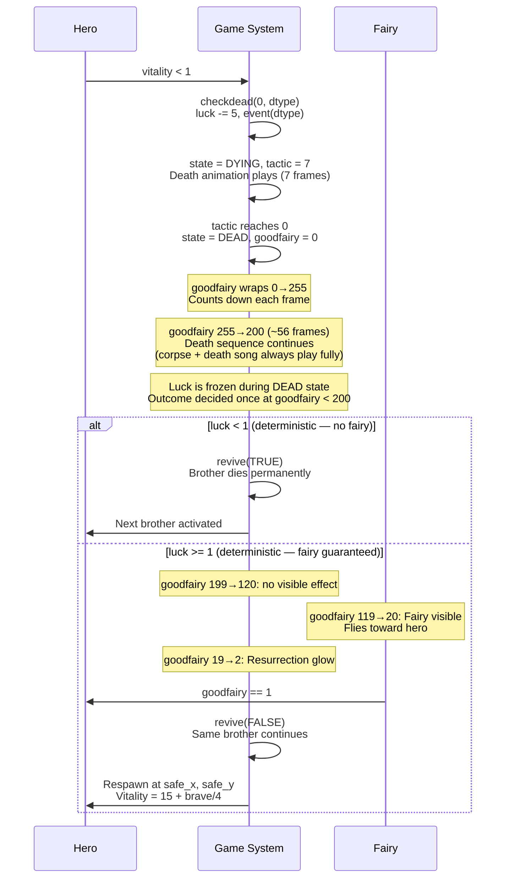
```mermaid
sequenceDiagram
    participant Hero
    participant System as Game System
    participant Fairy

    Hero->>System: vitality < 1
    System->>System: checkdead(0, dtype)<br>luck -= 5, event(dtype)
    System->>System: state = DYING, tactic = 7<br>Death animation plays (7 frames)
    System->>System: tactic reaches 0<br>state = DEAD, goodfairy = 0

    Note over System: goodfairy wraps 0→255<br>Counts down each frame

    Note over System: goodfairy 255→200 (~56 frames)<br>Death sequence continues<br>(corpse + death song always play fully)

    Note over System: Luck is frozen during DEAD state<br>Outcome decided once at goodfairy < 200

    alt luck < 1 (deterministic — no fairy)
        System->>System: revive(TRUE)<br>Brother dies permanently
        System->>Hero: Next brother activated
    else luck >= 1 (deterministic — fairy guaranteed)
        Note over System: goodfairy 199→120: no visible effect
        Note over Fairy: goodfairy 119→20: Fairy visible<br>Flies toward hero
        Note over System: goodfairy 19→2: Resurrection glow
        Fairy->>Hero: goodfairy == 1
        System->>System: revive(FALSE)<br>Same brother continues
        System->>Hero: Respawn at safe_x, safe_y<br>Vitality = 15 + brave/4
    end
```

Source: `fmain.c:1388-1403` (fairy logic), `fmain.c:2769-2782` (`checkdead()`), `fmain.c:2814-2911` (`revive()`).

**FALL state** (pit traps): Always rescued via `revive(FALSE)` regardless of luck — `fmain.c:1392`.

### 7.2 Princess Rescue Sequence

```mermaid
sequenceDiagram
    participant Hero
    participant System as Game System
    participant King

    Note over Hero: Enter princess extent<br>(10820-10877, 35646-35670)

    System->>System: Check: xtype == 83<br>AND ob_list8[9].ob_stat != 0
    System->>System: map_message() — fade to black
    System->>System: Display rescue placard<br>placard_text(8 + princess*3)
    Note over System: Princess name interpolated<br>Katra / Karla / Kandy
    System->>System: Delay(380) — 7.6 seconds
    System->>System: Display post-rescue text<br>placard_text(17), placard_text(18)
    System->>System: Delay(380) — 7.6 seconds

    System->>System: princess++
    System->>Hero: Teleport to (5511, 33780)
    System->>System: Bird extent repositioned<br>move_extent(0, 22205, 21231)
    System->>System: Noble → Princess in castle<br>ob_list8[2].ob_id = 4

    King->>Hero: speak(18) "Here is a writ..."
    System->>Hero: +100 gold<br>+Writ (stuff[28])<br>+3 of each key type
    System->>System: ob_list8[9].ob_stat = 0<br>Rescue flag cleared
```

Source: `rescue()` — `fmain2.c:1584-1603`. Trigger — `fmain.c:2684-2685`.

**Key detail**: `ob_list8[9].ob_stat` is reset to 3 during each `revive(TRUE)` (`fmain.c:2843`), so each new brother can trigger one rescue. The `princess` counter persists globally — each rescue shows a different princess.

### 7.3 Win Condition Sequence

```mermaid
sequenceDiagram
    participant Hero
    participant Necro as Necromancer
    participant System as Game System

    Hero->>Necro: Attacks with Bow or Wand
    Note over Necro: vitality reaches 0
    Necro->>Necro: State: DYING<br>tactic 7→0
    Necro->>Necro: race = 10 (Woodcutter)<br>vitality = 10
    Necro->>System: leave_item(i, 139)<br>Talisman on ground

    Hero->>System: Take → picks up Talisman
    System->>System: stuff[22] != 0
    System->>System: quitflag = TRUE<br>viewstatus = 2

    System->>System: map_message() — fade
    System->>System: placard_text(6) + name() + placard_text(7)
    Note over System: "Having defeated the Necromancer...<br>returned to Marheim, wed the princess"
    System->>System: placard() + Delay(80)

    System->>System: Load "winpic" image
    System->>System: Sunrise color animation<br>55 frames ≈ 11 seconds
    System->>System: Fade to black

    System->>System: Game loop exits
```

Source: Necromancer death — `fmain.c:1751-1756`. Win check — `fmain.c:3244-3247`. `win_colors()` — `fmain2.c:1605-1636`.

### 7.4 Copy Protection Flow

Both mechanisms trigger during startup, disabled in preserved source via `#define NO_PROTECT` — `fmain2.c:14`. Documented for completeness. See [RESEARCH.md §18](RESEARCH.md#18-menu-system) for startup flow.

```mermaid
flowchart TD
    INTRO[Intro Sequence Ends] --> DISK_CHECK["seekn() → cpytest()<br>fmain.c:1212"]
    DISK_CHECK --> DISK_TYPE{Floppy or HD?}
    DISK_TYPE -->|Floppy| CHECK_TICK{"dl_VolumeDate.ds_Tick == 230?"}
    CHECK_TICK -->|No| CRASH["cold() → jmp -4<br>System crash"]
    CHECK_TICK -->|Yes| RIDDLE
    DISK_TYPE -->|HD| CHECK_BLOCK{"buffer[123] == 230?"}
    CHECK_BLOCK -->|No| SHUTDOWN["close_all()<br>Graceful exit"]
    CHECK_BLOCK -->|Yes| RIDDLE

    RIDDLE["placard_text(19):<br>'Answer three questions...'"] --> Q1[Random question from 8 riddles]
    Q1 --> Q2[Second question]
    Q2 --> Q3[Third question]
    Q3 --> PASS{All correct?}
    PASS -->|Yes| GAME_START[Game begins]
    PASS -->|No| QUIT["Graceful shutdown"]
```

**Riddle answers** (from `fmain2.c:1306-1308`): LIGHT, HEED, DEED, SIGHT, FLIGHT, CREED, BLIGHT, NIGHT.

Source: `copy_protect_junk()` — `fmain2.c:1309-1334`. `cpytest()` — `fmain2.c:1409-1434`.

### 7.5 Game Over Sequence

```mermaid
flowchart TD
    KEVIN_DIES[Kevin dies<br>luck < 1] --> REVIVE["revive(TRUE) called"]
    REVIVE --> PLACARD["placard_text(5):<br>'And so ends our sad tale.<br>Stay at Home!'"]
    PLACARD --> BROTHER_CHECK{"brother > 3?"}
    BROTHER_CHECK -->|Yes| QUIT["quitflag = TRUE<br>Delay(500) — 10 seconds"]
    QUIT --> EXIT[Game loop exits<br>stopscore → close_all]
```

Source: `fmain.c:2870-2872`.

---

## Cross-Reference Index

| Topic | RESEARCH.md Section | STORYLINE.md Section |
|-------|-------------------|---------------------|
| Brother stats & succession | [§15 Brother Succession](RESEARCH.md#15-brother-succession) | [§4 Brother Succession](#4-brother-succession-narrative) |
| Carrier / transport system | [§14 Carrier System](RESEARCH.md#14-carrier-system) | [§2.4 Transport Progression](#24-transport-progression) |
| Combat system | [§7 Combat](RESEARCH.md#7-combat-system) | [§3.6 Witch](#36-witch), [§3.13 DreamKnight & Necromancer](#313-dreamknight--necromancer-auto-speak-only) |
| Dark Knight encounter | [§9.8 Dark Knight](RESEARCH.md#98-dark-knight-dknight) | [§3.13 DreamKnight & Necromancer](#313-dreamknight--necromancer-auto-speak-only) |
| Dialogue dispatch | [§13 NPC Dialogue](RESEARCH.md#13-npc-dialogue--quests) | [§3 NPC Dialogue Trees](#3-npc-dialogue-trees) |
| Door system | [§12 Doors](RESEARCH.md#12-door-system) | [§6.4 Door Connections](#64-door-connections) |
| Encounter zones | [§9 Encounters](RESEARCH.md#9-encounter--spawning) | [§6.5 Peace Zones](#65-peace-zones) |
| Inventory & items | [§10 Inventory](RESEARCH.md#10-inventory--items) | [§2.3 Key Quest Items](#23-key-quest-items) |
| Magic items | [§10 Inventory](RESEARCH.md#10-inventory--items) | [§2.5 Magic Items](#25-magic-items) |
| Princess rescue | [§16 Win Condition](RESEARCH.md#16-win-condition--princess-rescue) | [§7.2 Princess Rescue](#72-princess-rescue-sequence) |
| Win condition | [§16 Win Condition](RESEARCH.md#16-win-condition--princess-rescue) | [§7.3 Win Sequence](#73-win-condition-sequence) |
| World objects | [§11 World Objects](RESEARCH.md#11-world-objects) | [§2.2 Gold Statues](#22-gold-statue-sources) |
