# Game Storyline & Scenario Diagrams -- The Faery Tale Adventure

## Purpose

This document captures every game scenario, quest flow, NPC interaction, and state transition as Mermaid diagrams. Each diagram is implementation-ready -- it shows the exact conditions, speech indices, and function calls that drive each scenario.

### How to Read

- **Mermaid diagrams** render in GitHub, VS Code, and most Markdown viewers
- **Source references** use `file:line` format pointing to the original source
- **Speech indices** (e.g., `speak(27)`) reference entries in `narr.asm` -- see [RESEARCH.md Section 7](RESEARCH.md#7-npcs--dialogue) for the complete speech catalogue
- **Conditions in brackets** show the exact variable checks from the source code

---

## 1. Main Quest Progression

The overall quest arc: recover the Talisman of True Sight from the Necromancer and return it to the village. The player controls up to three brothers in succession. Death is frequent; fairy revival and brother succession provide continuity. For system architecture overview, see [ARCHITECTURE.md](ARCHITECTURE.md). For detailed quest mechanics, see [RESEARCH.md Section 8](RESEARCH.md#8-quest-system).

**Source:** `fmain.c:1129-1245` (intro/game start), `fmain.c:1919` (desert gate check), `fmain.c:3244-3248` (win condition), `fmain.c:3304` (magic blocked in Necromancer arena), `fmain.c:3594-3597` (hidden city map patch), `fmain2.c:1583-1620` (rescue, win_colors), `narr.asm:251-347` (placard text)

```mermaid
stateDiagram-v2
    [*] --> Intro_Sequence
    Intro_Sequence --> Copy_Protection
    Copy_Protection --> Village_of_Tambry : correct answers
    Copy_Protection --> Exit_Game : incorrect answer

    Village_of_Tambry --> Explore_World : gather equipment and keys
    note right of Village_of_Tambry : revive(TRUE) sets safe_x=19036 safe_y=15755\nbrother starts with dirk only (stuff[0]=1)\nplacard msg1: Mayor plea to rescue Talisman

    Explore_World --> Find_Golden_Statues : locate all 5 statues
    Explore_World --> Side_Princess_Rescue : enter princess extent (etype 83)
    Explore_World --> Side_Witch_Lasso : speak(46) with witch
    Explore_World --> Side_Turtle_Shell : turtle extent (etype 70, v3=5)
    Explore_World --> Side_Dragon_Cave : dragon extent / doorlist cave entry

    Side_Princess_Rescue --> Explore_World : rescue() awards wealth+=100 and keys+=3
    Side_Witch_Lasso --> Explore_World
    Side_Turtle_Shell --> Explore_World
    Side_Dragon_Cave --> Explore_World

    state Find_Golden_Statues {
        [*] --> Collect_5_Statues
        Collect_5_Statues --> Statue_Priest : writ from priest quest
        Collect_5_Statues --> Statue_Sorceress : sorceress reward
        Collect_5_Statues --> Statue_World_1 : world object pickup
        Collect_5_Statues --> Statue_World_2 : world object pickup
        Collect_5_Statues --> Statue_World_3 : world object pickup
    }

    Find_Golden_Statues --> Hidden_City_of_Azal : stuff[STATBASE] >= 5
    note right of Hidden_City_of_Azal : Desert sector (region 4)\nDoor type DESERT (17) blocks entry if stuff[STATBASE] < 5\nMap tiles patched to wall (254) when < 5 statues (fmain.c 3594)

    Hidden_City_of_Azal --> Spirit_Plane : stargate door (doorlist STAIR entries)
    note right of Spirit_Plane : Stargate forwards: 0x2960,0x8760 to 0x2b00,0x92c0\nStargate backwards: reverse path

    Spirit_Plane --> Defeat_Necromancer : melee combat only
    note right of Defeat_Necromancer : extent v3=9, etype=60, vitality=50\nMagic blocked: if extn->v3==9 then speak(59)\nNo spells work in Necromancer arena

    Defeat_Necromancer --> Recover_Talisman : pickup Necromancer drop (stuff[22])
    Recover_Talisman --> Victory : stuff[22] != 0 triggers win

    state Victory {
        [*] --> Win_Placard : msg7 + name() + msg7a
        Win_Placard --> Win_Picture : unpackbrush winpic
        Win_Picture --> Color_Fade : sun_colors fade sequence
        Color_Fade --> [*]
    }
    note right of Victory : quitflag=TRUE, viewstatus=2\nwin_colors() in fmain2.c 1605-1620\nWedding text: returned to Marheim where he wed the princess

    Explore_World --> Death_State : vitality reaches 0
    Death_State --> Fairy_Revival : goodfairy countdown, luck > 0
    Death_State --> Brother_Succession : luck < 1 and goodfairy < 200
    Fairy_Revival --> Explore_World : revive(FALSE) same brother
    Brother_Succession --> Explore_World : revive(TRUE) next brother
    Brother_Succession --> Game_Over : brother > 3

    Game_Over --> [*]
    Victory --> [*]
    Exit_Game --> [*]
```

### Key Conditions Summary

| Gate | Condition | Source |
|------|-----------|--------|
| Desert / Hidden City entry | `stuff[STATBASE] >= 5` (STATBASE=25) | `fmain.c:1919` |
| Desert map patch (block city) | `new_region == 4 && stuff[STATBASE] < 5` | `fmain.c:3594-3597` |
| Magic blocked in arena | `extn->v3 == 9` | `fmain.c:3304` |
| Win trigger | `stuff[22] != 0` after pickup | `fmain.c:3244-3248` |
| Brother succession | `luck < 1 && goodfairy < 200` | `fmain.c:1391` |
| Game over | `brother > 3` | `fmain.c:2872` |

---

## 2. Brother Lifecycle

Three brothers attempt the quest in order. Each has distinct stats and a unique sprite. For death/revival mechanics, see [RESEARCH.md Section 13](RESEARCH.md#13-death--revival). When a brother dies permanently (luck exhausted, no fairy saves left), his bones are placed in the world as a ghost object and the next brother begins from the village.

**Source:** `fmain.c:2806-2912` (revive, bro struct, placard sequencing), `narr.asm:251-301` (placard text per brother), `fmain.c:1386-1407` (death/fairy revival logic)

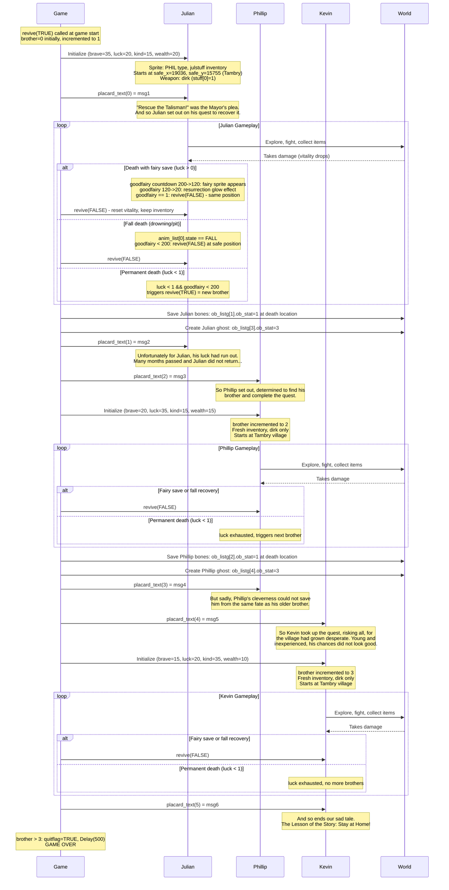
```mermaid
sequenceDiagram
    participant Game
    participant Julian
    participant Phillip
    participant Kevin
    participant World

    Note over Game: revive(TRUE) called at game start<br/>brother=0 initially, incremented to 1

    Game->>Julian: Initialize (brave=35, luck=20, kind=15, wealth=20)
    Note over Julian: Sprite: PHIL type, julstuff inventory<br/>Starts at safe_x=19036, safe_y=15755 (Tambry)<br/>Weapon: dirk (stuff[0]=1)
    Game->>Julian: placard_text(0) = msg1
    Note over Julian: "Rescue the Talisman!" was the Mayor's plea.<br/>And so Julian set out on his quest to recover it.

    loop Julian Gameplay
        Julian->>World: Explore, fight, collect items
        World-->>Julian: Takes damage (vitality drops)

        alt Death with fairy save (luck > 0)
            Note over Julian: goodfairy countdown 200->120: fairy sprite appears<br/>goodfairy 120->20: resurrection glow effect<br/>goodfairy == 1: revive(FALSE) - same position
            Game->>Julian: revive(FALSE) - reset vitality, keep inventory
        else Fall death (drowning/pit)
            Note over Julian: anim_list[0].state == FALL<br/>goodfairy < 200: revive(FALSE) at safe position
            Game->>Julian: revive(FALSE)
        else Permanent death (luck < 1)
            Note over Julian: luck < 1 && goodfairy < 200<br/>triggers revive(TRUE) = new brother
        end
    end

    Game->>World: Save Julian bones: ob_listg[1].ob_stat=1 at death location
    Game->>World: Create Julian ghost: ob_listg[3].ob_stat=3
    Game->>Julian: placard_text(1) = msg2
    Note over Julian: Unfortunately for Julian, his luck had run out.<br/>Many months passed and Julian did not return...

    Game->>Phillip: placard_text(2) = msg3
    Note over Phillip: So Phillip set out, determined to find his<br/>brother and complete the quest.
    Game->>Phillip: Initialize (brave=20, luck=35, kind=15, wealth=15)
    Note over Phillip: brother incremented to 2<br/>Fresh inventory, dirk only<br/>Starts at Tambry village

    loop Phillip Gameplay
        Phillip->>World: Explore, fight, collect items
        World-->>Phillip: Takes damage

        alt Fairy save or fall recovery
            Game->>Phillip: revive(FALSE)
        else Permanent death (luck < 1)
            Note over Phillip: luck exhausted, triggers next brother
        end
    end

    Game->>World: Save Phillip bones: ob_listg[2].ob_stat=1 at death location
    Game->>World: Create Phillip ghost: ob_listg[4].ob_stat=3
    Game->>Phillip: placard_text(3) = msg4
    Note over Phillip: But sadly, Phillip's cleverness could not save<br/>him from the same fate as his older brother.

    Game->>Kevin: placard_text(4) = msg5
    Note over Kevin: So Kevin took up the quest, risking all, for<br/>the village had grown desperate. Young and<br/>inexperienced, his chances did not look good.
    Game->>Kevin: Initialize (brave=15, luck=20, kind=35, wealth=10)
    Note over Kevin: brother incremented to 3<br/>Fresh inventory, dirk only<br/>Starts at Tambry village

    loop Kevin Gameplay
        Kevin->>World: Explore, fight, collect items
        World-->>Kevin: Takes damage

        alt Fairy save or fall recovery
            Game->>Kevin: revive(FALSE)
        else Permanent death (luck < 1)
            Note over Kevin: luck exhausted, no more brothers
        end
    end

    Game->>Kevin: placard_text(5) = msg6
    Note over Kevin: And so ends our sad tale.<br/>The Lesson of the Story: Stay at Home!
    Note over Game: brother > 3: quitflag=TRUE, Delay(500)<br/>GAME OVER
```

### Brother Stats Reference

| Brother | Index | brave | luck | kind | wealth | Inventory Array | Placard Intro | Placard Death |
|---------|-------|-------|------|------|--------|-----------------|---------------|---------------|
| Julian  | 0 (brother=1) | 35 | 20 | 15 | 20 | `julstuff` | msg1 (index 0) | msg2 (index 1) |
| Phillip | 1 (brother=2) | 20 | 35 | 15 | 15 | `philstuff` | msg3 (index 2) | msg4 (index 3) |
| Kevin   | 2 (brother=3) | 15 | 20 | 35 | 10 | `kevstuff` | msg5 (index 4) | msg6 (index 5) |

### Princess Variation by Brother

Each brother rescues a different princess (tracked by `princess` variable, incremented on each rescue):

| Princess | Brother | Rescue Text | Source |
|----------|---------|-------------|--------|
| Katra    | Julian (princess=0) | msg8/msg8a/msg8b | `narr.asm:303-311` |
| Karla    | Phillip (princess=1) | msg9/msg9a/msg9b (Katra's sister) | `narr.asm:313-320` |
| Kandy    | Kevin (princess=2) | msg10/msg10a/msg10b (Katra's and Karla's sister) | `narr.asm:322-331` |

After rescue, the brother escorts the princess home and receives the king's gold (msg11/msg11a), then resumes the quest. The `rescue()` function (`fmain2.c:1584-1603`) awards `wealth += 100`, adds 3 to each key slot (`stuff[16..21] += 3`), transfers princess to city, and clears the princess extent (`ob_list8[9].ob_stat = 0`).

---

## 3. Intro Sequence

The game opens with a legal notice, title screen animation, three story pages with columnar-reveal effects, copy protection riddles, and finally drops the player into the game world.

**Source:** `fmain.c:1129-1245` (main function intro logic), `fmain2.c:781-836` (copypage, flipscan, skipint), `fmain2.c:1304-1336` (copy_protect_junk)

```mermaid
sequenceDiagram
    participant Game
    participant Display
    participant Audio
    participant Player

    Note over Game: main() entry point (fmain.c:1129)

    Game->>Display: open_all() - initialize Amiga display hardware
    Game->>Display: SetRast() - clear both page bitmaps
    Game->>Display: screen_size(156) - set initial viewport
    Game->>Display: SetRGB4() - set colors (bg=dark blue, fg=white)

    Game->>Display: ssp(titletext) - render legal/copyright text
    Game->>Game: Delay(50) - 1 second pause on legal text

    Game->>Display: SetFont(afont) - load Amber proportional font
    Game->>Audio: read_score() - load packed music data from songs file
    Game->>Audio: read_sample() - load instrument samples
    Game->>Game: Delay(50) - 1 second pause

    Game->>Display: Allocate page bitmaps (5 bitplanes each)
    Game->>Audio: playscore(track[12..15]) - start intro music
    Game->>Display: LoadRGB4(blackcolors) - fade text screen to black

    Game->>Display: screen_size(0) - collapse viewport to zero height
    Game->>Display: pagechange() x2 - prime double-buffer

    alt Player presses space
        Player->>Game: spacebar detected by skipint()
        Note over Game: skipp flag set, goto end_intro
    else No skip - full intro plays
        Game->>Display: unpackbrush("page0") - load title screen IFF
        Game->>Display: BltBitMap to both page buffers

        loop Zoom-in animation (i=0 to 160, step 4)
            Game->>Display: screen_size(i) - expand viewport vertically
        end

        alt Player presses space
            Player->>Game: skipint() returns true
        else Story pages play
            Note over Display: Each copypage(): Delay(350)=7 sec,<br/>blit background, unpack 2 IFF brushes,<br/>flipscan() column-reveal animation

            Game->>Display: copypage("p1a","p1b",21,29) - story page 1
            Note over Display: 350-tick delay, then columnar reveal

            Game->>Display: copypage("p2a","p2b",20,29) - story page 2
            Note over Display: 350-tick delay, then columnar reveal

            Game->>Display: copypage("p3a","p3b",20,33) - story page 3
            Note over Display: 350-tick delay, then columnar reveal

            Game->>Game: Delay(190) - 3.8 sec pause on final page
        end

        loop Zoom-out animation (i=156 to 0, step -4)
            Game->>Display: screen_size(i) - collapse viewport
        end
    end

    Note over Game: no_intro label (fmain.c:1211)

    Game->>Display: seekn() - reset display state
    Game->>Display: LoadRGB4(blackcolors) - clear colors
    Game->>Display: screen_size(156) - restore viewport
    Game->>Display: unpackbrush("hiscreen") - load HUD graphics

    Game->>Display: stillscreen() + placard_text(19) = msg12
    Note over Display: "So... You, game seeker, would guide the<br/>brothers to their destiny? Answer, then,<br/>these three questions..."

    rect rgb(220, 220, 240)
        Note over Game: Copy Protection (fmain2.c:1309-1336)
        loop 3 riddle rounds
            Game->>Game: rand8() selects from 8 answers pool
            Game->>Display: question(j) - display riddle j
            Note over Display: Answer pool: LIGHT, HEED, DEED, SIGHT,<br/>FLIGHT, CREED, BLIGHT, NIGHT
            Player->>Game: Type answer (case-sensitive match)
            alt Correct answer
                Game->>Game: Mark answer as used (answers[j]=NULL)
            else Incorrect answer
                Game->>Game: return FALSE
                Note over Game: copy_protect_junk()==0<br/>goto quit_all - EXIT GAME
            end
        end
    end

    Game->>Audio: stopscore() - stop intro music
    Game->>Game: revive(TRUE) - initialize Julian (brother=1)
    Note over Game: Julian intro placard (msg1),<br/>HUD setup, day music begins,<br/>main game loop starts (fmain.c:1270)
```

### Intro Timing Summary

| Phase | Duration | Source |
|-------|----------|--------|
| Legal text display | 1 sec (Delay 50) | `fmain.c:1164` |
| Font/music load pause | 1 sec (Delay 50) | `fmain.c:1173` |
| Zoom-in animation | ~40 frames (0 to 160, step 4) | `fmain.c:1199` |
| Story page delay (each) | 7 sec (Delay 350) per page | `fmain2.c:783` |
| Final page hold | 3.8 sec (Delay 190) | `fmain.c:1206` |
| Zoom-out animation | ~39 frames (156 to 0, step 4) | `fmain.c:1209` |
| Copy protection | Player-paced (3 riddles) | `fmain2.c:1315` |
| Julian intro placard | 2.4 sec (Delay 120) | `fmain.c:2870` |

---

## 4. Death and Revival State Machine

This diagram details the exact frame-by-frame logic that determines whether the hero is revived by a fairy, falls to a safe point, or transitions to the next brother. For the complete revive() function and good fairy mechanic, see [RESEARCH.md Section 13](RESEARCH.md#13-death--revival).

**Source:** `fmain.c:1386-1407` (main loop death handling), `fmain.c:2814-2912` (revive function)

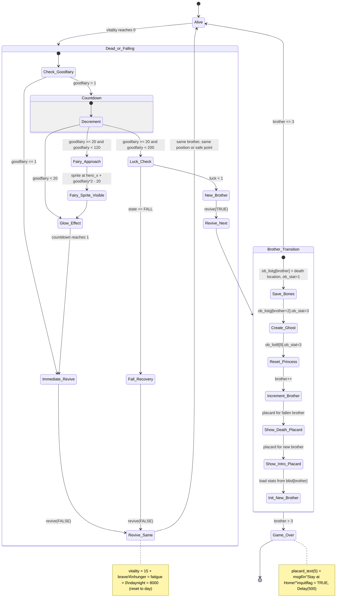
```mermaid
stateDiagram-v2
    [*] --> Alive
    Alive --> Dead_or_Falling : vitality reaches 0

    state Dead_or_Falling {
        [*] --> Check_Goodfairy
        Check_Goodfairy --> Immediate_Revive : goodfairy == 1
        Check_Goodfairy --> Countdown : goodfairy > 1

        state Countdown {
            [*] --> Decrement
            Decrement --> Glow_Effect : goodfairy < 20
            Decrement --> Luck_Check : goodfairy >= 20 and goodfairy < 200
            Decrement --> Fairy_Approach : goodfairy >= 20 and goodfairy < 120
        }

        Luck_Check --> New_Brother : luck < 1
        Luck_Check --> Fall_Recovery : state == FALL

        Fairy_Approach --> Fairy_Sprite_Visible : sprite at hero_x + goodfairy*2 - 20
        Fairy_Sprite_Visible --> Glow_Effect
        Glow_Effect --> Immediate_Revive : countdown reaches 1

        Immediate_Revive --> Revive_Same : revive(FALSE)
        Fall_Recovery --> Revive_Same : revive(FALSE)
        New_Brother --> Revive_Next : revive(TRUE)
    }

    Revive_Same --> Alive : same brother, same position or safe point
    note right of Revive_Same : vitality = 15 + brave/4\nhunger = fatigue = 0\ndaynight = 8000 (reset to day)

    Revive_Next --> Brother_Transition
    state Brother_Transition {
        [*] --> Save_Bones : ob_listg[brother] = death location, ob_stat=1
        Save_Bones --> Create_Ghost : ob_listg[brother+2].ob_stat=3
        Create_Ghost --> Reset_Princess : ob_list8[9].ob_stat=3
        Reset_Princess --> Increment_Brother : brother++
        Increment_Brother --> Show_Death_Placard : placard for fallen brother
        Show_Death_Placard --> Show_Intro_Placard : placard for new brother
        Show_Intro_Placard --> Init_New_Brother : load stats from blist[brother]
    }

    Brother_Transition --> Alive : brother <= 3
    Brother_Transition --> Game_Over : brother > 3

    note right of Game_Over : placard_text(5) = msg6\n"Stay at Home!"\nquitflag = TRUE, Delay(500)

    Game_Over --> [*]
```

### Placard Sequencing in revive(TRUE)

The `revive()` function uses the `brother` variable (incremented *before* placard display) to select text:

| brother (after ++) | First Placard | Pause | Second Placard | Meaning |
|-------------------|---------------|-------|----------------|---------|
| 1 | `placard_text(0)` = msg1 | 120 ticks | (none -- first brother, also clears screen) | Julian's quest begins |
| 2 | `placard_text(1)` = msg2 | 120 ticks | `placard_text(2)` = msg3 | Julian falls, Phillip begins |
| 3 | `placard_text(3)` = msg4 | 120 ticks | `placard_text(4)` = msg5 | Phillip falls, Kevin begins |
| 4 | `placard_text(5)` = msg6 | 120 ticks | (none -- game over) | Kevin falls, game ends |

**Source:** `fmain.c:2861-2879`

---

## 5. NPC Dialogue Trees

> All speech indices reference `_speeches` in `narr.asm:351-518` -- see [RESEARCH.md Section 7](RESEARCH.md#7-npcs--dialogue) for the complete speech catalogue.
> Placard text indices reference `_placard_text` in `narr.asm:233-347`.

### 5.1 Wizard (SETFIG race 0, 7 instances with goal 0-6)

The wizard appears in multiple locations, each with a distinct `goal` value that selects
a different cryptic hint. The kindness check gates whether the wizard will speak at all.

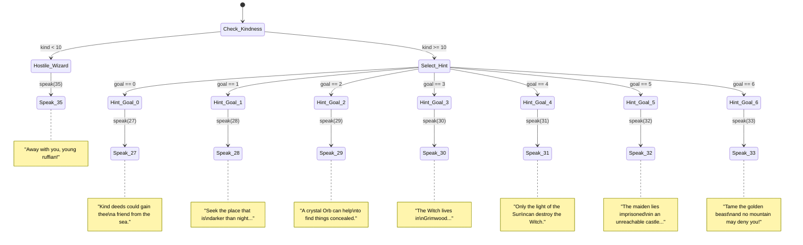
```mermaid
stateDiagram-v2
    [*] --> Check_Kindness
    Check_Kindness --> Hostile_Wizard : kind < 10
    Check_Kindness --> Select_Hint : kind >= 10

    Hostile_Wizard --> Speak_35 : speak(35)
    note right of Speak_35 : "Away with you, young ruffian!"

    Select_Hint --> Hint_Goal_0 : goal == 0
    Select_Hint --> Hint_Goal_1 : goal == 1
    Select_Hint --> Hint_Goal_2 : goal == 2
    Select_Hint --> Hint_Goal_3 : goal == 3
    Select_Hint --> Hint_Goal_4 : goal == 4
    Select_Hint --> Hint_Goal_5 : goal == 5
    Select_Hint --> Hint_Goal_6 : goal == 6

    Hint_Goal_0 --> Speak_27 : speak(27)
    note right of Speak_27 : "Kind deeds could gain thee\na friend from the sea."

    Hint_Goal_1 --> Speak_28 : speak(28)
    note right of Speak_28 : "Seek the place that is\ndarker than night..."

    Hint_Goal_2 --> Speak_29 : speak(29)
    note right of Speak_29 : "A crystal Orb can help\nto find things concealed."

    Hint_Goal_3 --> Speak_30 : speak(30)
    note right of Speak_30 : "The Witch lives in\nGrimwood..."

    Hint_Goal_4 --> Speak_31 : speak(31)
    note right of Speak_31 : "Only the light of the Sun\ncan destroy the Witch."

    Hint_Goal_5 --> Speak_32 : speak(32)
    note right of Speak_32 : "The maiden lies imprisoned\nin an unreachable castle..."

    Hint_Goal_6 --> Speak_33 : speak(33)
    note right of Speak_33 : "Tame the golden beast\nand no mountain may deny you!"
```

**Source:** `fmain.c:3380-3381` -- `case 0: if (kind < 10) speak(35); else speak(27+an->goal);`

---

### 5.2 Priest (SETFIG race 1)

The priest has three interaction branches: hostile rejection for unkind heroes,
granting the golden statue for heroes carrying the king's writ, and healing
with hints for kind heroes without the writ.

```mermaid
stateDiagram-v2
    [*] --> Check_Writ
    Check_Writ --> Has_Writ : stuff[28] == 1
    Check_Writ --> No_Writ : stuff[28] == 0

    Has_Writ --> Check_Statue_Given
    Check_Statue_Given --> Give_Statue : ob_listg[10] == 0
    Check_Statue_Given --> Already_Given : ob_listg[10] != 0

    Give_Statue --> Speak_39 : speak(39)
    note right of Speak_39 : "Ah! You have a writ from the king.\nHere is one of the golden statues..."
    Speak_39 --> Set_Statue_Flag : ob_listg[10].ob_stat = 1

    Already_Given --> Speak_19 : speak(19)
    note right of Speak_19 : "I already gave the golden\nstatue to the other young man."

    No_Writ --> Check_Kindness_Priest
    Check_Kindness_Priest --> Hostile_Priest : kind < 10
    Check_Kindness_Priest --> Heal_And_Hint : kind >= 10

    Hostile_Priest --> Speak_40 : speak(40)
    note right of Speak_40 : "Repent, Sinner! Thou art\nan uncouth brute..."

    Heal_And_Hint --> Select_Message : speak(36 + daynight%3)
    note right of Select_Message : One of three rotating messages:\nspeak(36) spirit plane warning\nspeak(37) "seek the Stones"\nspeak(38) "I shall Heal all your wounds"
    Select_Message --> Full_Heal : vitality = 15 + brave/4
```

**Source:** `fmain.c:3382-3393`

---

### 5.3 King (SETFIG race 5)

The king's dialogue changes based on whether the princess has been rescued.

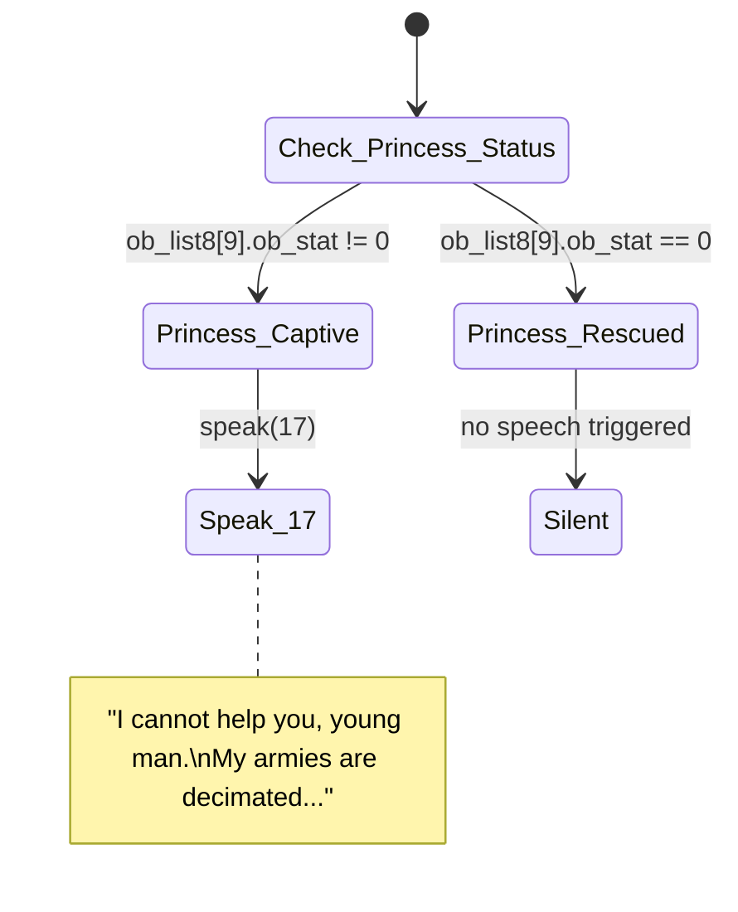
```mermaid
stateDiagram-v2
    [*] --> Check_Princess_Status
    Check_Princess_Status --> Princess_Captive : ob_list8[9].ob_stat != 0
    Check_Princess_Status --> Princess_Rescued : ob_list8[9].ob_stat == 0

    Princess_Captive --> Speak_17 : speak(17)
    note right of Speak_17 : "I cannot help you, young man.\nMy armies are decimated..."

    Princess_Rescued --> Silent : no speech triggered
```

**Source:** `fmain.c:3398` -- `case 5: if (ob_list8[9].ob_stat) speak(17);`

---

### 5.4 Sorceress (SETFIG race 7)

The sorceress gives one golden figurine on first visit, then provides
a luck boost on subsequent visits.

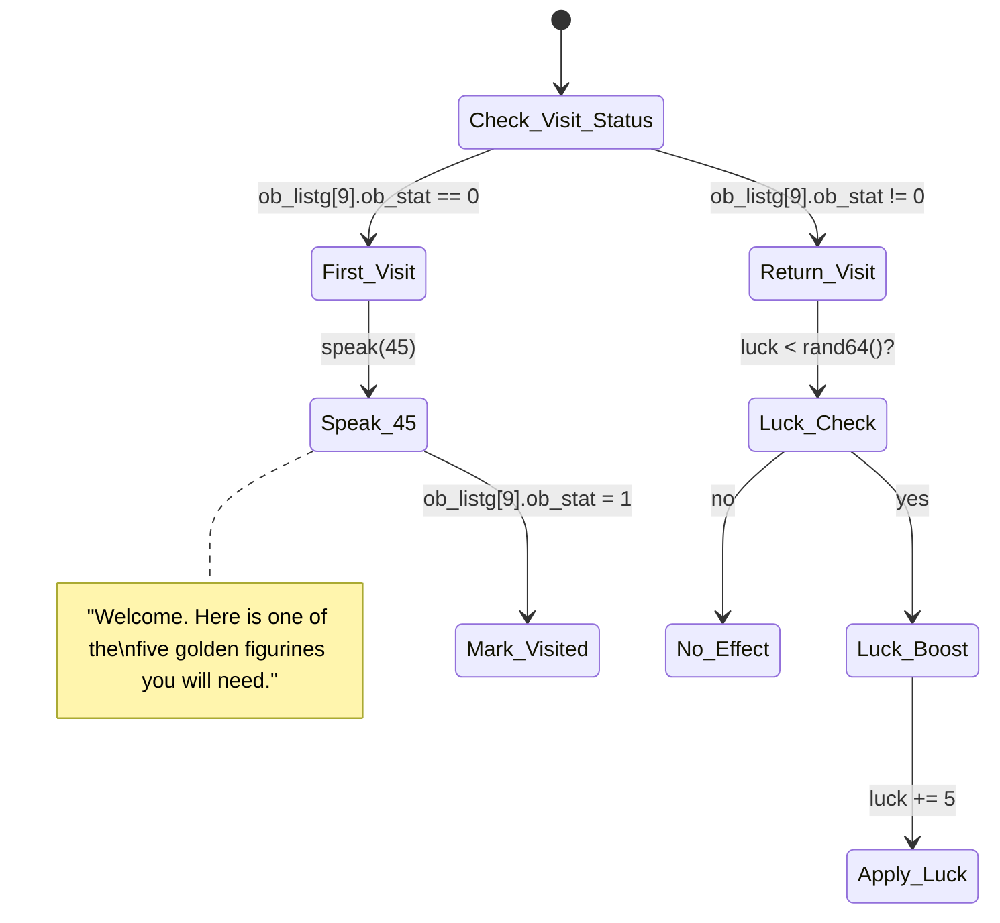
```mermaid
stateDiagram-v2
    [*] --> Check_Visit_Status
    Check_Visit_Status --> First_Visit : ob_listg[9].ob_stat == 0
    Check_Visit_Status --> Return_Visit : ob_listg[9].ob_stat != 0

    First_Visit --> Speak_45 : speak(45)
    note right of Speak_45 : "Welcome. Here is one of the\nfive golden figurines you will need."
    Speak_45 --> Mark_Visited : ob_listg[9].ob_stat = 1

    Return_Visit --> Luck_Check : luck < rand64()?
    Luck_Check --> Luck_Boost : yes
    Luck_Check --> No_Effect : no
    Luck_Boost --> Apply_Luck : luck += 5
```

**Source:** `fmain.c:3400-3404`

---

### 5.5 Beggar (SETFIG race 13, via GIVE gold)

The beggar begs for alms on TALK. When gold is given, he delivers one of
three progressive prophecies selected by his `goal` value (0-2).

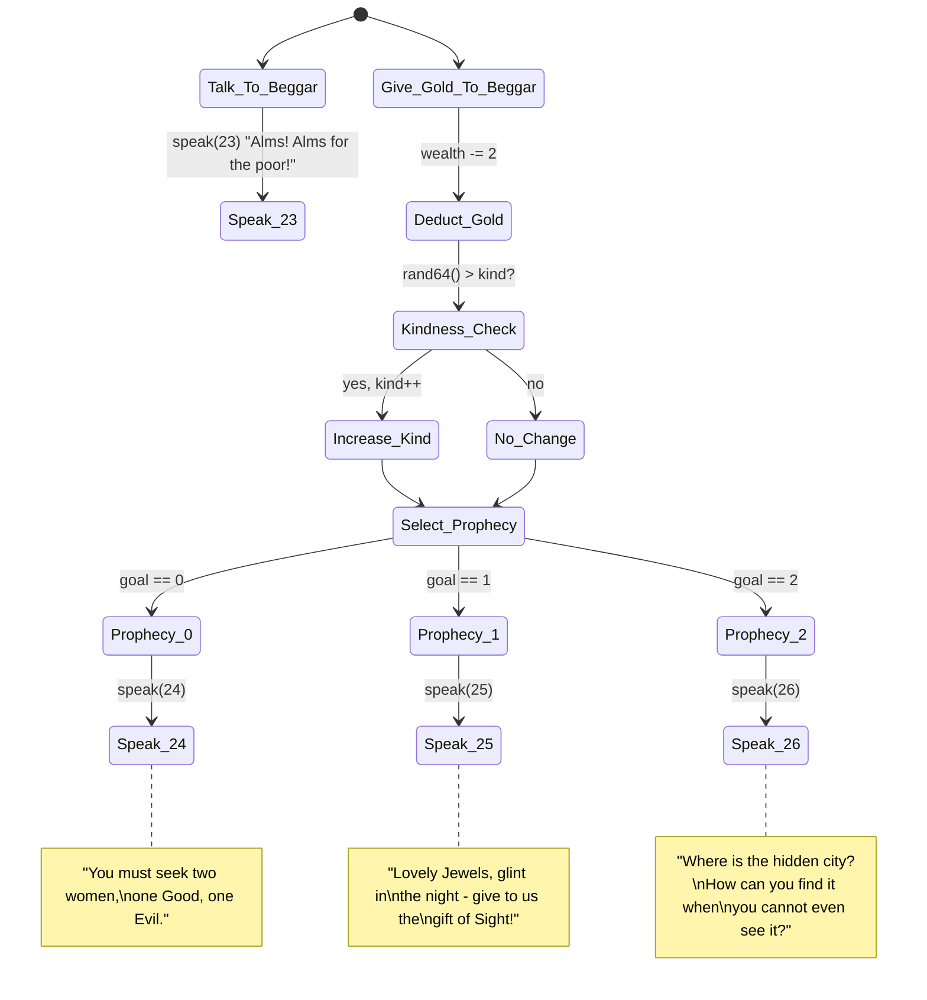
```mermaid
stateDiagram-v2
    [*] --> Talk_To_Beggar
    Talk_To_Beggar --> Speak_23 : speak(23) "Alms! Alms for the poor!"

    [*] --> Give_Gold_To_Beggar
    Give_Gold_To_Beggar --> Deduct_Gold : wealth -= 2
    Deduct_Gold --> Kindness_Check : rand64() > kind?
    Kindness_Check --> Increase_Kind : yes, kind++
    Kindness_Check --> No_Change : no
    Increase_Kind --> Select_Prophecy
    No_Change --> Select_Prophecy

    Select_Prophecy --> Prophecy_0 : goal == 0
    Select_Prophecy --> Prophecy_1 : goal == 1
    Select_Prophecy --> Prophecy_2 : goal == 2

    Prophecy_0 --> Speak_24 : speak(24)
    note right of Speak_24 : "You must seek two women,\none Good, one Evil."

    Prophecy_1 --> Speak_25 : speak(25)
    note right of Speak_25 : "Lovely Jewels, glint in\nthe night - give to us the\ngift of Sight!"

    Prophecy_2 --> Speak_26 : speak(26)
    note right of Speak_26 : "Where is the hidden city?\nHow can you find it when\nyou cannot even see it?"
```

**Source:** `fmain.c:3415` (TALK), `fmain.c:3493-3499` (GIVE)

---

### 5.6 Spectre (SETFIG race 10, via GIVE bones)

The spectre requests ancient bones to aid the hero. On TALK, he asks for them.
On GIVE with bones in inventory, he trades the crystal shard.

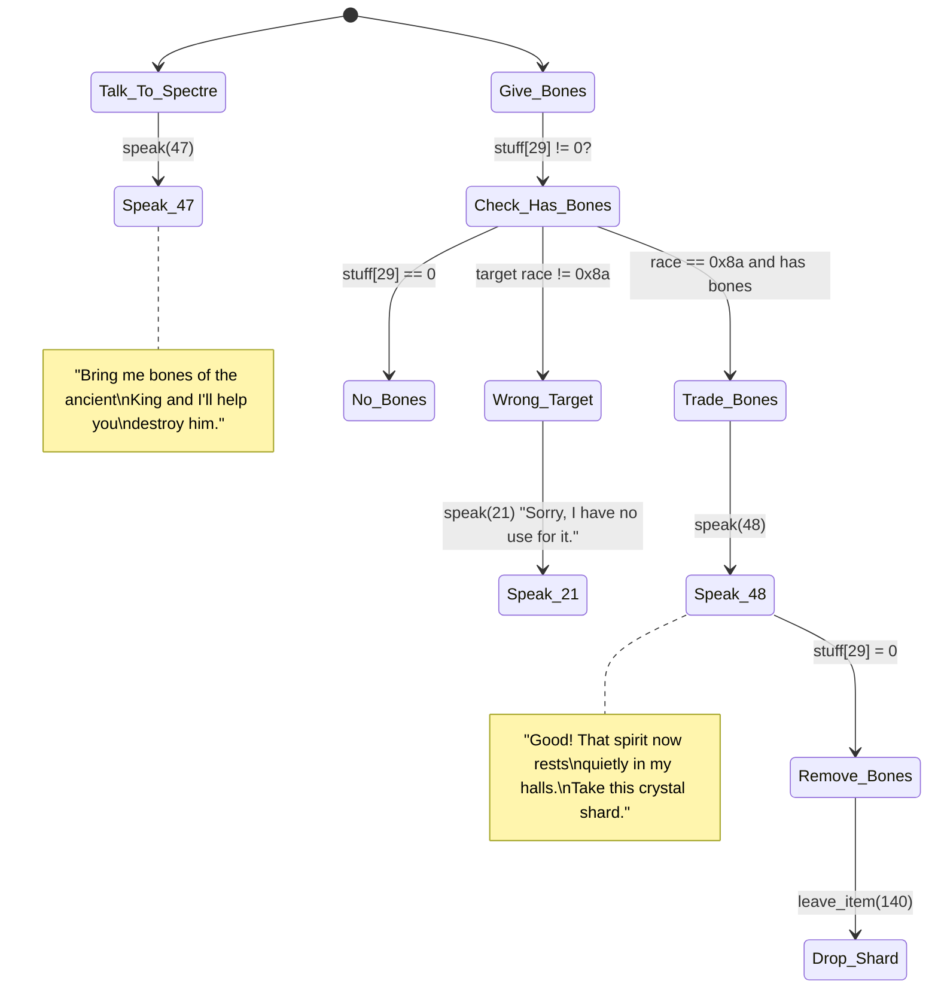
```mermaid
stateDiagram-v2
    [*] --> Talk_To_Spectre
    Talk_To_Spectre --> Speak_47 : speak(47)
    note right of Speak_47 : "Bring me bones of the ancient\nKing and I'll help you\ndestroy him."

    [*] --> Give_Bones
    Give_Bones --> Check_Has_Bones : stuff[29] != 0?
    Check_Has_Bones --> Wrong_Target : target race != 0x8a
    Check_Has_Bones --> No_Bones : stuff[29] == 0

    Wrong_Target --> Speak_21 : speak(21) "Sorry, I have no use for it."

    Check_Has_Bones --> Trade_Bones : race == 0x8a and has bones
    Trade_Bones --> Speak_48 : speak(48)
    note right of Speak_48 : "Good! That spirit now rests\nquietly in my halls.\nTake this crystal shard."
    Speak_48 --> Remove_Bones : stuff[29] = 0
    Remove_Bones --> Drop_Shard : leave_item(140)
```

**Source:** `fmain.c:3410` (TALK), `fmain.c:3501-3503` (GIVE)

---

### 5.7 Dark Knight (ENEMY race 7)

The Dark Knight guards the sacred shrine. He speaks on approach and again
when defeated.

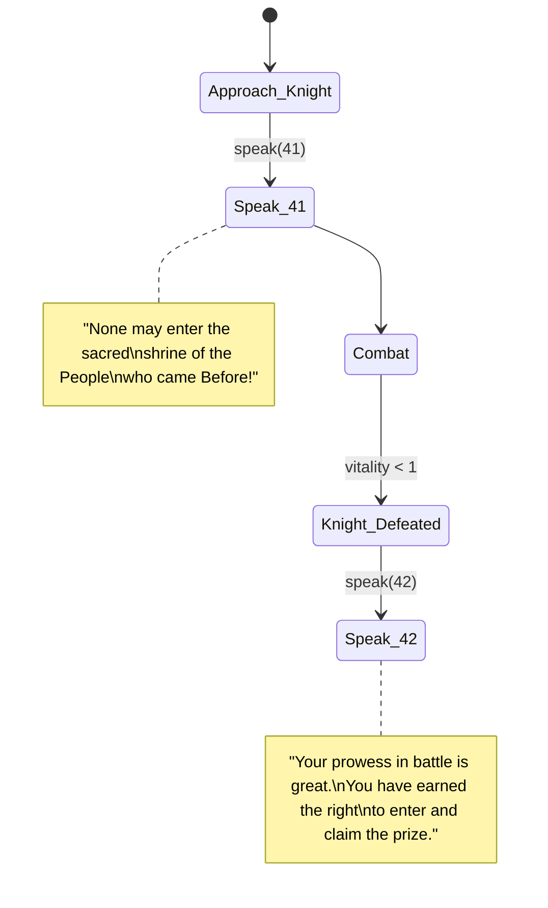
```mermaid
stateDiagram-v2
    [*] --> Approach_Knight
    Approach_Knight --> Speak_41 : speak(41)
    note right of Speak_41 : "None may enter the sacred\nshrine of the People\nwho came Before!"

    Speak_41 --> Combat
    Combat --> Knight_Defeated : vitality < 1
    Knight_Defeated --> Speak_42 : speak(42)
    note right of Speak_42 : "Your prowess in battle is great.\nYou have earned the right\nto enter and claim the prize."
```

**Source:** `fmain.c:2101` (auto-speak on approach), `fmain.c:2775` (checkdead triggers speak(42))

---

## 6. Princess Rescue Sequence

Three princesses (Katra, Karla, Kandy) can be rescued in sequence. Each rescue
triggers a placard cutscene, teleportation, and rewards.

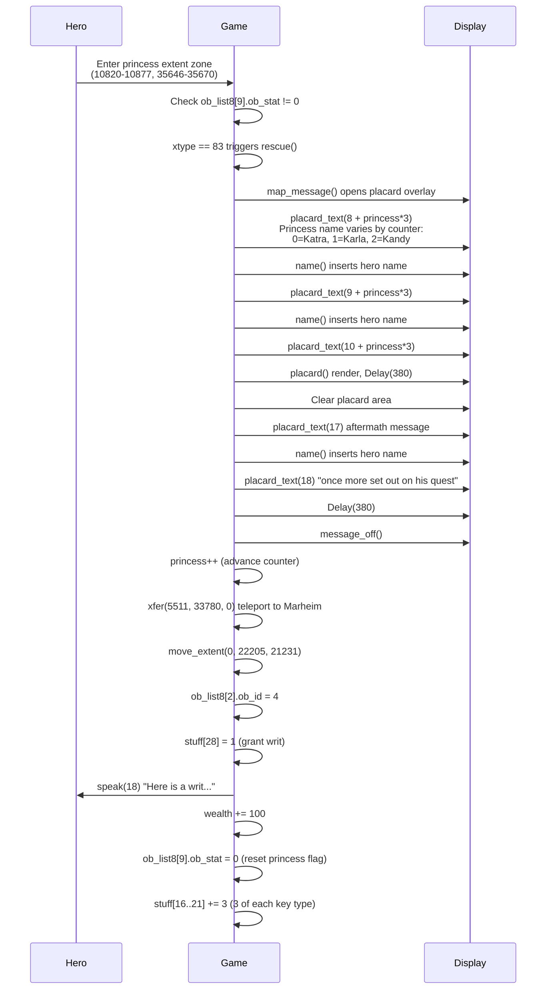
```mermaid
sequenceDiagram
    participant Hero
    participant Game
    participant Display

    Hero->>Game: Enter princess extent zone<br/>(10820-10877, 35646-35670)
    Game->>Game: Check ob_list8[9].ob_stat != 0
    Game->>Game: xtype == 83 triggers rescue()

    Game->>Display: map_message() opens placard overlay
    Game->>Display: placard_text(8 + princess*3)<br/>Princess name varies by counter:<br/>0=Katra, 1=Karla, 2=Kandy
    Game->>Display: name() inserts hero name
    Game->>Display: placard_text(9 + princess*3)
    Game->>Display: name() inserts hero name
    Game->>Display: placard_text(10 + princess*3)
    Game->>Display: placard() render, Delay(380)

    Game->>Display: Clear placard area
    Game->>Display: placard_text(17) aftermath message
    Game->>Display: name() inserts hero name
    Game->>Display: placard_text(18) "once more set out on his quest"
    Game->>Display: Delay(380)
    Game->>Display: message_off()

    Game->>Game: princess++ (advance counter)
    Game->>Game: xfer(5511, 33780, 0) teleport to Marheim
    Game->>Game: move_extent(0, 22205, 21231)
    Game->>Game: ob_list8[2].ob_id = 4
    Game->>Game: stuff[28] = 1 (grant writ)
    Game->>Hero: speak(18) "Here is a writ..."
    Game->>Game: wealth += 100
    Game->>Game: ob_list8[9].ob_stat = 0 (reset princess flag)
    Game->>Game: stuff[16..21] += 3 (3 of each key type)
```

**Source:** `fmain2.c:1584-1603`, triggered by `fmain.c:2684-2685`

**Placard text mapping (narr.asm:303-340):**
| princess | placard_text indices | Princess name |
|----------|---------------------|---------------|
| 0        | 8, 9, 10            | Katra         |
| 1        | 11, 12, 13          | Karla         |
| 2        | 14, 15, 16          | Kandy         |

Note: The placard table uses indices 8-16 for rescue messages and 17-18 for the
aftermath message (msg11, msg11a).

---

## 7. Witch Confrontation Sequence

The witch (SETFIG race 9, race byte 0x89 when spawned as encounter) resides in
Grimwood. She faces the hero every tick and projects a damaging vision cone.

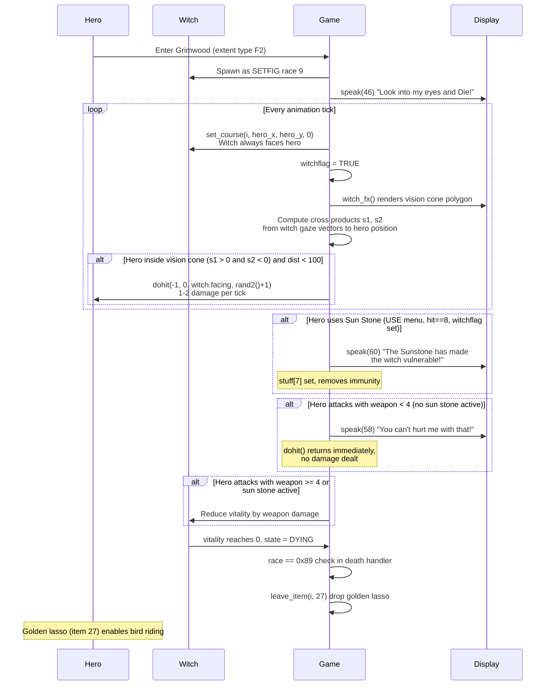
```mermaid
sequenceDiagram
    participant Hero
    participant Witch
    participant Game
    participant Display

    Hero->>Game: Enter Grimwood (extent type F2)
    Game->>Witch: Spawn as SETFIG race 9
    Game->>Display: speak(46) "Look into my eyes and Die!"

    loop Every animation tick
        Game->>Witch: set_course(i, hero_x, hero_y, 0)<br/>Witch always faces hero
        Game->>Game: witchflag = TRUE
        Game->>Display: witch_fx() renders vision cone polygon
        Game->>Game: Compute cross products s1, s2<br/>from witch gaze vectors to hero position
        alt Hero inside vision cone (s1 > 0 and s2 < 0) and dist < 100
            Game->>Hero: dohit(-1, 0, witch.facing, rand2()+1)<br/>1-2 damage per tick
        end
    end

    alt Hero uses Sun Stone (USE menu, hit==8, witchflag set)
        Game->>Display: speak(60) "The Sunstone has made<br/>the witch vulnerable!"
        Note over Game: stuff[7] set, removes immunity
    end

    alt Hero attacks with weapon < 4 (no sun stone active)
        Game->>Display: speak(58) "You can't hurt me with that!"
        Note over Game: dohit() returns immediately,<br/>no damage dealt
    end

    alt Hero attacks with weapon >= 4 or sun stone active
        Game->>Witch: Reduce vitality by weapon damage
    end

    Witch->>Game: vitality reaches 0, state = DYING
    Game->>Game: race == 0x89 check in death handler
    Game->>Game: leave_item(i, 27) drop golden lasso
    Note over Hero: Golden lasso (item 27) enables bird riding
```

**Key source references:**
- Witch always faces hero: `fmain.c:1553-1554`
- Vision cone rendering: `fmain2.c:917-965`
- Cone damage: `fmain.c:2374-2375`
- Sun stone USE: `fmain.c:3462`
- Immunity check: `fmain2.c:231-234` (weapon < 4 and race 0x89 and stuff[7]==0)
- Lasso drop on death: `fmain.c:1756`

---

## 8. Necromancer Final Battle Sequence

The Necromancer (type 60, race 9) awaits on the astral plane. Magic is restricted
in his domain, and he is immune to weak weapons.

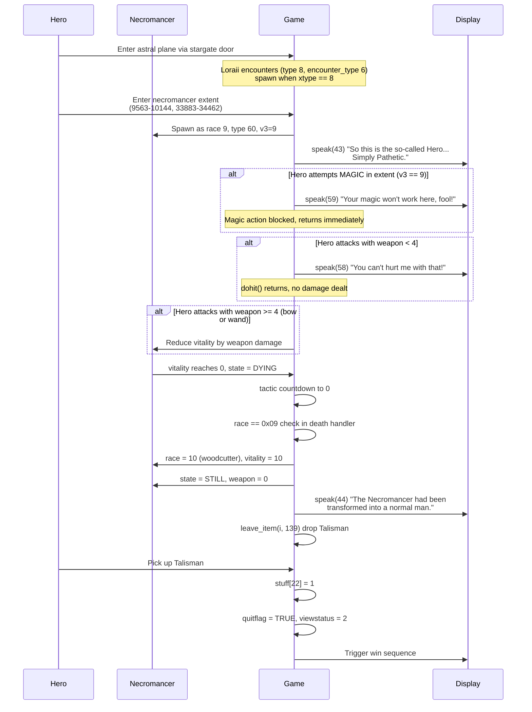
```mermaid
sequenceDiagram
    participant Hero
    participant Necromancer
    participant Game
    participant Display

    Hero->>Game: Enter astral plane via stargate door

    Note over Game: Loraii encounters (type 8, encounter_type 6)<br/>spawn when xtype == 8

    Hero->>Game: Enter necromancer extent<br/>(9563-10144, 33883-34462)
    Game->>Necromancer: Spawn as race 9, type 60, v3=9
    Game->>Display: speak(43) "So this is the so-called Hero...<br/>Simply Pathetic."

    alt Hero attempts MAGIC in extent (v3 == 9)
        Game->>Display: speak(59) "Your magic won't work here, fool!"
        Note over Game: Magic action blocked, returns immediately
    end

    alt Hero attacks with weapon < 4
        Game->>Display: speak(58) "You can't hurt me with that!"
        Note over Game: dohit() returns, no damage dealt
    end

    alt Hero attacks with weapon >= 4 (bow or wand)
        Game->>Necromancer: Reduce vitality by weapon damage
    end

    Necromancer->>Game: vitality reaches 0, state = DYING
    Game->>Game: tactic countdown to 0
    Game->>Game: race == 0x09 check in death handler
    Game->>Necromancer: race = 10 (woodcutter), vitality = 10
    Game->>Necromancer: state = STILL, weapon = 0
    Game->>Display: speak(44) "The Necromancer had been<br/>transformed into a normal man."
    Game->>Game: leave_item(i, 139) drop Talisman

    Hero->>Game: Pick up Talisman
    Game->>Game: stuff[22] = 1
    Game->>Game: quitflag = TRUE, viewstatus = 2
    Game->>Display: Trigger win sequence
```

**Key source references:**
- Necromancer extent: `fmain.c:343` -- `{ 9563,33883, 10144,34462, 60, 1, 1, 9 }`
- Auto-speak on approach: `fmain.c:2100`
- Magic restriction: `fmain.c:3304` -- `if (extn->v3 == 9) { speak(59); break; }`
- Weapon immunity: `fmain2.c:231-232` -- weapon < 4 and race == 9
- Death transformation: `fmain.c:1749-1754`
- Win trigger on pickup: `fmain.c:3244-3247`

---

## 9. Win and Lose Sequences

### 9.1 Win Condition

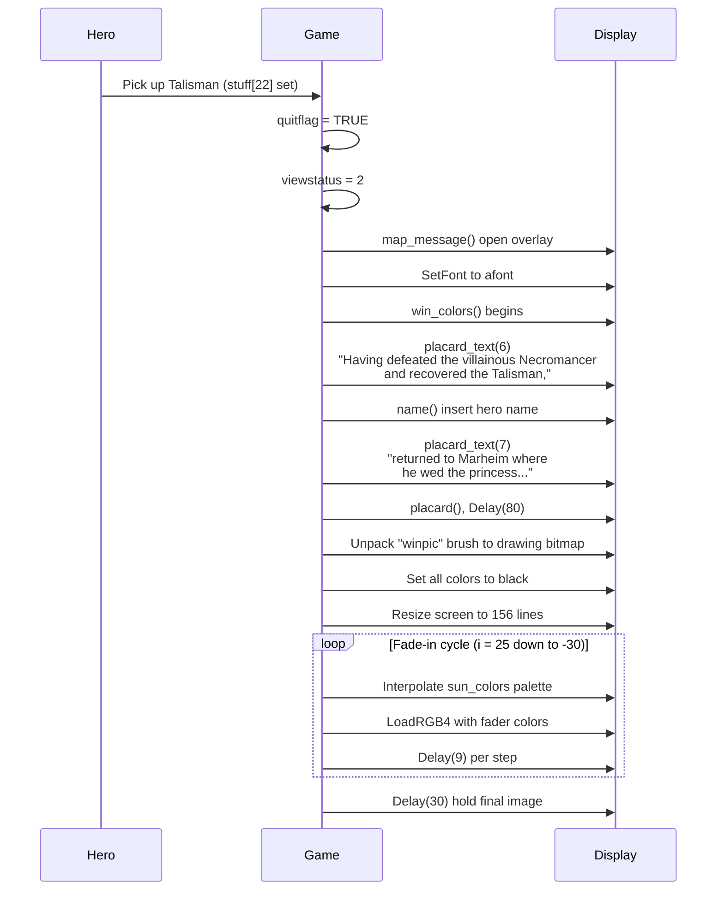
```mermaid
sequenceDiagram
    participant Hero
    participant Game
    participant Display

    Hero->>Game: Pick up Talisman (stuff[22] set)
    Game->>Game: quitflag = TRUE
    Game->>Game: viewstatus = 2

    Game->>Display: map_message() open overlay
    Game->>Display: SetFont to afont
    Game->>Display: win_colors() begins

    Game->>Display: placard_text(6)<br/>"Having defeated the villainous Necromancer<br/>and recovered the Talisman,"
    Game->>Display: name() insert hero name
    Game->>Display: placard_text(7)<br/>"returned to Marheim where<br/>he wed the princess..."
    Game->>Display: placard(), Delay(80)

    Game->>Display: Unpack "winpic" brush to drawing bitmap
    Game->>Display: Set all colors to black
    Game->>Display: Resize screen to 156 lines

    loop Fade-in cycle (i = 25 down to -30)
        Game->>Display: Interpolate sun_colors palette
        Game->>Display: LoadRGB4 with fader colors
        Game->>Display: Delay(9) per step
    end

    Game->>Display: Delay(30) hold final image
```

**Source:** `fmain.c:3244-3247` (trigger), `fmain2.c:1605-1634` (win_colors)

---

### 9.2 Lose Condition (All Brothers Dead)

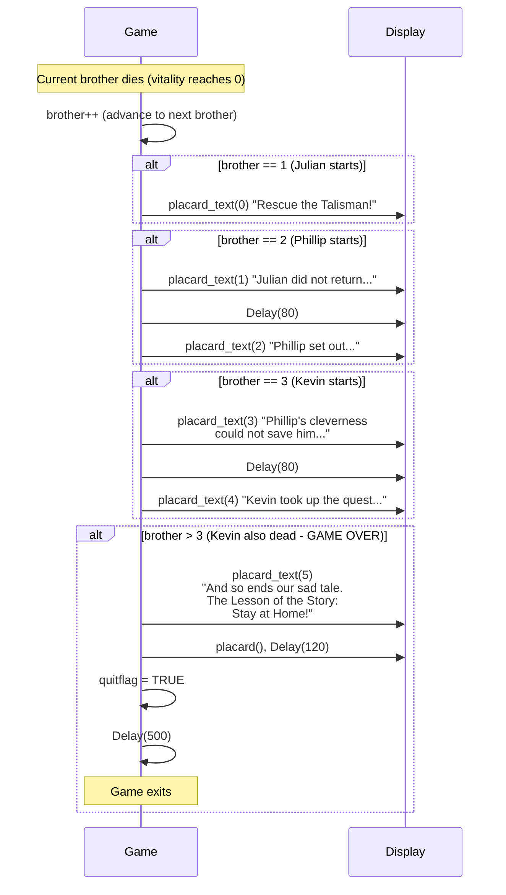
```mermaid
sequenceDiagram
    participant Game
    participant Display

    Note over Game: Current brother dies (vitality reaches 0)
    Game->>Game: brother++ (advance to next brother)

    alt brother == 1 (Julian starts)
        Game->>Display: placard_text(0) "Rescue the Talisman!"
    end
    alt brother == 2 (Phillip starts)
        Game->>Display: placard_text(1) "Julian did not return..."
        Game->>Display: Delay(80)
        Game->>Display: placard_text(2) "Phillip set out..."
    end
    alt brother == 3 (Kevin starts)
        Game->>Display: placard_text(3) "Phillip's cleverness<br/>could not save him..."
        Game->>Display: Delay(80)
        Game->>Display: placard_text(4) "Kevin took up the quest..."
    end
    alt brother > 3 (Kevin also dead - GAME OVER)
        Game->>Display: placard_text(5)<br/>"And so ends our sad tale.<br/>The Lesson of the Story:<br/>Stay at Home!"
        Game->>Display: placard(), Delay(120)
        Game->>Game: quitflag = TRUE
        Game->>Game: Delay(500)
        Note over Game: Game exits
    end
```

**Source:** `fmain.c:2847-2872`

**Placard text to narr.asm message mapping:**

| placard_text index | narr.asm label | Content summary |
|-------------------|----------------|-----------------|
| 0                 | msg1           | Julian's quest begins |
| 1                 | msg2           | Julian did not return |
| 2                 | msg3           | Phillip sets out |
| 3                 | msg4           | Phillip's fate |
| 4                 | msg5           | Kevin takes up the quest |
| 5                 | msg6           | "Stay at Home!" (game over) |
| 6                 | msg7           | Victory: defeated Necromancer |
| 7                 | msg7a          | Victory: wed the princess |

---

## 10. Speech Index Verification

Cross-referencing five speech indices between `fmain.c`/`fmain2.c` usage and
`narr.asm:351-518` definitions:

| Index | Code reference | narr.asm text | Match? |
|-------|---------------|---------------|--------|
| 17    | `fmain.c:3398` -- king speech when princess captive | `narr.asm:391-393`: "I cannot help you, young man... I have lost all hope." | Confirmed |
| 35    | `fmain.c:3380` -- wizard hostile (kind < 10) | `narr.asm:442-444`: "Away with you, young ruffian!... find some small animal to torment" | Confirmed |
| 43    | `fmain.c:2100` -- necromancer auto-speak on approach | `narr.asm:471-473`: "So this is the so-called Hero... Simply Pathetic." | Confirmed |
| 48    | `fmain.c:3503` -- spectre receives bones | `narr.asm:489-491`: "Good! That spirit now rests quietly... Take this crystal shard." | Confirmed |
| 58    | `fmain2.c:234` -- weapon immunity taunt | `narr.asm:513`: "Stupid fool, you can't hurt me with that!" | Confirmed |

All five spot-checked speech references match their `narr.asm` definitions correctly.

---

## 11. Combat Encounter Flow

For detailed encounter generation mechanics, see [RESEARCH.md Section 5.6](RESEARCH.md#56-encounter-generation).

This section provides Mermaid diagrams for the major game scenario subsystems: combat encounter generation, door/building transitions, carrier interactions, special map events, day/night cycles, and the shopping system.

The encounter system checks every 32 ticks whether to spawn enemies. It calculates a danger level based on the current region and terrain type, then rolls against it using `rand64()`. On success, it selects an encounter type, loads the appropriate sprite file, and places enemies on the map.

**Source:** `fmain.c:2058-2093`, `fmain.c:2105-2187`, `fmain2.c:253-275`

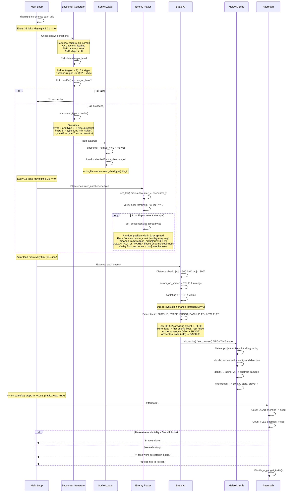
```mermaid
sequenceDiagram
    participant MainLoop as Main Loop
    participant EncGen as Encounter Generator
    participant Loader as Sprite Loader
    participant Placer as Enemy Placer
    participant AI as Battle AI
    participant Combat as Melee/Missile
    participant After as Aftermath

    MainLoop->>MainLoop: daynight increments each tick

    Note over MainLoop: Every 32 ticks (daynight & 31 == 0)
    MainLoop->>EncGen: Check spawn conditions
    Note over EncGen: Requires: !actors_on_screen<br/>AND !actors_loading<br/>AND !active_carrier<br/>AND xtype < 50

    EncGen->>EncGen: Calculate danger_level
    Note over EncGen: Indoor (region > 7): 5 + xtype<br/>Outdoor (region <= 7): 2 + xtype

    EncGen->>EncGen: Roll: rand64() <= danger_level?
    alt Roll fails
        EncGen-->>MainLoop: No encounter
    else Roll succeeds
        EncGen->>EncGen: encounter_type = rand4()
        Note over EncGen: Overrides:<br/>xtype 7 and type 2 -> type 4 (snake)<br/>xtype 8 -> type 6, no mix (spider)<br/>xtype 49 -> type 2, no mix (wraith)
        EncGen->>Loader: load_actors()
        Loader->>Loader: encounter_number = v1 + rnd(v2)
        Loader->>Loader: Read sprite file if actor_file changed
        Note over Loader: actor_file = encounter_chart[type].file_id

        Note over MainLoop: Every 16 ticks (daynight & 15 == 0)
        MainLoop->>Placer: Place encounter_number enemies
        Placer->>Placer: set_loc() picks encounter_x, encounter_y
        Placer->>Placer: Verify clear terrain: px_to_im() == 0
        loop Up to 10 placement attempts
            Placer->>Placer: set_encounter(slot, spread=63)
            Note over Placer: Random position within 63px spread<br/>Race from encounter_chart (mixflag may vary)<br/>Weapon from weapon_probs[arms*4 + wt]<br/>Goal: ATTACK or ARCHER based on arms/cleverness<br/>Vitality from encounter_chart[race].hitpoints
        end
    end

    Note over MainLoop: Actor loop runs every tick (i=2..anix)
    MainLoop->>AI: Evaluate each enemy
    AI->>AI: Distance check: |xd| < 300 AND |yd| < 300?
    AI->>AI: actors_on_screen = TRUE if in range
    AI->>AI: battleflag = TRUE if visible
    Note over AI: 1/16 re-evaluation chance (bitrand(15)==0)
    AI->>AI: Select tactic: PURSUE, EVADE, SHOOT, BACKUP, FOLLOW, FLEE
    Note over AI: Low HP (<2) or wrong extent -> FLEE<br/>Hero dead -> first enemy flees, rest follow<br/>Archer at range 40-70 -> SHOOT<br/>Archer too close (<40) -> BACKUP

    AI->>Combat: do_tactic() / set_course() / FIGHTING state
    Combat->>Combat: Melee: project strike point along facing
    Combat->>Combat: Missile: arrows with velocity and direction
    Combat->>Combat: dohit(i, j, facing, wt) -> subtract damage
    Combat->>Combat: checkdead() -> DYING state, brave++

    Note over MainLoop: When battleflag drops to FALSE (battle2 was TRUE)
    MainLoop->>After: aftermath()
    After->>After: Count DEAD enemies -> dead
    After->>After: Count FLEE enemies -> flee
    alt Hero alive and vitality < 5 and kills > 0
        After-->>MainLoop: "Bravely done!"
    else Normal victory
        After-->>MainLoop: "N foes were defeated in battle."
        After-->>MainLoop: "N foes fled in retreat."
    end
    After->>After: if turtle_eggs: get_turtle()
```

---

## 12. Door/Building Transition Flow

The door system uses an 86-entry lookup table (`doorlist`). Outdoor-to-indoor transitions use a binary search on the hero's `xc1` coordinate. Indoor-to-outdoor transitions use a linear scan on the `xc2` coordinate. Each door entry specifies type (wood, stone, cave, etc.) and which sectors it connects.

**Source:** `fmain.c:1894-1955`, `fmain.c:2625-2645`, `fmain.c:215-326`

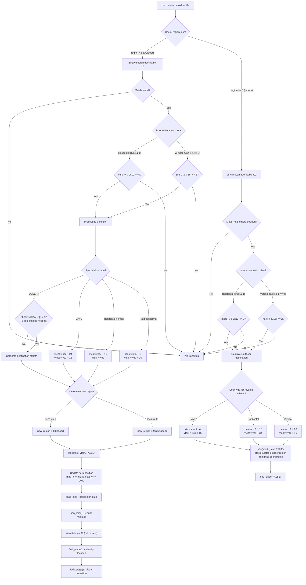
```mermaid
flowchart TD
    A[Hero walks onto door tile] --> B{Check region_num}
    B -->|"region < 8 (Outdoor)"| C[Binary search doorlist by xc1]
    B -->|"region >= 8 (Indoor)"| D[Linear scan doorlist by xc2]

    C --> E{Match found?}
    E -->|No| Z[No transition]
    E -->|Yes| F{Door orientation check}

    F -->|"Horizontal (type & 1)"| G{"hero_y & 0x10 == 0?"}
    F -->|"Vertical (type & 1 == 0)"| H{"(hero_x & 15) <= 6?"}
    G -->|Yes| I[Proceed to transition]
    G -->|No| Z
    H -->|Yes| I
    H -->|No| Z

    I --> J{Special door type?}
    J -->|DESERT| K{"stuff[STATBASE] >= 5?<br/>(5 gold statues needed)"}
    K -->|No| Z
    K -->|Yes| L[Calculate destination offsets]
    J -->|CAVE| M["xtest = xc2 + 24<br/>ytest = yc2 + 16"]
    J -->|"Horizontal normal"| N["xtest = xc2 + 16<br/>ytest = yc2"]
    J -->|"Vertical normal"| O["xtest = xc2 - 1<br/>ytest = yc2 + 16"]

    L --> P{Determine new region}
    M --> P
    N --> P
    O --> P

    P -->|"secs == 1"| Q["new_region = 8 (indoor)"]
    P -->|"secs == 2"| R["new_region = 9 (dungeon)"]

    Q --> S["xfer(xtest, ytest, FALSE)"]
    R --> S

    S --> S1["Update hero position<br/>map_x += delta, map_y += delta"]
    S1 --> S2["load_all() - load region data"]
    S2 --> S3["gen_mini() - rebuild minimap"]
    S3 --> S4["viewstatus = 99 (full redraw)"]
    S4 --> T["find_place(2) - identify location"]
    T --> U["fade_page() - visual transition"]

    D --> V{Match xc2 to hero position?}
    V -->|No| Z
    V -->|Yes| W{Indoor orientation check}

    W -->|"Horizontal (type & 1)"| W1{"(hero_y & 0x10) != 0?"}
    W -->|"Vertical (type & 1 == 0)"| W2{"(hero_x & 15) >= 2?"}
    W1 -->|Yes| X[Calculate outdoor destination]
    W1 -->|No| Z
    W2 -->|Yes| X
    W2 -->|No| Z

    X --> X1{Door type for reverse offsets?}
    X1 -->|CAVE| X2["xtest = xc1 - 4<br/>ytest = yc1 + 16"]
    X1 -->|Horizontal| X3["xtest = xc1 + 16<br/>ytest = yc1 + 34"]
    X1 -->|Vertical| X4["xtest = xc1 + 20<br/>ytest = yc1 + 16"]

    X2 --> Y["xfer(xtest, ytest, TRUE)<br/>Recalculates outdoor region<br/>from map coordinates"]
    X3 --> Y
    X4 --> Y

    Y --> Y1["find_place(FALSE)"]
```

### Door Type Summary

| Type ID | Name | Description |
|---------|------|-------------|
| 1 | HWOOD | Horizontal wooden door |
| 2 | VWOOD | Vertical wooden door |
| 3 | HSTONE | Horizontal stone door |
| 4 | VSTONE | Vertical stone door |
| 7 | CRYST | Crystal palace entrance |
| 8 | SECRET | Secret door |
| 9 | BLACK | Dark/fortress entrance |
| 11 | LOG | Log cabin door |
| 15 | STAIR | Stairway (used for stargate, tombs) |
| 17 | DESERT | Desert oasis (requires 5 gold statues) |
| 18 | CAVE | Cave entrance (also VLOG) |

---

## 13. Carrier Interactions

The game has four carrier types spawned via extent zones (etype 70). Each is loaded into `anim_list[3]` by `load_carrier()`. The carrier file IDs are: **5** (turtle), **10** (dragon), **11** (bird/swan).

**Source:** `fmain.c:1496-1547`, `fmain.c:2784-2802`, `fmain.c:339-341`

### 13.1 Raft (actor_file 1, anim_list slot 1)

The raft is a permanent fixture in slot 1. It follows water terrain and the hero can board it when nearby.

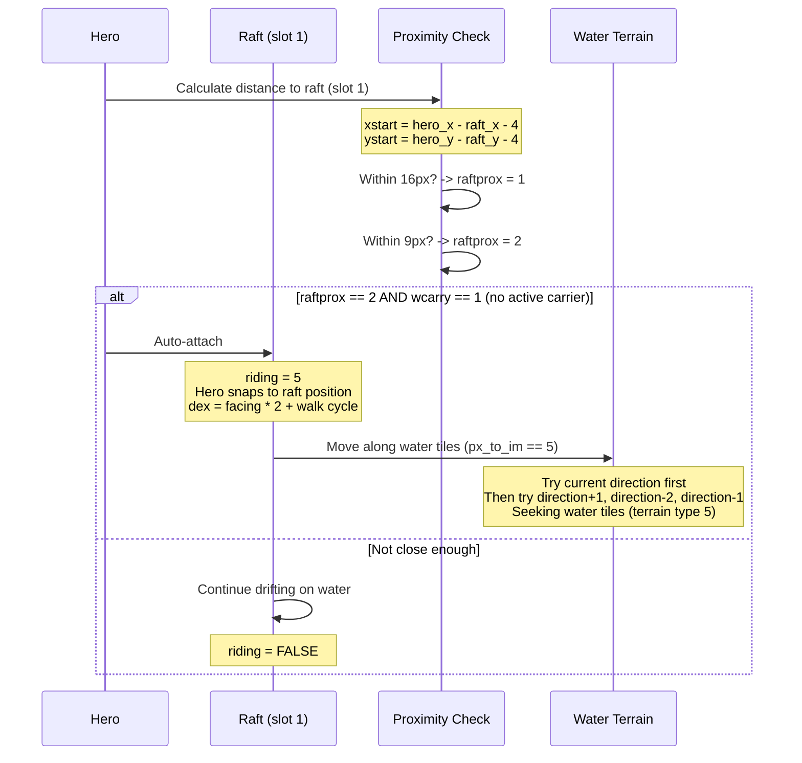
```mermaid
sequenceDiagram
    participant Hero
    participant Raft as Raft (slot 1)
    participant Prox as Proximity Check
    participant Water as Water Terrain

    Hero->>Prox: Calculate distance to raft (slot 1)
    Note over Prox: xstart = hero_x - raft_x - 4<br/>ystart = hero_y - raft_y - 4
    Prox->>Prox: Within 16px? -> raftprox = 1
    Prox->>Prox: Within 9px? -> raftprox = 2

    alt raftprox == 2 AND wcarry == 1 (no active carrier)
        Hero->>Raft: Auto-attach
        Note over Raft: riding = 5<br/>Hero snaps to raft position<br/>dex = facing * 2 + walk cycle
        Raft->>Water: Move along water tiles (px_to_im == 5)
        Note over Water: Try current direction first<br/>Then try direction+1, direction-2, direction-1<br/>Seeking water tiles (terrain type 5)
    else Not close enough
        Raft->>Raft: Continue drifting on water
        Note over Raft: riding = FALSE
    end
```

### 13.2 Turtle (actor_file 5, extent index 1)

The turtle spawns via extent zone and can be ridden after obtaining the sea shell by killing snakes near turtle eggs and talking to the turtle.

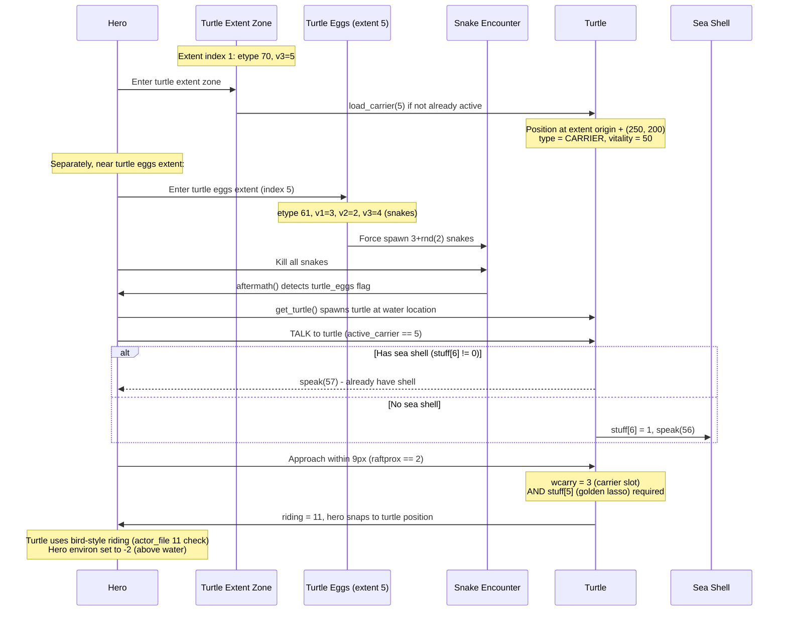
```mermaid
sequenceDiagram
    participant Hero
    participant Extent as Turtle Extent Zone
    participant Eggs as Turtle Eggs (extent 5)
    participant Snakes as Snake Encounter
    participant Turtle
    participant Shell as Sea Shell

    Note over Extent: Extent index 1: etype 70, v3=5
    Hero->>Extent: Enter turtle extent zone
    Extent->>Turtle: load_carrier(5) if not already active
    Note over Turtle: Position at extent origin + (250, 200)<br/>type = CARRIER, vitality = 50

    Note over Hero: Separately, near turtle eggs extent:
    Hero->>Eggs: Enter turtle eggs extent (index 5)
    Note over Eggs: etype 61, v1=3, v2=2, v3=4 (snakes)
    Eggs->>Snakes: Force spawn 3+rnd(2) snakes
    Hero->>Snakes: Kill all snakes
    Snakes->>Hero: aftermath() detects turtle_eggs flag
    Hero->>Turtle: get_turtle() spawns turtle at water location

    Hero->>Turtle: TALK to turtle (active_carrier == 5)
    alt Has sea shell (stuff[6] != 0)
        Turtle-->>Hero: speak(57) - already have shell
    else No sea shell
        Turtle->>Shell: stuff[6] = 1, speak(56)
    end

    Hero->>Turtle: Approach within 9px (raftprox == 2)
    Note over Turtle: wcarry = 3 (carrier slot)<br/>AND stuff[5] (golden lasso) required
    Turtle->>Hero: riding = 11, hero snaps to turtle position
    Note over Hero: Turtle uses bird-style riding (actor_file 11 check)<br/>Hero environ set to -2 (above water)
```

### 13.3 Bird / Swan (actor_file 11, extent index 0)

The bird is the primary flying carrier. After defeating the witch and obtaining the golden lasso, the hero can ride it across the map.

```mermaid
sequenceDiagram
    participant Hero
    participant Extent as Bird Extent Zone
    participant Bird as Bird/Swan (slot 3)
    participant Physics as Velocity Physics

    Note over Extent: Extent index 0: (2118,27237)-(2618,27637)<br/>etype 70, v3=11
    Hero->>Extent: Enter bird extent zone
    Extent->>Bird: load_carrier(11)
    Note over Bird: type = CARRIER, vitality = 50<br/>Position at extent origin + (250, 200)

    Hero->>Bird: Approach within 9px (raftprox == 2)
    Note over Hero: Requires: wcarry == 3 (carrier active)<br/>AND stuff[5] (golden lasso)
    Bird->>Hero: riding = 11
    Note over Hero: Hero snaps to bird position<br/>anim_list[0].environ = -2 (airborne)

    loop Each tick while riding == 11
        Hero->>Physics: Joystick input -> dif_x, dif_y
        alt fiery_death zone active
            Physics-->>Hero: event(32) - cannot fly here
        else Low velocity (|dif_x| < 15 AND |dif_y| < 15)
            Physics->>Physics: Check dismount: proxcheck at hero_y - 14
            alt Clear ground below
                Physics->>Hero: riding = 0, hero_y adjusted
                Note over Hero: Dismount successful
            else Blocked
                Physics-->>Hero: Cannot dismount here
            end
        else Normal flight
            Physics-->>Hero: event(33) - flying message
        end
    end
```

### 13.4 Dragon (actor_file 10, extent index 2)

The dragon is a hostile carrier that attacks with fireballs. It cannot be ridden -- it must be fought and killed.

```mermaid
sequenceDiagram
    participant Hero
    participant Extent as Dragon Extent Zone
    participant Dragon as Dragon (slot 3)
    participant Combat as Combat System

    Note over Extent: Extent index 2: (6749,34951)-(7249,35351)<br/>etype 70, v3=10
    Hero->>Extent: Enter dragon extent zone
    Extent->>Dragon: load_carrier(10)
    Note over Dragon: type = DRAGON (not CARRIER)<br/>vitality = 50<br/>Position at extent origin + (250, 200)

    loop Battle
        Dragon->>Combat: Fireballs (missile attacks)
        Note over Combat: Dragon immune to pushback<br/>(dohit skips move_figure for DRAGON type)
        Hero->>Combat: Melee and missile attacks against dragon
        Combat->>Dragon: Subtract damage from vitality
    end

    Combat->>Dragon: checkdead() when vitality reaches 0
    Note over Dragon: Dragon enters DYING state<br/>brave++ for hero
```

---

## 14. Special Event Diagrams

### 14.1 Stone Ring Teleport

The Blue Stone (item 9) activates teleportation at stone ring locations. There are 11 stone rings mapped in `stone_list[]`. The hero's facing direction selects the destination ring.

**Source:** `fmain.c:3327-3347`, `fmain.c:374-376`

```mermaid
stateDiagram-v2
    [*] --> Check_Sector: USE Blue Stone
    Check_Sector --> Not_At_Ring: hero_sector != 144
    Check_Sector --> Check_Center: hero_sector == 144

    Check_Center --> Not_Centered: Position not at center tile
    Check_Center --> Find_Ring: (hero_x & 255)/85 == 1<br/>AND (hero_y & 255)/64 == 1

    Not_At_Ring --> [*]: Return without decrementing use count
    Not_Centered --> [*]: Return without decrementing use count

    Find_Ring --> Scan_List: Scan stone_list[0..10]
    Scan_List --> No_Match: Hero coords not in any ring
    Scan_List --> Match_Found: stone_list[i*2] == hero_x>>8<br/>AND stone_list[i*2+1] == hero_y>>8

    No_Match --> [*]: No teleport

    Match_Found --> Calculate_Dest: dest = i + facing + 1
    Calculate_Dest --> Wrap_Index: if dest > 10 then dest -= 11
    Wrap_Index --> Build_Coords: x = stone_list[dest*2] shl 8 + (hero_x AND 255)
    Build_Coords --> Colorplay: colorplay() visual effect
    Colorplay --> Teleport: xfer(x, y, TRUE)
    Teleport --> Check_Riding: Carrier riding?
    Check_Riding --> Move_Carrier: Yes carrier snaps to hero
    Check_Riding --> Done: No
    Move_Carrier --> Done
    Done --> [*]: Decrement Blue Stone use count
```

### 14.2 Astral Plane Entry

The stargate door transitions the hero to region 9 (the astral plane), where Loraii enemies constantly replenish.

**Source:** `fmain.c:254-255` (doorlist entries), `fmain.c:353` (extent)

```mermaid
stateDiagram-v2
    [*] --> Stargate_Door: Hero on stargate tile<br/>(0x2960, 0x8760)
    Stargate_Door --> Binary_Search: Door type = STAIR, secs=1
    Binary_Search --> Calc_Dest: xc2 = 0x2B00, yc2 = 0x92C0
    Calc_Dest --> Set_Region: new_region = 8 (secs == 1)
    Set_Region --> Xfer_Call: xfer(xtest, ytest, FALSE)
    Xfer_Call --> Load_Region: load_all() + gen_mini()
    Load_Region --> Find_Place: find_place(2)
    Find_Place --> Astral_Extent: Enter extent (0x2400,0x8200)-(0x3100,0x8A00)
    Astral_Extent --> Spawn_Loraii: etype=52, encounter_type=8 (Loraii)
    Spawn_Loraii --> Continuous_Combat: Loraii replenish (v1=3, v2=1)
    Continuous_Combat --> Return_Gate: Hero finds return stargate
    Return_Gate --> Reverse_Door: (0x2B00,0x92C0) -> (0x2960,0x8780)
    Reverse_Door --> Outdoor: xfer to outdoor, secs=2 -> new_region=9
    Outdoor --> [*]
```

### 14.3 Graveyard (extent 7)

**Source:** `fmain.c:347` -- extent `(19596,17123)-(19974,17401)`, etype 48, v1=8, v2=8, v3=2 (wraith)

```mermaid
stateDiagram-v2
    [*] --> Enter_Graveyard: Hero enters graveyard extent zone
    Enter_Graveyard --> Set_Xtype: xtype = 48
    Set_Xtype --> Danger_Calc: danger_level = 2 + 48 = 50
    Danger_Calc --> High_Spawn_Rate: rand64() <= 50 (78% chance)
    High_Spawn_Rate --> Spawn_Wraiths: encounter_type forced to 2 (wraith)<br/>encounter_number = 8 + rnd(8)
    Spawn_Wraiths --> Battle_Wraiths: Wraiths: 16 HP, arms=6,<br/>cleverness=1, treasure=4
    Battle_Wraiths --> Aftermath_Check: aftermath() on battle end
    Aftermath_Check --> More_Wraiths: Spawn continues while in zone
    More_Wraiths --> Battle_Wraiths
    Aftermath_Check --> Exit_Zone: Hero leaves extent
    Exit_Zone --> [*]
```

### 14.4 Spider Pit (extents 3, 17, 18)

**Source:** `fmain.c:342,362,364` -- multiple spider extent zones, etype 53/8, v3=6 (spider)

```mermaid
stateDiagram-v2
    [*] --> Enter_Spider_Zone: Hero enters spider extent
    Enter_Spider_Zone --> Check_Etype: etype = 53 or 8?

    Check_Etype --> Forced_Spawn: etype 53 (spider pit)
    Forced_Spawn --> Set_Encounter: encounter_type = 6 (spider)<br/>mixflag = 0, wt = 0
    Set_Encounter --> Load_Immediate: load_actors() + prep(ENEMY)<br/>actors_loading = FALSE (instant)
    Load_Immediate --> Place_4_Spiders: encounter_number = v1 (4)
    Place_4_Spiders --> Battle_Spiders: Spiders: 10 HP, arms=6,<br/>cleverness=1

    Check_Etype --> Normal_Spawn: etype 8 (spider region)
    Normal_Spawn --> Danger_Check: danger_level = 2 + 8 = 10
    Danger_Check --> Roll_Encounter: Standard encounter roll
    Roll_Encounter --> Spider_Battle: Spiders spawn normally

    Battle_Spiders --> [*]
    Spider_Battle --> [*]
```

### 14.5 Hidden Valley (extent 15)

**Source:** `fmain.c:360` -- `(21405,25583)-(21827,26028)`, etype 60, v1=1, v2=1, v3=7 (dark knight)

```mermaid
stateDiagram-v2
    [*] --> Enter_Valley: Hero enters hidden valley extent
    Enter_Valley --> Special_Figure: etype = 60 (special figure)
    Special_Figure --> Check_Presence: anim_list[3].race != 7 or anix < 4?
    Check_Presence --> Force_DKnight: Yes spawn dark knight
    Force_DKnight --> Set_Position: Fixed position (21635, 25762)
    Set_Position --> DKnight_Stats: Dark Knight: 40 HP, arms=7,<br/>cleverness=1, race=7
    DKnight_Stats --> Special_Behavior: thresh = 16 (extended melee range)<br/>State = STILL, facing = 5<br/>Does not pursue, stands ground
    Special_Behavior --> Battle: Hero engages dark knight
    Battle --> Victory: speak(42) on death
    Check_Presence --> Already_Present: No already spawned
    Already_Present --> [*]
    Victory --> [*]
```

### 14.6 Fiery Death Zone

**Source:** `fmain.c:1384-1385`, `fmain.c:1843-1848`

```mermaid
stateDiagram-v2
    [*] --> Check_Bounds: Every tick check map coordinates
    Check_Bounds --> Not_Fiery: map_x <= 8802 OR map_x >= 13562<br/>OR map_y <= 24744 OR map_y >= 29544
    Check_Bounds --> Fiery_Active: map_x 8802 to 13562<br/>AND map_y 24744 to 29544

    Not_Fiery --> [*]
    Fiery_Active --> Check_Each_Actor: For each actor i=0..anix

    Check_Each_Actor --> Hero_Check: i == 0 (hero)
    Check_Each_Actor --> NPC_Check: i > 0 (enemy/NPC)

    Hero_Check --> Has_Fruit: stuff[23] (fruit) > 0?
    Has_Fruit --> Immune: Yes environ forced to 0
    Has_Fruit --> Apply_Damage: No check environ level

    NPC_Check --> Apply_Damage

    Apply_Damage --> Instant_Death: environ > 15
    Apply_Damage --> Gradual_Damage: environ > 2
    Apply_Damage --> Safe_For_Now: environ <= 2

    Instant_Death --> Set_Zero_HP: vitality = 0
    Set_Zero_HP --> Check_Dead: checkdead(i, 27)
    Gradual_Damage --> Lose_1_HP: vitality-- each tick
    Lose_1_HP --> Check_Dead
    Safe_For_Now --> [*]

    Immune --> [*]
    Check_Dead --> [*]
```

---

## 15. Day/Night Cycle and Shopping

### 15.1 Day/Night Cycle

The `daynight` counter runs from 0 to 23999 (one full day). The `lightlevel` is computed from `daynight` to create a parabolic brightness curve. Period changes trigger atmospheric event messages.

**Source:** `fmain.c:2011-2039`, `fmain.c:1867-1889`

```mermaid
sequenceDiagram
    participant Timer as daynight Counter
    participant Light as Light System
    participant Period as Period Events
    participant Sleep as Sleep System
    participant Regen as Health Regen

    Note over Timer: daynight increments each tick<br/>Wraps at 24000 -> 0<br/>Skipped during freeze_timer

    Timer->>Light: lightlevel = daynight / 40
    Light->>Light: if lightlevel >= 300: lightlevel = 600 - lightlevel
    Note over Light: Creates parabolic curve:<br/>Dawn/dusk = low light<br/>Midday = peak light (300)<br/>Night = near 0
    Light->>Light: if lightlevel < 40: torches visible (ob_stat=3)
    Light->>Light: day_fade() adjusts palette colors

    Timer->>Period: period = daynight / 2000
    Note over Period: 0-11 periods in a full day
    alt period changed from previous
        Period-->>Period: period 0: event(28) - midnight message
        Period-->>Period: period 4: event(29) - dawn message
        Period-->>Period: period 6: event(30) - midday message
        Period-->>Period: period 9: event(31) - dusk message
    end

    Note over Regen: Every 1024 ticks (daynight & 0x3FF == 0)
    Timer->>Regen: Check health regen
    Regen->>Regen: if vitality < max (15 + brave/4) AND hero alive
    Regen-->>Regen: vitality++

    Note over Sleep: Indoor bed detection (region == 8)
    Sleep->>Sleep: Check tile at hero position
    Note over Sleep: Bed tiles: 161, 52, 162, 53
    Sleep->>Sleep: Hero standing still on bed?
    Sleep->>Sleep: sleepwait++ each tick on bed
    alt sleepwait reaches 30
        alt fatigue < 50
            Sleep-->>Sleep: event(25) - "not tired enough"
        else fatigue >= 50
            Sleep->>Sleep: event(26) - hero falls asleep
            Sleep->>Sleep: state = SLEEP
            Note over Sleep: While SLEEP state:<br/>daynight += 63 per tick (fast forward)<br/>fatigue-- each tick
        end
    end

    Note over Sleep: Wake conditions (any triggers wake)
    Sleep->>Sleep: fatigue reaches 0
    Sleep->>Sleep: fatigue < 30 AND daynight in 9000-10000 (morning)
    Sleep->>Sleep: battleflag AND rand64() == 0 (combat interruption)
    Sleep-->>Sleep: state = STILL, hero_y aligned to grid
```

### 15.2 Shopping System

The BUY menu is available when near a bartender (race 0x88). Items and prices are defined in the `jtrans[]` table as pairs of (item_index, cost).

**Source:** `fmain.c:3424-3443`, `fmain2.c:850`

```mermaid
sequenceDiagram
    participant Hero
    participant Menu as BUY Menu
    participant Bartender as Bartender (race 0x88)
    participant Inventory as Inventory System

    Hero->>Bartender: Enter tavern, approach bartender
    Note over Bartender: nearest_person must be set<br/>anim_list[nearest].race == 0x88

    Hero->>Menu: Select BUY action
    Note over Menu: Menu items (hit values 5-11):<br/>5: Food - 3 gold (item 0)<br/>6: Arrows x10 - 10 gold (item 8)<br/>7: Vial - 15 gold (item 11)<br/>8: Mace - 30 gold (item 1)<br/>9: Sword - 45 gold (item 2)<br/>10: Bow - 75 gold (item 3)<br/>11: Totem - 20 gold (item 13)

    Menu->>Menu: hit = (menu_selection - 5) * 2
    Menu->>Menu: item = jtrans[hit], cost = jtrans[hit+1]

    alt wealth > cost
        Menu->>Inventory: wealth -= cost
        alt item == 0 (Food)
            Inventory->>Inventory: event(22), eat(50)
            Note over Inventory: Reduces hunger by 50
        else item == 8 (Arrows)
            Inventory->>Inventory: stuff[8] += 10, event(23)
            Note over Inventory: Adds 10 arrows to quiver
        else Other items
            Inventory->>Inventory: stuff[item]++
            Inventory-->>Hero: "Hero bought a [item name]."
        end
    else wealth <= cost
        Menu-->>Hero: "Not enough money!"
    end
```

### Buy Menu Price Table

Derived from `jtrans[] = { 0,3, 8,10, 11,15, 1,30, 2,45, 3,75, 13,20 }`:

| Menu Slot | Item Index | Item Name | Cost (gold) | Effect |
|-----------|-----------|-----------|-------------|--------|
| 5 | 0 | Food | 3 | eat(50) -- reduces hunger by 50 |
| 6 | 8 | Arrows | 10 | stuff[8] += 10 (adds 10 arrows) |
| 7 | 11 | Glass Vial | 15 | stuff[11]++ (magic item) |
| 8 | 1 | Mace | 30 | stuff[1]++ (weapon upgrade) |
| 9 | 2 | Sword | 45 | stuff[2]++ (weapon upgrade) |
| 10 | 3 | Bow | 75 | stuff[3]++ (ranged weapon) |
| 11 | 13 | Bird Totem | 20 | stuff[13]++ (magic item) |

---

## 16. Encounter Type Reference

From `encounter_chart[]` (`fmain.c:52-63`):

| Type | Name | HP | Aggressive | Arms | Cleverness | Treasure | Sprite File |
|------|------|----|-----------|------|------------|----------|-------------|
| 0 | Ogre | 18 | Yes | 2 | 0 | 2 | 6 |
| 1 | Orcs | 12 | Yes | 4 | 1 | 1 | 6 |
| 2 | Wraith | 16 | Yes | 6 | 1 | 4 | 7 |
| 3 | Skeleton | 8 | Yes | 3 | 0 | 3 | 7 |
| 4 | Snake | 16 | Yes | 6 | 1 | 0 | 8 |
| 5 | Salamander | 9 | Yes | 3 | 0 | 0 | 7 |
| 6 | Spider | 10 | Yes | 6 | 1 | 0 | 8 |
| 7 | Dark Knight | 40 | Yes | 7 | 1 | 0 | 8 |
| 8 | Loraii | 12 | Yes | 6 | 1 | 0 | 9 |
| 9 | Necromancer | 50 | Yes | 5 | 0 | 0 | 9 |
| 10 | Woodcutter | 4 | No | 0 | 0 | 0 | 9 |

## 17. Extent Zone Reference

From `extent_list[]` (`fmain.c:338-369`):

| Index | Name | Coordinates | etype | v1 | v2 | v3 | Behavior |
|-------|------|-------------|-------|----|----|----|----|
| 0 | Bird | (2118,27237)-(2618,27637) | 70 | 0 | 1 | 11 | Carrier spawn |
| 1 | Turtle | (0,0)-(0,0) | 70 | 0 | 1 | 5 | Carrier spawn (dynamically placed) |
| 2 | Dragon | (6749,34951)-(7249,35351) | 70 | 0 | 1 | 10 | Hostile carrier spawn |
| 3 | Spider Pit | (4063,34819)-(4909,35125) | 53 | 4 | 1 | 6 | Forced spider encounter |
| 4 | Necromancer | (9563,33883)-(10144,34462) | 60 | 1 | 1 | 9 | Special figure |
| 5 | Turtle Eggs | (22945,5597)-(23225,5747) | 61 | 3 | 2 | 4 | Forced snake encounter |
| 6 | Princess | (10820,35646)-(10877,35670) | 83 | 1 | 1 | 0 | Rescue trigger |
| 7 | Graveyard | (19596,17123)-(19974,17401) | 48 | 8 | 8 | 2 | Dense wraith spawns |
| 8 | City Area | (19400,17034)-(20240,17484) | 80 | 4 | 20 | 0 | Peace zone |
| 9 | Astral Plane | (0x2400,0x8200)-(0x3100,0x8A00) | 52 | 3 | 1 | 8 | Loraii arena |
| 15 | Hidden Valley | (21405,25583)-(21827,26028) | 60 | 1 | 1 | 7 | Dark knight encounter |
| 16 | Swamp Region | (6156,12755)-(12316,15905) | 7 | 1 | 8 | 0 | Swamp encounters |
| 17-18 | Spider Regions | Various | 8 | 1 | 8 | 0 | Spider encounters |
| 22 | Whole World | (0,0)-(0x7FFF,0x9FFF) | 3 | 1 | 8 | 0 | Default fallback |
