# AI System — Logic Spec

> Fidelity: behavioral  |  Source files: fmain.c, ftale.h
> Cross-refs: [RESEARCH §9](../RESEARCH.md#9-combat-system), [_discovery/ai-system.md](../_discovery/ai-system.md)

## Overview

Every hostile, companion, or carrier NPC carries a goal (`actor.goal`, one of
the `GOAL_*` values in [SYMBOLS.md §2.2](SYMBOLS.md#22-goal-modes-ftaleh27-37))
and a sub-goal tactic (`actor.tactic`, one of the `TACTIC_*` values in
[§2.5](SYMBOLS.md#25-tactical-modes-fmainc122-132-ftaleh39-50)). The per-tick
AI loop at `fmain.c:2109-2184` walks `anim_list[2..anix-1]` and drives each
actor through `advance_goal`, the state machine documented below.

Three transitions happen **outside** `advance_goal` itself:

- **Spawn** — `fmain.c:2761-2762` sets `actor.goal = ATTACK1 + encounter_chart[race].cleverness` for melee spawns, or `ARCHER1 + cleverness` for bow-wielders (weapon bit 2 set). So a race's `cleverness` column (0 or 1) picks between the stupid/clever pair.
- **Death** — `checkdead()` at `fmain.c:2774` sets `actor.goal = DEATH; actor.state = DYING` when `actor.vitality < 1` and the actor isn't already dying.
- **Player init** — `revive()` at `fmain.c:2831` sets `anim_list[0].goal = USER`.

Two concerns the caller handles and `advance_goal` does not:

- The on-screen sentinel pair (`actors_on_screen`, `battleflag`) is updated during the same per-actor pass at `fmain.c:2127-2131`; it drives music (`setmood`) rather than the goal FSM.
- After every iteration the caller does `if (leader == 0) leader = i;` at `fmain.c:2183`, claiming the first surviving enemy as "leader" so later iterations take the FOLLOWER branch when the hero is down.

## Symbols

No new locals are declared in this file beyond the per-function bindings shown
in each pseudo block. All other identifiers resolve in
[SYMBOLS.md](SYMBOLS.md).

## advance_goal

Source: `fmain.c:2114-2183`
Called by: `entry point`
Calls: `set_course`, `do_tactic`, `fire_aimed_shot`, `enter_melee`, `stand_guard`, `stop_motion`, `TABLE:encounter_chart`

```pseudo
def advance_goal(actor: Shape) -> None:
    """One tick of the goal FSM for a single non-hero actor (anim_list[2..anix-1])."""
    # fmain.c:2114-2118 — carriers drift toward hero once per 16 ticks, then bypass FSM
    if actor.type == CARRIER:
        if (daynight & 15) == 0:                                # fmain.c:2115, 15 = low-4-bit tick mask
            set_course(actor, hero_x, hero_y, 5)                # fmain.c:2116 — course mode 5 = carrier glide
        return
    if actor.type == SETFIG:                                    # fmain.c:2119 — stationary figures never move
        return

    mode = actor.goal                                           # fmain.c:2120
    tactic = actor.tactic                                       # fmain.c:2121

    # fmain.c:2123-2126 — unsigned Manhattan distance to hero
    xd = abs(actor.abs_x - hero_x)
    yd = abs(actor.abs_y - hero_y)

    r = chance(1, 16)                                           # fmain.c:2132 — !bitrand(15) is 1/16

    # --- Forced mode overrides -----------------------------------------------
    if player.state == STATE_DEAD or player.state == STATE_FALL:
        # fmain.c:2133-2136 — hero is down; first surviving enemy takes FLEE, rest become FOLLOWER
        if leader == 0:
            mode = GOAL_FLEE
        else:
            mode = GOAL_FOLLOWER
    elif actor.vitality < 2 or (xtype > 59 and actor.race != extn.v3):   # fmain.c:2138-2139, 59 = last normal xtype
        # fmain.c:2140 — low-HP flee; in special encounters (xtype > 59) only off-target races flee
        mode = GOAL_FLEE

    # --- Tactic-dispatch body ------------------------------------------------
    if tactic == TACTIC_FRUST or tactic == TACTIC_SHOOTFRUST:
        # fmain.c:2141-2144 — stuck; pick a random fallback tactic (bow = 2..5, melee = 3..4)
        if (actor.weapon & 4) != 0:                             # fmain.c:2142, weapon bit 2 = bow
            do_tactic(actor, rand(2, 5))                        # fmain.c:2142 — rand4()+2
        else:
            do_tactic(actor, rand(3, 4))                        # fmain.c:2143 — rand2()+3
    elif actor.state == STATE_SHOOT1:
        fire_aimed_shot(actor)                                  # fmain.c:2145 — SHOOT1 → SHOOT3 release
    elif mode <= GOAL_ARCHER2:
        # fmain.c:2146-2171 — hostile (melee or archer)
        if (mode & 2) == 0:                                     # fmain.c:2148 — bit-1-clear variants re-plan more often
            r = chance(1, 4)                                    # fmain.c:2148 — !rand4() is 1/4
        if r:
            # fmain.c:2149-2161 — choose a tactic
            if actor.race == 4 and turtle_eggs:                 # fmain.c:2150, race 4 = snake
                tactic = TACTIC_EGG_SEEK
            elif actor.weapon < 1:
                # fmain.c:2151-2152 — disarmed: panic
                mode = GOAL_CONFUSED
                tactic = TACTIC_RANDOM
            elif actor.vitality < 6 and rand(0, 1) != 0:        # fmain.c:2153, 6 = wounded-flee threshold
                tactic = TACTIC_EVADE
            elif mode >= GOAL_ARCHER1:
                # fmain.c:2155-2159 — archer range bands
                if xd < 40 and yd < 30:                         # fmain.c:2156 — 40/30 = too-close box (backup)
                    tactic = TACTIC_BACKUP
                elif xd < 70 and yd < 70:                       # fmain.c:2157 — 70/70 = ideal shot range
                    tactic = TACTIC_SHOOT
                else:
                    tactic = TACTIC_PURSUE                      # fmain.c:2158
            else:
                tactic = TACTIC_PURSUE                          # fmain.c:2160
        # fmain.c:2162-2170 — execute tactic, with a melee-range shortcut for non-bow hostiles
        thresh = 14 - mode                                      # fmain.c:2162, 14 = base melee reach in px (shrinks with clever modes)
        if actor.race == 7:                                     # fmain.c:2163, race 7 = dark knight
            thresh = 16                                         # fmain.c:2163 — dark knight has longer reach
        if (actor.weapon & 4) == 0 and xd < thresh and yd < thresh:  # fmain.c:2164, weapon bit 2 = bow
            # fmain.c:2164-2167 — inside melee range with a non-bow weapon
            set_course(actor, hero_x, hero_y, 0)                # fmain.c:2165
            enter_melee(actor)                                  # fmain.c:2166 — if state >= WALKING then state = FIGHTING
        elif actor.race == 7 and actor.vitality != 0:           # fmain.c:2168, race 7 = dark knight
            # fmain.c:2168-2169 — living dark knight outside reach: stand guard, face south
            stand_guard(actor)                                  # fmain.c:2169 — state = STILL, facing = DIR_S
        else:
            do_tactic(actor, tactic)                            # fmain.c:2170
    elif mode == GOAL_FLEE:
        do_tactic(actor, TACTIC_BACKUP)                         # fmain.c:2172
    elif mode == GOAL_FOLLOWER:
        do_tactic(actor, TACTIC_FOLLOW)                         # fmain.c:2173
    elif mode == GOAL_STAND:
        # fmain.c:2174-2177 — turn to face hero and freeze
        set_course(actor, hero_x, hero_y, 0)                    # fmain.c:2175
        stop_motion(actor)                                      # fmain.c:2176 — state = STILL
    elif mode == GOAL_WAIT:
        stop_motion(actor)                                      # fmain.c:2178 — state = STILL
    # GOAL_DEATH, GOAL_USER, and GOAL_CONFUSED fall through; the write-back below reasserts mode unchanged.

    actor.goal = mode                                           # fmain.c:2182 — persist mode transitions
```

### Mermaid

The diagram below shows every goal transition observed in the codebase, not
just those mutated by `advance_goal`. External transitions (spawn, death,
player init) are annotated with their source location. Transitions internal to
`advance_goal` have no file annotation; they all live in `fmain.c:2133-2140`.

```mermaid
stateDiagram-v2
    [*] --> GOAL_USER: revive() fmain.c:2831
    [*] --> GOAL_ATTACK1: spawn cleverness=0 fmain.c:2762
    [*] --> GOAL_ATTACK2: spawn cleverness=1 fmain.c:2762
    [*] --> GOAL_ARCHER1: spawn bow, cleverness=0 fmain.c:2761
    [*] --> GOAL_ARCHER2: spawn bow, cleverness=1 fmain.c:2761

    GOAL_ATTACK1 --> GOAL_CONFUSED: weapon lost (fmain.c:2151)
    GOAL_ATTACK2 --> GOAL_CONFUSED: weapon lost
    GOAL_ARCHER1 --> GOAL_CONFUSED: weapon lost
    GOAL_ARCHER2 --> GOAL_CONFUSED: weapon lost

    GOAL_ATTACK1 --> GOAL_FLEE: vitality<2 or xtype mismatch
    GOAL_ATTACK2 --> GOAL_FLEE: vitality<2 or xtype mismatch
    GOAL_ARCHER1 --> GOAL_FLEE: vitality<2 or xtype mismatch
    GOAL_ARCHER2 --> GOAL_FLEE: vitality<2 or xtype mismatch
    GOAL_CONFUSED --> GOAL_FLEE: vitality<2
    GOAL_STAND    --> GOAL_FLEE: vitality<2
    GOAL_WAIT     --> GOAL_FLEE: vitality<2

    GOAL_ATTACK1 --> GOAL_FLEE: hero DEAD/FALL and leader==0
    GOAL_ATTACK2 --> GOAL_FLEE: hero DEAD/FALL and leader==0
    GOAL_ARCHER1 --> GOAL_FLEE: hero DEAD/FALL and leader==0
    GOAL_ARCHER2 --> GOAL_FLEE: hero DEAD/FALL and leader==0
    GOAL_CONFUSED --> GOAL_FLEE: hero DEAD/FALL and leader==0

    GOAL_ATTACK1 --> GOAL_FOLLOWER: hero DEAD/FALL and leader!=0
    GOAL_ATTACK2 --> GOAL_FOLLOWER: hero DEAD/FALL and leader!=0
    GOAL_ARCHER1 --> GOAL_FOLLOWER: hero DEAD/FALL and leader!=0
    GOAL_ARCHER2 --> GOAL_FOLLOWER: hero DEAD/FALL and leader!=0
    GOAL_CONFUSED --> GOAL_FOLLOWER: hero DEAD/FALL and leader!=0

    GOAL_USER     --> GOAL_DEATH: vitality<1 fmain.c:2774
    GOAL_ATTACK1  --> GOAL_DEATH: vitality<1 fmain.c:2774
    GOAL_ATTACK2  --> GOAL_DEATH: vitality<1 fmain.c:2774
    GOAL_ARCHER1  --> GOAL_DEATH: vitality<1 fmain.c:2774
    GOAL_ARCHER2  --> GOAL_DEATH: vitality<1 fmain.c:2774
    GOAL_FLEE     --> GOAL_DEATH: vitality<1 fmain.c:2774
    GOAL_STAND    --> GOAL_DEATH: vitality<1 fmain.c:2774
    GOAL_WAIT     --> GOAL_DEATH: vitality<1 fmain.c:2774
    GOAL_FOLLOWER --> GOAL_DEATH: vitality<1 fmain.c:2774
    GOAL_CONFUSED --> GOAL_DEATH: vitality<1 fmain.c:2774
    GOAL_DEATH    --> [*]
```



## Notes

- **Write-back semantics.** `actor.goal` is assigned exactly once per tick, at `fmain.c:2182`. The `mode` local accumulates overrides (hero-down, low-HP flee, disarmed-panic) before the final write, so a single tick can collapse several logical transitions into one observable goal change.
- **Tactic vs. goal.** `advance_goal` both reads and writes `tactic` through helpers (`do_tactic`, `fire_aimed_shot`, `enter_melee`, `stand_guard`, `stop_motion`). Tactic semantics and the full `do_tactic` dispatch are out of scope for this file and will be documented in `tactics.md` (Wave 3).
- **Clever vs. stupid bit test.** The `(mode & 2) == 0` check at `fmain.c:2148` clumps `ATTACK1` (1) and `ARCHER2` (4) into a "re-plan every 1/4 ticks" bucket, and `ATTACK2` (2) and `ARCHER1` (3) into a "re-plan every 1/16 ticks" bucket. This does not align with the cleverness column of TABLE:encounter_chart — the named "clever" variants are `ATTACK2` / `ARCHER2`. Whether the `ARCHER2` pairing is an intentional design choice or an off-by-one in the original source is flagged in [PROBLEMS.md](../PROBLEMS.md).
- **Carrier tick cadence.** The `(daynight & 15) == 0` gate at `fmain.c:2115` fires every 16 game ticks. On older carriers this produces a visibly jittery approach; see RESEARCH §9 for cadence details.
