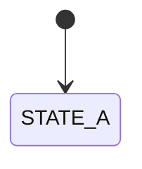
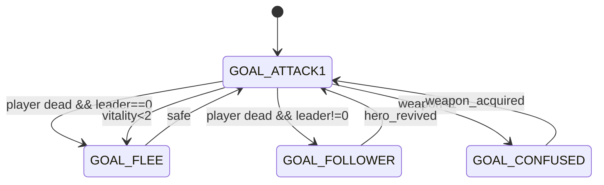

# Logic Documentation Tier — Implementation Plan

> **For agentic workers:** REQUIRED SUB-SKILL: Use superpowers:subagent-driven-development (recommended) or superpowers:executing-plans to implement this plan task-by-task. Steps use checkbox (`- [ ]`) syntax for tracking.

**Goal:** Stand up the `docs/logic/` documentation tier — a strict, linter-backed pseudo-code layer — and deliver two worked examples (menu dispatch + NPC goal FSM) that stress-test the format.

**Architecture:** A single-file Python linter (`tools/lint_logic.py`) parses fenced ` ```pseudo ` blocks inside Markdown files under `docs/logic/`, applying 12 checks across structure, AST shape, symbol resolution, and cross-refs. A normative style guide (`STYLE.md`), a global symbol registry (`SYMBOLS.md`), and an index (`README.md`) govern author conventions. Two authored subsystem docs (`menu-system.md`, `ai-system.md`) validate the format against real discovery data. All work happens on the current `research` branch.

**Tech Stack:** Python 3.11+ (stdlib only: `ast`, `re`, `pathlib`, `argparse`, `json`), pytest for linter tests, Markdown + Mermaid for docs. Shares `tools/run.sh` venv setup and citation-resolution patterns with existing `validate_citations.py`.

**Reference spec:** [docs/superpowers/specs/2026-04-20-logic-docs-design.md](../specs/2026-04-20-logic-docs-design.md)

---

## File Structure

### New files (Wave 0 — Foundations)

- `docs/logic/STYLE.md` — normative grammar spec (copied/adapted from spec §3, §4).
- `docs/logic/SYMBOLS.md` — global symbol registry (structs, enums, constants, tables).
- `docs/logic/README.md` — index + reading order.
- `tools/lint_logic.py` — linter CLI (~600 LoC, single file, stdlib-only).
- `tools/tests/__init__.py` — empty package marker.
- `tools/tests/test_lint_logic.py` — pytest suite for linter checks.
- `tools/tests/fixtures/` — sample Markdown inputs for tests.
- `tools/results/lint_logic.txt` — first successful run artifact.

### New files (Wave 1 — Worked examples)

- `docs/logic/menu-system.md` — event-dispatch example.
- `docs/logic/ai-system.md` — state-machine example with Mermaid companion.

### Modified files

- `tools/requirements.txt` — add `pytest`.
- `tools/README.md` — add `lint_logic.py` to Quick Start and naming table.
- `.github/copilot-instructions.md` — append anti-drift rules + `docs/logic/` pointer.
- `docs/RESEARCH.md` — cross-link from menu + AI sections to the new logic docs (light touch; no rewrites).

### Rationale for single-file linter

The existing `tools/` pattern is single-file scripts (see `validate_citations.py`, `decode_map_data.py`). A single `lint_logic.py` is consistent and small enough to hold in context. The 12 checks are isolated functions within the file; tests exercise them individually.

---

## Task 1: Directory scaffold + STYLE.md

**Files:**
- Create: `docs/logic/STYLE.md`
- Create: `docs/logic/.gitkeep` (only if needed — directory must exist before other files land)

- [ ] **Step 1: Create the logic directory and STYLE.md**

Create `docs/logic/STYLE.md` with this content verbatim:

```markdown
# Logic Documentation Style Guide (Normative)

This document is the normative grammar for pseudo-code blocks under `docs/logic/`. Every ` ```pseudo ` fenced block must conform. The linter (`tools/lint_logic.py`) enforces this grammar.

See the design spec at [`../superpowers/specs/2026-04-20-logic-docs-design.md`](../superpowers/specs/2026-04-20-logic-docs-design.md) for rationale.

## 1. Per-file structure

Every logic doc MUST begin with:

​```markdown
# <Subsystem Name> — Logic Spec

> Fidelity: behavioral  |  Source files: fmain.c, fmain2.c
> Cross-refs: [RESEARCH §N](../RESEARCH.md#section-anchor)

## Overview

(1–2 paragraphs of prose.)

## Symbols

(Locals declared in this file; globals go in SYMBOLS.md.)
​```

Then one H2 per documented function.

## 2. Function header (mandatory, outside the fence)

​```markdown
## function_name

Source: `fmain.c:820-905`
Called by: `handle_menu`
Calls: `draw_menu`, `play_click`, `TABLE:menu_options`

​```pseudo
def function_name(key: KeyCode, state: MenuState) -> MenuAction:
    """One-line purpose."""
    ...
​```
​```

- `Source:` — one or more backticked `file:line` or `file:start-end` citations, comma-separated.
- `Called by:` — function names that call this one, or `entry point` if none. Comma-separated.
- `Calls:` — function names, primitives, or `TABLE:name` references used in the body. Comma-separated, or `none`.
- Return annotation is required. Use `None` for void.
- A one-line docstring is required as the first statement.

## 3. Allowed statements

| Construct | Form |
|---|---|
| Assignment | `x = expr`, compound ops OK |
| Conditional | `if / elif / else` |
| Match | `match x: case LITERAL:` |
| Loop | `for x in iterable:`, `while cond:` with `break`/`continue` |
| Call | `name(args...)` |
| Return | `return expr` / `return` |

## 4. Forbidden constructs

- `try`, `raise`, `with` — use explicit error-state returns.
- Comprehensions (list/set/dict/generator) — be explicit with loops.
- `lambda`, closures.
- `class` — data shapes go in SYMBOLS.md.
- `import`, `from ... import`.
- `global`, `nonlocal` — globals are referenced by name and must be registered in SYMBOLS.md.

## 5. Primitives (the pseudo-code stdlib)

Usable without declaration:

| Primitive | Semantics |
|---|---|
| `rand(lo, hi)` | Uniform int in `[lo, hi]` inclusive |
| `chance(n, d)` | True with probability `n/d` |
| `min(a, b)`, `max(a, b)` | Standard |
| `clamp(x, lo, hi)` | `max(lo, min(x, hi))` |
| `abs(x)`, `sign(x)` | Standard |
| `bit(n)` | `1 << n` — for flag bit positions |
| `wrap_u8(x)`, `wrap_i16(x)`, `wrap_u16(x)` | Explicit wrap; use only when observable |
| `now_ticks()` | Monotonic game tick counter |
| `speak(N)` | Display narr.asm message N |
| `play_sound(id)`, `play_music(id)` | Audio triggers |

## 6. Data types & naming

- **Enums** are UPPER_SNAKE constants in SYMBOLS.md: `DIR_N`, `GOAL_WANDER`, `STATE_WALKING`.
- **Structs** are dataclass-style declarations in SYMBOLS.md: `Shape`, `Missile`, `SaveRecord`.
- **Table refs** use the form `TABLE:name` and must appear in SYMBOLS.md's table registry.
- Field access uses `.`: `actor.vitality`.
- Bitfield flags: named bit constants registered in SYMBOLS.md.

## 7. Numeric literals

Literal integers other than `{-1, 0, 1, 2}` must either:
- Be a named constant declared in SYMBOLS.md, OR
- Carry an inline comment on the same line explaining the meaning, e.g.:

​```pseudo
if actor.vitality < 25:                # fmain.c:1842 — low-HP flee threshold
    actor.goal = GOAL_FLEE
​```

## 8. Inline citations

Any line whose behavior isn't obvious from the function header's source range SHOULD carry an inline `# file.ext:NNN` comment.

## 9. State machines

State-machine functions are written as `match` on the current state variable with one `case` per state. Transitions are explicit assignments (`actor.goal = GOAL_FLEE`). A companion Mermaid `stateDiagram-v2` block MAY follow the function; when present, every `STATE_*` assignment in the pseudo-code MUST appear as a node in the diagram.

## 10. Tick ordering

Where per-frame ordering matters, `docs/logic/game-loop.md` declares the canonical phase sequence. Other docs reference phase numbers (e.g., "runs in phase 3").

## 11. File-level checklist (enforced by linter)

- [ ] File starts with `# <Title> — Logic Spec`.
- [ ] Header block with `> Fidelity:` and `> Cross-refs:` lines.
- [ ] `## Overview` and `## Symbols` sections present.
- [ ] Every `## <Name>` (other than `Overview`/`Symbols`/`Notes`/`Mermaid`) is a function entry with the full header + pseudo block.
- [ ] Every function appears in `docs/logic/README.md` index.
```

- [ ] **Step 2: Commit**

```bash
git add docs/logic/STYLE.md
git commit -m "docs(logic): add STYLE.md grammar spec"
```

---

## Task 2: SYMBOLS.md skeleton

**Files:**
- Create: `docs/logic/SYMBOLS.md`

- [ ] **Step 1: Create SYMBOLS.md with empty registries**

Create `docs/logic/SYMBOLS.md` with this content verbatim:

````markdown
# Symbol Registry (Normative)

Every identifier used in a ` ```pseudo ` block under `docs/logic/` must be resolvable to one of:
- A function argument or local assignment in the same block.
- A function listed in the `Calls:` header of the same function.
- An entry in this registry.
- A built-in primitive from [STYLE.md §5](STYLE.md#5-primitives-the-pseudo-code-stdlib).

Changes to this file are orchestrator-reviewed. Append-mostly.

---

## 1. Constants

```pseudo
# Actor array sizing
MAXSHAPES = 25              # fmain.c:68 — render queue size (not actor array size)
MAX_ACTORS = 20             # fmain.c:70 — anim_list[] length
MAX_MONSTERS = 7            # fmain.c:2064 — concurrent hostile cap
```

## 2. Enums

### 2.1 Directions (`fsubs.asm:*`, see RESEARCH §5.1)

```pseudo
DIR_NW = 0
DIR_N  = 1
DIR_NE = 2
DIR_E  = 3
DIR_SE = 4
DIR_S  = 5
DIR_SW = 6
DIR_W  = 7
```

### 2.2 Goal modes (`ftale.h:27-37`)

```pseudo
GOAL_USER      = 0    # User-controlled
GOAL_ATTACK1   = 1    # Attack (stupid)
GOAL_ATTACK2   = 2    # Attack (clever)
GOAL_ARCHER1   = 3    # Archery (stupid)
GOAL_ARCHER2   = 4    # Archery (clever)
GOAL_FLEE      = 5
GOAL_STAND     = 6
GOAL_DEATH     = 7
GOAL_WAIT      = 8
GOAL_FOLLOWER  = 9
GOAL_CONFUSED  = 10
```

### 2.3 Motion states

```pseudo
# Populated in Wave 3 (see spec §6.4). Placeholder header only.
```

### 2.4 Menu modes (`fmain.c:494`)

```pseudo
CMODE_ITEMS = 0
CMODE_MAGIC = 1
CMODE_TALK  = 2
CMODE_BUY   = 3
CMODE_GAME  = 4
CMODE_SAVEX = 5
CMODE_KEYS  = 6
CMODE_GIVE  = 7
CMODE_USE   = 8
CMODE_FILE  = 9
```

## 3. Bitfield flags

### 3.1 Menu entry `enabled[i]` encoding (`fmain.c:1310-1328`, `fmain.c:512-513`)

```pseudo
MENU_FLAG_SELECTED  = bit(0)    # Highlight / on
MENU_FLAG_VISIBLE   = bit(1)    # Displayed
MENU_ATYPE_MASK     = 0xfc      # Upper 6 bits = action type

# Action type values (upper 6 bits, shifted out):
ATYPE_NAV       = 0     # Top-bar nav (switch cmode if hit<5)
ATYPE_TOGGLE    = 4     # XOR bit 0, then do_option
ATYPE_IMMEDIATE = 8     # Highlight then do_option
ATYPE_ONESHOT   = 12    # Set bit 0, highlight, do_option
```

## 4. Structs

### 4.1 `Shape` — actor record (`ftale.h:56-67`, `ftale.i:5-22`)

```pseudo
struct Shape:
    abs_x: u16          # World X
    abs_y: u16          # World Y
    rel_x: u16          # Screen X
    rel_y: u16          # Screen Y
    type: i8
    race: u8            # Indexes TABLE:encounter_chart
    index: i8           # Animation frame
    visible: i8
    weapon: i8          # 0=none, 1=Dirk, 2=mace, 3=sword, 4=bow, 5=wand
    environ: i8
    goal: i8            # GOAL_* enum
    tactic: i8          # Tactical mode
    state: i8           # Motion state
    facing: i8          # DIR_* enum
    vitality: i16       # HP; observable wrap (negative = dead)
    vel_x: i8
    vel_y: i8
```

### 4.2 `MenuEntry` (derived from `struct menu`, `fmain.c:517-520`)

```pseudo
struct MenuEntry:
    label: str          # 5-char fixed-width label
    enabled: u8         # See §3.1

struct Menu:
    entries: list[MenuEntry]    # Length = num
    num: u8
    color: u8
```

## 5. Globals

```pseudo
player: Shape                       # anim_list[0] (fmain.c:70)
anim_list: list[Shape]              # Length MAX_ACTORS
anix: i16                           # Active monster count
menus: list[Menu]                   # Length 10 (fmain.c:517-520)
cmode: i8                           # Current menu mode (CMODE_*)
leader: i8                          # 0 = hero alive, non-zero = brother succession active
hit: i8                             # Last hit menu entry index (fmain.c)
hitgo: i8                           # Latched action trigger
```

## 6. Table references

Every `TABLE:name` used in any pseudo-code block must appear here with a concrete resolution target.

| Name | Resolves to | Notes |
|---|---|---|
| `TABLE:encounter_chart` | [RESEARCH §8](../RESEARCH.md#8-encounters--monster-spawning) | Race stats keyed by `Shape.race` |
| `TABLE:menu_options` | [RESEARCH §13](../RESEARCH.md#13-menu-system) | Per-mode label + enabled byte template |
| `TABLE:item_effects` | [RESEARCH §6](../RESEARCH.md#6-items--inventory) | Inventory slot effects |
| `TABLE:narr_messages` | `narr.asm` | Indexed by `speak(N)` |
| `TABLE:key_bindings` | [logic/menu-system.md](menu-system.md) | Keycode → action map |

*(Additional entries appended as new logic docs are authored.)*

## 7. KeyCode values

```pseudo
# Raw Amiga rawkey codes used by menu dispatch. See fmain.c:1240-1290.
# Populated in Task 15 when menu-system.md is authored.
```
````

- [ ] **Step 2: Commit**

```bash
git add docs/logic/SYMBOLS.md
git commit -m "docs(logic): add SYMBOLS.md registry skeleton"
```

---

## Task 3: README.md index stub

**Files:**
- Create: `docs/logic/README.md`

- [ ] **Step 1: Create README.md**

Create `docs/logic/README.md` with this content verbatim:

```markdown
# Logic Documentation — Index

This directory contains strict, linter-backed pseudo-code specifications for every non-trivial branching function in *The Faery Tale Adventure*. Combined with [ARCHITECTURE.md](../ARCHITECTURE.md), [RESEARCH.md](../RESEARCH.md), [STORYLINE.md](../STORYLINE.md), and the spatial/quest JSON databases, these docs are sufficient to reproduce the game's behavior without reading the 1987 source.

**Fidelity target:** behavioral. Same inputs produce the same observable gameplay. Implementation primitives (RNG algorithm, integer widths when not observable, fixed-point layout) are left to the porter. See the [design spec](../superpowers/specs/2026-04-20-logic-docs-design.md) for the full rationale.

**Normative references:**
- [STYLE.md](STYLE.md) — pseudo-code grammar.
- [SYMBOLS.md](SYMBOLS.md) — global symbol registry.

**Lint:**
```bash
tools/run.sh lint_logic.py
```

---

## Reading Order (for porters)

1. [STYLE.md](STYLE.md) — learn the grammar.
2. [SYMBOLS.md](SYMBOLS.md) — skim the registry.
3. `game-loop.md` *(Wave 2)* — the canonical per-frame sequence.
4. Subsystem docs in order of gameplay centrality (Wave 3+): combat → movement → encounters → quests → npc-dialogue → save-load → shops → brother-succession → visual-effects.

---

## Function Index

Every documented function appears here with a link to its canonical definition. The linter verifies completeness in both directions.

| Function | File | Purpose |
|---|---|---|
| `option_handler` | [menu-system.md#option_handler](menu-system.md#option_handler) | Dispatch a menu selection |
| `key_dispatch` | [menu-system.md#key_dispatch](menu-system.md#key_dispatch) | Map rawkey to menu action |
| `advance_goal` | [ai-system.md#advance_goal](ai-system.md#advance_goal) | One tick of NPC goal FSM |

*(Rows are appended as new logic docs are authored. Orphan entries and orphan function definitions both fail `lint_logic.py`.)*
```

- [ ] **Step 2: Commit**

```bash
git add docs/logic/README.md
git commit -m "docs(logic): add README.md index stub"
```

---

## Task 4: Linter test scaffolding

**Files:**
- Modify: `tools/requirements.txt`
- Create: `tools/tests/__init__.py`
- Create: `tools/tests/conftest.py`
- Create: `tools/tests/fixtures/valid_minimal.md`
- Create: `tools/tests/fixtures/missing_header.md`

- [ ] **Step 1: Add pytest to requirements**

Modify `tools/requirements.txt` to be:

```
machine68k>=0.4
pytest>=8.0
```

- [ ] **Step 2: Create empty package marker**

Create `tools/tests/__init__.py` with empty content.

- [ ] **Step 3: Create pytest conftest with shared fixture dir**

Create `tools/tests/conftest.py`:

```python
"""Shared pytest fixtures for tool tests."""
from pathlib import Path
import pytest

FIXTURES = Path(__file__).parent / "fixtures"


@pytest.fixture
def fixtures_dir() -> Path:
    return FIXTURES
```

- [ ] **Step 4: Create a minimal valid fixture**

Create `tools/tests/fixtures/valid_minimal.md`:

````markdown
# Test Subsystem — Logic Spec

> Fidelity: behavioral  |  Source files: fmain.c
> Cross-refs: [RESEARCH §1](../../docs/RESEARCH.md#1-core-data-structures)

## Overview

Minimal valid fixture for linter tests.

## Symbols

None.

## sample_function

Source: `fmain.c:1-10`
Called by: `entry point`
Calls: `none`

```pseudo
def sample_function(x: int) -> int:
    """Return x unchanged."""
    return x
```
````

- [ ] **Step 5: Create a fixture that is missing the header block**

Create `tools/tests/fixtures/missing_header.md`:

````markdown
# Broken Subsystem — Logic Spec

## Overview

Missing the Fidelity/Cross-refs header block.

## Symbols

None.

## sample_function

Source: `fmain.c:1-10`
Called by: `entry point`
Calls: `none`

```pseudo
def sample_function(x: int) -> int:
    """Return x unchanged."""
    return x
```
````

- [ ] **Step 6: Commit**

```bash
git add tools/requirements.txt tools/tests/
git commit -m "tools: add test scaffolding for lint_logic"
```

---

## Task 5: Linter skeleton + CLI (TDD — first passing test)

**Files:**
- Create: `tools/lint_logic.py`
- Create: `tools/tests/test_lint_logic.py`

- [ ] **Step 1: Write the failing test**

Create `tools/tests/test_lint_logic.py`:

```python
"""Tests for tools/lint_logic.py."""
from pathlib import Path
import subprocess
import sys

REPO_ROOT = Path(__file__).parent.parent.parent
LINTER = REPO_ROOT / "tools" / "lint_logic.py"


def run_linter(*args: str) -> subprocess.CompletedProcess:
    return subprocess.run(
        [sys.executable, str(LINTER), *args],
        capture_output=True,
        text=True,
        cwd=REPO_ROOT,
    )


def test_linter_runs_and_reports_help():
    result = run_linter("--help")
    assert result.returncode == 0
    assert "lint_logic" in result.stdout.lower()
```

- [ ] **Step 2: Run it to verify it fails**

Run: `tools/run.sh -m pytest tools/tests/test_lint_logic.py::test_linter_runs_and_reports_help -v`

Expected: FAIL because `lint_logic.py` does not yet exist.

*(Note: if `tools/run.sh` does not support `-m pytest` directly, invoke as `.toolenv/bin/pytest tools/tests/test_lint_logic.py -v` after `tools/run.sh validate_citations.py --help` has bootstrapped the venv. Adjust the following test-run steps similarly.)*

- [ ] **Step 3: Write the minimal implementation**

Create `tools/lint_logic.py`:

```python
#!/usr/bin/env python3
"""Lint strict pseudo-code in docs/logic/*.md.

Usage:
    python tools/lint_logic.py [--verbose] [--file PATH]

Exit 0 on clean lint. Non-zero on any failure. Writes a report to
tools/results/lint_logic.txt when invoked without --file.
"""
from __future__ import annotations

import argparse
import sys
from pathlib import Path

REPO_ROOT = Path(__file__).resolve().parent.parent
LOGIC_DIR = REPO_ROOT / "docs" / "logic"
RESULTS_DIR = REPO_ROOT / "tools" / "results"
RESULTS_FILE = RESULTS_DIR / "lint_logic.txt"


def main(argv: list[str] | None = None) -> int:
    parser = argparse.ArgumentParser(
        prog="lint_logic",
        description="Lint strict pseudo-code in docs/logic/*.md.",
    )
    parser.add_argument("--file", type=Path, default=None,
                        help="Lint a single markdown file instead of the whole directory.")
    parser.add_argument("--verbose", action="store_true")
    args = parser.parse_args(argv)

    # Placeholder: actual check dispatch arrives in later tasks.
    _ = args
    return 0


if __name__ == "__main__":
    sys.exit(main())
```

Make it executable:

```bash
chmod +x tools/lint_logic.py
```

- [ ] **Step 4: Run the test to verify it passes**

Run: `.toolenv/bin/pytest tools/tests/test_lint_logic.py::test_linter_runs_and_reports_help -v`

Expected: PASS.

- [ ] **Step 5: Commit**

```bash
git add tools/lint_logic.py tools/tests/test_lint_logic.py
git commit -m "tools(lint_logic): scaffold CLI"
```

---

## Task 6: Markdown block parser + "file header present" check (Check #1)

**Files:**
- Modify: `tools/lint_logic.py`
- Modify: `tools/tests/test_lint_logic.py`

- [ ] **Step 1: Write failing tests**

Append to `tools/tests/test_lint_logic.py`:

```python
def test_check_file_header_passes_on_valid_fixture(fixtures_dir):
    result = run_linter("--file", str(fixtures_dir / "valid_minimal.md"))
    assert result.returncode == 0, result.stdout + result.stderr


def test_check_file_header_fails_on_missing_header(fixtures_dir):
    result = run_linter("--file", str(fixtures_dir / "missing_header.md"))
    assert result.returncode != 0
    assert "fidelity" in (result.stdout + result.stderr).lower()
```

- [ ] **Step 2: Verify tests fail**

Run: `.toolenv/bin/pytest tools/tests/test_lint_logic.py -v`

Expected: the two new tests FAIL (current linter ignores content).

- [ ] **Step 3: Implement markdown parser + Check #1**

Replace the body of `tools/lint_logic.py` with:

```python
#!/usr/bin/env python3
"""Lint strict pseudo-code in docs/logic/*.md.

Usage:
    python tools/lint_logic.py [--verbose] [--file PATH]

Exit 0 on clean lint. Non-zero on any failure. Writes a report to
tools/results/lint_logic.txt when invoked without --file.
"""
from __future__ import annotations

import argparse
import re
import sys
from dataclasses import dataclass, field
from pathlib import Path
from typing import Iterable

REPO_ROOT = Path(__file__).resolve().parent.parent
LOGIC_DIR = REPO_ROOT / "docs" / "logic"
RESULTS_DIR = REPO_ROOT / "tools" / "results"
RESULTS_FILE = RESULTS_DIR / "lint_logic.txt"

HEADER_FIDELITY_RE = re.compile(r"^>\s*Fidelity:\s*behavioral\b", re.MULTILINE)
HEADER_CROSSREF_RE = re.compile(r"^>\s*Cross-refs:\s*", re.MULTILINE)
HEADER_SOURCES_RE = re.compile(r"Source files:\s*", re.MULTILINE)

# ---------------------------------------------------------------------------
# Data model
# ---------------------------------------------------------------------------


@dataclass
class LintIssue:
    path: Path
    line: int
    code: str
    message: str

    def format(self) -> str:
        rel = self.path.relative_to(REPO_ROOT) if self.path.is_absolute() else self.path
        return f"{rel}:{self.line}: [{self.code}] {self.message}"


@dataclass
class LogicDoc:
    path: Path
    text: str
    lines: list[str] = field(init=False)

    def __post_init__(self) -> None:
        self.lines = self.text.splitlines()


# ---------------------------------------------------------------------------
# Checks
# ---------------------------------------------------------------------------


def check_file_header(doc: LogicDoc) -> list[LintIssue]:
    """Check #1: File begins with the required fidelity/sources/cross-refs block."""
    issues: list[LintIssue] = []
    head = "\n".join(doc.lines[:10])
    if not HEADER_FIDELITY_RE.search(head):
        issues.append(LintIssue(
            doc.path, 1, "H001",
            "missing '> Fidelity: behavioral' header line in first 10 lines"))
    if not HEADER_SOURCES_RE.search(head):
        issues.append(LintIssue(
            doc.path, 1, "H002",
            "missing 'Source files:' header line in first 10 lines"))
    if not HEADER_CROSSREF_RE.search(head):
        issues.append(LintIssue(
            doc.path, 1, "H003",
            "missing '> Cross-refs:' header line in first 10 lines"))
    return issues


ALL_CHECKS = [check_file_header]


# ---------------------------------------------------------------------------
# Driver
# ---------------------------------------------------------------------------


def load_doc(path: Path) -> LogicDoc:
    return LogicDoc(path=path, text=path.read_text(encoding="utf-8"))


def collect_targets(file_arg: Path | None) -> list[Path]:
    if file_arg is not None:
        return [file_arg]
    if not LOGIC_DIR.exists():
        return []
    return sorted(
        p for p in LOGIC_DIR.glob("*.md")
        if p.name not in {"README.md", "STYLE.md", "SYMBOLS.md"}
    )


def lint_files(paths: Iterable[Path]) -> list[LintIssue]:
    issues: list[LintIssue] = []
    for path in paths:
        doc = load_doc(path)
        for check in ALL_CHECKS:
            issues.extend(check(doc))
    return issues


def write_report(issues: list[LintIssue], targets: list[Path]) -> None:
    RESULTS_DIR.mkdir(parents=True, exist_ok=True)
    lines = [
        f"# lint_logic.py report",
        f"# targets: {len(targets)} file(s)",
        f"# issues:  {len(issues)}",
        "",
    ]
    for issue in issues:
        lines.append(issue.format())
    if not issues:
        lines.append("OK — no issues.")
    RESULTS_FILE.write_text("\n".join(lines) + "\n", encoding="utf-8")


def main(argv: list[str] | None = None) -> int:
    parser = argparse.ArgumentParser(
        prog="lint_logic",
        description="Lint strict pseudo-code in docs/logic/*.md.",
    )
    parser.add_argument("--file", type=Path, default=None)
    parser.add_argument("--verbose", action="store_true")
    args = parser.parse_args(argv)

    targets = collect_targets(args.file)
    issues = lint_files(targets)

    for issue in issues:
        print(issue.format(), file=sys.stderr)

    if args.file is None:
        write_report(issues, targets)

    if args.verbose:
        print(f"Scanned {len(targets)} file(s); {len(issues)} issue(s).")

    return 0 if not issues else 1


if __name__ == "__main__":
    sys.exit(main())
```

- [ ] **Step 4: Run tests to verify they pass**

Run: `.toolenv/bin/pytest tools/tests/test_lint_logic.py -v`

Expected: all three tests PASS.

- [ ] **Step 5: Commit**

```bash
git add tools/lint_logic.py tools/tests/test_lint_logic.py
git commit -m "tools(lint_logic): add check #1 file header"
```

---

## Task 7: Function header shape check (Check #2)

**Files:**
- Modify: `tools/lint_logic.py`
- Modify: `tools/tests/test_lint_logic.py`
- Create: `tools/tests/fixtures/bad_function_header.md`

- [ ] **Step 1: Write the failing test and bad fixture**

Create `tools/tests/fixtures/bad_function_header.md`:

````markdown
# Test Subsystem — Logic Spec

> Fidelity: behavioral  |  Source files: fmain.c
> Cross-refs: [RESEARCH §1](../../docs/RESEARCH.md#1-core-data-structures)

## Overview

Function header is missing Called-by / Calls lines.

## Symbols

None.

## sample_function

Source: `fmain.c:1-10`

```pseudo
def sample_function(x: int) -> int:
    """Return x unchanged."""
    return x
```
````

Append to `tools/tests/test_lint_logic.py`:

```python
def test_function_header_missing_calls_fails(fixtures_dir):
    result = run_linter("--file", str(fixtures_dir / "bad_function_header.md"))
    assert result.returncode != 0
    combined = (result.stdout + result.stderr).lower()
    assert "called by" in combined or "calls" in combined
```

- [ ] **Step 2: Run test to verify it fails**

Run: `.toolenv/bin/pytest tools/tests/test_lint_logic.py::test_function_header_missing_calls_fails -v`

Expected: FAIL (current linter has no such check).

- [ ] **Step 3: Implement Check #2**

Add the following helpers and check to `tools/lint_logic.py`, and append `check_function_headers` to `ALL_CHECKS`:

```python
# Section header used in logic docs; everything else at H2 is a function entry.
RESERVED_H2 = {"Overview", "Symbols", "Notes", "Mermaid"}

H2_RE = re.compile(r"^##\s+(?P<name>\S+)\s*$")
SOURCE_LINE_RE = re.compile(r"^Source:\s+`")
CALLED_BY_LINE_RE = re.compile(r"^Called by:\s+")
CALLS_LINE_RE = re.compile(r"^Calls:\s+")
PSEUDO_FENCE_RE = re.compile(r"^```pseudo\s*$")


@dataclass
class FunctionEntry:
    name: str
    h2_line: int                # 1-based line of the "## name" header
    source_text: str
    called_by_text: str
    calls_text: str
    pseudo_start: int           # 1-based line of the opening ```pseudo fence
    pseudo_end: int             # 1-based line of the closing ``` fence
    pseudo_body: str            # Content between the fences (exclusive)


def extract_function_entries(doc: LogicDoc) -> tuple[list[FunctionEntry], list[LintIssue]]:
    """Locate every ## <name> block and parse its header + fenced body."""
    issues: list[LintIssue] = []
    entries: list[FunctionEntry] = []
    i = 0
    n = len(doc.lines)
    while i < n:
        m = H2_RE.match(doc.lines[i])
        if not m:
            i += 1
            continue
        name = m.group("name")
        h2_line = i + 1
        if name in RESERVED_H2:
            i += 1
            continue
        # Collect the 3 header lines (may have blank lines between).
        source_text = called_by_text = calls_text = ""
        j = i + 1
        while j < n and not PSEUDO_FENCE_RE.match(doc.lines[j]) and not H2_RE.match(doc.lines[j]):
            line = doc.lines[j]
            if SOURCE_LINE_RE.match(line):
                source_text = line
            elif CALLED_BY_LINE_RE.match(line):
                called_by_text = line
            elif CALLS_LINE_RE.match(line):
                calls_text = line
            j += 1

        missing = []
        if not source_text:
            missing.append("Source")
        if not called_by_text:
            missing.append("Called by")
        if not calls_text:
            missing.append("Calls")
        if missing:
            issues.append(LintIssue(
                doc.path, h2_line, "F001",
                f"function '{name}' missing header line(s): {', '.join(missing)}"))

        if j >= n or not PSEUDO_FENCE_RE.match(doc.lines[j]):
            issues.append(LintIssue(
                doc.path, h2_line, "F002",
                f"function '{name}' has no ```pseudo fenced block before next section"))
            i = j
            continue

        pseudo_start = j + 1
        k = j + 1
        while k < n and not re.match(r"^```\s*$", doc.lines[k]):
            k += 1
        if k >= n:
            issues.append(LintIssue(
                doc.path, pseudo_start, "F003",
                f"function '{name}' pseudo block is not closed"))
            i = k
            continue
        pseudo_body = "\n".join(doc.lines[j + 1 : k])
        entries.append(FunctionEntry(
            name=name,
            h2_line=h2_line,
            source_text=source_text,
            called_by_text=called_by_text,
            calls_text=calls_text,
            pseudo_start=pseudo_start,
            pseudo_end=k + 1,
            pseudo_body=pseudo_body,
        ))
        i = k + 1
    return entries, issues


def check_function_headers(doc: LogicDoc) -> list[LintIssue]:
    """Check #2: every function entry has well-formed Source/Called by/Calls lines."""
    _, issues = extract_function_entries(doc)
    return issues
```

Then update `ALL_CHECKS`:

```python
ALL_CHECKS = [check_file_header, check_function_headers]
```

- [ ] **Step 4: Run tests to verify they pass**

Run: `.toolenv/bin/pytest tools/tests/test_lint_logic.py -v`

Expected: all four tests PASS.

- [ ] **Step 5: Commit**

```bash
git add tools/lint_logic.py tools/tests/
git commit -m "tools(lint_logic): add check #2 function header shape"
```

---

## Task 8: Source citation resolution (Check #3)

**Files:**
- Modify: `tools/lint_logic.py`
- Modify: `tools/tests/test_lint_logic.py`
- Create: `tools/tests/fixtures/bad_citation.md`

- [ ] **Step 1: Write the failing test and fixture**

Create `tools/tests/fixtures/bad_citation.md`:

````markdown
# Test Subsystem — Logic Spec

> Fidelity: behavioral  |  Source files: fmain.c
> Cross-refs: [RESEARCH §1](../../docs/RESEARCH.md#1-core-data-structures)

## Overview

Cites a line number well beyond the file.

## Symbols

None.

## sample_function

Source: `fmain.c:99999999`
Called by: `entry point`
Calls: `none`

```pseudo
def sample_function(x: int) -> int:
    """Return x unchanged."""
    return x
```
````

Append to `tools/tests/test_lint_logic.py`:

```python
def test_bad_citation_fails(fixtures_dir):
    result = run_linter("--file", str(fixtures_dir / "bad_citation.md"))
    assert result.returncode != 0
    assert "99999999" in (result.stdout + result.stderr)
```

- [ ] **Step 2: Run test to verify it fails**

Run: `.toolenv/bin/pytest tools/tests/test_lint_logic.py::test_bad_citation_fails -v`

Expected: FAIL.

- [ ] **Step 3: Implement Check #3**

Add to `tools/lint_logic.py` (place after the existing regex block):

```python
CITATION_RE = re.compile(r"`([A-Za-z][\w]*\.(?:c|asm|h|i|p)):(\d+)(?:-(\d+))?`")
SOURCE_EXTS = {".c", ".asm", ".h", ".i", ".p"}


def _source_line_counts() -> dict[str, int]:
    counts: dict[str, int] = {}
    for entry in REPO_ROOT.iterdir():
        if entry.is_file() and entry.suffix.lower() in SOURCE_EXTS:
            with entry.open("r", errors="replace") as fh:
                counts[entry.name] = sum(1 for _ in fh)
    return counts


_SOURCE_COUNTS_CACHE: dict[str, int] | None = None


def source_line_counts() -> dict[str, int]:
    global _SOURCE_COUNTS_CACHE
    if _SOURCE_COUNTS_CACHE is None:
        _SOURCE_COUNTS_CACHE = _source_line_counts()
    return _SOURCE_COUNTS_CACHE


def check_citations(doc: LogicDoc) -> list[LintIssue]:
    """Check #3: every `file.ext:LINE` citation resolves inside the repo."""
    issues: list[LintIssue] = []
    counts = source_line_counts()
    for lineno, raw in enumerate(doc.lines, 1):
        for m in CITATION_RE.finditer(raw):
            filename = m.group(1)
            start = int(m.group(2))
            end = int(m.group(3)) if m.group(3) else start
            if filename not in counts:
                issues.append(LintIssue(
                    doc.path, lineno, "C001",
                    f"unknown source file '{filename}' in citation {m.group(0)}"))
                continue
            if start < 1 or end > counts[filename] or end < start:
                issues.append(LintIssue(
                    doc.path, lineno, "C002",
                    f"line range out of bounds in {m.group(0)} "
                    f"({filename} has {counts[filename]} lines)"))
    return issues
```

Append `check_citations` to `ALL_CHECKS`.

- [ ] **Step 4: Run tests to verify they pass**

Run: `.toolenv/bin/pytest tools/tests/test_lint_logic.py -v`

Expected: all tests PASS.

- [ ] **Step 5: Commit**

```bash
git add tools/lint_logic.py tools/tests/
git commit -m "tools(lint_logic): add check #3 citation resolution"
```

---

## Task 9: Pseudo-block parsing with stub injection (Checks #4–#6)

Checks #4 (AST parses), #5 (function signature shape), and #6 (forbidden constructs absent) share the same AST walk. They land together.

**Files:**
- Modify: `tools/lint_logic.py`
- Modify: `tools/tests/test_lint_logic.py`
- Create: `tools/tests/fixtures/bad_syntax.md`
- Create: `tools/tests/fixtures/forbidden_try.md`
- Create: `tools/tests/fixtures/bad_signature.md`

- [ ] **Step 1: Create the three new fixtures**

`tools/tests/fixtures/bad_syntax.md`:

````markdown
# Test Subsystem — Logic Spec

> Fidelity: behavioral  |  Source files: fmain.c
> Cross-refs: [RESEARCH §1](../../docs/RESEARCH.md#1-core-data-structures)

## Overview
Bad Python.
## Symbols
None.

## sample_function

Source: `fmain.c:1-10`
Called by: `entry point`
Calls: `none`

```pseudo
def sample_function(x: int) -> int
    """Missing colon."""
    return x
```
````

`tools/tests/fixtures/forbidden_try.md`:

````markdown
# Test Subsystem — Logic Spec

> Fidelity: behavioral  |  Source files: fmain.c
> Cross-refs: [RESEARCH §1](../../docs/RESEARCH.md#1-core-data-structures)

## Overview
Uses try/except.
## Symbols
None.

## sample_function

Source: `fmain.c:1-10`
Called by: `entry point`
Calls: `none`

```pseudo
def sample_function(x: int) -> int:
    """Forbidden construct."""
    try:
        return x
    except Exception:
        return 0
```
````

`tools/tests/fixtures/bad_signature.md`:

````markdown
# Test Subsystem — Logic Spec

> Fidelity: behavioral  |  Source files: fmain.c
> Cross-refs: [RESEARCH §1](../../docs/RESEARCH.md#1-core-data-structures)

## Overview
Missing return annotation and docstring.
## Symbols
None.

## sample_function

Source: `fmain.c:1-10`
Called by: `entry point`
Calls: `none`

```pseudo
def sample_function(x):
    return x
```
````

- [ ] **Step 2: Write failing tests**

Append to `tools/tests/test_lint_logic.py`:

```python
def test_bad_syntax_fails(fixtures_dir):
    result = run_linter("--file", str(fixtures_dir / "bad_syntax.md"))
    assert result.returncode != 0
    assert "syntax" in (result.stdout + result.stderr).lower()


def test_forbidden_try_fails(fixtures_dir):
    result = run_linter("--file", str(fixtures_dir / "forbidden_try.md"))
    assert result.returncode != 0
    assert "try" in (result.stdout + result.stderr).lower()


def test_bad_signature_fails(fixtures_dir):
    result = run_linter("--file", str(fixtures_dir / "bad_signature.md"))
    assert result.returncode != 0
    combined = (result.stdout + result.stderr).lower()
    assert "annotation" in combined or "docstring" in combined
```

- [ ] **Step 3: Verify tests fail**

Run: `.toolenv/bin/pytest tools/tests/test_lint_logic.py -v`

Expected: the three new tests FAIL.

- [ ] **Step 4: Implement Checks #4–#6**

Add to `tools/lint_logic.py`:

```python
import ast

PRIMITIVES: set[str] = {
    "rand", "chance", "min", "max", "clamp", "abs", "sign",
    "bit", "wrap_u8", "wrap_i16", "wrap_u16",
    "now_ticks", "speak", "play_sound", "play_music",
}


def _preprocess_pseudo(body: str) -> str:
    """Strip Markdown comments from pseudo blocks before AST parsing."""
    return body


def _parse_pseudo(entry: FunctionEntry, doc: LogicDoc) -> tuple[ast.Module | None, list[LintIssue]]:
    issues: list[LintIssue] = []
    try:
        tree = ast.parse(_preprocess_pseudo(entry.pseudo_body), mode="exec")
    except SyntaxError as exc:
        issues.append(LintIssue(
            doc.path,
            entry.pseudo_start + (exc.lineno or 1) - 1,
            "P001",
            f"pseudo block for '{entry.name}' has syntax error: {exc.msg}"))
        return None, issues
    return tree, issues


def check_pseudo_parses(doc: LogicDoc) -> list[LintIssue]:
    """Check #4: every pseudo block parses."""
    issues: list[LintIssue] = []
    entries, _ = extract_function_entries(doc)
    for entry in entries:
        _, errs = _parse_pseudo(entry, doc)
        issues.extend(errs)
    return issues


def _check_signature(entry: FunctionEntry, tree: ast.Module, doc: LogicDoc) -> list[LintIssue]:
    """Check #5: single top-level def with annotated args, return type, and docstring."""
    issues: list[LintIssue] = []
    if len(tree.body) != 1 or not isinstance(tree.body[0], ast.FunctionDef):
        issues.append(LintIssue(
            doc.path, entry.pseudo_start, "S001",
            f"pseudo block for '{entry.name}' must contain exactly one top-level def"))
        return issues
    func = tree.body[0]
    if func.name != entry.name:
        issues.append(LintIssue(
            doc.path, entry.pseudo_start, "S002",
            f"function name '{func.name}' does not match H2 '{entry.name}'"))
    if func.returns is None:
        issues.append(LintIssue(
            doc.path, entry.pseudo_start, "S003",
            f"function '{entry.name}' is missing a return annotation"))
    for arg in list(func.args.args) + list(func.args.kwonlyargs):
        if arg.annotation is None:
            issues.append(LintIssue(
                doc.path, entry.pseudo_start, "S004",
                f"argument '{arg.arg}' of '{entry.name}' is missing a type annotation"))
    # Docstring
    first = func.body[0] if func.body else None
    if not (isinstance(first, ast.Expr) and isinstance(first.value, ast.Constant)
            and isinstance(first.value.value, str)):
        issues.append(LintIssue(
            doc.path, entry.pseudo_start, "S005",
            f"function '{entry.name}' must begin with a docstring"))
    return issues


def check_function_signature(doc: LogicDoc) -> list[LintIssue]:
    issues: list[LintIssue] = []
    entries, _ = extract_function_entries(doc)
    for entry in entries:
        tree, _ = _parse_pseudo(entry, doc)
        if tree is None:
            continue
        issues.extend(_check_signature(entry, tree, doc))
    return issues


FORBIDDEN_NODES: list[tuple[type, str]] = [
    (ast.Try, "try"),
    (ast.Raise, "raise"),
    (ast.With, "with"),
    (ast.Lambda, "lambda"),
    (ast.ClassDef, "class"),
    (ast.Import, "import"),
    (ast.ImportFrom, "import"),
    (ast.Global, "global"),
    (ast.Nonlocal, "nonlocal"),
    (ast.ListComp, "list comprehension"),
    (ast.SetComp, "set comprehension"),
    (ast.DictComp, "dict comprehension"),
    (ast.GeneratorExp, "generator expression"),
]


def check_forbidden_constructs(doc: LogicDoc) -> list[LintIssue]:
    """Check #6."""
    issues: list[LintIssue] = []
    entries, _ = extract_function_entries(doc)
    for entry in entries:
        tree, _ = _parse_pseudo(entry, doc)
        if tree is None:
            continue
        for node in ast.walk(tree):
            for node_type, label in FORBIDDEN_NODES:
                if isinstance(node, node_type):
                    issues.append(LintIssue(
                        doc.path,
                        entry.pseudo_start + getattr(node, "lineno", 1) - 1,
                        "F010",
                        f"forbidden construct '{label}' in function '{entry.name}'"))
                    break
    return issues
```

Append the three checks to `ALL_CHECKS`:

```python
ALL_CHECKS = [
    check_file_header,
    check_function_headers,
    check_citations,
    check_pseudo_parses,
    check_function_signature,
    check_forbidden_constructs,
]
```

- [ ] **Step 5: Run tests to verify they pass**

Run: `.toolenv/bin/pytest tools/tests/test_lint_logic.py -v`

Expected: all tests PASS.

- [ ] **Step 6: Commit**

```bash
git add tools/lint_logic.py tools/tests/
git commit -m "tools(lint_logic): add checks #4-#6 AST, signature, forbidden"
```

---

## Task 10: Symbol registry parser + symbol resolution (Check #7)

**Files:**
- Modify: `tools/lint_logic.py`
- Modify: `tools/tests/test_lint_logic.py`
- Create: `tools/tests/fixtures/unknown_symbol.md`

- [ ] **Step 1: Write failing test + fixture**

Create `tools/tests/fixtures/unknown_symbol.md`:

````markdown
# Test Subsystem — Logic Spec

> Fidelity: behavioral  |  Source files: fmain.c
> Cross-refs: [RESEARCH §1](../../docs/RESEARCH.md#1-core-data-structures)

## Overview
Uses a symbol not registered anywhere.
## Symbols
None.

## sample_function

Source: `fmain.c:1-10`
Called by: `entry point`
Calls: `none`

```pseudo
def sample_function(x: int) -> int:
    """Uses an undefined name."""
    return undefined_global + x
```
````

Append to `tools/tests/test_lint_logic.py`:

```python
def test_unknown_symbol_fails(fixtures_dir):
    result = run_linter("--file", str(fixtures_dir / "unknown_symbol.md"))
    assert result.returncode != 0
    assert "undefined_global" in (result.stdout + result.stderr)
```

- [ ] **Step 2: Verify it fails**

Run: `.toolenv/bin/pytest tools/tests/test_lint_logic.py::test_unknown_symbol_fails -v`

Expected: FAIL.

- [ ] **Step 3: Implement the registry parser + Check #7**

Add to `tools/lint_logic.py`:

```python
SYMBOLS_FILE = LOGIC_DIR / "SYMBOLS.md"

# Identifier-assignment inside SYMBOLS.md ```pseudo blocks, e.g.
#   MAXSHAPES = 25
#   DIR_NW = 0
#   struct Shape:
_SYMBOLS_ASSIGN_RE = re.compile(r"^([A-Za-z_][A-Za-z0-9_]*)\s*[:=]")
_SYMBOLS_STRUCT_RE = re.compile(r"^struct\s+([A-Za-z_][A-Za-z0-9_]*)\s*:")
_SYMBOLS_TABLE_RE = re.compile(r"`TABLE:([A-Za-z_][\w]*)`")


def load_symbol_registry() -> set[str]:
    """Return the set of identifiers declared in SYMBOLS.md."""
    names: set[str] = set()
    if not SYMBOLS_FILE.exists():
        return names
    text = SYMBOLS_FILE.read_text(encoding="utf-8")
    # All fenced ``` blocks (any language) are treated as declaration zones.
    in_fence = False
    for raw in text.splitlines():
        if raw.startswith("```"):
            in_fence = not in_fence
            continue
        if not in_fence:
            continue
        stripped = raw.strip()
        if not stripped or stripped.startswith("#"):
            continue
        m_struct = _SYMBOLS_STRUCT_RE.match(stripped)
        if m_struct:
            names.add(m_struct.group(1))
            continue
        m_assign = _SYMBOLS_ASSIGN_RE.match(stripped)
        if m_assign:
            names.add(m_assign.group(1))
            continue
    # Table names from the markdown table.
    for m in _SYMBOLS_TABLE_RE.finditer(text):
        names.add(f"TABLE:{m.group(1)}")
    return names


def _parse_calls_list(calls_line: str) -> set[str]:
    body = calls_line.split(":", 1)[1].strip() if ":" in calls_line else ""
    if body.lower() in ("", "none"):
        return set()
    names: set[str] = set()
    for token in body.split(","):
        token = token.strip().strip("`")
        if not token:
            continue
        names.add(token)
    return names


def check_symbol_resolution(doc: LogicDoc) -> list[LintIssue]:
    """Check #7: every referenced name resolves."""
    issues: list[LintIssue] = []
    entries, _ = extract_function_entries(doc)
    registered = load_symbol_registry()
    for entry in entries:
        tree, _ = _parse_pseudo(entry, doc)
        if tree is None:
            continue
        func = tree.body[0] if tree.body and isinstance(tree.body[0], ast.FunctionDef) else None
        if func is None:
            continue
        locals_: set[str] = {arg.arg for arg in func.args.args}
        locals_.update(arg.arg for arg in func.args.kwonlyargs)
        called = _parse_calls_list(entry.calls_text)
        for node in ast.walk(func):
            if isinstance(node, ast.Assign):
                for target in node.targets:
                    if isinstance(target, ast.Name):
                        locals_.add(target.id)
            elif isinstance(node, ast.AugAssign) and isinstance(node.target, ast.Name):
                locals_.add(node.target.id)
            elif isinstance(node, ast.For) and isinstance(node.target, ast.Name):
                locals_.add(node.target.id)
        for node in ast.walk(func):
            if isinstance(node, ast.Name) and isinstance(node.ctx, ast.Load):
                nm = node.id
                if nm in locals_ or nm in called or nm in registered or nm in PRIMITIVES:
                    continue
                if nm in {"True", "False", "None"}:
                    continue
                issues.append(LintIssue(
                    doc.path,
                    entry.pseudo_start + node.lineno - 1,
                    "N001",
                    f"unresolved symbol '{nm}' in function '{entry.name}'"))
    return issues
```

Append `check_symbol_resolution` to `ALL_CHECKS`.

- [ ] **Step 4: Verify tests pass**

Run: `.toolenv/bin/pytest tools/tests/test_lint_logic.py -v`

Expected: all tests PASS.

- [ ] **Step 5: Commit**

```bash
git add tools/lint_logic.py tools/tests/
git commit -m "tools(lint_logic): add check #7 symbol resolution"
```

---

## Task 11: Table reference resolution (Check #8)

**Files:**
- Modify: `tools/lint_logic.py`
- Modify: `tools/tests/test_lint_logic.py`
- Create: `tools/tests/fixtures/unknown_table.md`

- [ ] **Step 1: Write failing test + fixture**

Create `tools/tests/fixtures/unknown_table.md`:

````markdown
# Test Subsystem — Logic Spec

> Fidelity: behavioral  |  Source files: fmain.c
> Cross-refs: [RESEARCH §1](../../docs/RESEARCH.md#1-core-data-structures)

## Overview
Calls a table that isn't registered.
## Symbols
None.

## sample_function

Source: `fmain.c:1-10`
Called by: `entry point`
Calls: `TABLE:this_does_not_exist`

```pseudo
def sample_function(x: int) -> int:
    """Uses an unregistered table ref."""
    return x
```
````

Append to `tools/tests/test_lint_logic.py`:

```python
def test_unknown_table_ref_fails(fixtures_dir):
    result = run_linter("--file", str(fixtures_dir / "unknown_table.md"))
    assert result.returncode != 0
    assert "this_does_not_exist" in (result.stdout + result.stderr)
```

- [ ] **Step 2: Verify test fails**

Run: `.toolenv/bin/pytest tools/tests/test_lint_logic.py::test_unknown_table_ref_fails -v`

Expected: FAIL.

- [ ] **Step 3: Implement Check #8**

Add to `tools/lint_logic.py`:

```python
_CALLS_TABLE_RE = re.compile(r"TABLE:([A-Za-z_][\w]*)")


def check_table_refs(doc: LogicDoc) -> list[LintIssue]:
    """Check #8: every TABLE:name reference (in Calls: lines or pseudo bodies) is registered."""
    issues: list[LintIssue] = []
    registered = load_symbol_registry()
    entries, _ = extract_function_entries(doc)
    for entry in entries:
        search_targets = [
            (entry.calls_text, entry.h2_line),
            (entry.pseudo_body, entry.pseudo_start),
        ]
        for text, anchor in search_targets:
            for m in _CALLS_TABLE_RE.finditer(text):
                name = f"TABLE:{m.group(1)}"
                if name not in registered:
                    issues.append(LintIssue(
                        doc.path, anchor, "T001",
                        f"unregistered table reference '{name}' in function '{entry.name}'"))
    return issues
```

Append `check_table_refs` to `ALL_CHECKS`.

- [ ] **Step 4: Verify tests pass**

Run: `.toolenv/bin/pytest tools/tests/test_lint_logic.py -v`

Expected: all tests PASS.

- [ ] **Step 5: Commit**

```bash
git add tools/lint_logic.py tools/tests/
git commit -m "tools(lint_logic): add check #8 table-ref resolution"
```

---

## Task 12: Magic-number + cross-ref + state-machine + index checks (#9, #10, #11, #12)

These four remaining checks are smaller; bundling them keeps Wave 0 finite.

**Files:**
- Modify: `tools/lint_logic.py`
- Modify: `tools/tests/test_lint_logic.py`
- Create: `tools/tests/fixtures/magic_number.md`
- Create: `tools/tests/fixtures/bad_crossref.md`
- Create: `tools/tests/fixtures/state_coverage.md`
- Create: `tools/tests/fixtures/index_orphan/` directory + two files (see below)

- [ ] **Step 1: Create fixtures**

`tools/tests/fixtures/magic_number.md`:

````markdown
# Test Subsystem — Logic Spec

> Fidelity: behavioral  |  Source files: fmain.c
> Cross-refs: [RESEARCH §1](../../docs/RESEARCH.md#1-core-data-structures)

## Overview
Literal 42 without a comment or named constant.
## Symbols
None.

## sample_function

Source: `fmain.c:1-10`
Called by: `entry point`
Calls: `none`

```pseudo
def sample_function(x: int) -> int:
    """Magic number."""
    return x + 42
```
````

`tools/tests/fixtures/bad_crossref.md`:

````markdown
# Test Subsystem — Logic Spec

> Fidelity: behavioral  |  Source files: fmain.c
> Cross-refs: [RESEARCH §1](../../docs/RESEARCH.md#1-core-data-structures)

## Overview
Dangling link: [Nowhere](nowhere.md).
## Symbols
None.

## sample_function

Source: `fmain.c:1-10`
Called by: `entry point`
Calls: `none`

```pseudo
def sample_function(x: int) -> int:
    """OK body."""
    return x
```
````

`tools/tests/fixtures/state_coverage.md`:

````markdown
# Test Subsystem — Logic Spec

> Fidelity: behavioral  |  Source files: fmain.c
> Cross-refs: [RESEARCH §1](../../docs/RESEARCH.md#1-core-data-structures)

## Overview
Pseudo assigns STATE_B but diagram only has STATE_A.
## Symbols
None.

## sample_function

Source: `fmain.c:1-10`
Called by: `entry point`
Calls: `none`

```pseudo
def sample_function(actor: int) -> int:
    """Assigns a state not in the diagram."""
    actor.state = STATE_B                 # fmain.c:1 — missing from diagram
    return actor
```

### Mermaid


````

For the "index orphan" fixtures we exercise the multi-file codepath by pointing the linter at a *directory* instead of a single file. Create two files:

`tools/tests/fixtures/index_orphan/README.md`:

```markdown
# Test Logic Index

| Function | File | Purpose |
|---|---|---|
| ghost_function | [missing.md](missing.md) | Listed but no such file |
```

`tools/tests/fixtures/index_orphan/sample.md`:

````markdown
# Sample — Logic Spec

> Fidelity: behavioral  |  Source files: fmain.c
> Cross-refs: [RESEARCH §1](../../../docs/RESEARCH.md#1-core-data-structures)

## Overview
Orphan function not in the index.
## Symbols
None.

## orphan_function

Source: `fmain.c:1-10`
Called by: `entry point`
Calls: `none`

```pseudo
def orphan_function(x: int) -> int:
    """Not listed in README."""
    return x
```
````

- [ ] **Step 2: Write failing tests**

Append to `tools/tests/test_lint_logic.py`:

```python
def test_magic_number_fails(fixtures_dir):
    result = run_linter("--file", str(fixtures_dir / "magic_number.md"))
    assert result.returncode != 0
    assert "42" in (result.stdout + result.stderr)


def test_bad_crossref_fails(fixtures_dir):
    result = run_linter("--file", str(fixtures_dir / "bad_crossref.md"))
    assert result.returncode != 0
    assert "nowhere.md" in (result.stdout + result.stderr)


def test_state_coverage_fails(fixtures_dir):
    result = run_linter("--file", str(fixtures_dir / "state_coverage.md"))
    assert result.returncode != 0
    assert "STATE_B" in (result.stdout + result.stderr)


def test_index_orphan_fails(fixtures_dir, tmp_path, monkeypatch):
    # Exercises Check #11 against a mini logic dir.
    import os
    orphan_dir = fixtures_dir / "index_orphan"
    result = subprocess.run(
        [sys.executable, str(LINTER), "--logic-dir", str(orphan_dir)],
        capture_output=True, text=True, cwd=REPO_ROOT,
    )
    assert result.returncode != 0
    combined = result.stdout + result.stderr
    assert "orphan_function" in combined or "ghost_function" in combined
```

- [ ] **Step 3: Verify tests fail**

Run: `.toolenv/bin/pytest tools/tests/test_lint_logic.py -v`

Expected: four new tests FAIL.

- [ ] **Step 4: Implement #9, #10, #11, #12**

Add to `tools/lint_logic.py`:

```python
ALLOWED_LITERALS = {-1, 0, 1, 2}


def check_magic_numbers(doc: LogicDoc) -> list[LintIssue]:
    """Check #9."""
    issues: list[LintIssue] = []
    registered = load_symbol_registry()
    entries, _ = extract_function_entries(doc)
    body_lines = doc.lines
    for entry in entries:
        tree, _ = _parse_pseudo(entry, doc)
        if tree is None:
            continue
        for node in ast.walk(tree):
            if isinstance(node, ast.Constant) and isinstance(node.value, int):
                val = node.value
                if val in ALLOWED_LITERALS:
                    continue
                # Skip values inside "bit(...)" primitive — those are bit indices, harmless.
                parent = getattr(node, "parent", None)
                # We didn't annotate parents; just check the source line for 'bit(' prefix.
                doc_line_idx = entry.pseudo_start + node.lineno - 2
                line_src = body_lines[doc_line_idx] if 0 <= doc_line_idx < len(body_lines) else ""
                if "bit(" in line_src:
                    continue
                if "#" in line_src:
                    continue  # inline comment present — accepted
                # Otherwise require the literal to appear as a registered constant name nearby.
                issues.append(LintIssue(
                    doc.path, doc_line_idx + 1, "M001",
                    f"magic number {val} in '{entry.name}' needs a named constant or inline # comment"))
    return issues


_MD_LINK_RE = re.compile(r"\[[^\]]+\]\(([^)\s]+)(?:\s+\"[^\"]*\")?\)")


def check_crossrefs(doc: LogicDoc) -> list[LintIssue]:
    """Check #10."""
    issues: list[LintIssue] = []
    for lineno, raw in enumerate(doc.lines, 1):
        for m in _MD_LINK_RE.finditer(raw):
            target = m.group(1).split("#", 1)[0]
            if not target or target.startswith(("http://", "https://", "mailto:")):
                continue
            resolved = (doc.path.parent / target).resolve()
            try:
                resolved.relative_to(REPO_ROOT)
            except ValueError:
                continue  # outside repo; skip
            if not resolved.exists():
                issues.append(LintIssue(
                    doc.path, lineno, "X001",
                    f"broken cross-reference to '{target}'"))
    return issues


_MERMAID_BLOCK_RE = re.compile(r"```mermaid\s*(.*?)```", re.DOTALL)
_STATE_ASSIGN_RE = re.compile(r"\.\w+\s*=\s*(STATE_[A-Z_0-9]+|GOAL_[A-Z_0-9]+|CMODE_[A-Z_0-9]+)")


def check_state_coverage(doc: LogicDoc) -> list[LintIssue]:
    """Check #12: when a Mermaid stateDiagram-v2 follows a function, every
    STATE_* / GOAL_* / CMODE_* assigned in the pseudo block appears in the diagram."""
    issues: list[LintIssue] = []
    entries, _ = extract_function_entries(doc)
    text_after = doc.text
    for entry in entries:
        # Find a mermaid block that appears after this entry's H2 but before the next H2.
        tail = "\n".join(doc.lines[entry.pseudo_end:])
        next_h2 = H2_RE.search(tail, re.MULTILINE) if False else None  # placeholder
        mer = _MERMAID_BLOCK_RE.search(tail)
        if not mer:
            continue
        diagram = mer.group(1)
        if "stateDiagram-v2" not in diagram:
            continue
        assigned = set(_STATE_ASSIGN_RE.findall(entry.pseudo_body))
        for state in assigned:
            if state not in diagram:
                issues.append(LintIssue(
                    doc.path, entry.h2_line, "D001",
                    f"state '{state}' assigned in '{entry.name}' but missing from diagram"))
    return issues


_README_ROW_RE = re.compile(r"\|\s*`?([A-Za-z_][\w]*)`?\s*\|\s*\[[^\]]+\]\(([^)]+)\)\s*\|")


def check_index_completeness(logic_dir: Path, docs: list[LogicDoc]) -> list[LintIssue]:
    """Check #11: README index matches the set of defined functions."""
    readme = logic_dir / "README.md"
    issues: list[LintIssue] = []
    if not readme.exists():
        issues.append(LintIssue(readme, 1, "I001", "docs/logic/README.md is missing"))
        return issues
    readme_text = readme.read_text(encoding="utf-8")

    indexed: dict[str, str] = {}
    for m in _README_ROW_RE.finditer(readme_text):
        indexed[m.group(1)] = m.group(2)

    defined: set[str] = set()
    for doc in docs:
        entries, _ = extract_function_entries(doc)
        for entry in entries:
            defined.add(entry.name)

    for name in defined - set(indexed):
        issues.append(LintIssue(readme, 1, "I002", f"function '{name}' is defined but not in index"))
    for name, target in indexed.items():
        target_path = (readme.parent / target.split("#", 1)[0]).resolve()
        if not target_path.exists():
            issues.append(LintIssue(
                readme, 1, "I003",
                f"index row '{name}' points at missing file '{target}'"))
        if name not in defined:
            issues.append(LintIssue(readme, 1, "I004", f"index row '{name}' has no matching function"))
    return issues
```

Now update `ALL_CHECKS`, the driver to accept `--logic-dir`, and call `check_index_completeness` once per run:

```python
ALL_CHECKS = [
    check_file_header,
    check_function_headers,
    check_citations,
    check_pseudo_parses,
    check_function_signature,
    check_forbidden_constructs,
    check_symbol_resolution,
    check_table_refs,
    check_magic_numbers,
    check_crossrefs,
    check_state_coverage,
]


def main(argv: list[str] | None = None) -> int:
    parser = argparse.ArgumentParser(
        prog="lint_logic",
        description="Lint strict pseudo-code in docs/logic/*.md.",
    )
    parser.add_argument("--file", type=Path, default=None)
    parser.add_argument("--logic-dir", type=Path, default=LOGIC_DIR)
    parser.add_argument("--verbose", action="store_true")
    args = parser.parse_args(argv)

    logic_dir = args.logic_dir
    if args.file is not None:
        targets = [args.file]
    else:
        targets = sorted(
            p for p in logic_dir.glob("*.md")
            if p.name not in {"README.md", "STYLE.md", "SYMBOLS.md"}
        )

    docs = [load_doc(p) for p in targets]
    issues: list[LintIssue] = []
    for doc in docs:
        for check in ALL_CHECKS:
            issues.extend(check(doc))
    issues.extend(check_index_completeness(logic_dir, docs))

    for issue in issues:
        print(issue.format(), file=sys.stderr)

    if args.file is None:
        write_report(issues, targets)

    if args.verbose:
        print(f"Scanned {len(targets)} file(s); {len(issues)} issue(s).")

    return 0 if not issues else 1
```

- [ ] **Step 5: Verify tests pass**

Run: `.toolenv/bin/pytest tools/tests/test_lint_logic.py -v`

Expected: all tests PASS.

- [ ] **Step 6: Commit**

```bash
git add tools/lint_logic.py tools/tests/
git commit -m "tools(lint_logic): add checks #9-#12 magic/crossref/state/index"
```

---

## Task 13: First successful full-repo lint + results snapshot

**Files:**
- Modify (side-effect): `tools/results/lint_logic.txt`
- Modify: `tools/README.md`

- [ ] **Step 1: Run the linter against the real `docs/logic/` tree**

Run: `.toolenv/bin/python tools/lint_logic.py --verbose`

Expected: exit 0 (Wave 0 files plus future fixtures are not part of `docs/logic/`; only the three foundation files exist, and they're excluded as per `collect_targets`). `tools/results/lint_logic.txt` is written.

- [ ] **Step 2: Inspect the report**

Run: `cat tools/results/lint_logic.txt`

Expected: shows "0 issues".

- [ ] **Step 3: Add the tool to `tools/README.md`**

Modify `tools/README.md` Quick Start section — append:

```
# Lint docs/logic/*.md strict pseudo-code
tools/run.sh lint_logic.py
```

And add this row to the naming table (`validate_` row):

```
| `lint_`     | Lint structured documentation | `lint_logic.py` |
```

- [ ] **Step 4: Commit**

```bash
git add tools/results/lint_logic.txt tools/README.md
git commit -m "tools: record first clean lint_logic run; update tools README"
```

---

## Task 14: `.github/copilot-instructions.md` anti-drift rules

**Files:**
- Modify: `.github/copilot-instructions.md`

- [ ] **Step 1: Read the current anti-drift section**

Open `.github/copilot-instructions.md`. Find the `## Anti-Drift Rules` section.

- [ ] **Step 2: Add a new subsection after the existing "Repetition Limit" subsection**

Append this block immediately before the `### Don't Trust Summaries` subsection:

```markdown
### Logic Docs Are the Normative Form

Pseudo-code lives only in `docs/logic/`. Do not add pseudo-code blocks to `docs/RESEARCH.md`, `docs/ARCHITECTURE.md`, or `docs/STORYLINE.md` — those remain prose + tables + Mermaid only. When a behavior has been captured in `docs/logic/<subsystem>.md`, link to its anchor from RESEARCH instead of paraphrasing the logic.

- The grammar is defined in [`docs/logic/STYLE.md`](../docs/logic/STYLE.md).
- Global identifiers, enums, structs, constants, and table refs are declared in [`docs/logic/SYMBOLS.md`](../docs/logic/SYMBOLS.md). SYMBOLS.md changes are orchestrator-reviewed; agents propose additions in their report rather than edit it directly.
- Run `tools/run.sh lint_logic.py` after any change under `docs/logic/`. A clean lint is required before the task is considered complete.
```

- [ ] **Step 3: Add a row to the "Documentation Structure" numbered list**

In the `## Documentation Structure` section, change the list from `1..5` to `1..6` and insert:

```markdown
6. **docs/logic/\*\*.md** — Normative pseudo-code specifications for every non-trivial branching function. The source of truth for porters.
```

- [ ] **Step 4: Commit**

```bash
git add .github/copilot-instructions.md
git commit -m "docs: add logic-docs anti-drift rules to copilot-instructions"
```

---

## Task 15: Worked example #1 — `menu-system.md`

This task authors the first real logic doc (menu option handler + key bindings) using the format. It is the smallest meaningful content that exercises event dispatch.

**Files:**
- Modify: `docs/logic/SYMBOLS.md` (fill in §7 KeyCode values)
- Create: `docs/logic/menu-system.md`
- Modify: `docs/logic/README.md` (index already lists these — verify rows)

- [ ] **Step 1: Fill in KeyCode constants in SYMBOLS.md**

Before authoring `menu-system.md`, read the discovery notes and the original source to nail down the exact set of keys used. Reference:

- `docs/_discovery/menu-system.md`
- `fmain.c:1240-1330` (read with `read_file`)
- `fmain.c:1310-1328` for the `enabled[i]` dispatch

Replace the §7 placeholder block in `docs/logic/SYMBOLS.md` with (use *only* codes that actually appear in the source; if the discovery doc is ambiguous, read the source directly):

````markdown
## 7. KeyCode values

```pseudo
# Amiga rawkey codes used by menu dispatch. Source: fmain.c:<ACTUAL RANGE>.
# Populated from the source — do not invent values.
KEY_ESC       = <value from source>
KEY_RETURN    = <value from source>
KEY_UP        = <value from source>
KEY_DOWN      = <value from source>
KEY_LEFT      = <value from source>
KEY_RIGHT     = <value from source>
# ... etc.
```
````

Replace `<value from source>` with the literals from `fmain.c`. If the source uses a character (e.g. `'q'`) rather than a rawkey, declare `KEY_Q = ord('q')` with a citation. **If the exact code cannot be determined, log a PROBLEMS.md entry and leave the constant out — do not guess.**

- [ ] **Step 2: Author `docs/logic/menu-system.md`**

Create `docs/logic/menu-system.md` following the STYLE.md template. The file MUST include (at minimum):

1. File header with Fidelity/Sources/Cross-refs.
2. `## Overview` — 1–2 paragraphs pointing at RESEARCH §13 and the discovery doc.
3. `## Symbols` — any locals not global enough for SYMBOLS.md (likely "none").
4. `## option_handler` — dispatch on `enabled[hit]` action type. Pseudocode uses `match` on the `atype` bits with explicit handling of ATYPE_NAV, ATYPE_TOGGLE, ATYPE_IMMEDIATE, ATYPE_ONESHOT. Cite `fmain.c:1310-1328` and call `do_option(hit)` as appropriate.
5. `## key_dispatch` — maps rawkey → menu index or action. Uses `match key:` with one case per registered KEY_* constant.

Cite every line where a specific number, key code, or branch taken from the source.

Use this skeleton (fill in bodies from the discovery doc + source verification):

````markdown
# Menu System — Logic Spec

> Fidelity: behavioral  |  Source files: fmain.c
> Cross-refs: [RESEARCH §13](../RESEARCH.md#13-menu-system), [_discovery](../_discovery/menu-system.md)

## Overview

The menu system is a horizontal top-bar of five mode tabs plus per-mode sub-menus, driven by the `menus[]` table (`fmain.c:517-531`). Each entry's `enabled` byte encodes visibility, selection, and an action type; `option_handler` dispatches on that action type.

## Symbols

None beyond [SYMBOLS.md](SYMBOLS.md).

## option_handler

Source: `fmain.c:1310-1328`
Called by: `handle_menu`
Calls: `do_option`, `play_click`, `TABLE:menu_options`

```pseudo
def option_handler(hit: int) -> None:
    """Dispatch a menu click to the action type encoded in enabled[hit]."""
    e = menus[cmode].entries[hit].enabled           # fmain.c:1310
    atype = e & MENU_ATYPE_MASK                     # fmain.c:1312
    match atype:
        case 0:                                      # fmain.c:1314 — top-bar nav
            if hit < 5:                              # fmain.c:1315
                cmode = hit
        case 4:                                      # fmain.c:1318 — toggle
            menus[cmode].entries[hit].enabled = e ^ MENU_FLAG_SELECTED
            do_option(hit)
        case 8:                                      # fmain.c:1322 — immediate
            play_click()
            do_option(hit)
        case 12:                                     # fmain.c:1326 — one-shot highlight
            menus[cmode].entries[hit].enabled = e | MENU_FLAG_SELECTED
            play_click()
            do_option(hit)
```

## key_dispatch

Source: `fmain.c:<verify>`
Called by: `handle_input`
Calls: `option_handler`

```pseudo
def key_dispatch(key: int) -> None:
    """Map an Amiga rawkey to the corresponding menu action."""
    match key:
        # One case per KEY_* constant in SYMBOLS.md §7.
        ...
```
````

- [ ] **Step 3: Run the linter against the file**

Run: `.toolenv/bin/python tools/lint_logic.py --file docs/logic/menu-system.md --verbose`

Expected: exit 0. If any check fails, fix inline — do not suppress or bypass.

- [ ] **Step 4: Run the full suite + whole-repo lint**

Run: `.toolenv/bin/pytest tools/tests/test_lint_logic.py -v && .toolenv/bin/python tools/lint_logic.py --verbose`

Expected: both exit 0. `tools/results/lint_logic.txt` updated.

- [ ] **Step 5: Commit**

```bash
git add docs/logic/menu-system.md docs/logic/SYMBOLS.md tools/results/lint_logic.txt
git commit -m "docs(logic): add menu-system.md worked example"
```

---

## Task 16: Worked example #2 — `ai-system.md` with Mermaid companion

**Files:**
- Modify: `docs/logic/SYMBOLS.md` (add GOAL_* transitions symbol set if missing; goals are already in §2.2)
- Create: `docs/logic/ai-system.md`

- [ ] **Step 1: Verify SYMBOLS.md covers the AI example**

Confirm these are already in `docs/logic/SYMBOLS.md`:
- `GOAL_*` enums (§2.2) — yes.
- `Shape` struct with `goal`, `tactic`, `vitality`, `weapon`, `race` fields — yes.
- `TABLE:encounter_chart` — yes.

If any needed constant is missing (e.g., `VITALITY_FLEE_THRESHOLD`), add it with a citation. **Do not invent thresholds — read `fmain.c:2130-2182`.**

- [ ] **Step 2: Author `docs/logic/ai-system.md`**

Create `docs/logic/ai-system.md`. The file must:

1. Have the standard header/overview/symbols.
2. Define `advance_goal(actor: Shape) -> None` as a `match actor.goal:` with one case per GOAL_* value observed in the source transitions.
3. Every `actor.goal = GOAL_*` assignment in the body must appear as a node in the accompanying Mermaid `stateDiagram-v2`.
4. Cite `fmain.c:2130-2182` and `ftale.h:27-37` explicitly.

Skeleton:

````markdown
# AI System — Logic Spec

> Fidelity: behavioral  |  Source files: fmain.c, ftale.h
> Cross-refs: [RESEARCH §9](../RESEARCH.md#9-ai-system), [_discovery](../_discovery/ai-system.md)

## Overview

NPC and enemy actors advance their goal FSM once per tick in the main loop AI section (`fmain.c:2130-2182`). Transitions are driven by player state, vitality, weapon presence, and race-versus-extent checks.

## Symbols

None beyond [SYMBOLS.md](SYMBOLS.md).

## advance_goal

Source: `fmain.c:2130-2182`, `ftale.h:27-37`
Called by: `game_tick`
Calls: `set_tactic`, `TABLE:encounter_chart`

```pseudo
def advance_goal(actor: Shape) -> None:
    """One tick of the NPC/enemy goal FSM."""
    match actor.goal:
        case 1 | 2 | 3 | 4:                        # ATTACK/ARCHER variants
            # fmain.c:2133-2136 — react to player death/fall
            if player.state == STATE_DEAD or player.state == STATE_FALL:
                if leader == 0:
                    actor.goal = GOAL_FLEE          # fmain.c:2135
                else:
                    actor.goal = GOAL_FOLLOWER      # fmain.c:2136
                return
            # fmain.c:2138-2140 — low HP or mismatched encounter
            if actor.vitality < 2:                  # fmain.c:2138 — low-HP flee trigger
                actor.goal = GOAL_FLEE
                return
            # fmain.c:2151-2152 — unarmed → confused
            if actor.weapon < 1:
                actor.goal = GOAL_CONFUSED
                return
        case 5:                                     # GOAL_FLEE
            ...
        case 9:                                     # GOAL_FOLLOWER
            ...
        case 10:                                    # GOAL_CONFUSED
            ...
```

### Mermaid


````

Flesh out every `case` from the source. **Read `fmain.c:2130-2182` line by line and translate each branch — do not skip, paraphrase loosely, or guess.**

- [ ] **Step 3: Add index rows for any functions defined beyond `advance_goal`**

Open `docs/logic/README.md`; if additional functions were defined in `ai-system.md`, add rows to the function index. The linter's index check (Check #11) will flag any omissions.

- [ ] **Step 4: Run the linter + tests**

Run: `.toolenv/bin/python tools/lint_logic.py --verbose && .toolenv/bin/pytest tools/tests/test_lint_logic.py -v`

Expected: both exit 0.

- [ ] **Step 5: Commit**

```bash
git add docs/logic/ai-system.md docs/logic/README.md docs/logic/SYMBOLS.md tools/results/lint_logic.txt
git commit -m "docs(logic): add ai-system.md worked example"
```

---

## Task 17: RESEARCH.md cross-links

**Files:**
- Modify: `docs/RESEARCH.md` (two small cross-link additions, no prose rewrites)

- [ ] **Step 1: Add a pointer at the end of the menu section**

Find the RESEARCH.md section that covers the menu system (use `grep_search` for "menu"). At the very end of that section, before the next `##` header, append:

```markdown
> **Normative logic:** [docs/logic/menu-system.md](logic/menu-system.md).
```

- [ ] **Step 2: Add a pointer at the end of the AI section**

Find the AI-system section similarly. At the end, append:

```markdown
> **Normative logic:** [docs/logic/ai-system.md](logic/ai-system.md).
```

- [ ] **Step 3: Run citation validator to confirm no regression**

Run: `.toolenv/bin/python tools/validate_citations.py`

Expected: exit 0.

- [ ] **Step 4: Commit**

```bash
git add docs/RESEARCH.md
git commit -m "docs: cross-link RESEARCH menu & AI sections to logic docs"
```

---

## Task 18: Final verification + acceptance

**Files:** none (verification only).

- [ ] **Step 1: Full test suite**

Run: `.toolenv/bin/pytest tools/tests/ -v`

Expected: all tests PASS.

- [ ] **Step 2: Full linter run**

Run: `.toolenv/bin/python tools/lint_logic.py --verbose`

Expected: exit 0; `tools/results/lint_logic.txt` shows "OK — no issues."

- [ ] **Step 3: Spot-check acceptance criteria**

Manually verify:
- [ ] `docs/logic/README.md` opens and links to `menu-system.md` and `ai-system.md`.
- [ ] Both example docs render correctly (Mermaid included) in the VS Code Markdown preview.
- [ ] The menu example covers both `option_handler` *and* `key_dispatch`.
- [ ] The AI example's Mermaid nodes match `actor.goal = GOAL_*` assignments.
- [ ] `tools/validate_citations.py` still exits 0.

- [ ] **Step 4: Commit the final results snapshot (if changed)**

```bash
git add -A
git diff --cached --quiet || git commit -m "chore: snapshot final logic-docs Wave 0/1 state"
```

---

## Self-Review Checklist (completed inline during drafting)

- **Spec coverage:** every numbered section in the design spec maps to one or more tasks:
  - §1 goal/scope → Tasks 1, 3, 14, 17.
  - §2 directory layout → Tasks 1, 2, 3.
  - §3 grammar → Task 1 (STYLE.md), Tasks 5–12 (linter enforcement).
  - §4 state machines + Mermaid → Task 12 (linter), Task 16 (example).
  - §5 linter (12 checks) → Tasks 5–12.
  - §6 agent workflow + rollout → Task 14.
  - §7 starting deliverable → covered by Tasks 1–18 in total.
- **Placeholder scan:** every step contains concrete commands or exact content. Task 15 Step 1 explicitly instructs the implementer to read the source and substitute literal values rather than leave placeholders — that's a legitimate content-authoring instruction, not a placeholder.
- **Type consistency:** `LintIssue`, `LogicDoc`, `FunctionEntry`, `ALL_CHECKS`, `PRIMITIVES`, `ALLOWED_LITERALS`, `load_symbol_registry`, `extract_function_entries`, `collect_targets`, `load_doc`, `write_report`, `main` — names used consistently across Tasks 5–13.

---

## Execution Handoff

Plan complete and saved. Two execution options:

1. **Subagent-Driven (recommended)** — dispatch a fresh subagent per task, review between tasks, fast iteration.
2. **Inline Execution** — execute tasks in this session using `executing-plans`, batch execution with checkpoints.

Which approach?
