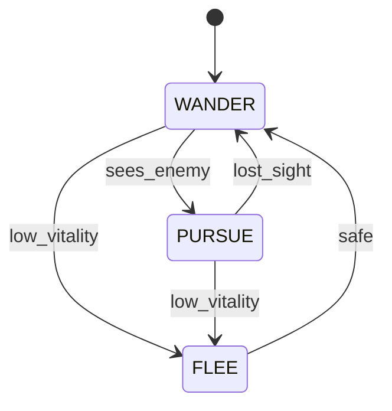

# Logic Documentation Tier — Design Spec

**Date:** 2026-04-20
**Status:** Approved (brainstorming phase complete)
**Next step:** Implementation plan via `writing-plans` skill

---

## 1. Goal & Scope

### 1.1 Goal

Produce a new documentation tier at `docs/logic/` that expresses every piece of game logic with branching, state, or event-dispatch behavior as strict, structured pseudo-code. Combined with the existing prose tiers (ARCHITECTURE, RESEARCH, STORYLINE) and data tiers (`world_db.json`, `quest_db.json`), the total documentation set must be sufficient to re-implement *The Faery Tale Adventure* without consulting the original 1987 source code.

### 1.2 Audience

Both human developers porting the game and AI agents generating port code. The format is optimized for both: readable as Markdown prose with pseudo-code fences, and machine-parseable via a strict grammar backed by a linter.

### 1.3 Fidelity target

**Behavioral fidelity, not implementation fidelity.** Same observable gameplay from the same inputs. The pseudo-code specifies *what* happens (rolls, thresholds, state transitions, ordering) but leaves implementation primitives (RNG algorithm, fixed-point layout, exact integer widths when not observable) to the port.

Specifically:

- Integer widths are documented **only** when overflow/wrap is observable (e.g., a value relied upon to go negative).
- RNG is specified as `rand(lo, hi)` / `chance(n, d)` primitives — any uniform PRNG with adequate period is acceptable.
- Save file byte layout **is** bit-exact (save compatibility is observable).
- Per-frame ordering **is** exact when it changes outcomes.
- Graphics, audio, input device APIs remain prose in RESEARCH.md — any port will use SDL/modern equivalents.

### 1.4 In scope for `docs/logic/`

Menu & key dispatch, game-loop tick ordering, actor state machines (motion, goal, tactic), AI decision logic, combat resolution, encounter spawning, quest triggers, dialogue trees, save/load byte layout, shop logic, brother succession, visual-effect sequences, and every other function with non-trivial branching.

### 1.5 Out of scope for `docs/logic/`

- Pure data tables → stay in RESEARCH.md, `world_db.json`, `quest_db.json`.
- Narrative content → stays in STORYLINE.md.
- Subsystem overviews → stay in ARCHITECTURE.md.
- Low-level graphics/audio/disk I/O that any modern port will replace → stays as prose in RESEARCH.md.

---

## 2. Directory Layout & File Shape

### 2.1 Layout

```
docs/
  logic/
    README.md              # Index: every function → file#anchor, plus reading order
    STYLE.md               # Normative style guide — the grammar spec
    SYMBOLS.md             # Declared symbol registry (globals, constants, tables, enums, structs)
    menu-system.md         # One file per subsystem
    game-loop.md
    combat.md
    ai-system.md
    movement.md
    encounters.md
    npc-dialogue.md
    quests.md
    save-load.md
    shops.md
    brother-succession.md
    visual-effects.md
    ...                    # ~20 files total, mirroring _discovery/ topics
tools/
  lint_logic.py            # Linter (new)
  results/
    lint_logic.txt         # Linter output artifact
```

### 2.2 Per-file structure (enforced by linter)

```markdown
# <Subsystem Name> — Logic Spec

> Fidelity: behavioral  |  Source files: fmain.c, fmain2.c, fsubs.asm
> Cross-refs: [RESEARCH §N](../RESEARCH.md#...), [ARCHITECTURE §N](...)

## Overview
(1–2 paragraphs of prose — what this file covers.)

## Symbols
(Locals declared in this file; globals go in SYMBOLS.md.)

## <Function Name>

Source: `fmain.c:1609-1750`
Called by: `main_loop`, `handle_menu`
Calls: `rand`, `play_sound`, `TABLE:encounter_chart`

​```pseudo
def function_name(args) -> return_type:
    """One-line purpose."""
    ...
​```

### Notes
(Optional: quirks, edge cases, PROBLEMS.md refs.)

### Mermaid
(Optional: state diagram for state machines.)
```

Each `## <Function Name>` produces a stable anchor that is the agent's entry point for targeted lookup.

### 2.3 Index (`docs/logic/README.md`)

A table mapping every documented function to its file and anchor, plus a suggested reading order for a porter (start with `game-loop.md`, then `movement.md`, etc.).

### 2.4 Symbol registry (`docs/logic/SYMBOLS.md`)

The one place that declares:

- Global actors (`player`, `anim_list`).
- Constants (`MAXSHAPES = 25`).
- Table references (`TABLE:encounter_chart`, `TABLE:item_effects`) and what they resolve to (a JSON path or RESEARCH.md anchor).
- Enums (motion states, goal modes, tactics, directions).
- Structs (`Shape`, `Missile`, `SaveRecord`) as dataclass-style declarations.

The linter checks that every identifier used in a pseudo block is either defined locally in its file or registered here.

---

## 3. Pseudo-Code Grammar

Everything inside a fenced ` ```pseudo ` block must conform to this grammar. The linter parses these blocks with Python's `ast` module after preprocessing (see 5.x), giving free syntax validation.

### 3.1 Function header (mandatory)

Every function has a three-line header *outside* the fence plus a docstring *inside*:

```markdown
## option_handler

Source: `fmain.c:820-905`
Called by: `handle_menu`
Calls: `draw_menu`, `play_click`, `TABLE:menu_options`

​```pseudo
def option_handler(key: KeyCode, state: MenuState) -> MenuAction:
    """Dispatch a menu keypress to the corresponding action."""
    ...
​```
```

- **Source** lines must resolve against the repo.
- **Called by / Calls** list other documented functions or registered primitives/tables. Unknown names fail the linter.
- Return type annotation is required. `None` for void.

### 3.2 Allowed statements

| Construct | Form |
|---|---|
| Assignment | `x = expr`, `x += expr` (all compound ops OK) |
| Conditional | `if / elif / else` |
| Match | `match x: case LITERAL:` (preferred for dispatch tables) |
| Loop | `for x in iterable:`, `while cond:` with `break`/`continue` |
| Call | `name(args...)` |
| Return | `return expr` / `return` |
| Raise / try | **Forbidden** — use explicit error-state returns |
| Comprehensions | **Forbidden** — be explicit |
| Lambdas / closures | **Forbidden** |
| Classes | **Forbidden** — data shapes go in SYMBOLS.md as dataclasses |

### 3.3 Allowed primitives (the pseudo-code "stdlib")

Declared once in STYLE.md, usable everywhere without import:

| Primitive | Semantics |
|---|---|
| `rand(lo, hi)` | Uniform int in `[lo, hi]` inclusive |
| `chance(n, d)` | True with probability `n/d` |
| `min(a, b)`, `max(a, b)`, `clamp(x, lo, hi)` | Obvious |
| `abs(x)`, `sign(x)` | Obvious |
| `wrap_u8(x)`, `wrap_i16(x)`, `wrap_u16(x)` | **Only** when wrap is observable |
| `now_ticks()` | Game tick counter (monotonic) |
| `speak(N)` | Display narr.asm message N |
| `play_sound(id)`, `play_music(id)` | Audio triggers |
| `TABLE:name` | Opaque reference to a data table; resolves via SYMBOLS.md |

### 3.4 Data types

- **Enums** are UPPER_SNAKE constants declared in SYMBOLS.md: `DIR_N`, `DIR_NE`, `GOAL_WANDER`, `STATE_WALKING`.
- **Structs** are dataclass-style declarations in SYMBOLS.md: `Shape`, `Missile`, `SaveRecord`.
- **Fields** accessed with dots: `actor.vitality`.
- **Bitfield flags** use named bit positions: `FLAGS_HAS_SWORD = bit(3)` and `if actor.flags & FLAGS_HAS_SWORD:`.

### 3.5 Inline citations

Any line whose behavior isn't obvious from the function header's source range gets an inline citation comment:

```pseudo
if dmg >= target.vitality:              # fmain.c:1842
    target.vitality = 0
    target.state = STATE_DEAD           # fmain.c:1843
```

### 3.6 Forbidden

- I/O (`print`, `open`, `input`) — use primitives.
- Any Python stdlib import.
- `global` keyword — globals are referenced directly by name; the linter checks they're registered.
- Magic numbers: numeric literals other than `-1, 0, 1, 2` must be named constants in SYMBOLS.md, **or** carry an inline comment explaining their meaning.

### 3.7 Linter preprocessing

The linter strips fences, injects stub `def`s for every registered primitive/table/symbol, then runs `ast.parse`. This yields free syntax validation plus cheap name-resolution checks without inventing a parser.

---

## 4. State Machines & Mermaid Companions

State-driven subsystems (menu navigation, goal modes, tactics, motion states, dialogue trees, combat phases) get a **dual representation**: the pseudo-code is the normative spec; a Mermaid `stateDiagram-v2` is a non-normative visual.

### 4.1 Convention

When a function is a state-machine step, write it as a `match` on current state, one `case` per state, with transitions as explicit assignments to the state variable. This maps 1:1 to Mermaid.

```pseudo
def advance_goal(actor: Shape) -> None:
    """One tick of the NPC goal FSM. Source: fmain.c:2100-2240."""
    match actor.goal:
        case GOAL_WANDER:
            if sees_enemy(actor):
                actor.goal = GOAL_PURSUE       # fmain.c:2118
            elif chance(1, 16):
                pick_new_wander_target(actor)  # fmain.c:2125
        case GOAL_PURSUE:
            if not sees_enemy(actor):
                actor.goal = GOAL_WANDER       # fmain.c:2150
            else:
                step_toward(actor, actor.target)
        case GOAL_FLEE:
            ...
```

Accompanied by:

````markdown

````

### 4.2 Coverage rule

Every state mentioned in the pseudo-code must appear in the diagram, and every diagram transition must correspond to an assignment in the pseudo-code. The linter checks the first direction (pseudo → diagram state coverage) by scanning `<field> = STATE_NAME` assignments against the Mermaid source. The reverse direction is human-reviewed.

### 4.3 Tick ordering

Where per-frame order matters (e.g., "player input processed, then missiles advance, then enemies decide, then depth-sort, then draw"), `game-loop.md` defines the canonical order as a numbered sequence inside a single top-level `game_tick()` function. Every other subsystem doc references phase numbers from that spec (e.g., "runs in phase 3 — enemy decisions").

---

## 5. Linter (`tools/lint_logic.py`)

Runs over `docs/logic/*.md`. Exits non-zero on any failure. Output artifact at `tools/results/lint_logic.txt`. Reuses citation-resolution logic from `tools/validate_citations.py` where possible.

### 5.1 Checks performed

1. **File header present.** Every logic doc starts with the `> Fidelity:` / `> Source files:` / `> Cross-refs:` block.
2. **Function header well-formed.** Every `## <Name>` is followed by `Source:`, `Called by:`, `Calls:` lines, then one ` ```pseudo ` fenced block.
3. **Source citation resolves.** Every `file:line` or `file:start-end` reference points to an existing file in the repo; line numbers are within file length.
4. **Pseudo block parses.** After stub injection, `ast.parse` succeeds.
5. **Function signature conforms.** Top-level node is a single `def` with type-annotated args and return type, plus a docstring.
6. **Forbidden constructs absent.** `try`, `raise`, `lambda`, `class`, `import`, `global`, comprehensions — all rejected via AST walk.
7. **Symbol resolution.** Every referenced name must be: a function arg, a local assignment, listed in `Calls:`, declared in SYMBOLS.md, or a built-in primitive.
8. **Table refs resolve.** `TABLE:name` must appear in SYMBOLS.md's table registry and point at a JSON path or RESEARCH.md anchor.
9. **No magic numbers.** Numeric literals outside `{-1, 0, 1, 2}` must be registered constants or carry an inline same-line comment.
10. **Cross-refs resolve.** Markdown links to other docs must resolve to existing files and anchors.
11. **Index completeness.** Every `## <Name>` anchor in any logic doc appears in `docs/logic/README.md`'s index table. Orphan functions and dangling index entries both fail.
12. **State-machine coverage.** When a Mermaid `stateDiagram-v2` block follows a function, every `<field> = STATE_*` assignment in that function's pseudo block appears as a node in the diagram.

### 5.2 Non-goals

The linter does **not** execute pseudo-code, does **not** verify semantic correctness against the original source, and does **not** check prose quality. Those remain human review.

### 5.3 Iteration story

Running the linter before and after every edit is how agents avoid drift — same pattern as `validate_citations.py` today. The logic-writer agent's workflow has a final "run lint_logic, fix until clean" step.

---

## 6. Agent Workflow Integration

### 6.1 New role: logic-writer

A researcher-class agent specialized in producing `docs/logic/*.md` files. It reads:

- `docs/_discovery/<topic>.md` (raw findings).
- `docs/RESEARCH.md` section for cross-refs.
- `docs/logic/STYLE.md` + `SYMBOLS.md` (normative).
- The original source **only** to verify specific lines referenced in the discovery file — never for exploration.

It writes exactly one logic doc per dispatch, then runs `tools/lint_logic.py` and iterates until clean. If a needed symbol isn't in SYMBOLS.md, the agent proposes the addition in its report rather than editing SYMBOLS.md itself. SYMBOLS.md changes are orchestrator-reviewed to keep the registry coherent.

### 6.2 Per-subsystem workflow

1. **Discover** — existing `discovery` agent produces `_discovery/<topic>.md` (most already exist).
2. **Symbol gap pass** — orchestrator reviews the discovery file, adds any missing structs/enums/tables/constants to SYMBOLS.md.
3. **Draft** — `logic-writer` produces `docs/logic/<topic>.md`.
4. **Lint** — `lint_logic.py` must pass clean.
5. **Verify** — `experimenter` agent writes a script under `tools/` that spot-checks specific numeric claims (thresholds, frame counts, table indices) in the pseudo-code against the original source. Output to `tools/results/`.
6. **Cross-link** — orchestrator adds a pointer from the corresponding RESEARCH.md section to the new logic doc and adds the entry to `docs/logic/README.md`'s index.

### 6.3 Anti-drift rules (added to `.github/copilot-instructions.md`)

- No pseudo-code outside `docs/logic/`. RESEARCH.md, ARCHITECTURE.md, and STORYLINE.md remain prose + tables + diagrams only.
- No prose re-explanation of logic that's already in `docs/logic/`. RESEARCH.md references the logic doc by anchor instead of paraphrasing.
- SYMBOLS.md is append-mostly. Renaming a symbol requires a find-all update.

### 6.4 Rollout order (iterative waves)

- **Wave 0** — Foundations: STYLE.md, SYMBOLS.md skeleton, README.md stub, `lint_logic.py`.
- **Wave 1** — Two worked examples: `menu-system.md` (event dispatch) and `ai-system.md` goal FSM (state machine). Format stress-test.
- **Wave 2** — `game-loop.md` as the tick-ordering anchor that later docs reference.
- **Wave 3+** — Remaining subsystems, one per wave, prioritized by how much gameplay behavior they encode: combat → movement → encounters → quests → npc-dialogue → save-load → shops → brother-succession → visual-effects → everything else.

---

## 7. Starting Deliverable (First Implementation Plan)

The first implementation plan covers Waves 0 + 1 from §6.4. It delivers:

1. `docs/logic/STYLE.md` — the full grammar spec from §3 and §4, with canonical examples.
2. `docs/logic/SYMBOLS.md` — initial symbol registry covering everything the two worked examples need: `Shape`, key codes, menu states, motion/goal/tactic enums, direction enums, `MAXSHAPES`, primary table refs.
3. `docs/logic/README.md` — index stub with the two example functions listed and a reading-order section.
4. `tools/lint_logic.py` — linter implementing all 12 checks from §5.1.
5. `tools/results/lint_logic.txt` — first successful run captured.
6. `docs/logic/menu-system.md` — worked example #1: event dispatch (option handler + key bindings).
7. `docs/logic/ai-system.md` — worked example #2: NPC goal FSM (state machine with Mermaid companion).
8. `.github/copilot-instructions.md` — amendment adding the §6.3 anti-drift rules and pointing agents at `docs/logic/`.

### 7.1 Out of scope for the first deliverable

`game-loop.md`, `combat.md`, and the rest of the subsystem docs. Those come in later waves once the format has survived two real uses.

### 7.2 Acceptance criteria

- `python tools/lint_logic.py` exits 0 and produces `tools/results/lint_logic.txt`.
- Both example docs pass lint.
- A fresh reader can open `docs/logic/README.md` and navigate to both examples via the index.
- The menu example covers both the option-selection dispatch and the key-bindings map.
- The AI example's Mermaid diagram matches the pseudo-code's state assignments.

---

## 8. Open Questions

None at time of approval. Any issues surfaced during implementation will be logged against this spec and resolved before moving beyond Wave 1.
