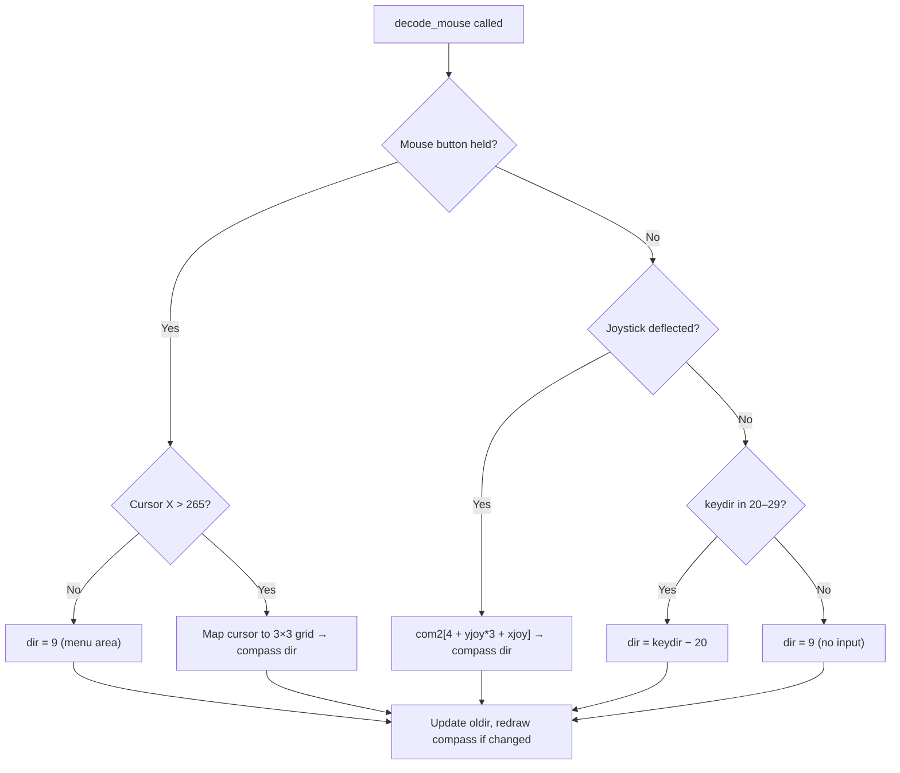

# Game Mechanics Research — Input & Movement

Input system architecture and movement/direction mechanics.

> **Citation format**: `file.c:LINE` or `file.c:START-END`. Speech references: `speak(N)`.
> Split from [RESEARCH.md](RESEARCH.md). See the hub document for the full section index.

---

## 4. Input System

### 4.1 Handler Architecture

The game installs a custom Amiga input event handler at priority 51 — one higher than Intuition's 50 — so it intercepts all input events before the operating system.

**Installation** — `add_device()` at `fmain.c:3017-3036`:

1. Clears keyboard buffer: `handler_data.laydown = handler_data.pickup = 0` (`fmain.c:3020`)
2. Creates a message port and I/O request (`fmain.c:3021-3022`)
3. Configures `struct Interrupt handlerStuff`:
   - `is_Data = &handler_data` — the `struct in_work` instance (`fmain.c:3025`)
   - `is_Code = HandlerInterface` — assembly entry point (`fmain.c:3026`)
   - `is_Node.ln_Pri = 51` (`fmain.c:3027`)
4. Opens `input.device` and sends `IND_ADDHANDLER` (`fmain.c:3029-3035`)

**Teardown** — `wrap_device()` at `fmain.c:3038-3046`: sends `IND_REMHANDLER`, closes device, frees port.

**Initialization before install** (`fmain.c:785-788`):
- `xsprite = ysprite = 320` — initial cursor position
- `gbase = GfxBase` — graphics library base
- `pbase = 0` — no sprite initially (set to `&pointer` later at `fmain.c:1258`)
- `vbase = &vp_text` — assigned after display setup (`fmain.c:943`)

### 4.2 Interrupt Handler

`_HandlerInterface` at `fsubs.asm:63-218` receives `a0` = input event chain, `a1` = `&handler_data`. It iterates the linked list of events and processes each by type:

#### TIMER Events (type 6) — `fsubs.asm:72-80`

Heartbeat mechanism: increments `ticker` (offset 150) each TIMER event. When `ticker` reaches 16, resets to 0 and synthesizes a fake RAWKEY event (keycode `$E0` — key-up for undefined scancode `$60`). This prevents the game loop from stalling when no real input arrives.

#### RAWKEY Events (type 1) — `fsubs.asm:82-110`

1. Reads qualifier word; ignores repeat keys (bit 9 set) (`fsubs.asm:90-92`)
2. Extracts 7-bit scancode and up/down flag (bit 7) (`fsubs.asm:94-96`)
3. Ignores scancodes > `$5A` (`fsubs.asm:97-98`)
4. **Nullifies the event** (sets type to 0) so Intuition never sees it (`fsubs.asm:100`)
5. Translates via `keytrans[]` table: `translated = keytrans[scancode]` (`fsubs.asm:102`)
6. Restores up/down bit: `output = translated | original_bit7` (`fsubs.asm:103-104`)
7. Writes to circular `keybuf[laydown]` and advances `laydown` pointer with `& $7F` wrap (`fsubs.asm:106-112`)

#### RAWMOUSE Events (type 2) — `fsubs.asm:114-159`

**Button change detection**: XORs new qualifier with old to detect transitions (`fsubs.asm:117`).

**Left button release**: replays `lastmenu` character with bit 7 set (key-up) and clears `lastmenu` (`fsubs.asm:123-127`).

**Left button press** in menu area (X: 215–265):
- Computes character: `(ysprite - 144) / 9 * 2 + 'a' + column` where column = 1 if X ≥ 240 (`fsubs.asm:139-148`)
- Queues character in `keybuf`; saves as `lastmenu` (`fsubs.asm:149-156`)

**Left button press** outside menu: `d2 = 9` (no direction) (`fsubs.asm:130`).

#### DISKIN Events (type $10) — `fsubs.asm:160-161`

Sets `handler_data.newdisk = 1` — the disk-inserted flag read by the game loop.

#### Mouse Position Update (all events) — `fsubs.asm:163-200`

Applied for every event regardless of type:
1. Adds delta from event fields (`ie_X`, `ie_Y`) to `xsprite`/`ysprite` (`fsubs.asm:166-167`)
2. Clamps X to 5–315, Y to 147–195 (`fsubs.asm:169-180`)
3. If `pbase` ≠ NULL: calls `MoveSprite(gbase, pbase, x*2, y-143)` (`fsubs.asm:184-199`)
   - X is doubled for hi-res sprite positioning
   - Y offset −143 maps to ViewPort-relative coordinates

The Y clamp of 147–195 confines the pointer to the 48-pixel status bar area — the mouse never enters the playfield.

### 4.3 Keyboard Buffer — getkey()

`_getkey` at `fsubs.asm:281-295`: reads the next translated keycode from the 128-byte circular FIFO. Returns 0 if buffer empty, or the translated key with bit 7 = up/down flag.

Called from the game loop at `fmain.c:1278`: `key = getkey()`.

### 4.4 keytrans Table — Scancode Translation

Defined at `fsubs.asm:221-226`. A 91-byte table translating Amiga raw scancodes (0–`$5A`) to game-internal key codes.

**Numpad → Direction codes (20–29)**:

```
7=NW(20)   8=N(21)    9=NE(22)
4=W(27)    5=stop(29)  6=E(23)
1=SW(26)   2=S(25)    3=SE(24)
```

| Scancode | Numpad Key | keytrans | Direction (val−20) | Compass |
|----------|-----------|----------|-------------------|---------|
| `$3D` | 7 | 20 | 0 | NW |
| `$3E` | 8 | 21 | 1 | N |
| `$3F` | 9 | 22 | 2 | NE |
| `$2F` | 6 | 23 | 3 | E |
| `$1D` | 1 | 26 | 6 | SW |
| `$1E` | 2 | 25 | 5 | S |
| `$1F` | 3 | 24 | 4 | SE |
| `$2D` | 4 | 27 | 7 | W |
| `$2E` | 5 | 29 | 9 | Stop/center |

Cursor keys (`$4C`–`$4F`) translate to values 1–4 (used as cheat movement keys at `fmain.c:1339-1342`), **not** direction codes 20–29.

Function keys F1–F10 (`$50`–`$59`) translate to values 10–19 (`fsubs.asm:225`).

### 4.5 Direction Decoder — decode_mouse()

`_decode_mouse` at `fsubs.asm:1488-1590`, called every frame from `fmain.c:1376`. Determines the current movement direction from three sources in priority order:



**Mouse direction** (highest priority, `fsubs.asm:1492-1529`): When either mouse button is held (`qualifier & $6000`), the cursor position maps to a 3×3 compass grid if X > 265. Otherwise direction = 9 (menu area, no movement).

**Joystick direction** (`fsubs.asm:1531-1560`): Reads JOY1DAT register at `$dff00c`. High byte = Y axis, low byte = X axis. Decoded via XOR of adjacent bits to extract direction per axis, then indexed through `com2[]`.

**Keyboard direction** (lowest priority, `fsubs.asm:1565-1576`): Uses the stored `keydir` value (set when numpad keys 20–29 are pressed at `fmain.c:1288`). `keydir − 20` gives the compass direction.

When the resolved direction changes from `oldir`, `drawcompass()` is called to update the compass highlight (`fsubs.asm:1578-1585`).

### 4.6 com2 — Direction Lookup Table

Defined at `fsubs.asm:1486` and `fmain2.c:155-162`. Converts (xjoy, yjoy) sign pairs to compass directions via the formula `com2[4 + yjoy*3 + xjoy]` (for joystick) or `com2[4 − 3*ydir − xdir]` (for `set_course`):

```
com2[9] = {0, 1, 2, 7, 9, 3, 6, 5, 4}
```

| yjoy\\xjoy | −1 | 0 | +1 |
|---|---|---|---|
| −1 | 0 (NW) | 1 (N) | 2 (NE) |
| 0 | 7 (W) | 9 (stop) | 3 (E) |
| +1 | 6 (SW) | 5 (S) | 4 (SE) |

### 4.7 Combat & Walk Triggers

The game loop reads input qualifier bits and hardware registers to determine action:

**Combat trigger** (`fmain.c:1409`):
```
qualifier & 0x2000 (right mouse)  ||  keyfight  ||  (CIA-A $bfe001 bit 7 == 0)
```

The joystick fire button is read directly from CIA-A PRA register at `$bfe001` bit 7 (active low), **bypassing** the input.device handler entirely (`fmain.c:1272`).

**Walk trigger** (`fmain.c:1447`):
```
qualifier & 0x4000 (left mouse)  ||  keydir != 0
```

**Fight mode toggle**: The '0' key (numpad 0) sets `keyfight = TRUE` on key-down and clears on key-up (`fmain.c:1290-1291`), providing a keyboard alternative to holding the fire button.

### 4.8 letter_list — Keyboard Shortcuts

Defined at `fmain.c:537-556`. A 38-entry table (`#define LMENUS 38`, `fmain.c:533`) mapping translated key characters to `(menu, choice)` pairs:

```c
struct letters { char letter, menu, choice; };
```

| Key | Menu | Choice | Action |
|-----|------|--------|--------|
| `I` | ITEMS (0) | 5 | Items menu |
| `T` | ITEMS (0) | 6 | Take |
| `?` | ITEMS (0) | 7 | Look |
| `U` | ITEMS (0) | 8 | Use |
| `G` | ITEMS (0) | 9 | Give |
| `Y` | TALK (2) | 5 | Yell |
| `S` | TALK (2) | 6 | Say |
| `A` | TALK (2) | 7 | Ask |
| `Space` | GAME (4) | 5 | Pause |
| `M` | GAME (4) | 6 | Music toggle |
| `F` | GAME (4) | 7 | Sound toggle |
| `Q` | GAME (4) | 8 | Quit |
| `L` | GAME (4) | 9 | Load |
| `O` | BUY (3) | 5 | Buy item |
| `R` | BUY (3) | 6 | Buy item |
| `8` | BUY (3) | 7 | Buy item |
| `C` | BUY (3) | 8 | Buy Mace |
| `W` | BUY (3) | 9 | Buy Sword |
| `B` | BUY (3) | 10 | Buy Bow |
| `E` | BUY (3) | 11 | Buy Totem |
| `V` | SAVEX (5) | 5 | Save |
| `X` | SAVEX (5) | 6 | Exit |
| F1–F7 | MAGIC (1) | 5–11 | Magic spells 1–7 |
| `1`–`7` | USE (8) | 0–6 | Use item slots 1–7 |
| `K` | USE (8) | 7 | Use key |

The game loop processes keys at `fmain.c:1278-1355` in priority order: view dismissal → direction keys → fight toggle → mouse-click menu → cheat keys → `letter_list` scan.

---


## 5. Movement & Direction

### 5.1 Direction Encoding

The game uses a compass-rose system with 10 values. Defined implicitly by the `xdir`/`ydir` vector tables at `fsubs.asm:1276-1277` and referenced throughout the codebase:

| Value | Direction | xdir | ydir |
|-------|-----------|------|------|
| 0 | NW | −2 | −2 |
| 1 | N | 0 | −3 |
| 2 | NE | +2 | −2 |
| 3 | E | +3 | 0 |
| 4 | SE | +2 | +2 |
| 5 | S | 0 | +3 |
| 6 | SW | −2 | +2 |
| 7 | W | −3 | 0 |
| 8 | Still | 0 | 0 |
| 9 | Still | 0 | 0 |

Values 8 and 9 both map to zero movement. `oldir = 9` signals "no direction input" (`fsubs.asm:1577`).

The vectors are **not** unit vectors. Cardinal directions have magnitude 3, diagonals have magnitude 2 per axis (displacement √8 ≈ 2.83). This produces near-parity between cardinal and diagonal movement speed.

### 5.2 Position Update Functions — newx / newy

#### newx (`fsubs.asm:1280-1295`)

Returns `x` unchanged when `dir > 7`; otherwise signed-multiplies `xdir[dir]` by `speed`, logically right-shifts one bit, adds to `x`, and masks to the 15-bit range. The logical (not arithmetic) right shift introduces a +1 pixel bias for negative products but the final mask makes this invisible to all callers. Full pseudo-code: [logic/movement.md § newx](logic/movement.md#newx).

#### newy (`fsubs.asm:1298-1318`)

Same formula as `newx` using `ydir[]`, plus one additional step: **preserves bit 15** of the original y coordinate:

```asm
and.l  #$07fff,d0      ; mask to 15 bits    (fsubs.asm:1315)
and.w  #$8000,d1       ; extract bit 15     (fsubs.asm:1316)
or.w   d1,d0           ; restore bit 15     (fsubs.asm:1317)
```

Bit 15 of `abs_y` is preserved through movement calculations but is never tested, set, or read by any other code — it has no functional effect.

### 5.3 set_course — Pathfinding

`set_course(object, target_x, target_y, mode)` at `fmain2.c:57-228`. Sets an actor's facing direction based on a target position and one of 7 pathfinding modes.

#### Direction Computation (`fmain2.c:69-109`)

1. **Mode 6 special case**: uses target_x/target_y directly as xdif/ydif without subtracting from current position (`fmain2.c:79-80`)
2. **All other modes**: `xdif = self.abs_x − target_x`, `ydif = self.abs_y − target_y` (`fmain2.c:85-88`)
3. Computes `xdir = sign(xdif)`, `ydir = sign(ydif)` (`fmain2.c:90-109`)

#### Directional Snapping (`fmain2.c:113-126`)

For mode ≠ 4: if one axis dominates, the minor axis is zeroed:
- `(|xdif| >> 1) > |ydif|` → `ydir = 0` (mostly horizontal)
- `(|ydif| >> 1) > |xdif|` → `xdir = 0` (mostly vertical)

Mode 4 skips snapping, always allowing diagonal movement.

#### com2 Lookup (`fmain2.c:155-168`)

Converts the sign pair to compass direction: `j = com2[4 − 3*ydir − xdir]` (see [§4.6](#46-com2--direction-lookup-table)).

If `j == 9` (actor is at target): sets `state = STILL` and returns (`fmain2.c:165-168`).

#### Random Deviation (`fmain2.c:172-179`)

If `j ≠ 9` and deviation > 0:
- `if (rand() & 2)`: `j += deviation` else `j −= deviation`
- `j = j & 7` (wraps to valid direction)

The random test checks bit 1 of `rand()` (`btst #1`), not bit 0.

#### Mode Summary

| Mode | Behavior | Deviation | Source |
|------|----------|-----------|--------|
| 0 | Toward target with snapping | 0 | `fmain2.c:113-187` |
| 1 | Toward target + deviation when distance < 40 | 1 | `fmain2.c:136-139` |
| 2 | Toward target + deviation when distance < 30 | 1 (stale comment says 2) | `fmain2.c:143-146` |
| 3 | Away from target (reverses direction) | 0 | `fmain2.c:149-152` |
| 4 | Toward target without snapping (always allows diagonal) | 0 | `fmain2.c:113` |
| 5 | Toward target with snapping; does NOT set state to WALKING | 0 | `fmain2.c:183-187` |
| 6 | Uses target_x/target_y as raw direction vector | 0 | `fmain2.c:79-80` |

**Important**: These mode numbers are NOT the same as tactical mode constants. `do_tactic()` (`fmain2.c:1664-1700`) maps AI tactics to `set_course` modes:

| Tactic | set_course mode | Target |
|--------|----------------|--------|
| PURSUE (1) | 0 | Hero |
| FOLLOW (2) | 0 | Leader (+20 Y offset) |
| BUMBLE_SEEK (3) | 4 | Hero (no snap) |
| BACKUP (5) | 3 | Hero (reversed) |
| EVADE (6) | 2 | Neighboring actor (+20 Y offset) |
| SHOOT (8) | 5 | Hero (no walk) |
| EGG_SEEK (10) | 0 | Fixed coords (23087, 5667) |
| RANDOM (4) | *(none)* | Sets `facing = rand()&7` directly (`fmain2.c:1686`) |

Most tactics only call `set_course` when a random check passes — `!(rand()&7)` = 1/8 chance per tick (`fmain2.c:1670`), upgraded to `!(rand()&3)` = 1/4 for ATTACK2 goal (`fmain2.c:1669`). This creates sluggish, organic NPC movement.

### 5.4 move_figure — Position Commit with Collision

`move_figure(fig, dir, dist)` at `fmain2.c:322-330` computes a tentative (`xtest`, `ytest`) via `newx`/`newy`, returns FALSE if `proxcheck` reports a block, and otherwise commits the new position and returns TRUE. Full pseudo-code: [logic/combat.md § move_figure](logic/combat.md#move_figure).

Used primarily for combat knockback (`fmain2.c:250`: `move_figure(j, fc, 2)`). Normal per-tick walking is handled **inline** in the main game loop (`fmain.c:1596-1650`), which performs `newx`/`newy` and `proxcheck` directly, then applies terrain effects, velocity, and animation.

#### proxcheck — Collision Detection (`fmain2.c:277-296`)

Two-phase collision test:

1. **Terrain**: calls `prox(x, y)` (`fsubs.asm:1604-1622`) which checks terrain at `(x+4, y+2)` and `(x−4, y+2)`. Returns terrain code if blocked. Wraiths (`race == 2`) skip terrain checks entirely (`fmain2.c:279`). Hero (`i==0`) can pass terrain codes 8 and 9 (`fmain2.c:280`).
2. **Actors**: loops through all actors; if another living actor (not self, not slot 1, not type 5/raft) is within an 11×9 pixel bounding box, returns 16 (`fmain2.c:284-290`).

Returns: 0 = clear, terrain code = terrain-blocked, 16 = actor-blocked.

#### Player Collision Deviation (`fmain.c:1612-1626`)

When any actor walks into a wall, the game auto-deviates before declaring a block (`fmain.c:1612-1626`):
1. Try `dir + 1` (clockwise) — if clear, commit (`fmain.c:1614-1618`)
2. Try `dir − 2` (counterclockwise from original) — if clear, commit (`fmain.c:1621-1625`)
3. All three blocked → `goto blocked` (`fmain.c:1626`)

This deviation logic runs for **all actors** (player and NPCs alike). At the `blocked:` label (`fmain.c:1654`), the paths diverge:

- **NPCs** (`i != 0`): `an->tactic = FRUST` — see [§8.4 Frustration Cycle](RESEARCH-ai-encounters.md#84-frustration-cycle)
- **Player** (`i == 0`): `frustflag++` with escalating visual feedback. This provides visual feedback when the player walks into impassable terrain — the character turns south and shakes his head repeatedly:
   - **0–20 frames**: Normal standing sprite (`fmain.c:1663`)
   - **21–40 frames**: Head-shaking animation — oscillation sprites 84/85, alternating every 2 game cycles — `dex = 84+((cycle>>1)&1)` (`fmain.c:1658`). These are figures 64/65 (`fmain.c:200-201`).
   - **41+ frames**: Hardcoded `dex = 40` (`fmain.c:1657`) — statelist[40] is figure 35 (south-facing pose). The character snaps to face south regardless of actual facing direction.

`frustflag` is a global `char` (`fmain.c:589`), only **incremented** for the player (`i == 0`), but **reset to 0** by any actor's successful action inside the shared animation loop (`fmain.c:1468`). Reset points: successful walk (`fmain.c:1650`), sink state (`fmain.c:1577`), shooting (`fmain.c:1707`), melee combat (`fmain.c:1715`), dying (`fmain.c:1725`). Since the flag exists solely to provide visual feedback that the hero is blocked, the NPC resets are harmless — during encounters, active NPCs reset it each tick, but the player is unlikely to be stuck against a wall in combat anyway. The escalating head-shaking animation is designed for solo exploration moments when the player walks into impassable terrain.

### 5.5 World Wrapping

#### Coordinate Masking

Both `_newx` and `_newy` mask results with `& 0x7FFF` — clamping to the 15-bit range [0, 32767]. This provides implicit wrapping on arithmetic overflow.

#### Hero Wrap Boundaries (`fmain.c:1831-1839`)

For outdoor regions (`region_num < 8`) only, applied to the hero (index 0): if `abs_x` or `abs_y` drops below 300 the hero is teleported to 32565 on that axis, and vice versa, creating a toroidal world with wrap boundaries at 300 and 32565. Indoor regions (`region_num ≥ 8`) do not wrap. NPCs are never wrapped — they can exist at any coordinate. Full pseudo-code: [logic/movement.md § World wrapping](logic/movement.md#world-wrapping).

#### Relative Positioning — wrap() (`fsubs.asm:1350-1356`)

Sign-extends a 15-bit coordinate difference to 16-bit signed:

```asm
btst  #14,d0          ; if bit 14 set (≥ 16384) →
or.w  #$8000,d0       ;   set bit 15 (treat as negative)
```

Called at `fmain.c:1846-1854` to compute screen-relative positions:

```c
rel_x = wrap(abs_x - map_x - 8);
rel_y = wrap(abs_y - map_y - 26);
```

### 5.6 Camera Tracking — map_adjust()

`_map_adjust(x, y)` at `fsubs.asm:1359-1437`. Adjusts the global camera position (`map_x`, `map_y`) to follow the hero.

**Dead zone**: ±20 pixels X, ±10 pixels Y. Within the dead zone, the camera does not scroll. Outside, it scrolls 1 pixel per tick (`fsubs.asm:1389-1397`, `fsubs.asm:1410-1419`).

**Large jumps**: If the hero-to-camera delta exceeds 70 pixels X or 44/24 pixels Y, the camera snaps immediately instead of scrolling (`fsubs.asm:1377-1387`, `fsubs.asm:1398-1407`).

The asymmetric Y thresholds (−24 vs +44) account for the player sprite being offset from screen center — more visible space exists below the character than above.

### 5.7 Velocity System

The `vel_x`/`vel_y` fields in `struct shape` (signed bytes, offset 20–21) implement ice/slippery physics.

#### Ice Physics (`fmain.c:1581-1597`)

When `environ == −2` (terrain type 7, ice):

```
vel_x += xdir[dir]    (directional impulse from input)
vel_y += ydir[dir]
```

Velocity is clamped to magnitude limits (`e = 42` normally, `e = 40` when riding swan). Position updates use `abs_x += vel_x / 4`, giving a maximum displacement of 8–10 pixels per tick.

On swan/ice, facing is derived from velocity rather than input: `set_course(0, −nvx, −nvy, 6)` (`fmain.c:1592`).

#### Normal Walking — Velocity Recording (`fmain.c:1646-1647`)

After each non-ice movement step, velocity is recorded as displacement × 4:

```c
vel_x = ((short)(xtest - abs_x)) * 4;
vel_y = ((short)(ytest - abs_y)) * 4;
```

This feeds the swan dismount check: the hero can only dismount when `|vel_x| < 15 && |vel_y| < 15` (`fmain.c:1420-1425`), preventing high-speed dismount.

#### FALL State Friction (`fmain.c:1737-1738`)

During FALL state, velocity decays by 25% per tick:

```c
vel_x = (vel_x * 3) / 4;
vel_y = (vel_y * 3) / 4;
```

Velocity halves approximately every 3 ticks. Position continues updating by `vel / 4` on ice (`fmain.c:1743-1744`).

### 5.8 Movement Speed by Terrain

Speed value `e` passed to `newx`/`newy` during WALKING (`fmain.c:1599-1602`). The if/else chain applies to **all actors** — hero and NPC share the same code path:

| Condition | Speed | Hero | NPC | Effect |
|-----------|-------|------|-----|--------|
| `i==0 && riding==5` | 3 | Yes | — | Turtle riding (hero-only, `fmain.c:1599`) |
| `environ == −3` (terrain 8) | −2 | Yes | Unreachable | Direction reversal; `proxcheck` blocks NPCs from terrain 8 (`fmain2.c:282`) |
| `environ == −2` (terrain 7) | velocity | Yes | Yes | Ice physics — no `i==0` guard (`fmain.c:1581-1598`) |
| `environ == −1` (terrain 6) | 4 | Yes | Yes | Fast terrain, 2× normal speed (`fmain.c:1601`) |
| `environ == 2` or `> 6` | 1 | Yes | Yes | Wading / deep water, half speed (`fmain.c:1602`) |
| Default | 2 | Yes | Yes | Normal walking (`fmain.c:1602`) |

Negative speed (−2 for terrain 8) causes backward movement along the current facing direction — the `newx`/`newy` `muls.w` handles the sign inversion.

**NPC terrain access**: `proxcheck` zeroes terrain types 8 and 9 only for the hero (`fmain2.c:282`). NPCs are blocked by Probe 2 (`fsubs.asm:1608-1609`, threshold ≥ 8), so they can never reach terrain 8 (direction reversal) or 9 (pits) under normal gameplay. This makes `environ == −3` effectively hero-only despite the speed code having no actor check.

**Race-based terrain immunity**: Wraiths (`race == 2`) skip terrain collision entirely (`fmain2.c:279-280`), but their terrain is forced to 0 at `fmain.c:1639`, giving them normal speed (e=2) on all surfaces. Snakes (`race == 4`) also have terrain forced to 0 (`fmain.c:1639`). See [§6.3](RESEARCH-terrain-combat.md#63-collision-detection) for collision details.

**Wading speed gap**: The check `k == 2 || k > 6` creates a speed anomaly during water depth ramping. For terrain 4 (deep water), where environ ramps 0→10, actors cycle through: normal speed (environ 0–1) → slow (environ 2) → normal (environ 3–6) → slow (environ 7–10). This brief normal-speed window at environ 3–6 affects hero and NPCs identically.

### 5.9 Hunger Stumble (`fmain.c:1442-1445`)

When `hunger > 120`, there is a 1/4 chance (`!rand4()`) per walking tick that the direction is deflected by ±1 (50/50 via `rand()&1`):

```c
if (!rand4()) {
    d = (rand() & 1) ? d + 1 : d - 1;
    d &= 7;
}
```

This creates visible stumbling/disorientation, crossing over with the input system to affect movement.

---

