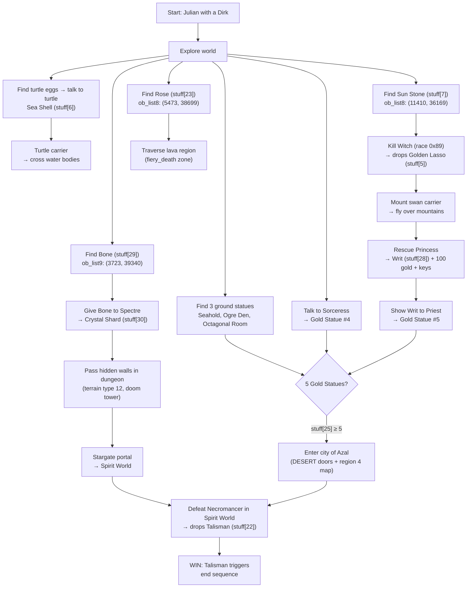

# Game Mechanics Research — Items, Objects & Doors

Inventory system, world objects, and the door system.

> **Citation format**: `file.c:LINE` or `file.c:START-END`. Speech references: `speak(N)`.
> Split from [RESEARCH.md](RESEARCH.md). See the hub document for the full section index.

---

## 10. Inventory & Items

### 10.1 `inv_list` — Complete Item Table

The 36-entry `inv_list[]` table (`fmain.c:380-424`) is described structurally in [§1.5](RESEARCH-data-structures.md#15-struct-inv_item--inventory-item-descriptor). The complete item catalogue with gameplay semantics:

#### Weapons (stuff[0–4])

| Index | Item | Melee Damage | Notes |
|-------|------|-------------|-------|
| 0 | Dirk | 1–3 | Starting weapon for each brother |
| 1 | Mace | 2–4 | Purchasable (30 gold) |
| 2 | Sword | 3–5 | Purchasable (45 gold) |
| 3 | Bow | 4–11 (missile) | Purchasable (75 gold); consumes arrows |
| 4 | Magic Wand | 4–11 (missile) | Fires fireballs; no ammo cost |

Weapon is equipped via USE menu: `anim_list[0].weapon = hit + 1` (`fmain.c:3448-3451`). The bow consumes one arrow per shot (`stuff[8]--` at `fmain.c:1677`); when arrows run out mid-combat, auto-switches to the next best weapon (`fmain.c:1693`).

#### Special Items (stuff[5–8])

| Index | Item | Effect |
|-------|------|--------|
| 5 | Golden Lasso | Enables mounting the swan carrier (`fmain.c:1498`). Dropped by the Witch (race `0x89`) on death (`fmain.c:1756`). Requires Sun Stone first — see below. |
| 6 | Sea Shell | USE calls `get_turtle()` to summon sea turtle carrier near water (`fmain.c:3458-3461`). Blocked inside rectangle `(11194–21373, 10205–16208)`. Obtained from turtle NPC dialogue (`fmain.c:3419-3420`), or ground pickup in ob_list2/ob_list8 at `(10344, 36171)`. |
| 7 | Sun Stone | Makes the Witch (race `0x89`) vulnerable to melee weapons (`fmain2.c:231-233`). Without it, attacks on the witch produce `speak(58)`: "Stupid fool, you can't hurt me with that!" Ground pickup at `(11410, 36169)` in ob_list8 (`fmain2.c:1092`). |
| 8 | Arrows | Integer count (max display 45). Consumed by bow. Purchased in batches of 10 for 10 gold. |

#### Magic Consumables (stuff[9–15], `MAGICBASE=9`)

All consumed on use (`--stuff[4+hit]` at `fmain.c:3365`). Guarded by `extn->v3 == 9` check — magic doesn't work in certain areas (`fmain.c:3304`).

| Index | Item | Effect | Source |
|-------|------|--------|--------|
| 9 | Blue Stone | Teleport via stone circle (only at sector 144) | `fmain.c:3306-3313` |
| 10 | Green Jewel | `light_timer += 760` — temporary light-magic effect that brightens dark outdoor areas | `fmain.c:3306` |
| 11 | Glass Vial | Heal: `vitality += rand8() + 4` (4–11), capped at `15 + brave/4` | `fmain.c:3317-3319` |
| 12 | Crystal Orb | `secret_timer += 360` — reveals hidden passages | `fmain.c:3321` |
| 13 | Bird Totem | Renders overhead map with player position | `fmain.c:3323-3340` |
| 14 | Gold Ring | `freeze_timer += 100` — freezes all enemies (disabled while riding) | `fmain.c:3342-3348` |
| 15 | Jade Skull | Kill spell: kills all visible enemies with `vitality > 0`, `type == ENEMY`, `race < 7`. **Decrements `brave`** per kill. | `fmain.c:3350-3363` |

The Jade Skull's `brave--` per kill is notable — it's the only item that *reduces* bravery, counterbalancing the kill-based `brave++` from normal combat.

#### Keys (stuff[16–21], `KEYBASE=16`)

| Index | Key |
|-------|-----|
| 16 | Gold Key |
| 17 | Green Key |
| 18 | Blue Key |
| 19 | Red Key |
| 20 | Grey Key |
| 21 | White Key |

Used via the KEYS submenu (`fmain.c:3468-3485`). The handler tries 9 directions from the hero's position, calling `doorfind(x, y, keytype)` (`fmain.c:1081-1123`). On success, the key is consumed (`stuff[hit + KEYBASE]--`). `doorfind()` matches terrain type 15 (door tile) nearby and checks the `open_list[]` for matching `keytype`.

#### Quest & Stat Items (stuff[22–30])

| Index | Item | Effect | Source |
|-------|------|--------|--------|
| 22 | Talisman | **Win condition**: collecting triggers end sequence (`fmain.c:3244-3247`). Dropped by the Necromancer (race `0x09`) on death (`fmain.c:1754`). The Necromancer transforms to a normal man (race 10) and speaks `speak(44)`. | `fmain.c:3244` |
| 23 | Rose | **Lava immunity**: forces `environ = 0` in the `fiery_death` zone (`map_x` 8802–13562, `map_y` 24744–29544) — `fmain.c:1384-1385`, `fmain.c:1844`. Without it, `environ > 15` kills instantly; `environ > 2` drains vitality per tick. Only protects the player (actor 0), not carriers or NPCs. Ground pickup at `(5473, 38699)` in ob_list8 (`fmain2.c:1128`). | `fmain.c:1844` |
| 24 | Fruit | **Portable food**: auto-consumed when `hunger > 30` at safe points (`fmain.c:2195-2196`), reducing hunger by 30. On pickup, stored only when `hunger < 15`; otherwise eaten immediately via `eat(30)` (`fmain.c:3166`). 10 fruits placed in ob_list8 (`fmain2.c:1129-1138`). | `fmain.c:2195` |
| 25 | Gold Statue | **Desert gate key**: need 5 to access the city of Azal. Dual-gated: DESERT door type blocked when `stuff[25] < 5` (`fmain.c:1919`), AND region 4 map tiles overwritten to impassable sector 254 at load time (`fmain.c:3594-3596`). See [§10.1.1](#1011-gold-statue-locations) for all 5 locations. | `fmain.c:1919` |
| 26 | Book | Vestigial — defined in inventory system but no world placement, no handler, not obtainable | — |
| 27 | Herb | Vestigial — defined in inventory system but no world placement, no handler, not obtainable | — |
| 28 | Writ | **Royal commission**: obtained from `rescue()` after saving the princess (`fmain2.c:1598`). Also grants `princess++`, 100 gold, and 3 of each key type (`stuff[16..21] += 3`). Shown to Priest triggers `speak(39)` and reveals a gold statue (`fmain.c:3383-3386`). GIVE menu entry exists but has no handler — the Writ functions only as a passive dialogue check. | `fmain.c:3383` |
| 29 | Bone | **Spectre trade**: found underground at `(3723, 39340)` in ob_list9 (`fmain2.c:1167`). Given to Spectre (race `0x8a`): `speak(48)` "Take this crystal shard", drops crystal shard (`fmain.c:3501-3503`). Non-spectre NPCs reject it: `speak(21)`. | `fmain.c:3501` |
| 30 | Crystal Shard | **Dungeon hidden passages**: overrides terrain type 12 blocking in collision check (`fmain.c:1609`). Type-12 walls (terra set 8, tile 93) appear in dungeon labyrinth sectors (2, 3, 5–9, 11–12, 35) and doom tower sectors 137–138 near the stargate portal to the spirit world. Never consumed. Obtained from Spectre trade (see Bone above). | `fmain.c:1611` |

##### 10.1.1 Gold Statue Locations

All 5 statues use object ID `STATUE` (149), mapped to `stuff[25]` via `itrans`.

| # | Source | Location | How Obtained |
|---|--------|----------|-------------|
| 1 | `ob_listg[6]` — `fmain2.c:1006` | Seahold `(11092, 38526)` | Ground pickup (ob_stat=1) |
| 2 | `ob_listg[7]` — `fmain2.c:1007` | Ogre Den `(25737, 10662)` | Ground pickup (ob_stat=1) |
| 3 | `ob_listg[8]` — `fmain2.c:1008` | Octagonal Room `(2910, 39023)` | Ground pickup (ob_stat=1) |
| 4 | `ob_listg[9]` — `fmain2.c:1009` | Sorceress `(12025, 37639)` | Talk to Sorceress — `speak(45)`, revealed on first visit (`fmain.c:3402-3403`) |
| 5 | `ob_listg[10]` — `fmain2.c:1010` | Priest `(6700, 33766)` | Show Writ to Priest — `speak(39)`, requires `stuff[28]` (`fmain.c:3383-3386`) |

Wizard hint — `speak(39)`: "Find all five and you'll find the vanishing city" (`narr.asm:437-439`).

##### 10.1.2 Quest Progression Chain

The quest items form a dependency graph. Items listed at the same indent level are independent.



**Key dependencies**: Sun Stone → Witch → Lasso → Bird → Princess → Writ → Priest Statue is the critical path for the 5-statue gate. The Bone → Shard → dungeon hidden walls → stargate chain provides access to the spirit world where the Necromancer resides. The Rose → lava traversal is required for the volcanic region.

#### Gold (stuff[31–34], `GOLDBASE=31`)

Gold items are handled specially: `inv_list[j].maxshown` holds the gold value (2, 5, 10, 100), which is added to the `wealth` variable instead of `stuff[]` (`fmain.c:3278`).

### 10.2 `stuff[]` Array — Inventory Storage

```c
UBYTE *stuff, julstuff[ARROWBASE], philstuff[ARROWBASE], kevstuff[ARROWBASE];
```
(`fmain.c:432`)

Three static arrays of 35 elements (indices 0–34), one per brother. The `stuff` pointer is bound to the current brother via `blist[brother-1].stuff` (`fmain.c:2848`, `fmain.c:3628`).

Index 35 (`ARROWBASE`) is used as a temporary accumulator for quiver pickups — set to 0 before Take, then `stuff[8] += stuff[ARROWBASE] * 10` after pickup (`fmain.c:3150`, `fmain.c:3243`).

On brother succession (`revive(TRUE)`): all items wiped (`fmain.c:2849`), starting loadout is one Dirk (`fmain.c:2850`). All three inventories are saved/loaded (`fmain.c:3623-3628`).

### 10.3 `itrans` — World Object to Inventory Mapping

`itrans[]` at `fmain2.c:979-985` maps world object IDs (`ob_id`) to `stuff[]` indices via pairs terminated by `0,0`:

| World Object ID | Name | → stuff[] Index | Inventory Item |
|-----------------|------|----------------|----------------|
| 11 (QUIVER) | Quiver | 35 | Arrows (×10) |
| 18 (B_STONE) | Blue Stone | 9 | Blue Stone |
| 19 (G_JEWEL) | Green Jewel | 10 | Green Jewel |
| 22 (VIAL) | Glass Vial | 11 | Glass Vial |
| 21 (C_ORB) | Crystal Orb | 12 | Crystal Orb |
| 23 (B_TOTEM) | Bird Totem | 13 | Bird Totem |
| 17 (G_RING) | Gold Ring | 14 | Gold Ring |
| 24 (J_SKULL) | Jade Skull | 15 | Jade Skull |
| 145 (M_WAND) | Magic Wand | 4 | Magic Wand |
| 27 | — | 5 | Golden Lasso |
| 8 | — | 2 | Sword |
| 9 | — | 1 | Mace |
| 12 | — | 0 | Dirk |
| 10 | — | 3 | Bow |
| 147 (ROSE) | Rose | 23 | Rose |
| 148 (FRUIT) | Fruit | 24 | Fruit |
| 149 (STATUE) | Gold Statue | 25 | Gold Statue |
| 150 (BOOK) | Book | 26 | Book |
| 151 (SHELL) | Sea Shell | 6 | Sea Shell |
| 155 | — | 7 | Sun Stone |
| 136 | — | 27 | Herb |
| 137 | — | 28 | Writ |
| 138 | — | 29 | Bone |
| 139 | — | 22 | Talisman |
| 140 | — | 30 | Crystal Shard |
| 25 (GOLD_KEY) | Gold Key | 16 | Gold Key |
| 153 (GREEN_KEY) | Green Key | 17 | Green Key |
| 114 (BLUE_KEY) | Blue Key | 18 | Blue Key |
| 242 (RED_KEY) | Red Key | 19 | Red Key |
| 26 (GREY_KEY) | Grey Key | 20 | Grey Key |
| 154 (WHITE_KEY) | White Key | 21 | White Key |

The `enum obytes` at `fmain2.c:968-977` defines constants for many of these IDs.

Lookup logic (`fmain.c:3186-3194`): linear scan of pairs until the `0,0` terminator. On match, increments `stuff[index]` and announces the pickup.

#### Special-Cased World Objects

These bypass `itrans` in the Take handler (`fmain.c:3155-3183`):

| ob_id | Item | Special Handling |
|-------|------|-----------------|
| 13 (MONEY) | Gold bag | `wealth += 50` |
| 20 (SCRAP) | Scrap | `event(17)` + region-specific event |
| 28 | Dead brother bones | Recovers dead brother's full inventory |
| 15 (CHEST) | Chest | Container → random loot |
| 14 (URN) | Brass urn | Container → random loot |
| 16 (SACKS) | Sacks | Container → random loot |
| 102 (TURTLE) | Turtle eggs | Cannot be taken |
| 31 (FOOTSTOOL) | Footstool | Cannot be taken |

### 10.4 `jtrans` — Shop System

`jtrans[]` at `fmain2.c:850` defines 7 purchasable items as `(stuff_index, price)` pairs:

| Menu Label | Item | Price | Notes | Source |
|------------|------|-------|-------|--------|
| Food | (special) | 3 gold | Calls `eat(50)` — reduces hunger by 50 | `fmain.c:3434` |
| Arrow | Arrows | 10 gold | Adds 10 arrows (`stuff[8] += 10`) | `fmain.c:3435` |
| Vial | Glass Vial | 15 gold | `stuff[11]++` | `fmain.c:3436` |
| Mace | Mace | 30 gold | `stuff[1]++` | `fmain.c:3436` |
| Sword | Sword | 45 gold | `stuff[2]++` | `fmain.c:3436` |
| Bow | Bow | 75 gold | `stuff[3]++` | `fmain.c:3436` |
| Totem | Bird Totem | 20 gold | `stuff[13]++` | `fmain.c:3436` |

Menu labels from `fmain.c:501`: `"Food ArrowVial Mace SwordBow  Totem"`.

Purchase requires proximity to a shopkeeper (`race == 0x88`) and `wealth > price` (`fmain.c:3424-3430`). Food is special — it doesn't add to `stuff[0]` (that's Dirk); instead calls `eat(50)`.

### 10.5 Container Loot (`fmain.c:3198-3239`)

When a container (chest, urn, sacks) is opened, `rand4()` determines the tier:

| Roll | Result | Details |
|------|--------|---------|
| 0 | Nothing | `"nothing."` |
| 1 | One item | `rand8() + 8` → indices 8–15 (arrows or magic items). Index 8 → quiver. |
| 2 | Two items | Two different random items from same range. Index 8 → 100 gold. |
| 3 | Three of same | Three copies. Index 8 → 3 random keys (`KEYBASE` to `KEYBASE+5`). |

### 10.6 Menu System

#### Menu Modes (`fmain.c:494`)

```c
enum cmodes {ITEMS=0, MAGIC, TALK, BUY, GAME, SAVEX, KEYS, GIVE, USE, FILE};
```

Menu item availability is managed by `set_options()` (`fmain.c:3526-3542`), which calls `stuff_flag(index)` — returns 10 (enabled) if `stuff[index] > 0`, else 8 (disabled). The Book in the GIVE menu is **hardcoded disabled**: `menus[GIVE].enabled[6] = 8` (`fmain.c:3540`).

#### GIVE Mode (`fmain.c:3486-3506`)

| Menu Hit | Action | Source |
|----------|--------|--------|
| Gold | Give 2 gold to NPC. `wealth -= 2`. If `rand64() > kind`, `kind++`. Beggars (`0x8d`) give goal speech. | `fmain.c:3488-3498` |
| Writ | Handled via TALK/Priest interaction, not GIVE handler | `fmain.c:3383-3386` |
| Bone | Give to Spectre (`0x8a`): `speak(48)`, drops crystal shard | `fmain.c:3501-3503` |

---


## 11. World Objects

### 11.1 `struct object`

Defined at `ftale.h:92-95`, each world object is a compact 6-byte record:

| Field | Type | Purpose |
|-------|------|---------|
| `xc` | `unsigned short` | World X coordinate (pixel-space, 0–65535) |
| `yc` | `unsigned short` | World Y coordinate (pixel-space, 0–65535) |
| `ob_id` | `char` | Object type identifier (see [§11.3](#113-object-id-registry)) |
| `ob_stat` | `char` | Object status code (see below) |

#### ob_stat Values

Defined in comment at `fmain2.c:998`:

| Value | Meaning | Effect in `set_objects` |
|-------|---------|------------------------|
| 0 | Non-existent / disabled | Skipped — `fmain2.c:1262` |
| 1 | On ground (pickable) | Rendered as OBJECTS type, `race=1` — `fmain2.c:1291` |
| 2 | In inventory / taken | Skipped — `fmain2.c:1262` |
| 3 | Setfig (NPC character) | NPC with `state=STILL` — `fmain2.c:1265-1282` |
| 4 | Dead setfig | NPC with `state=DEAD` — `fmain2.c:1275` |
| 5 | Hidden (revealed by Look) | Rendered as OBJECTS type, `race=0` — `fmain2.c:1290` |
| 6 | Cabinet item | Rendered as OBJECTS type, `race=2` — `fmain2.c:1289` |

The `race` values assigned to OBJECTS entries encode interaction behavior: `race=0` means not directly pickable (revealed by Look), `race=1` means normal ground item, `race=2` means cabinet item.

### 11.2 Region Object Lists

Objects are organized into 10 regional lists plus one global list. Each list is a static array of `struct object`. The global list is processed every tick; the regional list is processed only for the player's current region.

#### ob_listg — Global Objects (11 entries)

Defined at `fmain2.c:1001-1012`. `glbobs = 11` (`fmain2.c:1180`). These objects are checked regardless of region.

| Index | ob_id | Initial ob_stat | Purpose |
|-------|-------|----------------|---------|
| 0 | 0 | 0 | **Drop slot** — overwritten by `leave_item()` for dynamically dropped items |
| 1 | 28 (bones) | 0 | Dead brother 1 (Julian) — coordinates filled at death |
| 2 | 28 (bones) | 0 | Dead brother 2 (Phillip) — coordinates filled at death |
| 3 | 11 (ghost) | 0 | Ghost brother 1 — activated during succession |
| 4 | 11 (ghost) | 0 | Ghost brother 2 — activated during succession |
| 5 | 10 (spectre) | 3 | Spectre NPC — toggles visibility with day/night |
| 6 | STATUE | 1 | Gold statue — Seahold |
| 7 | STATUE | 1 | Gold statue — Ogre Den |
| 8 | STATUE | 1 | Gold statue — Octal Room |
| 9 | STATUE | 0 | Gold statue — Sorceress (hidden until first talk) |
| 10 | STATUE | 0 | Gold statue — Priest (hidden until writ presented) |

Key runtime mutations:
- `ob_listg[0]` overwritten by `leave_item()` — `fmain2.c:1191-1195`
- `ob_listg[1-2]` get death coordinates during brother succession — `fmain.c:2839-2840`
- `ob_listg[3-4]` activated as ghost setfigs (stat=3) — `fmain.c:2841`; cleared when bones picked up — `fmain.c:3174`
- `ob_listg[5]` stat toggles: `lightlevel < 40` → stat=3 (visible), else stat=2 (hidden) — `fmain.c:2027-2028`
- `ob_listg[9]` set to stat=1 on sorceress first talk — `fmain.c:3403`
- `ob_listg[10]` set to stat=1 on presenting writ to priest — `fmain.c:3384-3385`

#### Regional Lists (ob_list0–ob_list9)

Each outdoor region (0–7) has a small set of pre-placed objects plus 10 `TENBLANKS` slots reserved for random treasure. Regions 8 (building interiors) and 9 (underground) have larger fixed lists and are excluded from random scatter.

| Region | List | Initial Count | Description |
|--------|------|---------------|-------------|
| 0 | `ob_list0` | 3 | Snow Land — 3 rangers |
| 1 | `ob_list1` | 1 | Maze Forest North — turtle eggs |
| 2 | `ob_list2` | 5 | Swamp Land — 2 wizards, ranger, sacks, shell |
| 3 | `ob_list3` | 12 | Tambry / Manor area — mixed NPCs and items |
| 4 | `ob_list4` | 3 | Desert — 2 dummies + beggar |
| 5 | `ob_list5` | 5 | Farm & City — beggar, 2 wizards, ring, chest |
| 6 | `ob_list6` | 1 | Lava Plain — dummy object |
| 7 | `ob_list7` | 1 | Southern Mountains — dummy object |
| 8 | `ob_list8` | 77 (61+16) | Building Interiors — NPCs, items, and 16 hidden Look items |
| 9 | `ob_list9` | 9 | Underground — 4 wands, 2 chests, wizard, money, king's bone |

Source: `fmain2.c:1013-1177` for list data, `fmain2.c:1181` for initial counts.

**ob_list8** is the largest list. Indices 0–15 are setfig NPCs (priest, king, nobles, guards, wizards, princesses, sorceress, witch, bartenders). Indices 16–60 are ground items (footstools, urns, chests, vials, bird totems, keys, fruits, rose, scraps, shells). Indices 61–76 are hidden Look items with `ob_stat=5` (keys, jewels, skulls, money, totems) — `fmain2.c:1071-1168`.

### 11.3 Object ID Registry

The `enum obytes` at `fmain2.c:967-977` defines named constants for object types:

| Value | Constant | Description |
|-------|----------|-------------|
| 0–10 | (setfig NPCs) | Wizard (0), Priest (1), Guard (2/3), Princess (4), King (5), Noble (6), Sorceress (7), Bartender (8), Witch (9), Spectre (10) |
| 11 | `QUIVER` | Quiver of arrows |
| 13 | `MONEY` | 50 gold pieces — `fmain.c:3157` |
| 14 | `URN` | Brass urn (container) |
| 15 | `CHEST` | Chest (container) |
| 16 | `SACKS` | Sacks (container) |
| 17–24 | `G_RING`..`J_SKULL` | Magic/quest items (ring, stone, jewel, scrap, orb, vial, totem, skull) |
| 25–26 | `GOLD_KEY`, `GREY_KEY` | Keys |
| 28 | (dead brother) | Brother's bones — `fmain.c:3172-3176` |
| 29 | 0x1d | Opened/empty chest — `fmain2.c:1208` |
| 31 | `FOOTSTOOL` | Cannot be taken — `fmain.c:3186` |
| 102 | `TURTLE` | Turtle eggs — cannot be taken — `fmain.c:3170` |
| 114 | `BLUE_KEY` | Blue key |
| 139 | (talisman) | Dropped by necromancer on death — `fmain.c:1754` |
| 140 | (crystal shard) | Dropped when giving bone to spectre — `fmain.c:3503` |
| 145–151 | `M_WAND`..`SHELL` | Wand, meal, rose, fruit, statue, book, shell |
| 153–154 | `GREEN_KEY`, `WHITE_KEY` | Keys |
| 242 | `RED_KEY` | Red key |

The `itrans[]` table at `fmain2.c:979-985` maps `ob_id` values to `stuff[]` inventory indices as terminator-delimited pairs. See [§10.3](#103-itrans--world-object-to-inventory-mapping) for the full mapping.

### 11.4 Management Arrays

#### ob_table[10]

Maps region numbers to object list pointers — `fmain2.c:1178-1179`:

```c
struct object *ob_table[10] = {
    ob_list0, ob_list1, ob_list2, ob_list3, ob_list4,
    ob_list5, ob_list6, ob_list7, ob_list8, ob_list9 };
```

#### mapobs[10]

Tracks current entry count per region — `fmain2.c:1181`. Initial values: `{ 3, 1, 5, 12, 3, 5, 1, 1, 77, 9 }`. This array is **mutable**: when random treasure is distributed, `mapobs[region_num]` is incremented per new object — `fmain2.c:1234`.

#### dstobs[10]

Tracks whether random treasure has been distributed — `fmain2.c:1182`. Initial values: `{ 0,0,0,0,0,0,0,0,1,1 }`. Regions 8 and 9 start as 1 (excluded from random scatter). Set to 1 after distribution — `fmain2.c:1238`.

### 11.5 `do_objects` — Per-Tick Processing

Defined at `fmain2.c:1184-1189`, called every tick from `fmain.c:2304`:

1. Sets `j1 = 2` — starting anim_list index for setfig NPCs (0=hero, 1=carrier are reserved)
2. Calls `set_objects(ob_listg, glbobs, 0x80)` — processes global objects with flag `0x80`
3. Calls `set_objects(ob_table[region_num], mapobs[region_num], 0)` — processes regional objects
4. If `j1 > 3`, updates `anix = j1` — adjusts the setfig/enemy boundary in anim_list

### 11.6 `set_objects` — Region Load and Rendering

Defined at `fmain2.c:1218-1301`. Called twice per tick by `do_objects`.

**Random treasure distribution** (`fmain2.c:1225-1238`): On first region load (when `dstobs[region_num] == 0` and `new_region >= 10`), 10 random objects are scattered. Items are selected from `rand_treasure[]` (`fmain2.c:987-992`):

| Distribution | Items |
|-------------|-------|
| 4/16 | SACKS |
| 3/16 | GREY_KEY |
| 2/16 | CHEST |
| 1/16 each | MONEY, GOLD_KEY, QUIVER, RED_KEY, B_TOTEM, VIAL, WHITE_KEY |

Positions are randomized within the region's quadrant, rejecting non-traversable terrain via `px_to_im()` — `fmain2.c:1232`.

**Per-object processing** (`fmain2.c:1240-1301`): For each object, performs a screen-bounds check, then:

- **Setfigs** (ob_stat 3/4): Loads sprite file via `setfig_table[id]`, creates anim_list entry with `type=SETFIG`, `race = id + 0x80`, `vitality = 2 + id*2`, `goal = i` (list index). Dead setfigs (stat=4) get `state=DEAD`. Witch presence sets `witchflag = TRUE` — `fmain2.c:1258`.
- **Items** (ob_stat 1/5/6): Creates anim_list entry with `type=OBJECTS`, `index=ob_id`, `vitality = i + f` (list index + global flag `0x80`).
- **Resource limit**: Returns early if `anix2 >= 20` — `fmain2.c:1242`.

### 11.7 `change_object` — Object State Mutation

Defined at `fmain2.c:1200-1208`. Decodes the anim_list entry's `vitality` field to locate the original `struct object`: bit 7 selects global vs. regional list (`vitality & 0x80`), bits 0–6 give the list index (`vitality & 0x7f`).

- Normal objects: sets `ob_stat = flag`
- Chests: changes `ob_id` from `CHEST` (15) to `0x1d` (29, empty chest) instead — `fmain2.c:1208`

Callers:
- Take handler: `change_object(nearest, 2)` — marks taken — `fmain.c:3242`
- Look handler: `change_object(i, 1)` — reveals hidden items — `fmain.c:3294`

### 11.8 `leave_item` — Drop Item in World

Defined at `fmain2.c:1191-1196`. Always uses `ob_listg[0]` (the dedicated drop slot), setting coordinates to the actor's position (+10 Y offset) and `ob_stat=1`.

Callers:
- Necromancer death (race `0x09`) → talisman (139): `leave_item(i, 139)` — `fmain.c:1754`
- Witch death (race `0x89`) → golden lasso (27): `leave_item(i, 27)` — `fmain.c:1756`
- Bone given to spectre → crystal shard (140): `leave_item(nearest_person, 140)` — `fmain.c:3503`

**Limitation**: Only one dynamically dropped item can exist at a time. Each call overwrites the previous `ob_listg[0]` contents.

### 11.9 Save/Load of Object State

Object state is fully persisted — `fmain2.c:1522-1527`:

1. `ob_listg` — 66 bytes (11 × 6)
2. `mapobs` — 20 bytes (10 × 2, current counts including random additions)
3. `dstobs` — 20 bytes (10 × 2, distribution flags)
4. All 10 regional lists — variable size based on current `mapobs[i]`

---


## 12. Door System

### 12.1 `struct door` and `doorlist[86]`

Defined at `fmain.c:233-325`. Each door connects an outdoor coordinate (`xc1, yc1`) to an indoor coordinate (`xc2, yc2`):

```c
struct door {
    unsigned short xc1, yc1;  /* outside image coords */
    unsigned short xc2, yc2;  /* inside image coords */
    char type;                /* door visual/orientation type */
    char secs;                /* 1=buildings (region 8), 2=dungeons (region 9) */
};
```

`DOORCOUNT = 86` (`fmain.c:231`). The table is sorted by `xc1` (ascending) to support binary search during outdoor→indoor transitions.

#### Door Type Constants (`fmain.c:210-229`)

Horizontal types have bit 0 set (`type & 1`):

| Constant | Value | Orientation | Entries in doorlist |
|----------|-------|-------------|---------------------|
| HWOOD | 1 | Horizontal | 16 |
| VWOOD | 2 | Vertical | 3 |
| HSTONE | 3 | Horizontal | 11 |
| CRYST | 7 | Horizontal | 2 |
| BLACK | 9 | Horizontal | 5 |
| MARBLE | 10 | Vertical | 7 |
| LOG | 11 | Horizontal | 10 |
| HSTON2 | 13 | Horizontal | 12 |
| VSTON2 | 14 | Vertical | 2 |
| STAIR | 15 | Horizontal | 4 |
| DESERT | 17 | Horizontal | 5 |
| CAVE/VLOG | 18 | Vertical | 14 (4 cave + 10 cabin yard) |

**CAVE and VLOG share value 18** — `fmain.c:228-229`. Code checking `d->type == CAVE` also catches VLOG entries. Both use the same teleportation offset.

Unused types: VSTONE (4), HCITY (5), VCITY (6) are defined but never appear in `doorlist[]`. SECRET (8) appears only in `open_list[]`.

#### secs Field

| Value | Target Region | Description |
|-------|--------------|-------------|
| 1 | 8 | Building interiors (F9 image set) — `fmain.c:624` |
| 2 | 9 | Dungeons and caves (F10 image set) — `fmain.c:625` |

Region assignment at `fmain.c:1926`: `if (d->secs == 1) new_region = 8; else new_region = 9;`

#### Notable Patterns

- **Entries 0–3 identical** — four copies of the same desert fort door at `fmain.c:240-243`. Editing artifact; functionally harmless.
- **Cabin pairs** — 10 cabins, each with a VLOG "yard" door and a LOG "cabin" door (20 entries total).
- **Crystal palace** (idx 21–22) — two adjacent doors for the same building.
- **Stargate** (idx 14–15) — bidirectional portal. Entry 14 goes outdoor→region 8, entry 15 goes region 8→region 9.
- **Village cluster** (idx 31–39) — 9 doors for the village.
- **City cluster** (idx 50–61) — 12 doors for Marheim.

### 12.2 `doorfind` Algorithm

Defined at `fmain.c:1081-1128`. Opens LOCKED doors (terrain tile type 15) by modifying map tiles. This system is **separate** from the `doorlist[]` teleportation system — `doorfind` operates on `open_list[]`.

Algorithm:
1. **Locate terrain type 15** — tries `px_to_im(x,y)`, `px_to_im(x+4,y)`, `px_to_im(x-8,y)` — `fmain.c:1083-1085`
2. **Find top-left corner** — scans left (up to 2×16 px) and down (32 px) — `fmain.c:1087-1089`
3. **Convert to image coordinates** — `x >>= 4; y >>= 5` — `fmain.c:1090-1091`
4. **Get sector/region IDs** — `sec_id = *(mapxy(x,y))`, `reg_id = current_loads.image[(sec_id >> 6)]` — `fmain.c:1093-1095`
5. **Search `open_list[17]`** — match `map_id == reg_id && door_id == sec_id`, with key check `keytype == 0 || keytype == open_list[j].keytype` — `fmain.c:1097-1118`
6. **Replace tiles** — writes new tile IDs into `sector_mem` via `mapxy()`. Placement varies by `above` field — `fmain.c:1100-1114`
7. **Failure** — prints "It's locked." (suppressed by `bumped` flag) — `fmain.c:1121-1123`

Collision-triggered: when the player bumps terrain type 15, `doorfind(xtest, ytest, 0)` is called automatically — `fmain.c:1607`. This opens only NOKEY doors.

### 12.3 Door Types & Keys (`open_list`)

#### Key Enum (`fmain.c:1049`)

```c
enum ky {NOKEY=0, GOLD=1, GREEN=2, KBLUE=3, RED=4, GREY=5, WHITE=6};
```

#### `struct door_open` (`fmain.c:1053-1058`)

| Field | Type | Purpose |
|-------|------|---------|
| `door_id` | UBYTE | Sector tile ID of the closed door |
| `map_id` | USHORT | Image block number identifying the door's region |
| `new1` | UBYTE | Primary replacement tile ID |
| `new2` | UBYTE | Secondary replacement tile ID (0 = none) |
| `above` | UBYTE | Tile placement: 0=none, 1=above, 2=side, 3=back, 4=special cabinet |
| `keytype` | UBYTE | Key needed: 0=none, 1–6 per enum |

#### `open_list[17]` (`fmain.c:1059-1078`)

| Idx | Key | Comment |
|-----|-----|---------|
| 0 | GREEN | HSTONE door (outdoor stone buildings) |
| 1 | NOKEY | HWOOD door (unlocked wooden doors) |
| 2 | NOKEY | VWOOD door (unlocked vertical wooden doors) |
| 3 | GREY | HSTONE2 door |
| 4 | GREY | VSTONE2 door |
| 5 | KBLUE | CRYST (crystal palace interiors) |
| 6 | GREEN | OASIS entrance |
| 7 | WHITE | MARBLE (keep doors) |
| 8 | GOLD | HGATE (gates) |
| 9 | GOLD | VGATE (vertical gates) |
| 10 | RED | SECRET passage |
| 11 | GREY | TUNNEL |
| 12 | GOLD | GOLDEN door (special 3-tile layout) |
| 13 | NOKEY | HSTON3 (unlocked) |
| 14 | NOKEY | VSTON3 (unlocked) |
| 15 | GREEN | CABINET (special 4-tile layout) |
| 16 | NOKEY | BLUE door (unlocked) |

#### Key Usage — Menu Handler (`fmain.c:3472-3488`)

Player selects a key, then all 9 directions (0–8) at 16-pixel distance are checked via `doorfind(x, y, keytype)`. On success, the key is consumed (`stuff[hit+KEYBASE]--`).

**Door tile changes are transient** — they modify live `sector_mem` data only. Changes are lost when the sector reloads from disk. No save mechanism preserves opened door tiles.

### 12.4 Region Transitions

#### Outdoor → Indoor (`fmain.c:1894-1935`)

Triggered when `region_num < 8` and the hero's aligned position matches a doorlist entry:

1. **Align** to 16×32 tile grid: `xtest = hero_x & 0xfff0; ytest = hero_y & 0xffe0` — `fmain.c:1898-1899`
2. **Riding check**: `if (riding) goto nodoor3` — cannot enter doors while mounted — `fmain.c:1901`
3. **Binary search** on `doorlist` by `xc1` — `fmain.c:1903-1913`
4. **Orientation check**: horizontal doors skip if `hero_y & 0x10` is set; vertical doors skip if `(hero_x & 15) > 6` — `fmain.c:1914-1916`
5. **DESERT gate**: `if (d->type == DESERT && stuff[STATBASE] < 5) break` — need ≥5 gold statues — `fmain.c:1919`
6. **Destination offset** by type — `fmain.c:1920-1923`:
   - CAVE/VLOG: `xc2 + 24, yc2 + 16`
   - Horizontal: `xc2 + 16, yc2`
   - Vertical: `xc2 - 1, yc2 + 16`
7. **Teleport**: `xfer(xtest, ytest, FALSE)` — `fmain.c:1927`
8. **Visual transition**: `fade_page(100,100,100,TRUE,pagecolors)` — `fmain.c:1929`

#### Indoor → Outdoor (`fmain.c:1936-1954`)

Triggered when `region_num >= 8` and the hero matches a doorlist's `xc2/yc2`:

1. **Linear scan** through all 86 entries — `fmain.c:1937`
2. **Match on `xc2/yc2`** with wider hit zone for horizontal doors — `fmain.c:1938-1939`
3. **Destination offset** — `fmain.c:1943-1946`:
   - CAVE/VLOG: `xc1 - 4, yc1 + 16`
   - Horizontal: `xc1 + 16, yc1 + 34`
   - Vertical: `xc1 + 20, yc1 + 16`
4. **Teleport**: `xfer(xtest, ytest, TRUE)` — TRUE recalculates region from position — `fmain.c:1948`
5. **No fade** — exiting is instant, unlike entering

#### Quicksand → Dungeon (`fmain.c:1784-1791`)

A non-door transition. When the player fully sinks (`environ == 30`) at `hero_sector == 181`: teleport to `(0x1080, 34950)` in region 9. NPCs in the same quicksand die.

---

