# Storyline — NPCs, Dialogue & Interactions

NPC dialogue trees, brother succession narrative, and detailed NPC interaction sequences.

> **Citation format**: `file.c:LINE` or `file.c:START-END`. Speech references: `speak(N)`.
> Split from [STORYLINE.md](STORYLINE.md). See the hub document for the full section index.

---

## 3. NPC Dialogue Trees

All NPC speech is dispatched through `do_option()` — `fmain.c:3367-3422`. The Talk submenu offers three functionally identical options (Yell/Say/Ask) defined at `fmain.c:497`. The target NPC is identified by `race & 0x7f` for setfig types. See [RESEARCH.md §13](RESEARCH.md#13-npc-dialogue--quests).

### 3.1 Wizard

Wizards appear in multiple locations with different `goal` values (set from their object list position — `fmain2.c:1275`). Each goal produces a unique hint.

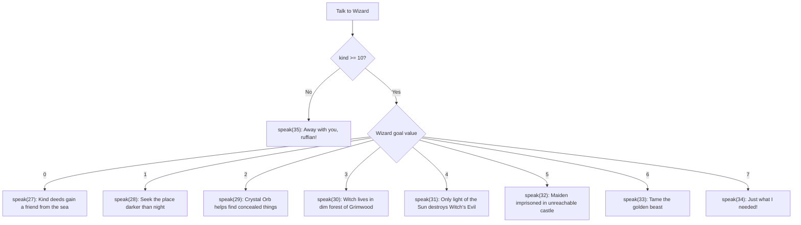
```mermaid
flowchart TD
    TALK_WIZ[Talk to Wizard] --> KIND_CHECK{kind >= 10?}
    KIND_CHECK -->|No| RUDE["speak(35): Away with you, ruffian!"]
    KIND_CHECK -->|Yes| GOAL_SWITCH{Wizard goal value}
    GOAL_SWITCH -->|0| S27["speak(27): Kind deeds gain a friend from the sea"]
    GOAL_SWITCH -->|1| S28["speak(28): Seek the place darker than night"]
    GOAL_SWITCH -->|2| S29["speak(29): Crystal Orb helps find concealed things"]
    GOAL_SWITCH -->|3| S30["speak(30): Witch lives in dim forest of Grimwood"]
    GOAL_SWITCH -->|4| S31["speak(31): Only light of the Sun destroys Witch's Evil"]
    GOAL_SWITCH -->|5| S32["speak(32): Maiden imprisoned in unreachable castle"]
    GOAL_SWITCH -->|6| S33["speak(33): Tame the golden beast"]
    GOAL_SWITCH -->|7| S34["speak(34): Just what I needed!"]
```

Source: `fmain.c:3380-3381`. Kindness threshold: `kind < 10` → `speak(35)`.

### 3.2 Priest

The priest has a three-stage progression based on quest items and stats.

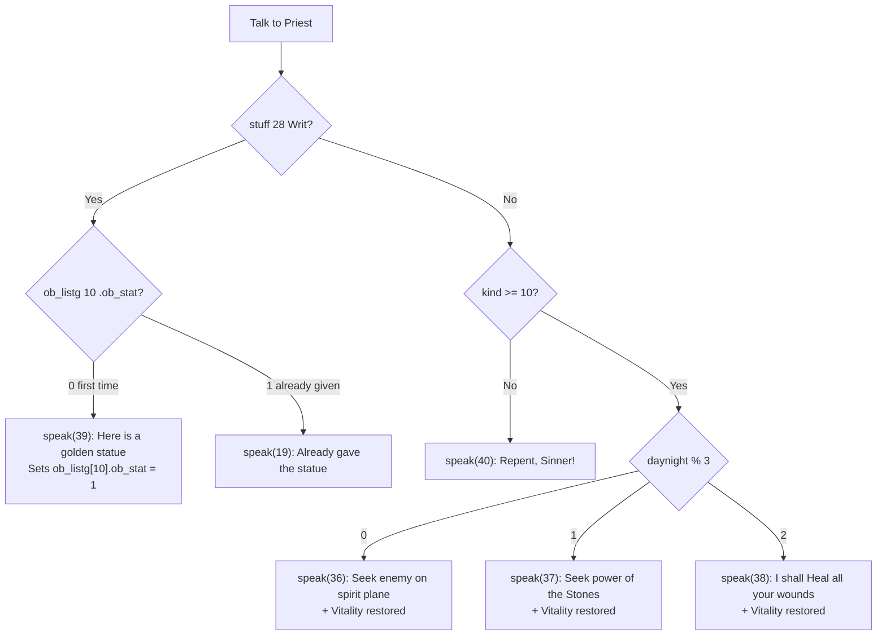
```mermaid
flowchart TD
    TALK_PRIEST[Talk to Priest] --> HAS_WRIT{stuff 28 Writ?}
    HAS_WRIT -->|Yes| ALREADY_GIVEN{ob_listg 10 .ob_stat?}
    ALREADY_GIVEN -->|0 first time| S39["speak(39): Here is a golden statue<br>Sets ob_listg[10].ob_stat = 1"]
    ALREADY_GIVEN -->|1 already given| S19["speak(19): Already gave the statue"]
    HAS_WRIT -->|No| KIND_CHECK2{kind >= 10?}
    KIND_CHECK2 -->|No| S40["speak(40): Repent, Sinner!"]
    KIND_CHECK2 -->|Yes| ROTATE{daynight % 3}
    ROTATE -->|0| S36["speak(36): Seek enemy on spirit plane<br>+ Vitality restored"]
    ROTATE -->|1| S37["speak(37): Seek power of the Stones<br>+ Vitality restored"]
    ROTATE -->|2| S38["speak(38): I shall Heal all your wounds<br>+ Vitality restored"]
```

Source: `fmain.c:3382-3394`. The vitality restoration (`15 + brave/4`) occurs on **every** visit when `kind >= 10` and no Writ — the rotating message (`daynight % 3`) selects only the speech text, not whether healing occurs. All three speeches (36, 37, 38) are followed by the heal.

### 3.3 King

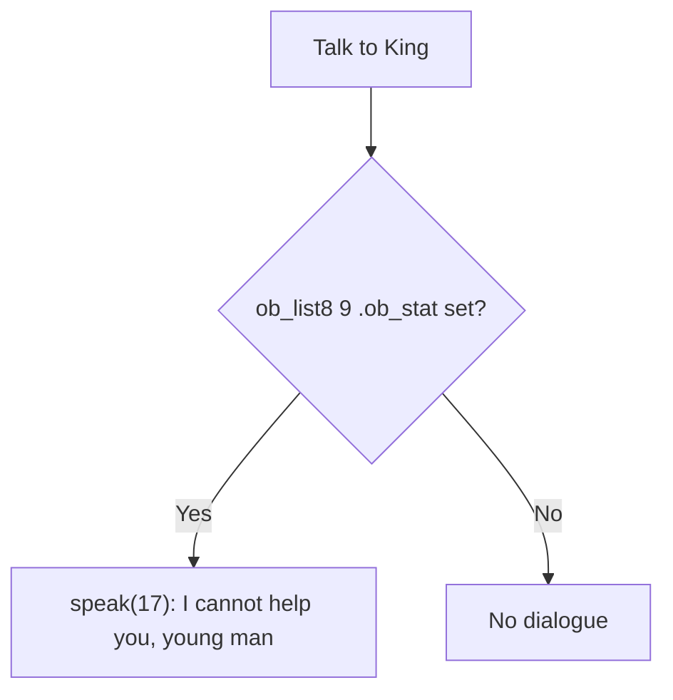
```mermaid
flowchart TD
    TALK_KING[Talk to King] --> PRINCESS_FLAG{ob_list8 9 .ob_stat set?}
    PRINCESS_FLAG -->|Yes| S17["speak(17): I cannot help you, young man"]
    PRINCESS_FLAG -->|No| SILENT[No dialogue]
```

Source: `fmain.c:3398`. The King's main role is post-rescue: after `rescue()` fires, he gives the Writ via `speak(18)` — `fmain2.c:1599`.

### 3.4 Sorceress

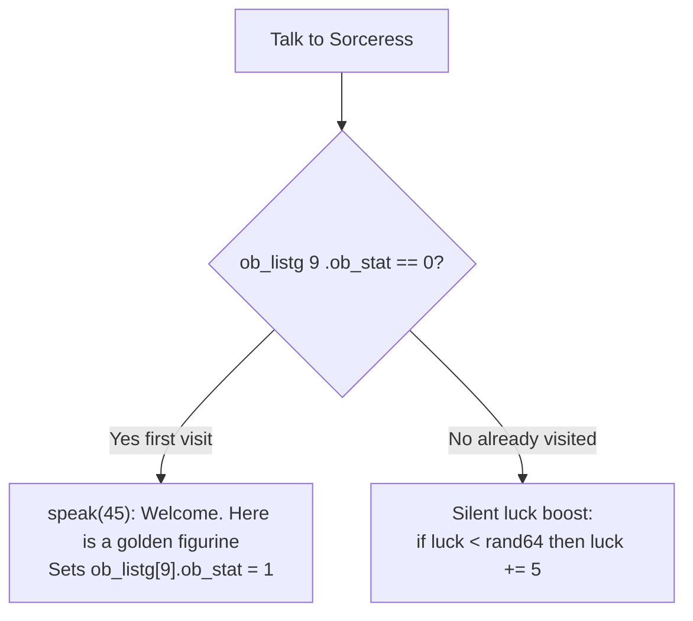
```mermaid
flowchart TD
    TALK_SORC[Talk to Sorceress] --> FIRST_VISIT{ob_listg 9 .ob_stat == 0?}
    FIRST_VISIT -->|Yes first visit| S45["speak(45): Welcome. Here is a golden figurine<br>Sets ob_listg[9].ob_stat = 1"]
    FIRST_VISIT -->|No already visited| LUCK_BOOST["Silent luck boost:<br>if luck < rand64 then luck += 5"]
```

Source: `fmain.c:3400-3405`. On first visit, the sorceress gives a Gold Statue and speaks. On return visits, no speech plays but `luck` silently increases by 5 (if `luck < rand64()`) — a hidden mechanical reward for revisiting.

### 3.5 Bartender

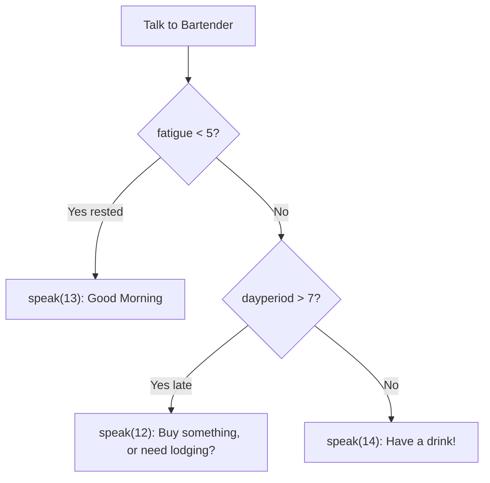
```mermaid
flowchart TD
    TALK_BAR[Talk to Bartender] --> FATIGUE_CHECK{fatigue < 5?}
    FATIGUE_CHECK -->|Yes rested| S13["speak(13): Good Morning"]
    FATIGUE_CHECK -->|No| TIME_CHECK{dayperiod > 7?}
    TIME_CHECK -->|Yes late| S12["speak(12): Buy something, or need lodging?"]
    TIME_CHECK -->|No| S14["speak(14): Have a drink!"]
```

Source: `fmain.c:3405-3407`. Bartenders (race `0x88`) also serve as shopkeepers — see BUY menu in [RESEARCH.md §18](RESEARCH.md#18-menu-system).

### 3.6 Witch

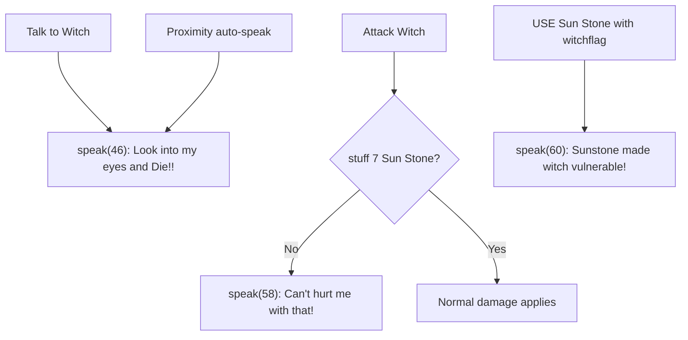
```mermaid
flowchart TD
    TALK_WITCH[Talk to Witch] --> S46["speak(46): Look into my eyes and Die!!"]
    PROXIMITY[Proximity auto-speak] --> S46
    ATTACK[Attack Witch] --> HAS_SUN{stuff 7 Sun Stone?}
    HAS_SUN -->|No| S58["speak(58): Can't hurt me with that!"]
    HAS_SUN -->|Yes| DAMAGE[Normal damage applies]
    USE_SUN[USE Sun Stone with witchflag] --> S60["speak(60): Sunstone made witch vulnerable!"]
```

Source: Talk — `fmain.c:3408`. Auto-speak — `fmain.c:2099`. Combat immunity — `fmain2.c:231-233`. Sun Stone USE — `fmain.c:3462`.

### 3.7 Spectre

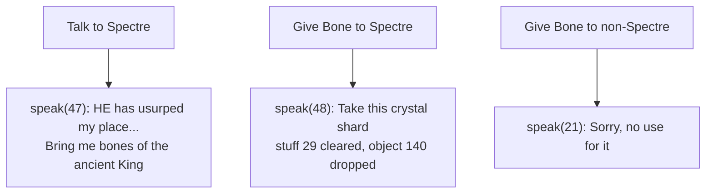
```mermaid
flowchart TD
    TALK_SPECTRE[Talk to Spectre] --> S47["speak(47): HE has usurped my place...<br>Bring me bones of the ancient King"]
    GIVE_BONE[Give Bone to Spectre] --> S48["speak(48): Take this crystal shard<br>stuff 29 cleared, object 140 dropped"]
    GIVE_OTHER[Give Bone to non-Spectre] --> S21["speak(21): Sorry, no use for it"]
```

Source: Talk — `fmain.c:3409`. Give Bone — `fmain.c:3501-3503`. The Spectre only appears at night (`lightlevel < 40` → `ob_listg[5].ob_stat = 3` — `fmain.c:2027-2028`).

### 3.8 Ghost (Dead Brother)

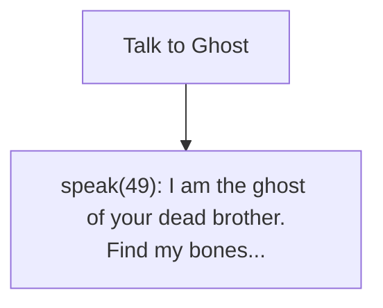
```mermaid
flowchart TD
    TALK_GHOST[Talk to Ghost] --> S49["speak(49): I am the ghost of your dead brother.<br>Find my bones..."]
```

Source: `fmain.c:3410`. Ghosts appear after a brother dies — `ob_listg[brother+2].ob_stat = 3` — `fmain.c:2841`. Finding and picking up the dead brother's bones merges their inventory into the current brother's — `fmain.c:3173-3177`.

### 3.9 Noble, Guard, Princess

| NPC | Race | Speech | Condition | Source |
|-----|------|--------|-----------|--------|
| Noble | 0x86 | `speak(20)`: "If you could rescue the king's daughter..." | Always | `fmain.c:3396` |
| Guard | 0x82/0x83 | `speak(15)`: "State your business!" | Always | `fmain.c:3394` |
| Princess | 0x84 | `speak(16)`: "Please, sir, rescue me..." | `ob_list8[9].ob_stat` set | `fmain.c:3397` |

Princess auto-speaks on proximity when captured — `fmain.c:2099`.

### 3.10 Beggar

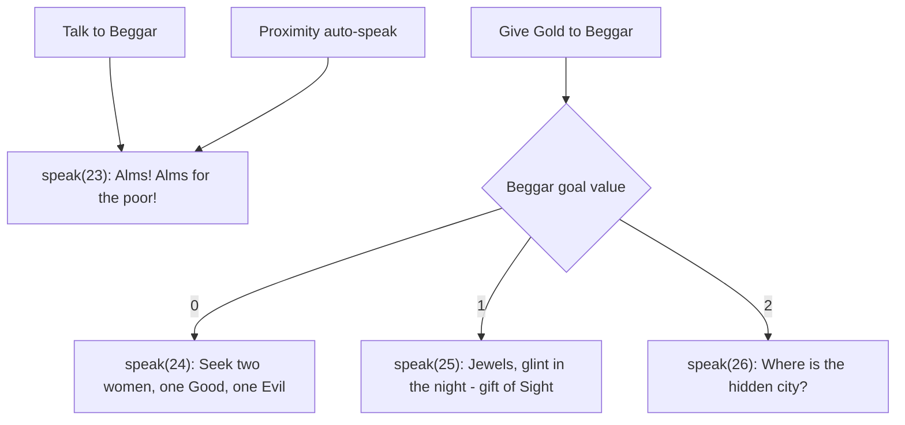
```mermaid
flowchart TD
    TALK_BEGGAR[Talk to Beggar] --> S23["speak(23): Alms! Alms for the poor!"]
    PROXIMITY[Proximity auto-speak] --> S23
    GIVE_GOLD[Give Gold to Beggar] --> GOAL{Beggar goal value}
    GOAL -->|0| S24["speak(24): Seek two women, one Good, one Evil"]
    GOAL -->|1| S25["speak(25): Jewels, glint in the night - gift of Sight"]
    GOAL -->|2| S26["speak(26): Where is the hidden city?"]
```

Source: Talk — `fmain.c:3414`. Auto-speak — `fmain.c:2097`. Give Gold — `fmain.c:3498`. Giving gold (costs 2 `wealth`) may also increase `kind` stat — `fmain.c:3496`.

> **Bug**: The beggar at `ob_list3[3]` (region 3, near Great Bog) has `goal=3`, which overflows the 3 beggar speeches (24–26) and reads `speak(27)` — the first wizard hint text ("Kind deeds could gain thee a friend from the sea"). Only goals 0–2 produce intended beggar dialogue.

### 3.11 Ranger

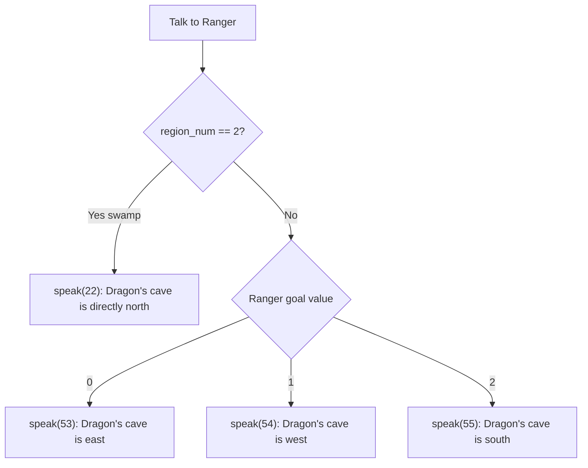
```mermaid
flowchart TD
    TALK_RANGER[Talk to Ranger] --> REGION{region_num == 2?}
    REGION -->|Yes swamp| S22["speak(22): Dragon's cave is directly north"]
    REGION -->|No| GOAL{Ranger goal value}
    GOAL -->|0| S53["speak(53): Dragon's cave is east"]
    GOAL -->|1| S54["speak(54): Dragon's cave is west"]
    GOAL -->|2| S55["speak(55): Dragon's cave is south"]
```

Source: `fmain.c:3411-3413`. Rangers only appear in ob_list0 (snow, 3 rangers) and ob_list2 (swamp, 1 ranger).

### 3.12 Turtle

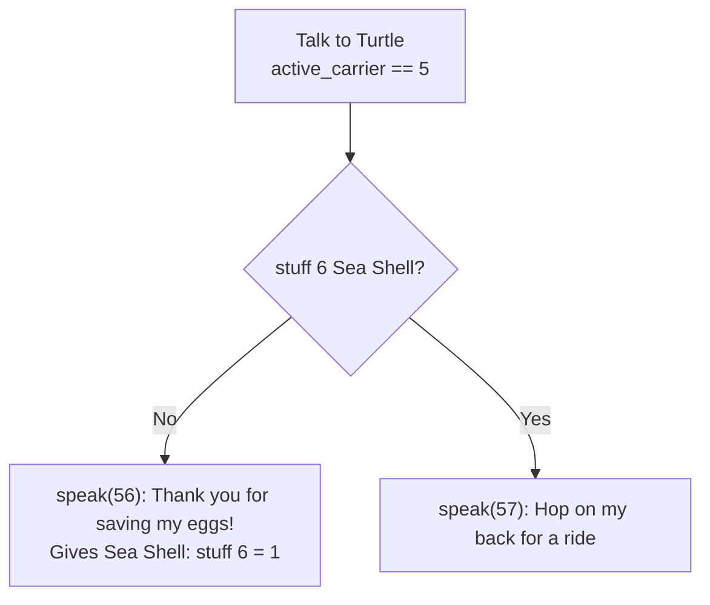
```mermaid
flowchart TD
    TALK_TURTLE[Talk to Turtle<br>active_carrier == 5] --> HAS_SHELL{stuff 6 Sea Shell?}
    HAS_SHELL -->|No| S56["speak(56): Thank you for saving my eggs!<br>Gives Sea Shell: stuff 6 = 1"]
    HAS_SHELL -->|Yes| S57["speak(57): Hop on my back for a ride"]
```

Source: `fmain.c:3418-3421`. The Turtle carrier (extent idx 1) starts at coordinates (0,0,0,0) — initially unreachable. It must be repositioned via `move_extent()`.

### 3.13 DreamKnight & Necromancer (Auto-Speak Only)

| NPC | Race | Auto-Speak | On Death | Source |
|-----|------|------------|----------|--------|
| DreamKnight | 7 | `speak(41)`: "None may enter the sacred shrine..." | `speak(42)`: "Your prowess in battle is great. You have earned the right to enter..." | `fmain.c:2101`, `fmain.c:2775` |
| Necromancer | 9 | `speak(43)`: "So this is the so-called Hero..." | Transforms to Woodcutter (race 10), drops Talisman | `fmain.c:2100`, `fmain.c:1751-1756` |

### 3.14 Enemy Speech

When the player talks to enemies, the speech index equals the enemy's `race` value — `fmain.c:3422`:

| Race | Enemy | Speech |
|------|-------|--------|
| 0 | Ogre | `speak(0)`: "A guttural snarl was the only reply." |
| 1 | Orc | `speak(1)`: "Human must die!" |
| 2 | Wraith | `speak(2)`: "Doom!" |
| 3 | Skeleton | `speak(3)`: "A clattering of bones" |
| 4 | Snake | `speak(4)`: "A waste of time to talk to a snake" |
| 5 | Salamander | `speak(5)`: "..." |
| 6 | Spider | `speak(6)`: "There was no reply." |
| 7 | DKnight | `speak(7)`: "Die, foolish mortal!" |

**Note**: The `narr.asm` comments label speak(6) as "loraii" and speak(7) as "necromancer", reflecting an earlier race table before Spider (6) and DKnight (7) were inserted. Loraii (race 8) and Necromancer (race 9) have special auto-speak handlers (`speak(43)` for Necromancer on extent entry) that preempt the generic talk handler, so the misaligned speeches at indices 8–9 are never heard in normal gameplay.

---

## 4. Brother Succession Narrative

When a brother dies, the fairy rescue system determines the outcome based on the `luck` stat. This is a deterministic system with no random element: if `luck >= 1` after the death penalty (`luck -= 5`), the fairy always rescues the brother. If `luck < 1`, the brother is permanently lost and the next brother takes over. Each brother's luck is a finite resource — Julian and Kevin can survive 3 deaths, Phillip can survive 6 (from starting stats alone). See [RESEARCH.md §15](RESEARCH.md#15-brother-succession).

### 4.1 Succession State Diagram

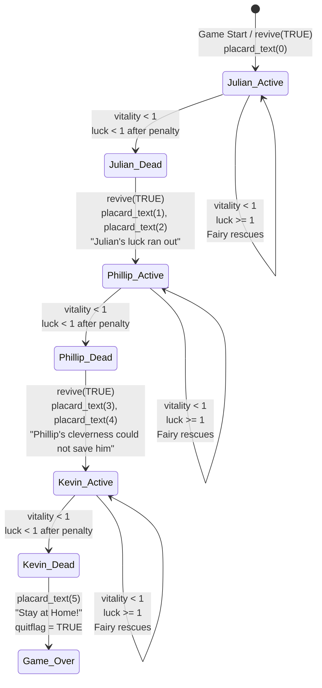
```mermaid
stateDiagram-v2
    [*] --> Julian_Active : Game Start / revive(TRUE)<br>placard_text(0)

    Julian_Active --> Julian_Dead : vitality < 1<br>luck < 1 after penalty
    Julian_Active --> Julian_Active : vitality < 1<br>luck >= 1<br>Fairy rescues

    Julian_Dead --> Phillip_Active : revive(TRUE)<br>placard_text(1), placard_text(2)<br>"Julian's luck ran out"

    Phillip_Active --> Phillip_Dead : vitality < 1<br>luck < 1 after penalty
    Phillip_Active --> Phillip_Active : vitality < 1<br>luck >= 1<br>Fairy rescues

    Phillip_Dead --> Kevin_Active : revive(TRUE)<br>placard_text(3), placard_text(4)<br>"Phillip's cleverness could not save him"

    Kevin_Active --> Kevin_Dead : vitality < 1<br>luck < 1 after penalty
    Kevin_Active --> Kevin_Active : vitality < 1<br>luck >= 1<br>Fairy rescues

    Kevin_Dead --> Game_Over : placard_text(5)<br>"Stay at Home!"<br>quitflag = TRUE
```

### 4.2 Placard Text Sequence

The `brother` variable (`fmain.c:567`) controls which placard text displays during `revive(TRUE)` — `fmain.c:2857-2872`:

| brother (after ++) | Placard | Text Summary |
|--------------------|---------|-------------|
| 1 (Julian starts) | `placard_text(0)` | *"Rescue the Talisman!" was the Mayor's plea... Julian set out on his quest.* |
| 2 (Phillip starts) | `placard_text(1)` then `placard_text(2)` | *Julian's luck had run out... So Phillip set out, determined to find his brother.* |
| 3 (Kevin starts) | `placard_text(3)` then `placard_text(4)` | *Phillip's cleverness could not save him... Kevin took up the quest, risking all.* |
| >3 (Game Over) | `placard_text(5)` | *"And so ends our sad tale. The Lesson of the Story: Stay at Home!"* |

Source: Placard text content in `narr.asm:252-302`.

### 4.3 Journey Start Messages

After the placard, each brother gets a contextual start message — `fmain.c:2885-2892`:

| Brother | Event Messages |
|---------|---------------|
| Julian | `event(9)`: *"% started the journey in his home village of Tambry."* |
| Phillip | `event(9)` + `event(10)`: *"...as had his brother before him."* |
| Kevin | `event(9)` + `event(11)`: *"...as had his brothers before him."* |

### 4.4 What Carries Over Between Brothers

| Persists | Resets |
|----------|--------|
| Princess counter (`princess`) | Stats loaded fresh from `blist[]` |
| Quest flags (`ob_listg`, `ob_list8` entries) | Inventory cleared (gets only a Dirk) |
| Princess rescued flag reset to 3 (`ob_list8[9].ob_stat = 3`) | Position resets to Tambry (19036, 15755) |
| Dead brother bones + ghost placed in world | Hunger, fatigue reset to 0 |

Source: `revive()` — `fmain.c:2814-2911`. Inventory clear at `fmain.c:2849-2850`. Ghost placement at `fmain.c:2837-2841`.

### 4.5 Recovering a Dead Brother's Items

When a living brother picks up the bones (ob_id 28) of a dead brother — `fmain.c:3173-3177`:

1. Both ghost setfigs are removed: `ob_listg[3].ob_stat = ob_listg[4].ob_stat = 0`
2. The dead brother's entire inventory (31 item slots) is merged into the current brother's inventory
3. Ghost dialogue before pickup: `speak(49)` — *"I am the ghost of your dead brother. Find my bones..."*

---

## 5. NPC Interactions

### 5.1 Wizard Interaction Flow

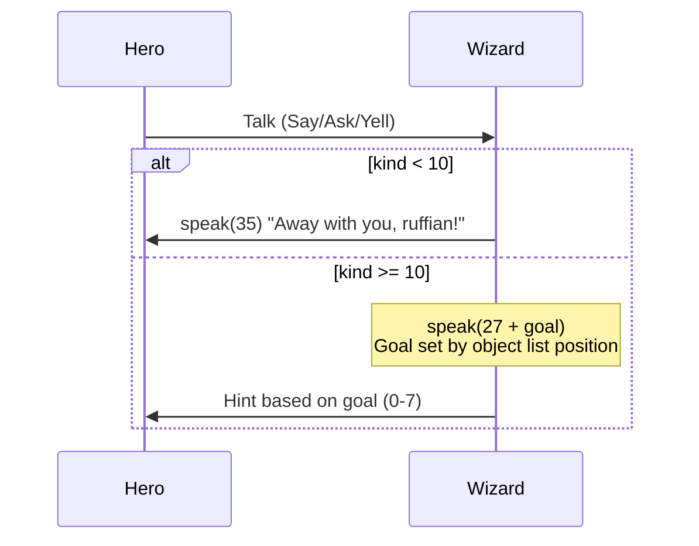
```mermaid
sequenceDiagram
    participant Hero
    participant Wizard

    Hero->>Wizard: Talk (Say/Ask/Yell)

    alt kind < 10
        Wizard->>Hero: speak(35) "Away with you, ruffian!"
    else kind >= 10
        Note over Wizard: speak(27 + goal)<br>Goal set by object list position
        Wizard->>Hero: Hint based on goal (0-7)
    end
```

**Wizard locations and hints**:

| Region | Object List | Goal | Hint Topic |
|--------|------------|------|------------|
| Swamp (region 2) | ob_list2[0] | 0 | Sea friend (Turtle) |
| Swamp (region 2) | ob_list2[1] | 1 | Place darker than night |
| Tambry (region 3) | ob_list3[2] | 2 | Crystal Orb reveals secrets |
| Farm/City (region 5) | ob_list5[3] | 3 | Witch in Grimwood |
| Farm/City (region 5) | ob_list5[4] | 4 | Sun destroys Witch |
| Indoors (region 8) | ob_list8[5] | 5 | Princess in unreachable castle |
| Indoors (region 8) | ob_list8[6] | 6 | Tame the golden beast (Swan) |
| Underground (region 9) | ob_list9[6] | 6 | Tame the golden beast (Swan) — same hint as region 8 wizard |

### 5.2 Priest Interaction Flow

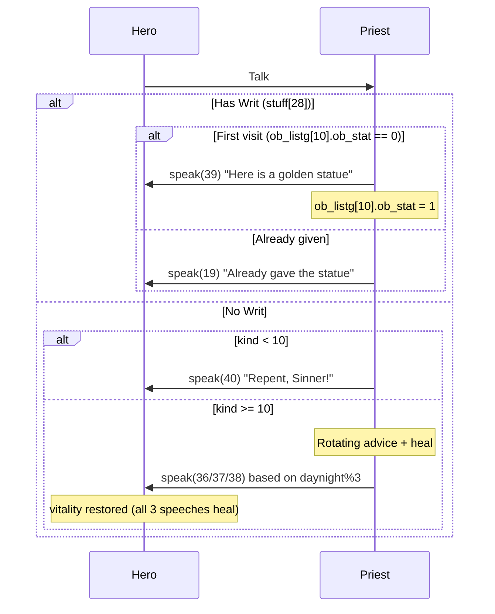
```mermaid
sequenceDiagram
    participant Hero
    participant Priest

    Hero->>Priest: Talk

    alt Has Writ (stuff[28])
        alt First visit (ob_listg[10].ob_stat == 0)
            Priest->>Hero: speak(39) "Here is a golden statue"
            Note over Priest: ob_listg[10].ob_stat = 1
        else Already given
            Priest->>Hero: speak(19) "Already gave the statue"
        end
    else No Writ
        alt kind < 10
            Priest->>Hero: speak(40) "Repent, Sinner!"
        else kind >= 10
            Note over Priest: Rotating advice + heal
            Priest->>Hero: speak(36/37/38) based on daynight%3
            Note over Hero: vitality restored (all 3 speeches heal)
        end
    end
```

### 5.3 Spectre / Bone / Shard Exchange

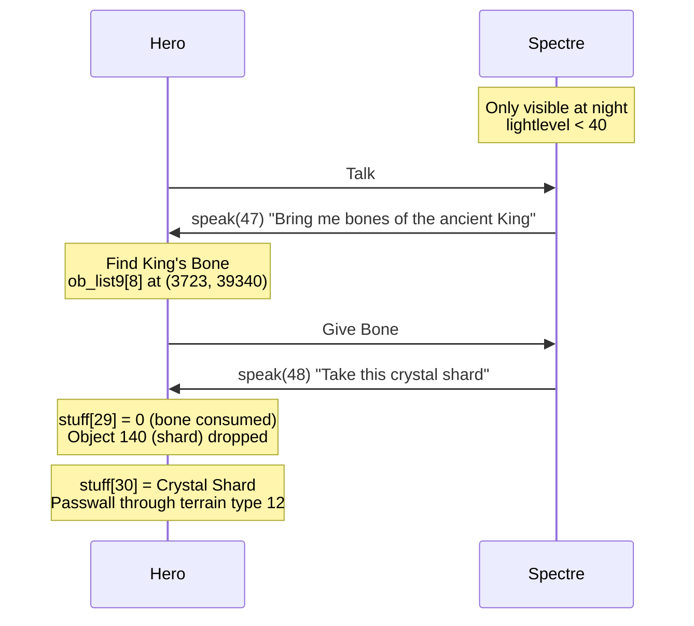
```mermaid
sequenceDiagram
    participant Hero
    participant Spectre

    Note over Spectre: Only visible at night<br>lightlevel < 40

    Hero->>Spectre: Talk
    Spectre->>Hero: speak(47) "Bring me bones of the ancient King"

    Note over Hero: Find King's Bone<br>ob_list9[8] at (3723, 39340)

    Hero->>Spectre: Give Bone
    Spectre->>Hero: speak(48) "Take this crystal shard"
    Note over Hero: stuff[29] = 0 (bone consumed)<br>Object 140 (shard) dropped
    Note over Hero: stuff[30] = Crystal Shard<br>Passwall through terrain type 12
```

### 5.4 Witch Combat Encounter

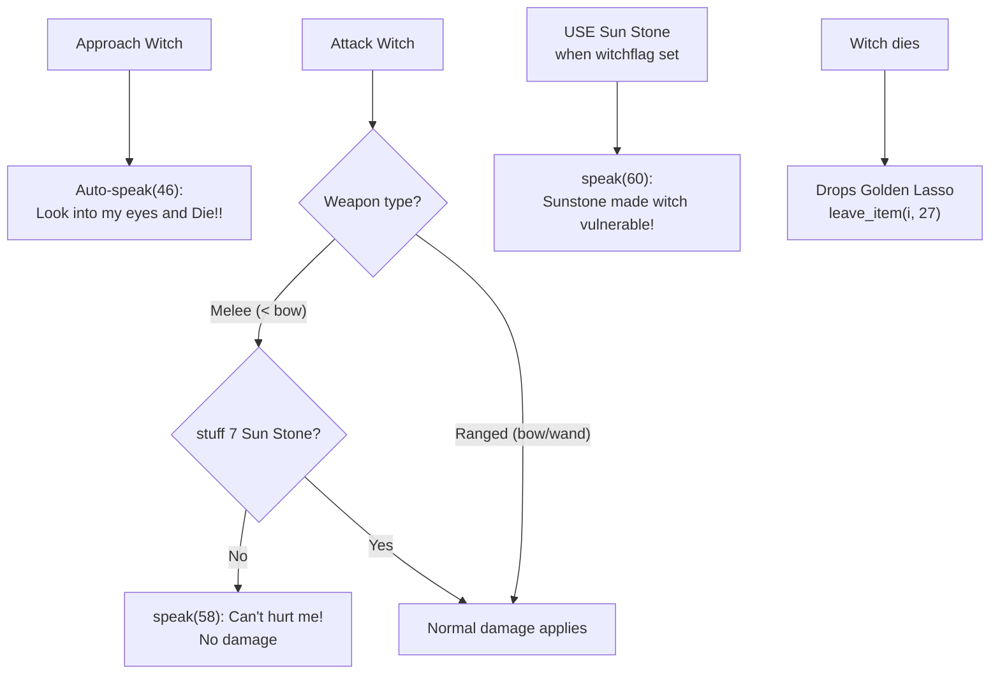
```mermaid
flowchart TD
    APPROACH[Approach Witch] --> AUTO["Auto-speak(46):<br>Look into my eyes and Die!!"]
    ATTACK[Attack Witch] --> WEAPON{Weapon type?}
    WEAPON -->|"Melee (< bow)"| SUN{stuff 7 Sun Stone?}
    SUN -->|No| IMMUNE["speak(58): Can't hurt me!<br>No damage"]
    SUN -->|Yes| DAMAGE[Normal damage applies]
    WEAPON -->|"Ranged (bow/wand)"| DAMAGE

    USE_SUNSTONE[USE Sun Stone<br>when witchflag set] --> VULNERABLE["speak(60):<br>Sunstone made witch vulnerable!"]

    WITCH_DIES[Witch dies] --> LASSO_DROP["Drops Golden Lasso<br>leave_item(i, 27)"]
```

Source: Combat immunity — `fmain2.c:231-233`. Lasso drop — `fmain.c:1756`. Sun Stone USE — `fmain.c:3462`.

### 5.5 Necromancer Final Battle

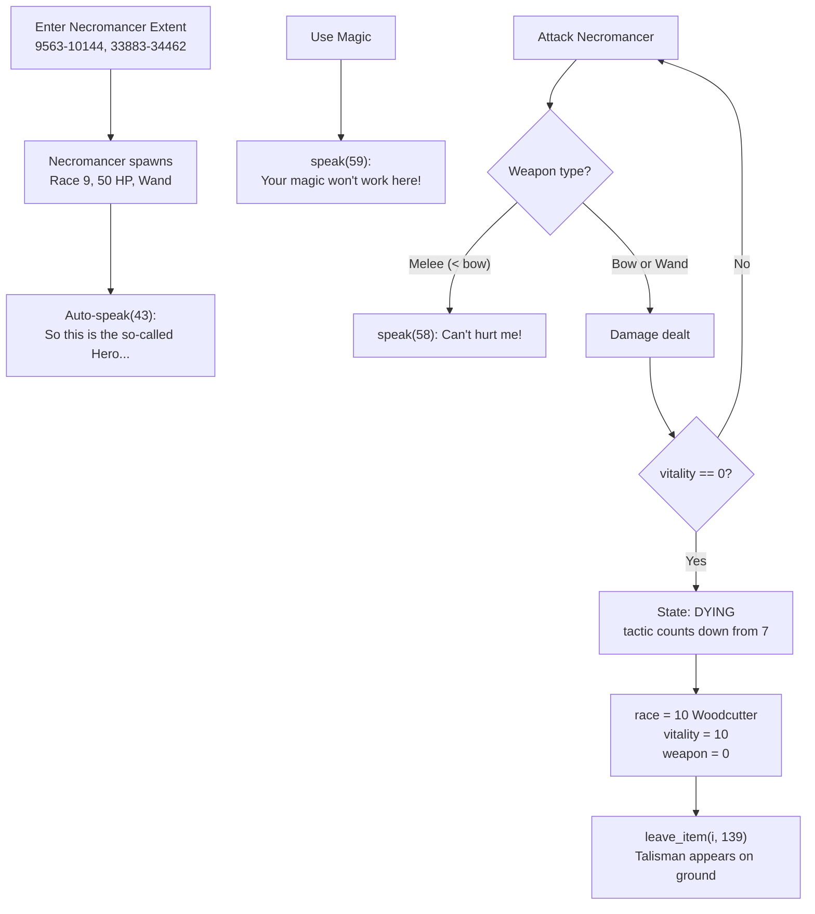
```mermaid
flowchart TD
    ENTER_ARENA[Enter Necromancer Extent<br>9563-10144, 33883-34462] --> SPAWN["Necromancer spawns<br>Race 9, 50 HP, Wand"]
    SPAWN --> AUTO["Auto-speak(43):<br>So this is the so-called Hero..."]

    MAGIC_ATTEMPT[Use Magic] --> BLOCKED["speak(59):<br>Your magic won't work here!"]

    ATTACK[Attack Necromancer] --> WEAPON{Weapon type?}
    WEAPON -->|"Melee (< bow)"| IMMUNE["speak(58): Can't hurt me!"]
    WEAPON -->|"Bow or Wand"| DAMAGE[Damage dealt]

    DAMAGE --> DEAD{vitality == 0?}
    DEAD -->|No| ATTACK
    DEAD -->|Yes| DYING["State: DYING<br>tactic counts down from 7"]
    DYING --> TRANSFORM["race = 10 Woodcutter<br>vitality = 10<br>weapon = 0"]
    TRANSFORM --> DROP_TALISMAN["leave_item(i, 139)<br>Talisman appears on ground"]
```

Source: Extent — `fmain.c:343`. Stats — `fmain.c:62`. Magic block — `fmain.c:3305`. Death handler — `fmain.c:1751-1756`.

### 5.6 Dark Knight (Knight of Dreams)

The DKnight is a unique fixed encounter guarding the elf glade, where the Sun Stone is located. Unlike other enemies, it does not use the tactic system — it stands still facing south at a hardcoded position, physically blocking passage. See [RESEARCH.md §9.8](RESEARCH.md#98-dark-knight-dknight).

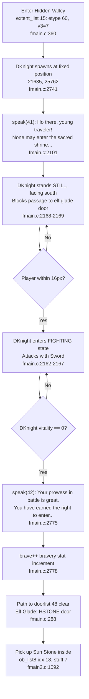
```mermaid
flowchart TD
    ENTER[Enter Hidden Valley<br>extent_list 15: etype 60, v3=7<br>fmain.c:360] --> SPAWN[DKnight spawns at fixed position<br>21635, 25762<br>fmain.c:2741]
    SPAWN --> SPEAK41["speak(41): Ho there, young traveler!<br>None may enter the sacred shrine...<br>fmain.c:2101"]
    SPEAK41 --> IDLE[DKnight stands STILL, facing south<br>Blocks passage to elf glade door<br>fmain.c:2168-2169]

    IDLE --> APPROACH{Player within 16px?}
    APPROACH -->|No| IDLE
    APPROACH -->|Yes| FIGHT[DKnight enters FIGHTING state<br>Attacks with Sword<br>fmain.c:2162-2167]

    FIGHT --> DEAD{DKnight vitality == 0?}
    DEAD -->|No| FIGHT
    DEAD -->|Yes| SPEAK42["speak(42): Your prowess in battle is great.<br>You have earned the right to enter...<br>fmain.c:2775"]
    SPEAK42 --> BRAVE[brave++ bravery stat increment<br>fmain.c:2778]
    BRAVE --> CLEAR[Path to doorlist 48 clear<br>Elf Glade: HSTONE door<br>fmain.c:288]
    CLEAR --> SUNSTONE[Pick up Sun Stone inside<br>ob_list8 idx 18, stuff 7<br>fmain2.c:1092]
```

**DKnight combat stats**:

| Stat | Value | Source |
|------|-------|--------|
| Hitpoints | 40 | `fmain.c:61` |
| Weapon | Sword (3) | `fmain2.c:867` |
| Goal | ATTACK2 (clever) | ATTACK1 + cleverness 1 |
| Melee threshold | 16 (overridden from normal 12) | `fmain.c:2163` |
| Aggressive | TRUE | `fmain.c:61` |
| Treasure | None (group 0) | `fmain.c:61` |

**Key behaviors**:
- **No pursuit**: Outside melee range, the DKnight stands STILL facing south (direction 5) — it never chases the player (`fmain.c:2168-2169`). All other enemies use the tactic system when out of range.
- **Extended engagement**: Normal ATTACK2 enemies engage at threshold 12 (14 − mode). The DKnight overrides this to 16, a 33% larger radius (`fmain.c:2163`).
- **No flee**: The DKnight's race (7) matches extent v3 (7), so the flee condition at `fmain.c:2138-2140` is suppressed — it fights to the death.
- **Respawns**: The DKnight spawns every time the player enters the hidden valley extent (`fmain.c:2687-2691`). No death flag is persisted.
- **DOOR_SEEK/DOOR_LET unused**: `ftale.h:53-54` defines goal modes DOOR_SEEK (11) and DOOR_LET (12), but no code references them. The DKnight's door-blocking behavior is entirely hardcoded.

---

