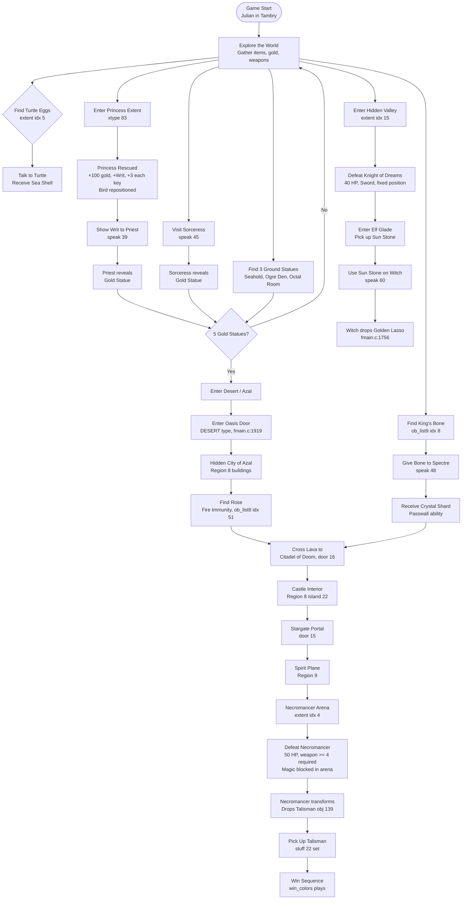

# Storyline — Story Overview & Quest Progression

High-level narrative summary and quest progression mechanics.

> **Citation format**: `file.c:LINE` or `file.c:START-END`. Speech references: `speak(N)`.
> Split from [STORYLINE.md](STORYLINE.md). See the hub document for the full section index.

---

## 1. Story Overview

Three brothers — Julian, Phillip, and Kevin — live in the village of Tambry. The Talisman, a powerful artifact protecting their land, has been stolen by a Necromancer. The village mayor pleads: *"Rescue the Talisman!"* — `placard_text(0)`, `narr.asm:252-260`.

Julian, the eldest and bravest, sets out first. If he falls, Phillip takes up the quest. If Phillip also fails, young Kevin is the last hope. If all three perish, the tale ends: *"The Lesson of the Story: Stay at Home!"* — `placard_text(5)`, `narr.asm:299-302`.

The quest spans a vast overworld divided into outdoor regions (snow, swamp, desert, forest, lava, mountains, farmland) and indoor areas (castles, keeps, cabins, dungeons, caves). Along the way, brothers rescue princesses, gather golden figurines, consult wizards, and ultimately confront the Necromancer to recover the Talisman.

### The Three Brothers

| Brother | Brave | Luck | Kind | Wealth | Starting Vitality | Defining Trait |
|---------|-------|------|------|--------|-------------------|----------------|
| Julian  | 35    | 20   | 15   | 20     | 23                | Strongest fighter |
| Phillip | 20    | 35   | 15   | 15     | 20                | Most fairy rescues (highest luck) |
| Kevin   | 15    | 20   | 35   | 10     | 18                | Kindest; weakest combatant |

Source: `blist[]` — `fmain.c:2807-2812`. Vitality = `15 + brave/4` — `fmain.c:2901`.

### The Three Princesses

| Order | Name  | Relationship | Placard Texts |
|-------|-------|-------------|---------------|
| 1st   | Katra | Princess of Marheim | `placard_text(8-10)` |
| 2nd   | Karla | Katra's sister | `placard_text(11-13)` |
| 3rd   | Kandy | Katra's and Karla's sister | `placard_text(14-16)` |

Source: `narr.asm:302-336`. Counter: `princess` variable — `fmain.c:568`.

### Narrative Walkthrough

The quest begins in **Tambry** (sectors 64–69), a small village in the plains. Julian sets out with only a dirk, 20 gold pieces, and the mayor's plea. The world is large and nonlinear — there is no enforced quest order — but the item gates create a natural progression.

**Early exploration**: The hero explores the plains around Tambry and the nearby farms and city of **Marheim** (sectors 80–95). Talking to **wizards** (when `kind >= 10`) yields cryptic hints: *"Kind deeds could gain thee a friend from the sea"*, *"The Witch lives in the dim forest of Grimwood"*, *"Only the light of the Sun can destroy the Witch's Evil."* **Beggars**, when given gold, offer prophecies: *"Seek two women, one Good, one Evil"*, *"Where is the hidden city?"*. **Rangers** give directions to the dragon's cave. **Priests** heal the hero's wounds on every visit (`vitality = 15 + brave/4`) and offer counsel about the spirit plane and teleport stones. The **King** at Marheim can only lament: *"I cannot help you, young man"* — until the princess is rescued.

**The Turtle and Sea Shell**: In the **Witch Wood** (region 1), the hero discovers **Turtle Eggs** at an extent zone (22945–23225, 5597–5747). When the turtle carrier spawns, talking to it earns gratitude: *"Oh, thank you for saving my eggs!"* — and the **Sea Shell** (`stuff[6]`), which can be USEd anywhere to summon the turtle for ocean travel. This opens the coastlines and islands.

**Princess Rescue**: The princess is imprisoned in the **Unreachable Castle** — an isolated room (sector 129, region 8) accessible only through door 67, a STAIR entrance in the forest and wilderness region (region 7). The outdoor entrance is completely surrounded by mountain terrain, requiring the swan to fly over the mountains and land at the door. No underground tunnel connects to this location. When the hero enters the princess extent zone with `ob_list8[9].ob_stat != 0`, the rescue cinematic plays. The hero is teleported to Marheim (5511, 33780), the **King** speaks: *"Here is a writ designating you as my official agent"* — granting the **Writ** (`stuff[28]`), 100 gold, and 3 of each key type. The bird extent is also repositioned from the southern mountains to the Marheim farmlands (`move_extent(0, 22205, 21231)`), a hidden reward. Each brother can trigger one rescue; the `princess` counter advances through Katra → Karla → Kandy.

**The Five Golden Statues**: Five golden figurines of Azal-Car-Ithil are needed to enter the **Burning Waste** desert and reach the hidden city of **Azal** (sectors 159–162). Three statues sit on the ground: at **Seahold** (`ob_listg[6]`), in the **Ogre Den** (`ob_listg[7]`), and in the **Octagonal Room** (`ob_listg[8]`). The **Sorceress** at the Crystal Palace gives one on first visit: *"Welcome. Here is one of the five golden figurines you will need."* The **Priest** gives one when shown the Writ: *"Ah! You have a writ from the king. Here is one of the golden statues."* Both NPCs "give" statues by making invisible ground objects visible (`ob_stat = 1`), which the player picks up normally.

**The Dark Knight and Sun Stone**: The **Knight of Dreams** (race 7, 40 HP) guards the **Hidden Valley** (extent idx 15, region 7). *"None may enter the sacred shrine of the People who came Before!"* Defeating him grants access: *"You have earned the right to enter and claim the prize."* Inside the Elf Glade sanctuary (door 48, HSTONE type), the **Sun Stone** (`stuff[7]`) awaits — the key to defeating the Witch.

**The Witch and Golden Lasso**: In **Grimwood** (Witch's Castle, sectors 96–99), the Witch hisses: *"Look into my eyes and Die!!"* Without the Sun Stone, all attacks are blocked: *"Stupid fool, you can't hurt me with that!"* USEing the Sun Stone when the witch is present makes her vulnerable. Killing her (race `0x89`) drops the **Golden Lasso** (`stuff[5]`, `leave_item(i, 27)` — `fmain.c:1756`). The lasso is the key to the swan.

**The Swan**: The bird carrier (`actor_file == 11`) can only be mounted when the hero has the Golden Lasso (`stuff[5]`) and is near the bird (`raftprox && wcarry == 3` — `fmain.c:1497-1502`). Without the lasso, the bird sits on the ground, unmountable. Once mounted (`riding = 11`), the swan uses momentum-based physics (`environ = -2`, velocity cap `e = 40` — `fmain.c:1582`) and bypasses terrain collision entirely (`goto newloc` skips `proxcheck()` — `fmain.c:1591-1594`), making the entire world accessible — mountains, water, lava, all flyable. Facing is derived from velocity, not joystick input (`set_course(0, -nvx, -nvy, 6)` — `fmain.c:1592`). Dismounting (fire button) is blocked in three cases: in the volcanic `fiery_death` zone (*"Ground is too hot for swan to land"* — `event(32)`, `fmain.c:1418`), at high velocity when `|vel_x| >= 15` or `|vel_y| >= 15` (*"Flying too fast to dismount"* — `event(33)`, `fmain.c:1427`), or silently when the landing terrain is impassable (`proxcheck` at two heights — `fmain.c:1421-1422`). On successful dismount, the hero is repositioned 14 pixels above the swan's position (`fmain.c:1420, 1424`).

**The Spectre and Crystal Shard**: The **Spectre** (visible only at night, `lightlevel < 40`) haunts a crypt near Marheim. *"HE has usurped my place as lord of undead. Bring me bones of the ancient King."* Finding the **King's Bone** (`stuff[29]`, `ob_list9[8]`) in the underground and giving it to the Spectre yields the **Crystal Shard** (`stuff[30]`): *"Take this crystal shard."* The Shard allows walking through terrain type 12 — spirit barriers in the dungeon passages leading to the Necromancer.

**The Rose and Desert**: With 5 Golden Statues, the hero can enter the desert through oasis doors (`stuff[25] >= 5` — `fmain.c:1919`). Without them, the desert tiles are overwritten to block passage (`fmain.c:3594`). Inside the hidden city of **Azal** (region 8, doors 7–11), the hero finds the **Rose** (`stuff[23]`, `ob_list8[51]`). The Rose grants fire immunity in the lava zone — when in the `fiery_death` area, `stuff[23]` resets environmental damage to 0 (`fmain.c:1844`). This is essential for reaching the **Citadel of Doom** (door 16), which sits inside the volcanic `fiery_death` zone (region 6).

**The Spirit Plane and Necromancer**: Through the **Citadel of Doom** (door 16, region 6 volcanic), the hero enters the Doom castle interior (region 8, sectors 135–138). A stargate portal (door 15) leads from the castle to the **Spirit Plane** (sectors 43–59, 100, 143–149 in region 9) — a twisted maze where *"Space may twist, and time itself may run backwards!"* The Crystal Shard is needed to navigate its barriers. At the heart lies the **Necromancer's Arena** (sector 46, extent idx 4). The Necromancer (race 9, 50 HP) taunts: *"So this is the so-called Hero... Simply Pathetic."* He can only be damaged with the Bow or Magic Wand (`weapon >= 4`); lesser weapons are deflected: *"Stupid fool, you can't hurt me with that!"* Magic is also explicitly blocked in his arena (`extn->v3 == 9`): *"Your magic won't work here, fool!"*

**Victory**: When the Necromancer falls, he transforms into a normal man (race 10, Woodcutter) and drops the **Talisman** (object 139, `leave_item(i, 139)` — `fmain.c:1754`). *"The Necromancer had been transformed into a normal man. All of his evil was gone."* Picking up the Talisman sets `stuff[22]`, which triggers `quitflag = TRUE`. The win sequence plays: *"Having defeated the villainous Necromancer and recovered the Talisman, [name] returned to Marheim where he wed the princess..."* A sunrise color animation plays over a victory image, and the tale ends.

---

## 2. Quest Progression

### 2.1 Complete Quest Chain

### 2.2 Gold Statue Sources

Five golden figurines are required to access the desert and the hidden city of Azal (`stuff[25] >= 5` — `fmain.c:1919`). Without them, DESERT-type doors block entry and the Azal map tiles are overwritten to be impassable (`fmain.c:3594-3596`).

| # | Source | Location | How Obtained |
|---|--------|----------|-------------|
| 1 | Sorceress | ob_listg[9], (12025, 37639) | Talk to sorceress; `speak(45)`, sets `ob_listg[9].ob_stat = 1` — `fmain.c:3400-3403` |
| 2 | Priest | ob_listg[10], (6700, 33766) | Show Writ to priest; `speak(39)`, sets `ob_listg[10].ob_stat = 1` — `fmain.c:3384-3385` |
| 3 | Seahold | ob_listg[6], (11092, 38526) | Ground pickup — `fmain2.c:1008` |
| 4 | Ogre Den | ob_listg[7], (25737, 10662) | Ground pickup — `fmain2.c:1009` |
| 5 | Octal Room | ob_listg[8], (2910, 39023) | Ground pickup — `fmain2.c:1010` |

> **Note**: Dialogue-revealed statues work through the standard Take mechanic — setting `ob_stat = 1` makes the object world-visible; the player picks it up via `itrans` like any ground object. See [PROBLEMS.md P21](PROBLEMS.md) (resolved).

### 2.3 Key Quest Items

| Item | stuff[] | How Obtained | Purpose |
|------|---------|-------------|---------|
| Writ | stuff[28] | Princess rescue → `fmain2.c:1598` | Show to Priest for Gold Statue |
| Gold Statues ×5 | stuff[25] | Various (§2.2) | Gate to desert/Azal |
| Sun Stone | stuff[7] | Ground pickup, ob_list8[18] | Makes Witch vulnerable — `fmain2.c:231-233`. Also required for combat: without Sun Stone, all attacks on Witch are blocked (`speak(58)`) |
| Golden Lasso | stuff[5] | Dropped by witch (race 0x89) on death — `fmain.c:1756` | Enables riding the Swan — `fmain.c:1498` |
| Sea Shell | stuff[6] | Talk to Turtle with `active_carrier==5` | Summon Turtle for water travel |
| Rose | stuff[23] | Ground pickup, ob_list8[51] | Fire immunity — `fmain.c:1844` |
| Bone | stuff[29] | Ground pickup, ob_list9[8] | Give to Spectre for Shard |
| Crystal Shard | stuff[30] | Give Bone to Spectre — `fmain.c:3503` | Walk through terrain type 12 (crystal/spirit barriers) — `fmain.c:1609`. Required for navigating Spirit Plane |
| Crystal Orb | stuff[12] | Pickups/containers | `secret_timer` — reveals secret passages |
| Talisman | stuff[22] | Necromancer drops on death — `fmain.c:1754` | Picking it up wins the game |

See [RESEARCH.md §10](RESEARCH.md#10-inventory--items) for full item mechanics.

### 2.4 Transport Progression

Four transport modes exist, each unlocking new areas of the world. All carriers share `anim_list[3]` (except the raft at `anim_list[1]`), meaning only one active carrier at a time.

| Carrier | Actor | How Obtained | Capability | Restriction |
|---------|-------|-------------|------------|-------------|
| Raft | 1 | Automatic near water edges | Cross rivers/lakes | Water only; no steering |
| Turtle | 5 | Save turtle eggs → talk to turtle → USE Sea Shell | Ocean travel | Water only; summoned via `move_extent(1,...)` |
| Swan (bird) | 11 | Extent zone (idx 0); requires Golden Lasso (`stuff[5]`) to mount (`fmain.c:1498`) | Unrestricted flight over all terrain | Dismount blocked in lava (`event(32)`), at speed (`event(33)`), or on impassable terrain (`fmain.c:1421-1422`) |

**Key interactions**:
- All carriers suppress random encounters (`fmain.c:2081`)
- All doors are blocked while mounted (`fmain.c:1901`)
- Cannot talk to NPCs while riding swan/bird (`riding==11`, `fmain.c:2338`)
- Freeze spell blocked when `riding > 1` (`fmain.c:3308`)
- After combat, the turtle auto-resumes if turtle eggs are visible (`fmain2.c:274`)
- Carrier and enemy shapes share memory — loading one unloads the other (`fmain.c:2730, 2791`)

Source: `load_carrier()` — `fmain.c:2784-2802`. Extent zones — `fmain.c:2680-2720`.

### 2.5 Magic Items

Seven magic items (`stuff[9]`–`stuff[15]`) provide tactical advantages. All require weapon slot selection and are consumed on use via the MAGIC menu (`fmain.c:3301-3324`).

| Item | stuff[] | Effect | Source |
|------|---------|--------|--------|
| Blue Stone | stuff[9] | Teleport to Great Stone Ring (sector 144) | `fmain.c:3312` |
| Green Jewel | stuff[10] | Teleport to last-visited inn | `fmain.c:3315` |
| Gold Ring | stuff[11] | Freeze all enemies on screen | `fmain.c:3308` — blocked when `riding > 1` |
| Crystal Orb | stuff[12] | Start `secret_timer` — reveals hidden objects (`ob_stat == 5`) | `fmain.c:3310` |
| Vial | stuff[13] | Full heal: vitality = `15 + brave/4` | `fmain.c:3319` |
| Jade Skull | stuff[14] | Kill all enemies on screen | `fmain.c:3321` |
| Red Gem | stuff[15] | *(Listed in `inv_list` but no effect code found)* | — |

> **Note**: The Crystal Orb (`stuff[12]`) is uniquely valuable — it reveals hidden ground objects by setting `secret_timer`, which cycles `ob_stat` between 5 and 6 (visible/hidden) each frame. Objects with `ob_stat == 5` have their `race` temporarily set to 0, making them pickable.

---

