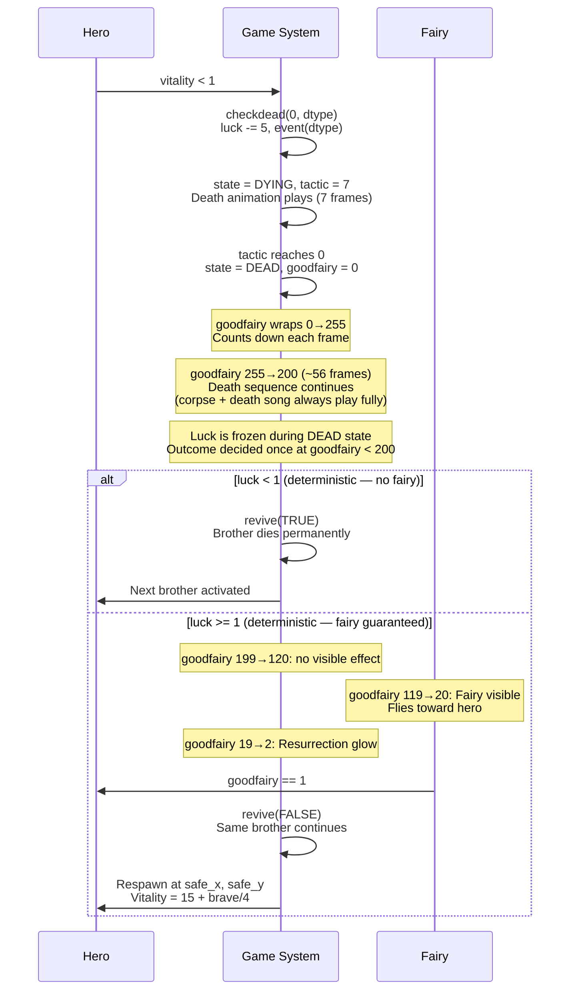
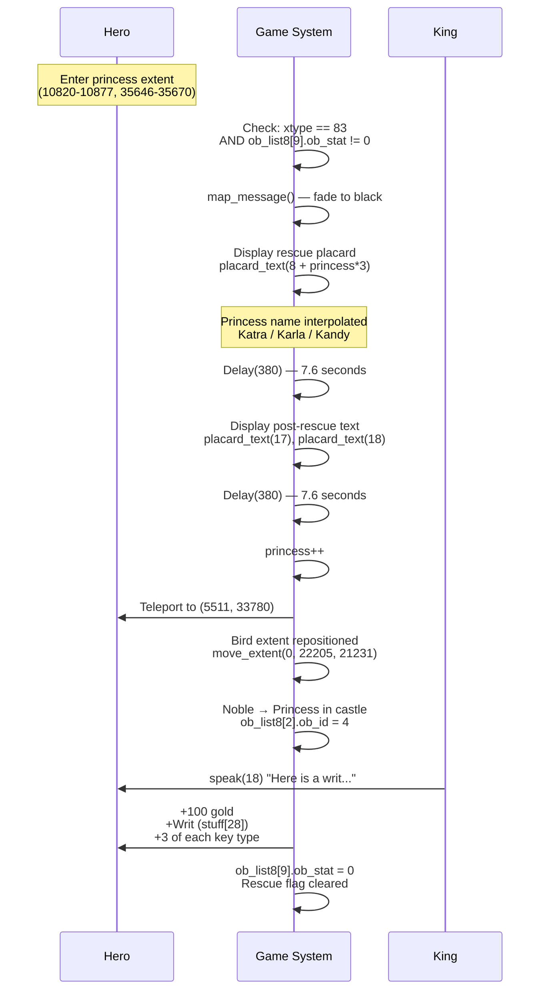
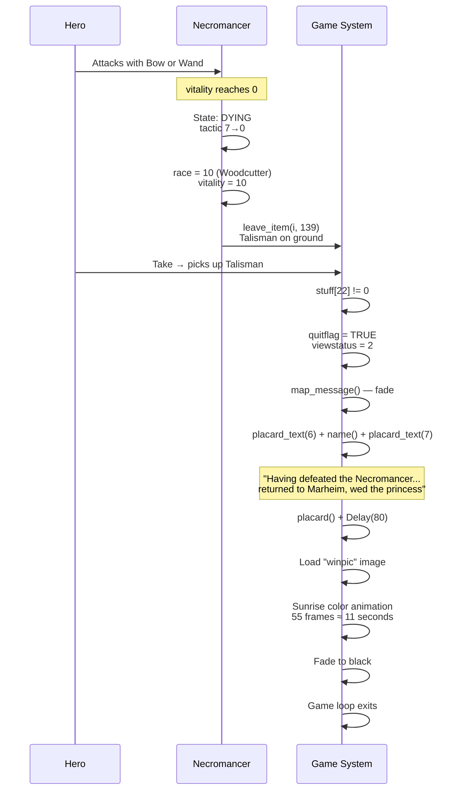
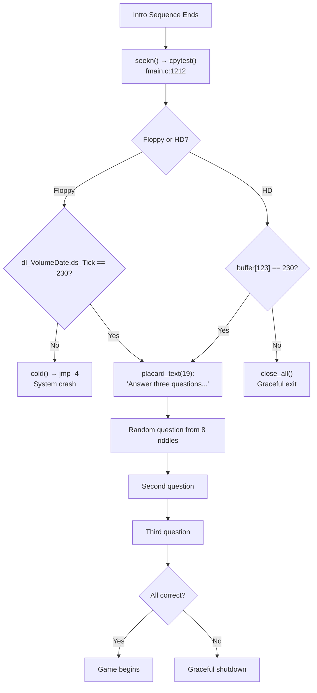
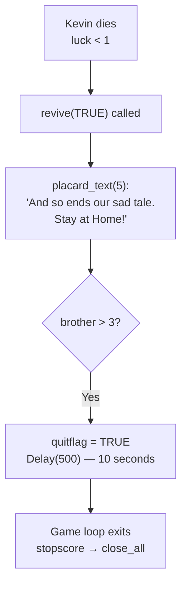

# Storyline — World Map & Event Sequences

Location map, door connections, peace zones, and major event sequences.

> **Citation format**: `file.c:LINE` or `file.c:START-END`. Speech references: `speak(N)`.
> Split from [STORYLINE.md](STORYLINE.md). See the hub document for the full section index.

---

## 6. Location Map

### 6.1 Outdoor Regions

The world is divided into 8 outdoor regions (0–7) plus 2 indoor regions (8–9). The outdoor world is a **2×4 grid** computed from map coordinates: `x_col = ((map_x+151)>>14) & 1`, `y_row = ((map_y+64)>>13) & 7`, `region = x_col + y_row*2` — `fmain.c:2633-2637`.

```
          WEST (x=0)              EAST (x=1)
       ┌─────────────────────┬─────────────────────┐
 NORTH │  0 — Snow Land      │  1 — Witch Wood /   │
 (y=0) │      (F1)           │      Maze Forest (F2)│
       ├─────────────────────┼─────────────────────┤
       │  2 — Swamp Land     │  3 — Plains /       │
 (y=1) │      Great Bog (F3) │      Tambry (F4)    │
       ├─────────────────────┼─────────────────────┤
       │  4 — Desert /       │  5 — Bay / Marheim /│
 (y=2) │      Azal (F5)      │      Farms (F6)     │
       ├─────────────────────┼─────────────────────┤
 SOUTH │  6 — Lava /         │  7 — Forest /       │
 (y=3) │      Volcanic (F7)  │      Mountains (F8) │
       └─────────────────────┴─────────────────────┘
         Indoor regions (entered via doors):
           8 — Building interiors (F9)
           9 — Dungeons and caves (F10)
```

| Region | File | Description |
|--------|------|-------------|
| 0 | F1 | Snow land |
| 1 | F2 | Witch wood / maze forest north |
| 2 | F3 | Swamp land |
| 3 | F4 | Plains / Tambry / manor |
| 4 | F5 | Desert |
| 5 | F6 | Bay / City of Marheim / farms |
| 6 | F7 | Lava / volcanic |
| 7 | F8 | Forest / wilderness / mountains |
| 8 | F9 | Building interiors |
| 9 | F10 | Dungeons and caves |

Source: `file_index[]` — `fmain.c:615-625`. Region formula — `fmain.c:2633-2637`.

### 6.2 Named Outdoor Locations

From `_place_tbl` / `_place_msg` — `narr.asm:86-193`. Sector ranges determine which name displays when the hero enters.

| Sector Range | Location Name | Notable Features |
|-------------|--------------|-----------------|
| 51 | Small Keep | — |
| 64–69 | Village of Tambry | Starting location for all brothers |
| 70–73 | Vermillion Manor | — |
| 80–95 | City of Marheim | King's castle, shops, guards |
| 96–99 | Witch's Castle | Witch encounter; Sun Stone needed |
| 138–139 | Graveyard | High danger (79.7% spawn rate) |
| 144 | Great Stone Ring | Blue Stone teleport destination |
| 147 | Watchtower | — |
| 148 | Old Castle | — |
| 159–162 | Hidden City of Azal | Requires 5 Gold Statues |
| 163 | Outlying Fort | Desert region |
| 164–167 | Crystal Palace | Blue Key doors |
| 168 | Log Cabin | — |
| 170 | Dark Stone Tower | — |
| 171–174 | Citadel of Doom | Gateway to Spirit Plane (door 16, inside fiery_death zone) |
| 176 | Pixle Grove | Troll cave entrance (door 64) |
| 178 | Isolated Cabin | Swamp area |
| 179 | Tombs of Hemsath | Stair to underground |
| 180 | Forbidden Keep | — |
| 208–221 | Great Bog | Swamp region |
| 243 | Oasis | Desert; requires 5 statues |
| 255 | Cave in Hillside | Dragon cave |
| 185–254 | Burning Waste | Desert region (broad range) |
| 78, 187–239 | Mountains of Frost | Region-dependent display logic |

> **Dead text**: `_place_msg[5]` = "Plain of Grief" (`narr.asm:171`) — defined but never referenced by any `_place_tbl` entry.

### 6.3 Named Indoor Locations

Complete indoor location table from `_inside_tbl` / `_inside_msg` — `narr.asm:117-154, 199-226`. Earlier entries take priority when sectors overlap.

| Sector Range | Message | Notes |
|-------------|---------|-------|
| 2 | Small chamber | Dungeon |
| 7 | Large chamber | Dungeon |
| 4 | Long passageway | Dungeon |
| 5–6 | Twisting tunnel | Dungeon |
| 9–10 | Forked intersection | Dungeon |
| 30 | Keep interior | Forbidden Keep |
| 19–33, 101, 130–134 | Stone corridor | Dungeon passages; King's Bone at sec 132 |
| 36 | Octagonal room | Gold Statue pickup |
| 37–42 | Large room | Dungeon |
| 46 | Final arena | Necromancer encounter (special message) |
| 43–59, 100, 143–149 | Spirit Plane | Twisted maze with type-12 barriers |
| 62 | Small building | Village |
| 65–66 | Tavern | Village |
| 60–78 | Building | Generic building (overridden by above) |
| 82, 86–87, 92, 94–95 | Building | City buildings; sec 92 = priest |
| 97–99 | Building | Witch's Castle indoor area |
| 120, 116–119, 139–141 | Building | Desert buildings (fort + Azal) |
| 79–96 | Castle of King Mar | Overridden by above for 82+ |
| 104 | Inn | Wayside inn |
| 114 | Crypt | Tomb interior (Spectre quest) |
| 105–115 | Castle | Generic castle; includes Seahold (115) |
| 135–138 | Castle | Doom tower (Citadel interior) |
| 125 | Cabin | Cabin interior |
| 127 | Sanctuary of the temple | Elf Glade (Sun Stone) |
| 142 | Unlocked and entered | Lighthouse |
| 121–129 | Unlocked and entered | Generic door; sec 129 = princess rescue room |
| 150–161 | Stone maze | Underground labyrinth |

### 6.4 Door Connections

The doorlist (`fmain.c:240-325`, `DOORCOUNT = 86`) maps outdoor coordinates to indoor coordinates. See [RESEARCH.md §12](RESEARCH.md#12-door-system) for the full door system.

**Key quest-relevant connections**:

| Door | Outdoor (secs) | Type | Notable |
|------|---------------|------|---------|
| Dragon Cave (idx 4) | CAVE → region 9 | Dungeon | Dragon carrier inside |
| Crystal Palace (idx 21-22) | CRYST → region 8 | Blue Key required | Two entries |
| Main Castle (idx 50) | MARBLE → region 8 | King Mar's castle | White Key |
| Witch's Castle (idx 79) | BLACK → region 8 | Witch encounter area |
| Unreachable Castle (idx 67) | STAIR → region 8 | Princess rescue location |
| Tombs (idx 20) | STAIR → region 9 | Underground dungeon |
| Spider Exit (idx 70) | CAVE → region 9 | Spider pit area |
| Citadel of Doom (idx 16) | STAIR → region 8 | Doom castle interior (sec 135–138) |
| Stargate (idx 14-15) | STAIR bidirectional | Portal: Doom castle ↔ Spirit Plane |
| Village (idx 31-39) | VWOOD/HWOOD → region 8 | 9 village doors |
| City (idx 50-61) | Various → region 8 | 12 city doors |
| Cabins (10 pairs) | VLOG/LOG → region 8 | Each cabin has yard + door |
| Desert Oasis (idx 7-11) | DESERT → region 8 | Hidden city of Azal buildings |

**Desert gate**: All 5 oasis doors (type DESERT) require `stuff[25] >= 5` (Gold Statues) — `fmain.c:1919`.

**Riding restriction**: All doors are blocked while mounted (`if (riding) goto nodoor3` — `fmain.c:1901`).

### 6.5 Peace Zones

Certain areas prevent random encounters and/or weapon use. See [RESEARCH.md §9](RESEARCH.md#9-encounter--spawning).

| Extent Idx | etype | Location | Effect |
|-----------|-------|----------|--------|
| 8 | 80 | Around city | No encounters |
| 10 | 81 | King's castle grounds | No encounters + no weapon draw (`event(15)`) |
| 11 | 82 | Sorceress area | No encounters + no weapon draw (`event(16)`) |
| 12-14 | 80 | Buildings / cabins / specials | No encounters |
| 19 | 80 | Village of Tambry | No encounters |

---


## 7. Event Sequences

### 7.1 Fairy Rescue on Death

The fairy rescue system is **deterministic**: if the hero has luck ≥ 1 after the death penalty, the fairy always appears. There is no random element — and since luck cannot change during the DEAD state, the outcome is fixed the moment the hero dies. The system uses the `goodfairy` counter (unsigned char, starts at 0) which counts down when the hero is in DEAD or FALL state. See [RESEARCH.md §7.9](RESEARCH.md#79-good-fairy--brother-succession).



Source: `fmain.c:1388-1403` (fairy logic), `fmain.c:2769-2782` (`checkdead()`), `fmain.c:2814-2911` (`revive()`).

**FALL state** (pit traps): Always rescued via `revive(FALSE)` regardless of luck — `fmain.c:1392`.

### 7.2 Princess Rescue Sequence



Source: `rescue()` — `fmain2.c:1584-1603`. Trigger — `fmain.c:2684-2685`.

**Key detail**: `ob_list8[9].ob_stat` is reset to 3 during each `revive(TRUE)` (`fmain.c:2843`), so each new brother can trigger one rescue. The `princess` counter persists globally — each rescue shows a different princess.

### 7.3 Win Condition Sequence



Source: Necromancer death — `fmain.c:1751-1756`. Win check — `fmain.c:3244-3247`. `win_colors()` — `fmain2.c:1605-1636`.

### 7.4 Copy Protection Flow

Both mechanisms trigger during startup, disabled in preserved source via `#define NO_PROTECT` — `fmain2.c:14`. Documented for completeness. See [RESEARCH.md §18](RESEARCH.md#18-menu-system) for startup flow.



**Riddle answers** (from `fmain2.c:1306-1308`): LIGHT, HEED, DEED, SIGHT, FLIGHT, CREED, BLIGHT, NIGHT.

Source: `copy_protect_junk()` — `fmain2.c:1309-1334`. `cpytest()` — `fmain2.c:1409-1434`.

### 7.5 Game Over Sequence



Source: `fmain.c:2870-2872`.

---


## Cross-Reference Index

| Topic | RESEARCH.md Section | STORYLINE Section |
|-------|-------------------|-------------------|
| Brother stats & succession | [§15 Brother Succession](RESEARCH.md#15-brother-succession) | [§4 Brother Succession](STORYLINE-npcs.md#4-brother-succession-narrative) |
| Carrier / transport system | [§9.6 Special Extents](RESEARCH.md#96-special-extents) | [§2.4 Transport Progression](STORYLINE-quests.md#24-transport-progression) |
| Combat system | [§7 Combat](RESEARCH.md#7-combat-system) | [§3.6 Witch](STORYLINE-npcs.md#36-witch), [§3.13 DreamKnight & Necromancer](STORYLINE-npcs.md#313-dreamknight--necromancer-auto-speak-only) |
| Dark Knight encounter | [§9.8 Dark Knight](RESEARCH.md#98-dark-knight-dknight) | [§3.13 DreamKnight & Necromancer](STORYLINE-npcs.md#313-dreamknight--necromancer-auto-speak-only) |
| Dialogue dispatch | [§13 NPC Dialogue](RESEARCH.md#13-npc-dialogue--quests) | [§3 NPC Dialogue Trees](STORYLINE-npcs.md#3-npc-dialogue-trees) |
| Door system | [§12 Doors](RESEARCH.md#12-door-system) | [§6.4 Door Connections](#64-door-connections) |
| Encounter zones | [§9 Encounters](RESEARCH.md#9-encounter--spawning) | [§6.5 Peace Zones](#65-peace-zones) |
| Inventory & items | [§10 Inventory](RESEARCH.md#10-inventory--items) | [§2.3 Key Quest Items](STORYLINE-quests.md#23-key-quest-items) |
| Magic items | [§10 Inventory](RESEARCH.md#10-inventory--items) | [§2.5 Magic Items](STORYLINE-quests.md#25-magic-items) |
| Princess rescue | [§16 Win Condition](RESEARCH.md#16-win-condition--princess-rescue) | [§7.2 Princess Rescue](#72-princess-rescue-sequence) |
| Win condition | [§16 Win Condition](RESEARCH.md#16-win-condition--princess-rescue) | [§7.3 Win Sequence](#73-win-condition-sequence) |
| World objects | [§11 World Objects](RESEARCH.md#11-world-objects) | [§2.2 Gold Statues](STORYLINE-quests.md#22-gold-statue-sources) |

