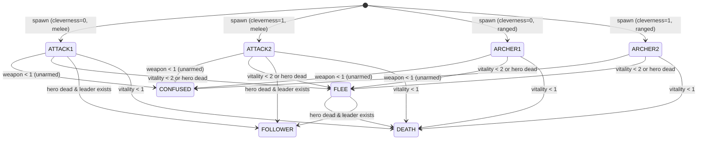
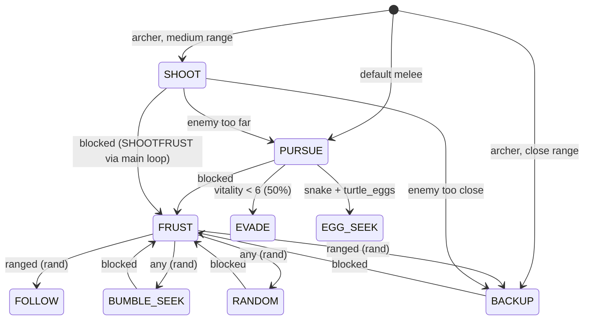

# Discovery: AI Goals, Tactical Modes & Decision System

**Status**: complete
**Investigated**: 2026-04-05
**Requested by**: orchestrator
**Prompt summary**: Trace the complete AI system: goal modes, tactical modes, do_tactic(), the main loop AI dispatch, transitions, cleverness, and per-mode behavior.

## Goal Modes

Defined in `ftale.h:27-37` (duplicated in `fmain.c:107-117`):

| Value | Name | Comment |
|-------|------|---------|
| 0 | `USER` | Character is user-controlled |
| 1 | `ATTACK1` | Attack character (stupidly) |
| 2 | `ATTACK2` | Attack character (cleverly) |
| 3 | `ARCHER1` | Archery attack style 1 |
| 4 | `ARCHER2` | Archery attack style 2 |
| 5 | `FLEE` | Run directly away |
| 6 | `STAND` | Don't move but face character |
| 7 | `DEATH` | A dead character |
| 8 | `WAIT` | Wait to speak to character |
| 9 | `FOLLOWER` | Follow another character |
| 10 | `CONFUSED` | Run around randomly |

### How Goal Modes Are Assigned

**At spawn** (`fmain.c:2761-2762` — inside `set_encounter()`):
```
if (an->weapon&4) an->goal = ARCHER1 + encounter_chart[race].cleverness;
else an->goal = ATTACK1 + encounter_chart[race].cleverness;
```
- Ranged weapon (bit 2 set): ARCHER1 (cleverness=0) or ARCHER2 (cleverness=1)
- Melee weapon: ATTACK1 (cleverness=0) or ATTACK2 (cleverness=1)

**At death** (`fmain.c:2774`):
```
an->goal = DEATH; an->state = DYING;
```

**At player init** (`fmain.c:2831`):
```
an->goal = USER;
```

**SETFIGs** (`fmain2.c:1275`):
```
an->goal = i;  /* index into object list */
```
SETFIGs reuse the `goal` field for their object-list index, not as an AI goal mode. They are excluded from AI processing via `if (an->type == SETFIG) continue;` at `fmain.c:2119`.

### Goal Mode Transitions at Runtime

Transitions happen in the main loop AI section (`fmain.c:2130-2182`). Mode changes are written back via `an->goal = mode;` at `fmain.c:2182`.

- **Player dead or falling** (`fmain.c:2133-2136`): If hero state is DEAD or FALL:
  - If `leader == 0`: mode → FLEE
  - If `leader != 0`: mode → FOLLOWER
- **Low vitality or special encounter mismatch** (`fmain.c:2138-2140`): If `vitality < 2` or (xtype > 59 and race doesn't match extent's v3): mode → FLEE
- **Unarmed** (`fmain.c:2151-2152`): Inside hostile block when `weapon < 1`: mode → CONFUSED, tactic → RANDOM

## Tactical Modes

Defined in `ftale.h:42-54` (partially duplicated in `fmain.c:121-131` — fmain.c omits DOOR_SEEK and DOOR_LET):

| Value | Name | Comment | Implemented in do_tactic()? |
|-------|------|---------|----------------------------|
| 0 | `FRUST` | All tactics frustrated — try something else | Handled in main loop, not do_tactic |
| 1 | `PURSUE` | Go in the direction of the character | Yes |
| 2 | `FOLLOW` | Go toward another character | Yes |
| 3 | `BUMBLE_SEEK` | Bumble around looking for him | Yes |
| 4 | `RANDOM` | Move randomly | Yes |
| 5 | `BACKUP` | Opposite direction we were going | Yes |
| 6 | `EVADE` | Move 90 degrees from character | Yes |
| 7 | `HIDE` | Seek a hiding place | **No — not implemented** |
| 8 | `SHOOT` | Shoot an arrow | Yes |
| 9 | `SHOOTFRUST` | Arrows not getting through | Handled in main loop, not do_tactic |
| 10 | `EGG_SEEK` | Snakes going for the eggs | Yes |
| 11 | `DOOR_SEEK` | DKnight blocking door | **No — not implemented** |
| 12 | `DOOR_LET` | DKnight letting pass | **No — not implemented** |

Comment at `ftale.h:40`: "choices 2-5 can be selected randomly for getting around obstacles"

## do_tactic() — Complete Function Trace

Source: `fmain2.c:1664-1699`

```c
do_tactic(i,tactic) register long i,tactic;
```

### Rate-limiting variable `r`

- `fmain2.c:1666`: `r = !(rand()&7);` — TRUE with 1/8 probability (when rand()&7 == 0)
- `fmain2.c:1669`: If `an->goal == ATTACK2`: `r = !(rand()&3);` — override to 1/4 probability

This means most tactics only execute their movement command ~12.5% of ticks (or 25% for ATTACK2 actors). When `r` is 0, the function does nothing and the actor continues its previous trajectory.

### Per-Tactic Dispatch

**PURSUE (1)** — `fmain2.c:1670`:
```
if (r) set_course(i,hero_x,hero_y,0);
```
- set_course mode 0 = SMART_SEEK: approach hero with cardinal axis prioritization
- Only executes 1/8 (or 1/4) of ticks

**SHOOT (8)** — `fmain2.c:1671-1682`:
```c
xd = an->abs_x - anim_list[0].abs_x;
yd = an->abs_y - anim_list[0].abs_y;
if (xd < 0) xd = -xd;
if (yd < 0) yd = -yd;
if ((rand()&1) && (xd < 8 || yd < 8 || (xd>(yd-5) && xd<(yd+7))))
{   set_course(i,hero_x,hero_y,5);   /* face but don't walk */
    if (an->state < SHOOT1) an->state = SHOOT1;
}
else set_course(i,hero_x,hero_y,0);  /* approach */
```
- Alignment check: actor is roughly aligned on a cardinal or diagonal axis with hero
  - `xd < 8`: nearly same X column
  - `yd < 8`: nearly same Y row
  - `xd>(yd-5) && xd<(yd+7)`: roughly on a diagonal (yd-5 < xd < yd+7)
- If aligned (50% coin flip): face hero (mode 5), enter SHOOT1 state
- If not aligned: approach with SMART_SEEK (mode 0)
- **No rate limiting** — executes every tick (does NOT check `r`)

**RANDOM (4)** — `fmain2.c:1684`:
```
if (r) an->facing = rand()&7; an->state = WALKING;
```
- **Note**: Due to C syntax, `an->state = WALKING` executes unconditionally every tick.
  The `if (r)` only guards the facing randomization. The semicolon after `rand()&7` ends the if-body.
- Every tick: state = WALKING (always walking)
- 1/8 (or 1/4) of ticks: facing randomized to any of 8 directions

**BUMBLE_SEEK (3)** — `fmain2.c:1686`:
```
if (r) set_course(i,hero_x,hero_y,4);
```
- set_course mode 4 = BUMBLE: no axis prioritization, both axes always contribute (more random-feeling approach)
- Only executes 1/8 (or 1/4) of ticks

**BACKUP (5)** — `fmain2.c:1687`:
```
if (r) set_course(i,hero_x,hero_y,3);
```
- set_course mode 3 = REVERSE: negates direction, moves AWAY from hero
- Only executes 1/8 (or 1/4) of ticks

**FOLLOW (2)** — `fmain2.c:1688-1691`:
```c
f = leader;
if (i == f) an->tactic = RANDOM;  /* can't follow self!! */
if (r) set_course(i,anim_list[f].abs_x,anim_list[f].abs_y+20,0);
```
- Follows the `leader` variable (first living active actor, set at `fmain.c:2183`)
- Self-follow fallback: switches own tactic to RANDOM
- Targets leader position + 20 pixels south (y+20)
- set_course mode 0 (SMART_SEEK)
- Only executes 1/8 (or 1/4) of ticks

**EVADE (6)** — `fmain2.c:1693-1695`:
```c
if (i == anix) f = i-1; else f = i+i;
if (r) set_course(i,anim_list[f].abs_x,anim_list[f].abs_y+20,2);
```
- Picks another actor for evasion reference:
  - If i equals anix (allocation limit): use previous actor (i-1)
  - Otherwise: `f = i+i` — **probable bug**: doubles index instead of incrementing by 1. If i=3→f=6, i=4→f=8 (out of bounds for 7-slot anim_list). Intended behavior was likely `f = i+1`.
- set_course mode 2: approach with close-proximity deviation (random wobble when distance < 30)
- Evading relative to another enemy, NOT the player
- Only executes 1/8 (or 1/4) of ticks

**EGG_SEEK (10)** — `fmain2.c:1697-1699`:
```c
if (r) set_course(i,23087,5667,0); an->state = WALKING;
```
- Hardcoded target coordinates: (23087, 5667) — turtle eggs location
- Comment shows previous coordinates were (23297, 5797), overwritten
- Like RANDOM, `an->state = WALKING` executes unconditionally (outside the `if`)
- set_course mode 0 (SMART_SEEK)
- Only course changes 1/8 (or 1/4) of ticks

**Unhandled tactics**: HIDE (7), DOOR_SEEK (11), DOOR_LET (12) are not handled in `do_tactic()`. If called with these values, the function does nothing (no case matches, falls through to end). FRUST (0) and SHOOTFRUST (9) are also not handled here — they're intercepted before `do_tactic()` is called in the main loop.

## set_course Modes (fmain2.c:62-225)

The `set_course(object, target_x, target_y, mode)` function is implemented in inline 68000 assembly within fmain2.c. It computes a direction from the actor's position to the target and assigns facing/state.

| Mode | Name | Behavior |
|------|------|----------|
| 0 | SMART_SEEK | Approach target. Prioritizes cardinal direction when one axis is dominant (if xabs/2 > yabs: clear ydir; if yabs/2 > xabs: clear xdir). No deviation. Sets state=WALKING. |
| 1 | CLOSE_APPROACH | Like mode 0, but adds random ±1 deviation when total distance < 40. Adds wobble at close range. Sets state=WALKING. |
| 2 | CLOSE_PROXIMITY | Like mode 0, but adds random ±1 deviation when total distance < 30. Used for evasion. Sets state=WALKING. |
| 3 | REVERSE | Negates xdir and ydir BEFORE direction lookup. Moves AWAY from target. Sets state=WALKING. |
| 4 | BUMBLE | Skips axis prioritization (both axes always contribute). More random/diagonal movement. Sets state=WALKING. |
| 5 | FACE_ONLY | Like mode 0 for direction calculation, but does NOT set state=WALKING (`fmain2.c:219-221`). Actor faces target but stays in current motion state. |
| 6 | DIRECT_VECTOR | Uses target_x/target_y directly as xdif/ydif rather than computing position difference (`fmain2.c:82-84`). For raw velocity-based steering. Sets state=WALKING. |

Direction lookup uses `com2` table (`fmain2.c:57`): `{0,1,2,7,9,3,6,5,4}` indexed by `4 - 3*ydir - xdir`. Value 9 means no valid direction → sets state = STILL (`fmain2.c:199-201`).

## AI in Main Loop

Source: `fmain.c:2109-2183`

### Loop Structure

```c
for (i=2; i<anix; i++)  /* skip raft (index 1) */
```

Actor index 0 = player, index 1 = raft, indices 2+ = enemies/NPCs. `anix` is the allocation index (one past last enemy).

### Processing Order

1. **Goodfairy check** (`fmain.c:2112`): `if (goodfairy && goodfairy < 120) break;` — AI completely suspended during fairy resurrection.

2. **CARRIER type** (`fmain.c:2114-2117`): Every 16 ticks (`daynight & 15 == 0`), face player with `set_course(i,hero_x,hero_y,5)`. Skip all other AI.

3. **SETFIG type** (`fmain.c:2119`): Skip entirely — SETFIGs have special rendering behavior but no real-time AI.

4. **Read goal & tactic** (`fmain.c:2120-2121`):
   ```c
   mode = an->goal;
   tactic = an->tactic;
   ```
   These are local copies. `mode` gets written back at `fmain.c:2182`.

5. **Distance calculation** (`fmain.c:2123-2126`): Compute absolute xd/yd distance to hero.

6. **Visibility & battle detection** (`fmain.c:2127-2131`): If within 300×300 pixels: `actors_on_screen = TRUE`. Dead actors (vitality < 1) skipped. Visible/previously battling actors set `battleflag = TRUE`.

7. **Random reconsider chance** (`fmain.c:2132`): `r = !bitrand(15);` — 1/16 probability (when rand()&15 == 0).

8. **Override checks** (`fmain.c:2133-2140`):
   - Hero dead/falling → FLEE (no leader) or FOLLOWER (leader exists)
   - Vitality < 2 → FLEE
   - Special encounter mismatch (xtype > 59, race ≠ extent's v3) → FLEE

9. **Frustration handler** (`fmain.c:2141-2143`) — runs for ANY goal mode:
   ```c
   if (tactic == FRUST || tactic == SHOOTFRUST)
   {   if (an->weapon & 4) do_tactic(i,rand4()+2);  /* 2-5: FOLLOW..BACKUP */
       else do_tactic(i,rand2()+3);                   /* 3-4: BUMBLE_SEEK..RANDOM */
   }
   ```
   - Ranged weapon: random tactic from {FOLLOW(2), BUMBLE_SEEK(3), RANDOM(4), BACKUP(5)}
   - Melee weapon: random tactic from {BUMBLE_SEEK(3), RANDOM(4)}

10. **SHOOT1 state** (`fmain.c:2144`): `an->state = SHOOT3;` — advance shooting animation.

11. **Hostile AI (mode ≤ ARCHER2)** (`fmain.c:2146-2171`) — see detailed section below.

12. **FLEE** (`fmain.c:2172`): `do_tactic(i,BACKUP);` — always via BACKUP tactic.

13. **FOLLOWER** (`fmain.c:2173`): `do_tactic(i,FOLLOW);` — always via FOLLOW tactic.

14. **STAND** (`fmain.c:2174-2176`): `set_course(i,hero_x,hero_y,0); an->state = STILL;` — compute facing toward hero, then immediately force STILL state. Actor faces player but never walks.

15. **WAIT** (`fmain.c:2178`): `an->state = STILL;` — just stand still, no facing change.

16. **CONFUSED** and other modes: Fall through with no processing. Actor continues whatever state they were in.

17. **Save & leader** (`fmain.c:2182-2183`):
    ```c
    an->goal = mode;
    if (leader == 0) leader = i;
    ```

### Hostile AI Detail (mode ≤ ARCHER2)

`fmain.c:2146-2171`:

**Reconsider frequency** (`fmain.c:2148`):
```c
if ((mode & 2) == 0) r = !rand4();
```
- `mode & 2 == 0` is true for ATTACK1(1) and ARCHER2(4)
- These modes get r = !rand4() → 1/4 chance to reconsider
- ATTACK2(2) and ARCHER1(3) keep r from line 2132 → 1/16 chance

**Tactic reconsideration** (`fmain.c:2149-2161`, only when `r` is true):

| Condition | Tactic assigned | Source |
|-----------|----------------|--------|
| `race==4 && turtle_eggs` | EGG_SEEK | `fmain.c:2150` |
| `weapon < 1` | RANDOM (mode→CONFUSED) | `fmain.c:2151-2152` |
| `vitality < 6 && rand2()` | EVADE | `fmain.c:2153-2154` |
| Archer mode, xd<40 && yd<30 | BACKUP | `fmain.c:2156` |
| Archer mode, xd<70 && yd<70 | SHOOT | `fmain.c:2157` |
| Archer mode, far away | PURSUE | `fmain.c:2158` |
| Melee mode, default | PURSUE | `fmain.c:2160` |

**Melee engagement threshold** (`fmain.c:2162-2163`):
```c
thresh = 14 - mode;
if (an->race == 7) thresh = 16;
```

| Mode | Value | thresh |
|------|-------|--------|
| ATTACK1 | 1 | 13 |
| ATTACK2 | 2 | 12 |
| ARCHER1 | 3 | 11 |
| ARCHER2 | 4 | 10 |
| DKnight (race 7) | any | 16 (override) |

**Melee engagement** (`fmain.c:2164-2166`):
```c
if ((an->weapon & 4)==0 && xd < thresh && yd < thresh)
{   set_course(i,hero_x,hero_y,0);
    if (an->state >= WALKING) an->state = FIGHTING;
}
```
- Only for non-ranged weapons (bit 2 not set)
- When within thresh pixels on both axes: face hero and enter FIGHTING state

**DKnight special** (`fmain.c:2168-2169`):
```c
else if (an->race == 7 && an->vitality)
{   an->state = STILL; an->facing = 5; }
```
- DKnight (race 7) stays STILL facing south (direction 5) when alive and not in melee range
- This overrides `do_tactic()` — DKnight never executes normal tactical movement

**Default** (`fmain.c:2170`):
```c
else do_tactic(i,tactic);
```

## Goal/Tactic Transitions — State Machine

### Tactic Frustration Cycle

When an actor is blocked during movement (collision), the STILL/blocked handler at `fmain.c:1660-1661` sets:
```c
else an->tactic = FRUST;
```

Next tick in AI loop, FRUST is caught at `fmain.c:2141-2143`:
- Ranged: random tactic from FOLLOW/BUMBLE_SEEK/RANDOM/BACKUP (2-5)
- Melee: random tactic from BUMBLE_SEEK/RANDOM (3-4)

This creates a loop: walk → blocked → FRUST → random new tactic → walk → ...

### Goal Mode State Diagram



### Tactical Mode Transitions for Hostile Actors



## Cleverness & Monster Types

### encounter_chart (fmain.c:52-63)

| Index | Race | HP | Aggressive | Arms | Cleverness | Treasure | File |
|-------|------|----|-----------|------|------------|----------|------|
| 0 | Ogre | 18 | TRUE | 2 | 0 | 2 | 6 |
| 1 | Orcs | 12 | TRUE | 4 | **1** | 1 | 6 |
| 2 | Wraith | 16 | TRUE | 6 | **1** | 4 | 7 |
| 3 | Skeleton | 8 | TRUE | 3 | 0 | 3 | 7 |
| 4 | Snake | 16 | TRUE | 6 | **1** | 0 | 8 |
| 5 | Salamander | 9 | TRUE | 3 | 0 | 0 | 7 |
| 6 | Spider | 10 | TRUE | 6 | **1** | 0 | 8 |
| 7 | DKnight | 40 | TRUE | 7 | **1** | 0 | 8 |
| 8 | Loraii | 12 | TRUE | 6 | **1** | 0 | 9 |
| 9 | Necromancer | 50 | TRUE | 5 | 0 | 0 | 9 |
| 10 | Woodcutter | 4 | FALSE | 0 | 0 | 0 | 9 |

### How Cleverness Affects Behavior

Cleverness is 0 or 1. Its effects:

1. **Goal mode selection** (`fmain.c:2761-2762`):
   - Cleverness=0 → ATTACK1 or ARCHER1
   - Cleverness=1 → ATTACK2 or ARCHER2

2. **Reconsider frequency** (`fmain.c:2148`):
   - ATTACK1 (mode & 2 == 0): r = !rand4() → 25% reconsider rate per tick
   - ATTACK2 (mode & 2 != 0): keeps r from `!bitrand(15)` → 6.25% reconsider rate
   - ARCHER1 (mode & 2 != 0): keeps 6.25% rate
   - ARCHER2 (mode & 2 == 0): r = !rand4() → 25% reconsider rate

   **Pattern is NOT simply stupid=more, clever=less.** The bit test `(mode & 2)` creates pairs: {ATTACK1, ARCHER2} reconsider often (25%), {ATTACK2, ARCHER1} reconsider rarely (6.25%).

3. **do_tactic() action rate** (`fmain2.c:1666-1669`):
   - Default: `r = !(rand()&7)` → 12.5% chance of acting per tick
   - ATTACK2 override: `r = !(rand()&3)` → 25% chance
   - ATTACK2 actors change direction/state twice as often as others

4. **Melee threshold** (`fmain.c:2162`): `thresh = 14 - mode`
   - ATTACK1: thresh=13, ATTACK2: thresh=12, ARCHER1: thresh=11, ARCHER2: thresh=10
   - Stupid modes engage melee from slightly further away

### Arms Field

`arms` indexes into `weapon_probs[]` (`fmain2.c:860-873`). The weapon is selected as:
```
w = (encounter_chart[race].arms * 4) + wt;  /* wt = rand4() or from mixflag */
an->weapon = weapon_probs[w];
```

Weapon values: 0=none, 1=dagger, 2=mace, 3=sword, 4=bow, 5=wand, 8=touch attack.
- weapon & 4 (bit 2 set): ranged weapons (4=bow, 5=wand)
- weapon < 1: unarmed → forced CONFUSED

## ATTACK1/ATTACK2/ARCHER1/ARCHER2 Differences

| Property | ATTACK1 (1) | ATTACK2 (2) | ARCHER1 (3) | ARCHER2 (4) |
|----------|-------------|-------------|-------------|-------------|
| Reconsider rate | 25% | 6.25% | 6.25% | 25% |
| do_tactic action rate | 12.5% | 25% | 12.5% | 12.5% |
| Melee threshold | 13 | 12 | 11 | 10 |
| Distance-based tactic | PURSUE always | PURSUE always | BACKUP/SHOOT/PURSUE | BACKUP/SHOOT/PURSUE |
| Shooting ability | No (melee only) | No (melee only) | Yes | Yes |

ATTACK2 is the most distinct: it reconsiders tactics rarely (6.25%) but when `do_tactic()` fires, it acts twice as often (25% vs 12.5%). This means ATTACK2 actors are more persistent — they keep the same tactic longer but execute it more aggressively.

## FOLLOWER Goal Mode

`fmain.c:2173`: `do_tactic(i,FOLLOW);`

In `do_tactic()` (`fmain2.c:1688-1691`):
- `f = leader` — the `leader` variable is set at `fmain.c:2183`: first living active enemy becomes leader
- Self-follow check: if actor IS the leader, tactic falls back to RANDOM
- Targets leader's position + 20 pixels south: `set_course(i,anim_list[f].abs_x,anim_list[f].abs_y+20,0);`
- Only course changes 1/8 of ticks

FOLLOWER is assigned when the hero is dead/falling AND a leader exists (`fmain.c:2135`). Enemies follow their pack leader after winning the fight.

## CONFUSED Goal Mode

Assigned at `fmain.c:2151-2152` when a hostile actor has `weapon < 1`:
```c
mode = CONFUSED; tactic = RANDOM;
```

**First tick** (still inside hostile block): `do_tactic(i,RANDOM)` is called at `fmain.c:2170`. Actor faces random direction and walks. Mode saved as CONFUSED at `fmain.c:2182`.

**Subsequent ticks**: CONFUSED (10) fails all goal mode checks in the dispatch chain:
- `mode <= ARCHER2` (10 ≤ 4) → false
- `mode == FLEE` (10 == 5) → false
- `mode == FOLLOWER` (10 == 9) → false
- `mode == STAND` (10 == 6) → false
- `mode == WAIT` (10 == 8) → false

Result: **No AI processing per tick.** The actor continues walking in its last direction until blocked.

**When blocked**: Movement code at `fmain.c:1661` sets `an->tactic = FRUST`. Next tick, the frustration handler at `fmain.c:2141-2143` fires BEFORE goal mode dispatch (applies to all modes). Since CONFUSED actors are unarmed (`weapon & 4 == 0`): `do_tactic(i,rand2()+3)` gives BUMBLE_SEEK(3) or RANDOM(4).

**Key implication**: CONFUSED actors can BUMBLE_SEEK toward the player when frustrated, despite being "confused." This is because the frustration handler doesn't check goal mode.

## Cross-Cutting Findings

- **fmain.c:1661**: Tactic FRUST is assigned by the MOVEMENT system (blocked check), not the AI system. The blocked handler `else an->tactic = FRUST;` is in the STILL/blocked rendering section, crossing subsystem boundaries.

- **fmain.c:2112**: AI is completely suspended when `goodfairy && goodfairy < 120` — fairy resurrection overrides AI.

- **fmain.c:2114-2117**: CARRIER entities (bird/turtle) have minimal AI: face the player every 16 ticks via `set_course(i,hero_x,hero_y,5)`. They don't use the goal/tactic system at all.

- **fmain2.c:1275**: `an->goal = i;` for SETFIGs reuses the goal field as an object-list index, not as an AI goal mode.

- **fmain2.c:1684**: RANDOM tactic has a C parsing subtlety: `if (r) an->facing = rand()&7; an->state = WALKING;` — the `WALKING` assignment is unconditional due to the missing braces. This means RANDOM actors always walk, while facing only changes 1/8 of ticks. Same pattern at `fmain2.c:1699` for EGG_SEEK.

- **fmain.c:2168-2169**: DKnight (race 7) has hardcoded behavior that bypasses the tactical system entirely: stands still facing south unless in melee range. The defined DOOR_SEEK/DOOR_LET tactics for DKnights are never used.

## Unresolved

- **EVADE `f = i+i` bug** (`fmain2.c:1694`): The expression `f = i+i` (i.e., `f = 2*i`) is almost certainly a typo for `f = i+1`. For i≥4, the computed index exceeds the anim_list bounds. Cannot confirm intent without Talin — could be intentional odd behavior or a bug that rarely manifests because it only triggers for i≥4 and only 1/8 of ticks. Logged as probable bug.

- **HIDE tactic (7)**: Defined but never assigned by any AI logic and not handled in `do_tactic()`. Was it planned and never implemented, or is there dead code elsewhere?

- **DOOR_SEEK/DOOR_LET tactics (11-12)**: Defined for DKnight but never assigned or handled. The DKnight has hardcoded behavior instead (`fmain.c:2168-2169`). These may have been replaced by the simpler hardcoded logic during development.

- **`aggressive` field in encounter_chart**: Defined as a field (`fmain.c:47`) and set to TRUE for all enemies (FALSE only for Woodcutter, race 10). Never read by any code path found in the source. May have been planned for passive encounter behavior.

- **Woodcutter AI (race 10)**: Has 0 arms (no weapon) and 0 cleverness. Would get ATTACK1 with weapon 0, immediately becoming CONFUSED. But woodcutters are only spawned via the Necromancer's death transformation at `fmain.c:1759-1762`, not via `set_encounter()`. Their goal/tactic in that context is not set through the normal path.

- **EGG_SEEK hardcoded coordinates**: (23087, 5667) at `fmain2.c:1699`. Previous value (23297, 5797) is commented out. These are absolute map coordinates for the turtle egg location. Cannot verify correctness without the actual map data or runtime testing.

## Refinement Log
- 2026-04-05: Initial comprehensive discovery pass. Traced do_tactic(), all goal modes, all tactical modes, AI main loop, encounter_chart, cleverness effects, and cross-cutting findings.
