# Combat — Logic Spec

> Fidelity: behavioral  |  Source files: fmain.c, fmain2.c
> Cross-refs: [RESEARCH §7](../RESEARCH.md#7-combat-system), [_discovery/combat.md](../_discovery/combat.md), [logic/game-loop.md](game-loop.md), [logic/ai-system.md](ai-system.md)

## Overview

Combat resolution splits cleanly across six functions. Hit detection happens in
the main loop: during Phase 15, `melee_swing` runs once per attacker in a
fighting pose; during Phase 16, `missile_step` runs once per entry in
`missile_list[0..5]`. Both end by calling `dohit(attacker, defender, facing,
damage)` when a target lies inside the reach band. `dohit` is the single entry
point that applies damage, plays the hit sample, shoves the target (and, for
melee, the attacker) two pixels forward via `move_figure`, and calls
`checkdead` to roll the death transition. `checkdead` is also called from
inside `actor_tick`'s `STATE_DYING` branch and from the environmental-damage
paths (drowning, lava, witch petrification). When `battleflag` falls back to
zero on the next Phase 14 tick, `aftermath` tallies corpses and fled enemies
and fires the summary line.

The two loops in `reference/logic/game-loop.md` (`melee_hit_detection` and
`missile_tick`) are the canonical per-frame drivers; the per-attacker and
per-missile bodies documented here are pure refactorings of those inner
loops. See [`Notes`](#notes) for how they compose.

## Symbols

No new locals beyond the function-local bindings shown in each pseudo block.
All identifiers resolve in [SYMBOLS.md](SYMBOLS.md) or in each function's
`Calls:` header. Proposed SYMBOLS additions (weapon codes, race constants,
sunstone slot, SFX sample indices, dtype codes) are listed in the wave report
and are not yet applied — this doc therefore cites numeric literals inline.

## dohit

Source: `fmain2.c:230-249`
Called by: `melee_swing`, `missile_step`, witch-attack branch at `fmain.c:2375`
Calls: `speak`, `effect`, `move_figure`, `checkdead`, `rand`, `bitrand`, `anim_list`, `stuff`, `DRAGON`, `SETFIG`

```pseudo
def dohit(i: int, j: int, fc: int, wt: int) -> None:
    """Apply wt damage from attacker i to defender j; immunity, SFX, knockback, death roll."""
    # fmain2.c:231-233 — weak-weapon immunity: necromancer (race 9) is always immune to weapon<4;
    # witch (race 0x89) is immune unless player holds the sunstone (stuff[7]).
    if anim_list[0].weapon < 4:                           # fmain2.c:231, 4 = ranged-weapon cutoff (bow/wand)
        if anim_list[j].race == 9:                        # fmain2.c:232, 9 = necromancer race
            speak(58)                                     # fmain2.c:232, 58 = "can't hurt me with that"
            return
        if anim_list[j].race == 0x89 and stuff[7] == 0:   # fmain2.c:233, 0x89 = witch race; 7 = sunstone stuff[] slot
            speak(58)                                     # fmain2.c:233, 58 = "can't hurt me with that"
            return
    # fmain2.c:234 — spectre (0x8a) and ghost (0x8b) silently ignore all damage.
    if anim_list[j].race == 0x8a or anim_list[j].race == 0x8b:  # fmain2.c:234, 0x8a = spectre race, 0x8b = ghost race
        return
    # fmain2.c:236-237 — apply damage then clamp vitality at 0.
    anim_list[j].vitality = anim_list[j].vitality - wt
    if anim_list[j].vitality < 0:
        anim_list[j].vitality = 0
    # fmain2.c:238-241 — hit SFX chosen by source channel: arrow / fireball / hero-takes / monster-takes.
    if i == -1:
        effect(2, 500 + rand(0, 63))                      # fmain2.c:238, 2 = arrow-hit sample; 500 = base pitch; 63 = rand64 jitter
    elif i == -2:                                         # fmain2.c:239, -2 = fireball source marker
        effect(5, 3200 + bitrand(511))                    # fmain2.c:239, 5 = fireball sample; 3200 = base pitch; 511 = bitrand mask
    elif j == 0:
        effect(0, 800 + bitrand(511))                     # fmain2.c:240, 0 = hero-takes-melee sample; 800 = base pitch; 511 = bitrand mask
    else:
        effect(3, 400 + rand(0, 255))                     # fmain2.c:241, 3 = monster-hit sample; 400 = base pitch; 255 = rand256 jitter
    # fmain2.c:243-245 — knockback + attacker follow-through; dragons and setfigs refuse to move.
    pushable = anim_list[j].type != DRAGON and anim_list[j].type != SETFIG
    if pushable and move_figure(j, fc, 2) and i >= 0:
        move_figure(i, fc, 2)
    # fmain2.c:246 — death check; dtype 5 = "X was hit and killed!" narration.
    checkdead(j, 5)                                       # fmain2.c:246, 5 = melee/missile death dtype
```

## melee_swing

Source: `fmain.c:2238-2266`
Called by: `melee_hit_detection` (Phase 15, one call per attacker slot)
Calls: `dohit`, `effect`, `newx`, `newy`, `rand`, `bitrand`, `anim_list`, `anix`, `brave`, `freeze_timer`, `STATE_WALKING`, `STATE_DEAD`, `CARRIER`

```pseudo
def melee_swing(i: int) -> None:
    """Run one attacker's melee swing: compute reach, Chebyshev-match a target, call dohit or emit a near-miss clang."""
    # fmain.c:2239 — raft slot and any actor still in walk/still/shoot pose skip the swing.
    if i == 1 or anim_list[i].state >= STATE_WALKING:     # fmain.c:2239, 1 = raft slot
        return
    wt = anim_list[i].weapon
    fc = anim_list[i].facing
    # fmain.c:2242 — weapon bit 2 = bow/wand; ranged weapons do not swing.
    if (wt & 4) != 0:                                     # fmain.c:2242, 4 = ranged-weapon bit (bow=4, wand=5)
        return
    # fmain.c:2244-2245 — touch attack (wt>=8) is clamped to reach/damage 5, then gets 0..3 random bonus.
    if wt >= 8:                                           # fmain.c:2244, 8 = touch-attack weapon code
        wt = 5                                            # fmain.c:2244, 5 = tuned-down touch reach/damage
    wt = wt + bitrand(2)
    # fmain.c:2247-2248 — strike point: wt*2 px ahead of attacker, with +/- ~3 px jitter on each axis.
    xs = newx(anim_list[i].abs_x, fc, wt + wt) + rand(0, 7) - 3   # fmain.c:2247, 7 = rand8 range; 3 = jitter centre
    ys = newy(anim_list[i].abs_y, fc, wt + wt) + rand(0, 7) - 3   # fmain.c:2248, 7 = rand8 range; 3 = jitter centre
    # fmain.c:2249 — hero reach grows with bravery (capped at 15); enemies reroll 2..5 each swing.
    if i == 0:
        bv = (brave // 20) + 5                            # fmain.c:2249, 20 = brave-per-reach divisor; 5 = hero reach base
    else:
        bv = 2 + rand(0, 3)                               # fmain.c:2249, 3 = rand4 range
    if bv > 14:                                           # fmain.c:2250, 14 = soft cap before hard ceiling
        bv = 15                                           # fmain.c:2250, 15 = hard reach ceiling
    # fmain.c:2252-2263 — scan every actor for a target in the reach band.
    j = 0
    while j < anix:
        dead = anim_list[j].state == STATE_DEAD
        same_or_raft = j == 1 or j == i                   # fmain.c:2253, 1 = raft slot
        skip = same_or_raft or dead or anim_list[i].type == CARRIER
        if skip:
            j = j + 1
            continue
        xd = abs(anim_list[j].abs_x - xs)
        yd = abs(anim_list[j].abs_y - ys)
        if xd > yd:
            yd = xd                                       # fmain.c:2259 — Chebyshev distance
        # fmain.c:2260 — hero auto-rolls to hit; enemies gated by rand256 > brave.
        hit_ok = i == 0 or rand(0, 255) > brave           # fmain.c:2260, 255 = rand256 range
        if hit_ok and yd < bv and freeze_timer == 0:
            dohit(i, j, fc, wt)
            return
        if yd < bv + 2 and wt != 5:                       # fmain.c:2262, 2 = near-miss margin; 5 = touch-weapon silent
            effect(1, 150 + rand(0, 255))                 # fmain.c:2262, 1 = near-miss clang sample; 150 = base pitch; 255 = rand256 jitter
        j = j + 1
```

## missile_step

Source: `fmain.c:2268-2301`
Called by: `missile_tick` (Phase 16, one call per missile slot)
Calls: `dohit`, `newx`, `newy`, `px_to_im`, `rand`, `bitrand`, `anim_list`, `anix`, `missile_list`, `brave`, `STATE_DEAD`, `CARRIER`

```pseudo
def missile_step(i: int) -> None:
    """Advance missile_list[i] one tick: age-expire, terrain-test, victim-test, step position by 2*speed."""
    ms = missile_list[i]
    s = ms.speed * 2
    # fmain.c:2273 — expire if the slot is inactive (0) or spent-puff (3).
    if ms.missile_type == 0 or ms.missile_type == 3:      # fmain.c:2273, 3 = spent-fireball puff frame
        ms.missile_type = 0
        return
    if s == 0:
        ms.missile_type = 0
        return
    # fmain.c:2274 — age test uses the pre-increment value; the counter then advances.
    aged = ms.time_of_flight > 40                         # fmain.c:2274, 40 = max flight ticks
    ms.time_of_flight = ms.time_of_flight + 1
    if aged:
        ms.missile_type = 0
        return
    # fmain.c:2276-2277 — terrain test; codes 1 = impassable, 15 = solid kill the missile in place.
    terrain_code = px_to_im(ms.abs_x, ms.abs_y)
    if terrain_code == 1 or terrain_code == 15:           # fmain.c:2277, 15 = solid-terrain code
        ms.missile_type = 0
        s = 0
    fc = ms.direction
    # fmain.c:2279-2280 — hit radius by missile type.
    if ms.missile_type == 2:                              # fmain.c:2280, 2 = fireball
        mt = 9                                            # fmain.c:2280, 9 = fireball hit radius
    else:
        mt = 6                                            # fmain.c:2279, 6 = arrow hit radius
    # fmain.c:2283-2299 — victim scan.
    j = 0
    while j < anix:
        if j == 0:
            bv = brave
        else:
            bv = 20                                       # fmain.c:2284, 20 = generic monster dodge floor
        skip_self = j == 1 or ms.archer == j              # fmain.c:2285, 1 = raft slot
        skip_dead = anim_list[j].state == STATE_DEAD
        skip_carrier = anim_list[j].type == CARRIER
        if skip_self or skip_dead or skip_carrier:
            j = j + 1
            continue
        xd = abs(anim_list[j].abs_x - ms.abs_x)
        yd = abs(anim_list[j].abs_y - ms.abs_y)
        if xd > yd:
            yd = xd                                       # fmain.c:2293 — Chebyshev distance
        # fmain.c:2294 — slot 0 always rolls; higher slots gated by bitrand(512) > dodge.
        miss_rolls = i == 0 or bitrand(512) > bv          # fmain.c:2294, 512 = bitrand range
        if miss_rolls and yd < mt:
            if ms.missile_type == 2:                      # fmain.c:2295, 2 = fireball
                dohit(-2, j, fc, rand(0, 7) + 4)          # fmain.c:2295, -2 = fireball source; 7 = rand8 range; 4 = base missile damage
            else:
                dohit(-1, j, fc, rand(0, 7) + 4)          # fmain.c:2296, 7 = rand8 range; 4 = base missile damage
            ms.speed = 0
            if ms.missile_type == 2:                      # fmain.c:2298, 2 = fireball
                ms.missile_type = 3                       # fmain.c:2298, 3 = spent-fireball puff frame
            return
        j = j + 1
    # fmain.c:2300-2301 — step missile forward by 2*speed pixels along its direction.
    ms.abs_x = newx(ms.abs_x, fc, s)
    ms.abs_y = newy(ms.abs_y, fc, s)
```

## checkdead

Source: `fmain.c:2769-2782`
Called by: `dohit`, `actor_tick` (STATE_DYING branch), drowning / lava / witch-petrify paths
Calls: `speak`, `event`, `setmood`, `prq`, `anim_list`, `brave`, `luck`, `kind`, `STATE_DYING`, `STATE_DEAD`, `GOAL_DEATH`, `SETFIG`

```pseudo
def checkdead(i: int, dtype: int) -> None:
    """If actor i has vitality <= 0 and isn't already dying/dead, transition into STATE_DYING and adjust stats."""
    an = anim_list[i]
    # fmain.c:2772 — only the fresh-kill transition runs the block; repeat calls short-circuit into the HUD refresh.
    if an.vitality < 1 and an.state != STATE_DYING and an.state != STATE_DEAD:
        an.vitality = 0
        an.tactic = 7                                     # fmain.c:2773, 7 = dying-animation frame countdown
        an.goal = GOAL_DEATH
        an.state = STATE_DYING
        # fmain.c:2774 — dark-knight death speech.
        if an.race == 7:                                  # fmain.c:2774, 7 = dark knight race
            speak(42)                                     # fmain.c:2774, 42 = dark knight death speech
        elif an.type == SETFIG and an.race != 0x89:       # fmain.c:2775, 0x89 = witch race (exempt from kindness penalty)
            kind = kind - 3                               # fmain.c:2775, 3 = kindness penalty per NPC kill
        # fmain.c:2777 — bravery gain on monster kill vs player-death bookkeeping.
        if i != 0:
            brave = brave + 1
        else:
            event(dtype)
            luck = luck - 5                               # fmain.c:2777, 5 = luck cost per player death
            setmood(True)
        if kind < 0:
            kind = 0
        prq(7)                                            # fmain.c:2779, 7 = aftermath text redraw request
    # fmain.c:2781 — always refresh the vitality bar when the hero is the target.
    if i == 0:
        prq(4)                                            # fmain.c:2781, 4 = stat-bar redraw request
```



```mermaid
stateDiagram-v2
    [*] --> STATE_FIGHTING: melee_swing / ai-system enter_melee
    STATE_FIGHTING --> STATE_DYING: checkdead — vitality < 1 (sets goal = GOAL_DEATH, tactic = 7)
    STATE_DYING --> STATE_DEAD: actor_tick death_step countdown (tactic → 0)
    STATE_DEAD --> [*]: sprite drops to frame 82; body lootable
    note right of STATE_DYING
        Race-specific drops (talisman, lasso)
        are emitted inside actor_tick, not checkdead.
    end note
```

## aftermath

Source: `fmain2.c:253-276`
Called by: `no_motion_tick` (Phase 14, when `battleflag` falls from True to False)
Calls: `print`, `print_cont`, `prdec`, `get_turtle`, `anim_list`, `anix`, `xtype`, `turtle_eggs`, `ENEMY`, `STATE_DEAD`, `GOAL_FLEE`

```pseudo
def aftermath() -> None:
    """Tally dead vs fled enemies after a battle; print the summary; trigger turtle-egg delivery if pending."""
    dead = 0
    flee = 0
    # fmain2.c:255 — slot 3 is the first spawnable enemy slot (skip hero/raft/setfig).
    i = 3                                                 # fmain2.c:255, 3 = first enemy anim_list slot
    while i < anix:
        if anim_list[i].type == ENEMY:
            if anim_list[i].state == STATE_DEAD:
                dead = dead + 1
            elif anim_list[i].goal == GOAL_FLEE:
                flee = flee + 1
        i = i + 1
    # fmain2.c:262 — dead hero: no message at all.
    if anim_list[0].vitality < 1:
        return
    # fmain2.c:263 — wounded hero with at least one kill: commendation line.
    if anim_list[0].vitality < 5 and dead != 0:           # fmain2.c:263, 5 = low-vitality commendation threshold
        print("Bravely done!")
    # fmain2.c:264 — normal encounters only (special-extent xtypes skip the recap).
    elif xtype < 50:                                      # fmain2.c:264, 50 = special-extent xtype floor
        if dead != 0:
            print("")
            prdec(dead, 1)
            print_cont("foes were defeated in battle.")
        if flee != 0:
            print("")
            prdec(flee, 1)
            print_cont("foes fled in retreat.")
    # fmain2.c:274 — pending turtle-egg delivery fires after battle.
    if turtle_eggs:
        get_turtle()
```

## move_figure

Source: `fmain2.c:322-330`
Called by: `dohit` (knockback), various NPC motion helpers
Calls: `newx`, `newy`, `proxcheck`, `anim_list`

```pseudo
def move_figure(fig: int, dir: int, dist: int) -> bool:
    """Try to displace actor fig by dist pixels in direction dir; commit only if proxcheck reports clear."""
    xtest = newx(anim_list[fig].abs_x, dir, dist)
    ytest = newy(anim_list[fig].abs_y, dir, dist)
    # fmain2.c:326 — non-zero proxcheck means the destination is blocked (terrain or another actor).
    if proxcheck(xtest, ytest, fig) != 0:
        return False
    anim_list[fig].abs_x = xtest
    anim_list[fig].abs_y = ytest
    return True
```

## Notes

- **Relationship to `game-loop.md`.** The canonical per-frame drivers live in
  [`game-loop.md#melee_hit_detection`](game-loop.md#melee_hit_detection) and
  [`game-loop.md#missile_tick`](game-loop.md#missile_tick). `melee_swing(i)` and
  `missile_step(i)` above are the pure per-attacker and per-missile bodies
  of those inner loops, factored out so combat rules are specified in one
  place. A port that inlines them into the game-loop drivers is
  behaviourally identical.
- **`dohit` sign of `i`.** `dohit` distinguishes attack sources by sign of
  `i`: `i == -2` is a fireball, `i == -1` is an arrow, `i == 0` is the hero's
  melee hit, `i >= 2` is an NPC melee hit, and the witch's ranged attack at
  `fmain.c:2375` passes `i = -1` to reuse the arrow branch. The knockback
  follow-through at `fmain2.c:245` only fires for `i >= 0`, so arrows and
  fireballs don't recoil their imaginary owner.
- **`brave` double-duty.** Bravery is both the passive experience meter (`+1`
  per monster kill in `checkdead`) and an active combat stat: hero melee
  reach `(brave / 20) + 5` (`melee_swing`), enemy-hit gate `rand(0,255) >
  brave` (`melee_swing`), and missile dodge gate `bitrand(512) > brave`
  (`missile_step` slot 0). Combat therefore compounds — the same stat that
  extends the hero's sword also makes monsters miss more often.
- **Missile slot 0 dodge asymmetry.** Only slot 0 of `missile_list[]` runs
  the dodge roll; slots 1..5 always hit if their Chebyshev test passes. The
  original source carries a `/* really?? */` comment at `fmain.c:2286`, so
  this is recorded as an open question — see
  [`PROBLEMS.md`](../PROBLEMS.md).
- **Race-specific loot drops**: `checkdead` does not emit the Necromancer's
  talisman or the Witch's lasso — those are produced inside
  `actor_tick`'s dying branch at `fmain.c:1751-1756`, one frame after
  `checkdead` fires. See [`logic/game-loop.md#actor_tick`](game-loop.md#actor_tick).
- **SETFIG / DRAGON knockback immunity.** `dohit` tests
  `type != DRAGON and type != SETFIG` before calling `move_figure`; these
  two types are hit-stunned in place (the dragon by design, NPCs because
  their coordinates are fixed by the scenario).
