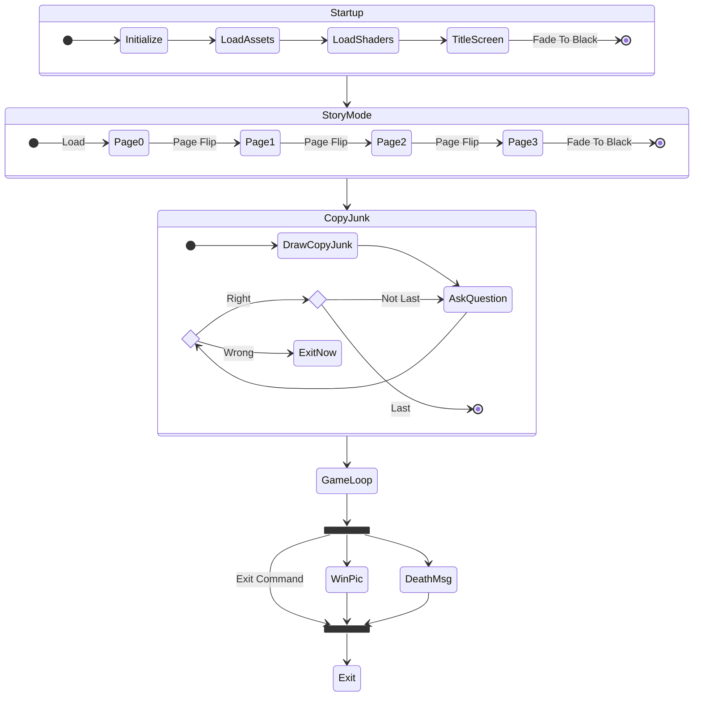

## Storyboard

More or less how things flow through the game

### Startup
#### Intro
* black screen
* load mouse pointer
* init game state

* screen_size(156) -> extract viewport config
* show title text
* Delay(50) -> 1 second (50 ticks/second)

* load songs/samples
* Delay(50) -> 1 second
* play song(track[12], track[13], track[14], track[15]) -> start intro music

* black screen (load black palette)
* screen_size(0) -> extract viewport config

* load IFF "page0" -> copied to page bitmaps

* loop i = 0..160 in increments of 4
    * screen_size(i) -> also fades from black palette to introcolors palette

* page flip -> "p1a" and "p1b"
* page flip -> "p2a" and "p2b"
* page flip -> "p3a" and "p3b"

* Delay(190) -> 3.8 seconds

* end intro
* loop i = 160..0 increments of -4
    * screen_size(i) -> also fades from introcolors to black palette

#### Copy Protect Junk
(loading assets in the background, which we've already done by this point)

* set up game play screen mode -> get viewport settings
* black screen -> load black palette
* screen_size(156) (hires mode? text doesn't fit lores)
* color 0 = (0,0,6) {blue}, color 1 = (15, 15, 15) {white}
* stillscreen() -> investigate
* placard_text(19) -> "So... You, game seeker ..."
* do copy protect questions, "answer ye, these questions three!"
* Delay(20)

#### Start game loop

* char start placards -> "mayors plea", etc...
    * placard_text(player index -> 0, 1, 2, 3 if all dead)
    * swirly border effect -> roughly 1.5s
    * Delay(120) -> 2.4 seconds
* if all dead:
    * Delay(500) -> 10 seconds
    * set quitflag (exit game loop)
* if brother > 1 (Julian dead)
    * placard_text(2 (Philip) or 4 (Kevin))
    * Delay(120) -> 2.4 seconds
* fade to black
* fade in to play start in the Village of Tambry

## Game States

