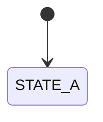

# Test Subsystem — Logic Spec

> Fidelity: behavioral  |  Source files: fmain.c
> Cross-refs: [RESEARCH §1](../../../docs/RESEARCH.md#1-core-data-structures)

## Overview
Pseudo assigns STATE_B but diagram only has STATE_A.
## Symbols
None.

## sample_function

Source: `fmain.c:1-10`
Called by: `entry point`
Calls: `none`

```pseudo
def sample_function(actor: int) -> int:
    """Assigns a state not in the diagram."""
    actor.state = STATE_B                 # fmain.c:1 — missing from diagram
    return actor
```

### Mermaid


